# Technical Specification

# 1. INTRODUCTION

## 1.1 Executive Summary

The Microsoft Financial Econometrics (MFE) Toolbox is a comprehensive MATLAB-based suite designed for financial econometrics, time series analysis, and risk modeling. Currently at version 4.0 (released on October 28, 2009), this toolbox addresses the critical need for robust, well-documented MATLAB routines primarily focused on modeling financial time series, while extending to broader econometric applications including macroeconomic time series and cross-sectional data analysis.

The MFE Toolbox solves several core challenges in quantitative finance and econometrics:
- Limited availability of robust, production-ready implementations of advanced financial econometric methods
- Need for consistent interfaces across diverse modeling approaches
- Computational bottlenecks in performance-intensive econometric calculations
- Requirement for rigorous error checking and input validation in financial modeling

Key stakeholders and users of the MFE Toolbox include:
- Academic researchers in financial econometrics and time series analysis
- Financial analysts and risk managers requiring sophisticated volatility modeling
- Econometricians working with time series and cross-sectional data
- MATLAB users seeking specialized statistical and econometric functionality

| Value Proposition | Description |
|-------------------|-------------|
| Modular Design | Well-organized collection of functions with consistent interfaces |
| Comprehensive Coverage | Implements both fundamental and advanced econometric methods |
| Performance Optimization | Integrates MEX acceleration for computationally intensive routines |
| Interactive Components | Includes GUI elements for model exploration and visualization |

## 1.2 System Overview

### 1.2.1 Project Context

The MFE Toolbox operates within the broader ecosystem of financial and econometric analysis tools, positioning itself as a specialized extension to MATLAB's core capabilities. While MATLAB provides fundamental mathematical and statistical functions, the MFE Toolbox offers domain-specific implementations tailored for financial and econometric applications.

**Business Context and Market Positioning:**
- Serves as a specialized toolkit for financial econometrics, complementing MATLAB's base capabilities
- Positioned as a comprehensive open-source toolbox tailored specifically for financial time series analysis
- Addresses the gap between general-purpose statistical packages and specialized financial modeling requirements

**Integration with Existing Environment:**
- Designed to seamlessly integrate with MATLAB's native functions
- Compatible with optional MATLAB components such as the Statistics Toolbox
- Functions as a standalone package that can be incorporated into existing MATLAB workflows

### 1.2.2 High-Level Description

**Primary System Capabilities:**

The MFE Toolbox provides a comprehensive set of capabilities organized around several core functional areas:

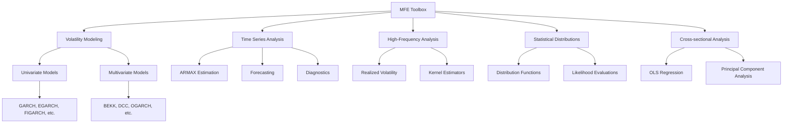

**Key Architectural Decisions:**
- Modular organization of related functions into specialized subfolders
- Separation of core computational routines from interface components
- MEX C implementation for performance-critical functions
- Comprehensive error checking and input validation
- Standardized parameter handling and transformation

**Major System Components:**

| Component | Description | Key Functionality |
|-----------|-------------|-------------------|
| bootstrap | Bootstrapping techniques | Block bootstrap, stationary bootstrap, Model Confidence Set |
| crosssection | Cross-sectional analysis | OLS regression, Principal Component Analysis |
| distributions | Statistical distributions | GED, Hansen's Skewed T, Standardized Student's T |
| GUI | Interactive modeling environment | ARMAX visualization and parameterization |
| multivariate | Multivariate volatility models | BEKK, DCC, OGARCH implementations |
| realized | High-frequency econometrics | Realized volatility measures, kernel estimators |
| tests | Statistical testing | Distributional and time series diagnostic tests |
| timeseries | Time series modeling | ARMA/ARMAX estimation and forecasting |
| univariate | Univariate volatility models | GARCH family model implementations |
| utility | Support functions | Data transformation and matrix operations |
| mex_source | Performance optimization | C source for computationally intensive operations |

**Core Technical Approach:**
- Rigorous input validation enforces data integrity and prevents downstream errors
- Parameter transformation ensures numerical stability during optimization
- Consistent interfaces facilitate interchangeability of similar model types
- MEX compilation accelerates performance-critical operations
- Comprehensive documentation supports both novice and advanced users

### 1.2.3 Success Criteria

**Measurable Objectives:**
- Successful estimation of various econometric models with documented convergence properties
- Accurate time series forecasting with quantifiable error metrics
- Reliable volatility modeling with statistical validation
- Improved computational performance for intensive operations compared to pure MATLAB implementations

**Critical Success Factors:**
- Reliability and numerical stability of estimation routines across different data characteristics
- Comprehensive error checking preventing silent failures
- Consistent API design facilitating model comparison and combination
- Clear documentation enabling proper application of econometric methods

**Key Performance Indicators (KPIs):**
- Accuracy of model estimates compared to theoretical values in simulation settings
- Computational efficiency metrics for large datasets
- Adoption rate and citation frequency in academic and industry research
- Robustness under challenging market conditions and extreme data scenarios

## 1.3 Scope

### 1.3.1 In-Scope

**Core Features and Functionalities:**

| Category | In-Scope Elements |
|----------|-------------------|
| Univariate Volatility Models | AGARCH, APARCH, EGARCH, FIGARCH, HEAVY, IGARCH, TARCH |
| Multivariate Volatility Models | BEKK, CCC, DCC, OGARCH, GOGARCH, RARCH, RCC, RiskMetrics |
| Time Series Analysis | ARMA/ARMAX estimation, forecasting, impulse response analysis |
| Realized Volatility | Bipower variation, kernel estimation, range-based volatility |
| Bootstrap Methods | Block bootstrap, stationary bootstrap, Model Confidence Set |
| Statistical Distributions | GED, Hansen's Skewed T, Standardized Student's T |
| Statistical Tests | Berkowitz, Jarque-Bera, Kolmogorov-Smirnov, Ljung-Box, LM tests |
| Cross-sectional Analysis | OLS regression, Principal Component Analysis |

**Implementation Boundaries:**
- **System Boundaries:** MATLAB environment (version compatibility not explicitly specified)
- **User Groups:** Researchers, analysts, and econometricians familiar with MATLAB
- **Geographic Coverage:** Global (no specific regional limitations)
- **Data Domains:** Financial time series, macroeconomic time series, cross-sectional data

### 1.3.2 Out-of-Scope

The following elements are explicitly excluded from the current scope of the MFE Toolbox:

- Integration with non-MATLAB environments or programming languages
- Data acquisition systems or direct market data connections
- Automated trading systems or execution algorithms
- Portfolio optimization and asset allocation tools
- Comprehensive documentation beyond basic function help files
- GUI interfaces for all functionality (limited to ARMAX modeling)
- Compatibility guarantees with future MATLAB versions
- Technical support or formal maintenance agreements

# 2. PRODUCT REQUIREMENTS

## 2.1 FEATURE CATALOG

### 2.1.1 Univariate Volatility Modeling (F-001)

#### Feature Metadata
* **Unique ID**: F-001
* **Feature Name**: Univariate Volatility Modeling
* **Feature Category**: Volatility Estimation
* **Priority Level**: Critical
* **Status**: Completed

#### Description
* **Overview**: Implements a comprehensive suite of univariate GARCH-family volatility models, including AGARCH, APARCH, EGARCH, FIGARCH, HEAVY, IGARCH, and TARCH.
* **Business Value**: Provides robust tools for modeling time-varying volatility in financial time series, essential for risk management and asset pricing applications.
* **User Benefits**: Enables accurate estimation of conditional variances with support for various error distributions and model specifications.
* **Technical Context**: Each model follows a modular design with separate functions for parameter checking, transformation, likelihood evaluation, and simulation.

#### Dependencies
* **Prerequisite Features**: None
* **System Dependencies**: MATLAB Optimization Toolbox (fminunc, fmincon, optimset)
* **External Dependencies**: None
* **Integration Requirements**: Core MATLAB numerical libraries (exp, sqrt, abs, log)

### 2.1.2 Multivariate Volatility Modeling (F-002)

#### Feature Metadata
* **Unique ID**: F-002
* **Feature Name**: Multivariate Volatility Modeling
* **Feature Category**: Volatility Estimation
* **Priority Level**: Critical
* **Status**: Completed

#### Description
* **Overview**: Implements a suite of multivariate GARCH models for estimating dynamic correlation and covariance matrices, including BEKK, CCC, DCC, OGARCH, GOGARCH, RARCH, RCC, and RiskMetrics approaches.
* **Business Value**: Enables portfolio risk assessment and asset allocation through accurate estimation of time-varying covariance structures.
* **User Benefits**: Provides multiple model specifications to capture different types of volatility dynamics and correlation structures.
* **Technical Context**: Utilizes matrix operations and numerical optimization for parameter estimation with robust covariance estimation and diagnostic outputs.

#### Dependencies
* **Prerequisite Features**: Univariate Volatility Modeling (F-001)
* **System Dependencies**: MATLAB Optimization Toolbox (fmincon, fminunc, optimset)
* **External Dependencies**: None
* **Integration Requirements**: Matrix manipulation functions (vech, ivech, chol2vec, vec2chol)

### 2.1.3 Time Series Modeling (F-003)

#### Feature Metadata
* **Unique ID**: F-003
* **Feature Name**: Time Series Modeling
* **Feature Category**: Econometric Analysis
* **Priority Level**: Critical
* **Status**: Completed

#### Description
* **Overview**: Implements ARMA/ARMAX model estimation, forecasting, and diagnostic tools with support for unit root testing, filtering, and model selection.
* **Business Value**: Enables analysis of time-dependent data for forecasting and structural modeling in economics and finance.
* **User Benefits**: Provides robust parameter estimation, forecasting capabilities, and diagnostic tools for time series analysis.
* **Technical Context**: Implements both direct linear regression for AR models and nonlinear least squares for MA components, with careful handling of stationarity and invertibility.

#### Dependencies
* **Prerequisite Features**: None
* **System Dependencies**: MATLAB Optimization Toolbox (lsqnonlin)
* **External Dependencies**: None
* **Integration Requirements**: Lag matrix creation and statistical diagnostic functions

### 2.1.4 High-Frequency Econometrics (F-004)

#### Feature Metadata
* **Unique ID**: F-004
* **Feature Name**: High-Frequency Econometrics
* **Feature Category**: Volatility and Covariance Estimation
* **Priority Level**: High
* **Status**: Completed

#### Description
* **Overview**: Implements realized volatility measures, kernel estimators, and microstructure-robust variance estimation techniques for high-frequency financial data.
* **Business Value**: Enables accurate intraday volatility estimation for high-frequency trading, risk management, and market microstructure analysis.
* **User Benefits**: Provides noise-robust volatility estimators with flexible time representation and sampling schemes.
* **Technical Context**: Includes preprocessing functions for time normalization and price filtering, along with advanced kernel-based estimation methods.

#### Dependencies
* **Prerequisite Features**: None
* **System Dependencies**: None
* **External Dependencies**: None
* **Integration Requirements**: Time conversion utilities (wall2seconds, seconds2unit, etc.)

### 2.1.5 Bootstrap Methods (F-005)

#### Feature Metadata
* **Unique ID**: F-005
* **Feature Name**: Bootstrap Methods
* **Feature Category**: Statistical Inference
* **Priority Level**: High
* **Status**: Completed

#### Description
* **Overview**: Implements bootstrapping methods for dependent time series data, including block bootstrap, stationary bootstrap, and model confidence set procedures.
* **Business Value**: Enables robust inference and model comparison without assuming specific distributional properties.
* **User Benefits**: Provides tools for constructing confidence intervals, hypothesis testing, and model selection under uncertainty.
* **Technical Context**: Includes parameter validation, precise resampling techniques, and robust statistical inference methods.

#### Dependencies
* **Prerequisite Features**: None
* **System Dependencies**: None
* **External Dependencies**: None
* **Integration Requirements**: None

### 2.1.6 Statistical Distributions (F-006)

#### Feature Metadata
* **Unique ID**: F-006
* **Feature Name**: Statistical Distributions
* **Feature Category**: Probability Models
* **Priority Level**: High
* **Status**: Completed

#### Description
* **Overview**: Provides comprehensive implementation of specialized statistical distributions including Generalized Error Distribution (GED), Hansen's Skewed T, and standardized Student's T.
* **Business Value**: Enables accurate modeling of heavy-tailed and asymmetric return distributions common in financial data.
* **User Benefits**: Offers a complete set of distribution functions (CDF, inverse CDF, PDF, log-likelihood) for probability modeling.
* **Technical Context**: Implements numerical techniques for stable computation of distribution functions with robust parameter validation.

#### Dependencies
* **Prerequisite Features**: None
* **System Dependencies**: MATLAB Statistics Toolbox (gamma functions)
* **External Dependencies**: None
* **Integration Requirements**: Core MATLAB mathematical functions

### 2.1.7 Statistical Testing (F-007)

#### Feature Metadata
* **Unique ID**: F-007
* **Feature Name**: Statistical Testing
* **Feature Category**: Diagnostic Analysis
* **Priority Level**: Medium
* **Status**: Completed

#### Description
* **Overview**: Implements a suite of statistical tests for distribution conformity and serial correlation, including Berkowitz, Jarque-Bera, Kolmogorov-Smirnov, Ljung-Box, and LM tests.
* **Business Value**: Ensures model validity through rigorous diagnostic testing.
* **User Benefits**: Provides tools to validate distributional assumptions and detect serial dependencies in data.
* **Technical Context**: Each test function includes robust input validation, parameter initialization, and detailed statistical computation.

#### Dependencies
* **Prerequisite Features**: None
* **System Dependencies**: MATLAB Statistics Toolbox (chi2cdf)
* **External Dependencies**: None
* **Integration Requirements**: None

### 2.1.8 Cross-Sectional Analysis (F-008)

#### Feature Metadata
* **Unique ID**: F-008
* **Feature Name**: Cross-Sectional Analysis
* **Feature Category**: Econometric Analysis
* **Priority Level**: Medium
* **Status**: Completed

#### Description
* **Overview**: Implements cross-sectional regression methods including OLS with robust standard errors and Principal Component Analysis.
* **Business Value**: Enables analysis of relationships between variables in cross-sectional data.
* **User Benefits**: Provides robust estimation of coefficients and principal components with diagnostic statistics.
* **Technical Context**: Implements rigorous input validation and matrix operations for regression and dimensionality reduction.

#### Dependencies
* **Prerequisite Features**: None
* **System Dependencies**: None
* **External Dependencies**: None
* **Integration Requirements**: Matrix operations for linear algebra

### 2.1.9 GUI Interface for ARMAX Modeling (F-009)

#### Feature Metadata
* **Unique ID**: F-009
* **Feature Name**: GUI Interface for ARMAX Modeling
* **Feature Category**: User Interface
* **Priority Level**: Low
* **Status**: Completed

#### Description
* **Overview**: Provides a graphical user interface for ARMAX model estimation, diagnostics, and visualization.
* **Business Value**: Reduces the learning curve for users unfamiliar with command-line model estimation.
* **User Benefits**: Enables interactive model specification, parameter estimation, and diagnostic visualization.
* **Technical Context**: Implemented using MATLAB's GUIDE framework with modular separation of interface components.

#### Dependencies
* **Prerequisite Features**: Time Series Modeling (F-003)
* **System Dependencies**: MATLAB GUIDE
* **External Dependencies**: None
* **Integration Requirements**: Integration with ARMAX estimation functions

## 2.2 FUNCTIONAL REQUIREMENTS

### 2.2.1 Univariate Volatility Modeling Requirements

#### Requirement Details
| Requirement ID | Description | Acceptance Criteria | Priority |
|----------------|-------------|---------------------|----------|
| F-001-RQ-001 | Support for AGARCH, APARCH, EGARCH, FIGARCH, HEAVY, IGARCH, and TARCH models | Functions for each model type successfully estimate parameters from time series data | Must-Have |
| F-001-RQ-002 | Support for Normal, Student's t, GED, and Skewed t error distributions | Each model correctly implements all four error distributions | Must-Have |
| F-001-RQ-003 | Parameter validation and constraint enforcement | Functions validate inputs and enforce model-specific parameter constraints | Must-Have |
| F-001-RQ-004 | Model diagnostics and statistics | Functions output log-likelihood, AIC, BIC, parameter standard errors, and t-statistics | Should-Have |
| F-001-RQ-005 | Simulation capabilities | Each model includes functions to generate simulated time series | Should-Have |
| F-001-RQ-006 | MEX acceleration for computationally intensive operations | Core variance computation routines have MEX implementations | Could-Have |

#### Technical Specifications
| Input Parameters | Output/Response | Performance Criteria | Data Requirements |
|------------------|-----------------|---------------------|-------------------|
| Zero-mean residual series, model orders (p,o,q), error distribution type, optional starting values | Parameter estimates, log-likelihood, conditional variances, covariance matrices, scores, diagnostics | Convergence to optimal parameter estimates for typical financial time series within 100 iterations | Time series data as column vector with sufficient observations (>30) |

#### Validation Rules
| Business Rules | Data Validation | Security Requirements | Compliance Requirements |
|----------------|-----------------|------------------------|-------------------------|
| Model parameters must satisfy stationarity and non-negativity constraints | Input vector must be column-oriented with no missing values | None | None |
| Parameter constraints vary by model type | Model orders must be non-negative integers | | |
| | Error type must be one of NORMAL, STUDENTST, GED, or SKEWT | | |

### 2.2.2 Multivariate Volatility Modeling Requirements

#### Requirement Details
| Requirement ID | Description | Acceptance Criteria | Priority |
|----------------|-------------|---------------------|----------|
| F-002-RQ-001 | Support for BEKK, CCC, DCC, OGARCH, GOGARCH, RARCH, RCC, and RiskMetrics models | Functions for each model type successfully estimate parameters from multivariate time series data | Must-Have |
| F-002-RQ-002 | Flexible parameter specification for different model types | Support for scalar, diagonal, and full parameterizations where applicable | Should-Have |
| F-002-RQ-003 | Robust covariance estimation | Functions provide both standard and robust variance-covariance matrices for inference | Should-Have |
| F-002-RQ-004 | Simulation capabilities | Models include functions to generate simulated multivariate time series | Should-Have |
| F-002-RQ-005 | Integration with univariate GARCH models | Multivariate models leverage univariate specifications for marginal distributions | Must-Have |

#### Technical Specifications
| Input Parameters | Output/Response | Performance Criteria | Data Requirements |
|------------------|-----------------|---------------------|-------------------|
| T-by-K residual matrix or K-by-K-by-T covariance array, model-specific parameters | Parameter estimates, log-likelihood, conditional covariance matrices, robust VCV, scores, diagnostics | Convergence within 200 iterations for moderate dimension (K<10) | Multivariate time series with sufficient observations (>50) |

#### Validation Rules
| Business Rules | Data Validation | Security Requirements | Compliance Requirements |
|----------------|-----------------|------------------------|-------------------------|
| Model parameters must ensure positive definite covariance matrices | Input dimensions must be consistent | None | None |
| Dynamic parameters must satisfy stationarity conditions | Model orders must be non-negative integers | | |
| | Data must have no missing values | | |

### 2.2.3 Time Series Modeling Requirements

#### Requirement Details
| Requirement ID | Description | Acceptance Criteria | Priority |
|----------------|-------------|---------------------|----------|
| F-003-RQ-001 | ARMA/ARMAX model estimation | Functions correctly estimate AR, MA, ARMA, and ARMAX models | Must-Have |
| F-003-RQ-002 | Forecasting capabilities | Functions generate multi-step forecasts with error bounds | Must-Have |
| F-003-RQ-003 | Model selection criteria | Computation of AIC, HQIC, and BIC for model comparison | Should-Have |
| F-003-RQ-004 | Unit root and stationarity testing | Implementation of ADF tests with automatic lag selection | Should-Have |
| F-003-RQ-005 | Filtering and decomposition methods | Implementation of HP filter, BK filter, and Beveridge-Nelson decomposition | Could-Have |
| F-003-RQ-006 | Impulse response analysis | Functions for computing and plotting impulse responses | Should-Have |

#### Technical Specifications
| Input Parameters | Output/Response | Performance Criteria | Data Requirements |
|------------------|-----------------|---------------------|-------------------|
| Time series data, lag orders, optional exogenous variables | Parameter estimates, standard errors, residuals, log-likelihood, information criteria | Efficient estimation for large models (p+q≤20) | Time series as column vector with sufficient observations relative to model order |

#### Validation Rules
| Business Rules | Data Validation | Security Requirements | Compliance Requirements |
|----------------|-----------------|------------------------|-------------------------|
| MA models must be invertible | Input vector must be column-oriented with no missing values | None | None |
| AR models must be stationary | Lag orders must be non-negative integers | | |
| | Exogenous variables must have same row count as dependent variable | | |

### 2.2.4 High-Frequency Econometrics Requirements

#### Requirement Details
| Requirement ID | Description | Acceptance Criteria | Priority |
|----------------|-------------|---------------------|----------|
| F-004-RQ-001 | Realized variance estimation | Functions implement standard, subsampled, and bias-corrected realized variance | Must-Have |
| F-004-RQ-002 | Realized kernel estimation | Implementation of various kernel estimators with optimal bandwidth selection | Must-Have |
| F-004-RQ-003 | Microstructure noise handling | Functions account for market microstructure noise in volatility estimation | Must-Have |
| F-004-RQ-004 | Price filtering and time conversion | Utilities for normalizing time scales and filtering price data | Must-Have |
| F-004-RQ-005 | Multivariate covariance estimation | Functions estimate realized covariance matrices from asynchronous data | Should-Have |
| F-004-RQ-006 | Support for different sampling schemes | Implementation of calendar time, business time, and fixed sampling | Should-Have |

#### Technical Specifications
| Input Parameters | Output/Response | Performance Criteria | Data Requirements |
|------------------|-----------------|---------------------|-------------------|
| High-frequency price and time data, sampling type, sampling interval | Realized variance estimates, diagnostic information | Efficient processing of large datasets (>10,000 observations) | Price data as column vector with corresponding time stamps |

#### Validation Rules
| Business Rules | Data Validation | Security Requirements | Compliance Requirements |
|----------------|-----------------|------------------------|-------------------------|
| Sampling parameters must be consistent with data frequency | Time values must be strictly increasing | None | None |
| Bandwidth selection should minimize MSE | Price and time vectors must have matching dimensions | | |
| | Time format must be one of wall, seconds, or unit | | |

### 2.2.5 Bootstrap Methods Requirements

#### Requirement Details
| Requirement ID | Description | Acceptance Criteria | Priority |
|----------------|-------------|---------------------|----------|
| F-005-RQ-001 | Block bootstrap implementation | Function generates bootstrap samples preserving block structure | Must-Have |
| F-005-RQ-002 | Stationary bootstrap implementation | Function generates bootstrap samples with variable block length | Must-Have |
| F-005-RQ-003 | Model confidence set procedure | Function implements MCS for model comparison | Should-Have |
| F-005-RQ-004 | Bootstrap-based p-value computation | Calculation of p-values for model comparison with benchmark | Should-Have |

#### Technical Specifications
| Input Parameters | Output/Response | Performance Criteria | Data Requirements |
|------------------|-----------------|---------------------|-------------------|
| Time series data, number of bootstraps (B), block length (w) | Bootstrap samples, p-values, confidence sets | Efficient generation of large bootstrap samples (B>1000) | Time series data as column vector with no missing values |

#### Validation Rules
| Business Rules | Data Validation | Security Requirements | Compliance Requirements |
|----------------|-----------------|------------------------|-------------------------|
| Block length should reflect data dependence structure | Input must be column vector | None | None |
| Number of bootstrap samples should ensure stable inference | Bootstrap count (B) must be positive integer | | |
| | Block length (w) must be positive scalar | | |

### 2.2.6 Statistical Distributions Requirements

#### Requirement Details
| Requirement ID | Description | Acceptance Criteria | Priority |
|----------------|-------------|---------------------|----------|
| F-006-RQ-001 | Generalized Error Distribution (GED) functions | Implementation of CDF, PDF, inverse, log-likelihood, and random number generation | Must-Have |
| F-006-RQ-002 | Hansen's Skewed T distribution functions | Implementation of CDF, PDF, inverse, log-likelihood, and random number generation | Must-Have |
| F-006-RQ-003 | Standardized Student's T distribution functions | Implementation of CDF, PDF, inverse, log-likelihood, and random number generation | Must-Have |
| F-006-RQ-004 | Multivariate normal log-likelihood | Function computes multivariate normal log-likelihood for covariance estimation | Should-Have |

#### Technical Specifications
| Input Parameters | Output/Response | Performance Criteria | Data Requirements |
|------------------|-----------------|---------------------|-------------------|
| Distribution-specific parameters, data points or probability values | CDF values, quantiles, density values, log-likelihoods, or random draws | Accurate computation for extreme parameter values | Input data depending on specific function |

#### Validation Rules
| Business Rules | Data Validation | Security Requirements | Compliance Requirements |
|----------------|-----------------|------------------------|-------------------------|
| Distribution parameters must satisfy constraints (e.g., degrees of freedom > 2) | Input dimensions must be compatible | None | None |
| Numerical stability must be maintained for extreme parameter values | Parameter values must be within valid ranges | | |

### 2.2.7 Statistical Testing Requirements

#### Requirement Details
| Requirement ID | Description | Acceptance Criteria | Priority |
|----------------|-------------|---------------------|----------|
| F-007-RQ-001 | Berkowitz test for distribution conformity | Function correctly computes test statistic and p-value | Must-Have |
| F-007-RQ-002 | Jarque-Bera test for normality | Function correctly assesses skewness and kurtosis | Must-Have |
| F-007-RQ-003 | Kolmogorov-Smirnov test for distribution fit | Function compares empirical and theoretical distributions | Must-Have |
| F-007-RQ-004 | Ljung-Box test for serial correlation | Function computes Q-statistics and p-values for multiple lags | Must-Have |
| F-007-RQ-005 | Lagrange Multiplier test for serial correlation | Function implements LM test with optional robustness | Should-Have |

#### Technical Specifications
| Input Parameters | Output/Response | Performance Criteria | Data Requirements |
|------------------|-----------------|---------------------|-------------------|
| Time series data, test-specific parameters | Test statistics, p-values, rejection indicators | Fast computation for large samples | Time series data as vector with sufficient observations |

#### Validation Rules
| Business Rules | Data Validation | Security Requirements | Compliance Requirements |
|----------------|-----------------|------------------------|-------------------------|
| Significance level must be between 0 and 1 | Input must be vector with sufficient observations | None | None |
| Test parameters must satisfy test-specific constraints | Parameters must be within valid ranges | | |

### 2.2.8 Cross-Sectional Analysis Requirements

#### Requirement Details
| Requirement ID | Description | Acceptance Criteria | Priority |
|----------------|-------------|---------------------|----------|
| F-008-RQ-001 | OLS regression with robust standard errors | Function estimates coefficients with optional heteroskedasticity-robust errors | Must-Have |
| F-008-RQ-002 | Principal Component Analysis | Function performs PCA with various standardization options | Must-Have |

#### Technical Specifications
| Input Parameters | Output/Response | Performance Criteria | Data Requirements |
|------------------|-----------------|---------------------|-------------------|
| Dependent variable, independent variables or data matrix | Coefficient estimates, standard errors, t-statistics, p-values, R-squared | Efficient computation for large matrices | Data as matrices with matching dimensions |

#### Validation Rules
| Business Rules | Data Validation | Security Requirements | Compliance Requirements |
|----------------|-----------------|------------------------|-------------------------|
| Regression matrix must have full column rank | Input matrices must have compatible dimensions | None | None |
| | No missing values allowed | | |

### 2.2.9 GUI Interface for ARMAX Modeling Requirements

#### Requirement Details
| Requirement ID | Description | Acceptance Criteria | Priority |
|----------------|-------------|---------------------|----------|
| F-009-RQ-001 | Interactive model specification | GUI allows selection of AR and MA orders | Must-Have |
| F-009-RQ-002 | Parameter estimation interface | GUI performs ARMAX estimation and displays results | Must-Have |
| F-009-RQ-003 | Diagnostic plotting | GUI generates residual, ACF, and PACF plots | Should-Have |
| F-009-RQ-004 | Model equation display | GUI formats and displays the estimated model equation | Could-Have |

#### Technical Specifications
| Input Parameters | Output/Response | Performance Criteria | Data Requirements |
|------------------|-----------------|---------------------|-------------------|
| User-provided time series data through GUI | Visual display of estimation results and diagnostic plots | Responsive interface for moderate size datasets | Time series data loaded through GUI |

#### Validation Rules
| Business Rules | Data Validation | Security Requirements | Compliance Requirements |
|----------------|-----------------|------------------------|-------------------------|
| Model orders must be within reasonable ranges | Input data validation performed by GUI | None | None |
| | User inputs checked for validity | | |

## 2.3 FEATURE RELATIONSHIPS

### 2.3.1 Feature Dependencies Map

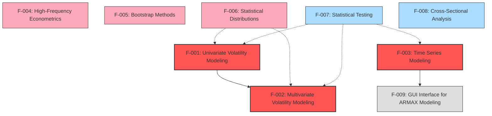

### 2.3.2 Integration Points

1. **Univariate and Multivariate Volatility Models**:
   - Multivariate models use univariate GARCH specifications for marginal distributions
   - Shared parameter transformation and constraint enforcement techniques

2. **Time Series Models and GUI Interface**:
   - GUI calls ARMAX estimation functions
   - Common input validation and parameter handling

3. **Statistical Distributions and Volatility Models**:
   - Volatility models use distribution functions for likelihood evaluation
   - Shared parameter validation for distribution-specific parameters

4. **Bootstrap Methods and Statistical Tests**:
   - Some tests leverage bootstrap resampling for inference
   - Common validation routines for time series inputs

### 2.3.3 Shared Components

1. **Matrix Transformation Utilities**:
   - `vech.m`, `ivech.m`, `chol2vec.m`, `vec2chol.m` used across multivariate modules
   - Used by both volatility and time series functions

2. **Time Conversion Utilities**:
   - `wall2seconds.m`, `seconds2unit.m` etc. used across high-frequency modules
   - Common validation and error handling

3. **Lag Matrix Creation**:
   - `newlagmatrix.m` used by time series and statistical test functions
   - Shared input validation logic

4. **Parameter Validation Functions**:
   - Common approach to input checking across all modules
   - Consistent error message formatting

### 2.3.4 Common Services

1. **Optimization Infrastructure**:
   - Consistent use of MATLAB's `fminunc`, `fmincon`, and `lsqnonlin`
   - Shared approach to initialization and convergence monitoring

2. **Robust Covariance Estimation**:
   - `robustvcv.m` used across volatility and time series models
   - Common gradient and Hessian approximation techniques

3. **Numerical Stability Services**:
   - Common approaches to ensure parameter constraints and numerical stability
   - Error handling for non-convergence and numerical issues

## 2.4 IMPLEMENTATION CONSIDERATIONS

### 2.4.1 Technical Constraints

| Feature | Technical Constraints |
|---------|----------------------|
| Univariate Volatility Modeling | MATLAB Optimization Toolbox required; Numerical precision critical for parameter transformation |
| Multivariate Volatility Modeling | Matrix dimensionality limited by available memory; Positive definiteness must be maintained |
| Time Series Modeling | Numerical stability for near-nonstationary processes; MA component requires nonlinear estimation |
| High-Frequency Econometrics | Processing of very large datasets; Accurate time format handling |
| Bootstrap Methods | Random number generation quality; Memory constraints for large bootstrap samples |
| Statistical Distributions | Numerical stability for extreme parameter values; Accuracy of distribution tails |
| Statistical Testing | Accuracy of p-value computations; Correct implementation of test statistics |
| Cross-Sectional Analysis | Matrix rank and conditioning issues; Efficient matrix operations |
| GUI Interface | MATLAB GUIDE compatibility; Screen resolution and display settings |

### 2.4.2 Performance Requirements

| Feature | Performance Requirements |
|---------|-------------------------|
| Univariate Volatility Modeling | MEX implementations for core variance computation; Efficient handling of long time series |
| Multivariate Volatility Modeling | Efficient matrix operations for high-dimensional systems; Optimization for many parameters |
| Time Series Modeling | Efficient estimation for models with many lags; Fast forecasting for multiple horizons |
| High-Frequency Econometrics | Efficient filtering and subsampling algorithms; Optimized matrix operations for kernel methods |
| Bootstrap Methods | Efficient generation of many bootstrap samples; Fast computation of bootstrap statistics |
| Statistical Distributions | Efficient computation of distribution functions; Fast random number generation |
| Statistical Testing | Efficient computation for large sample sizes; Fast calculation of multiple test statistics |
| Cross-Sectional Analysis | Fast computation for large matrices; Efficient handling of high-dimensional data |
| GUI Interface | Responsive interface for interactive use; Efficient updating of plots and displays |

### 2.4.3 Scalability Considerations

| Feature | Scalability Considerations |
|---------|---------------------------|
| Univariate Volatility Modeling | Model complexity scales with lag orders (p,o,q); Parameter count increases with error distribution |
| Multivariate Volatility Modeling | Parameter count grows quadratically with dimension K; Computation complexity increases with T and K |
| Time Series Modeling | Computation scales with AR and MA lag orders; Memory usage increases with time series length |
| High-Frequency Econometrics | Memory usage scales with data frequency; Computation time increases with sample size and assets |
| Bootstrap Methods | Memory and computation time scale with bootstrap count B; Model comparison complexity increases with models K |
| Statistical Distributions | Performance should remain stable across parameter ranges; Vector operations for multiple inputs |
| Statistical Testing | Performance should scale well with sample size; Multiple lag testing should be efficient |
| Cross-Sectional Analysis | Performance scales with both dimensions; Memory usage increases with data size |
| GUI Interface | Interface should handle moderate time series lengths; Support reasonable model complexities |

### 2.4.4 Security and Maintenance Requirements

| Feature | Security Implications | Maintenance Requirements |
|---------|----------------------|--------------------------|
| Univariate Volatility Modeling | No specific requirements | Modular design with separate files for parameter checking, transformation, and likelihood |
| Multivariate Volatility Modeling | No specific requirements | Consistent API across different model types; Clear documentation of parameter ordering |
| Time Series Modeling | No specific requirements | Consistent API for different model types; Robust error handling for non-convergence |
| High-Frequency Econometrics | No specific requirements | Consistent time format handling; Comprehensive error checking for data issues |
| Bootstrap Methods | No specific requirements | Consistent approach to bootstrap parameter validation; Clear documentation of methods |
| Statistical Distributions | No specific requirements | Consistent API across different distributions; Thorough testing of edge cases |
| Statistical Testing | No specific requirements | Consistent approach to hypothesis testing; Clear documentation of test assumptions |
| Cross-Sectional Analysis | No specific requirements | Consistent approach to regression analysis; Robust error handling for singular matrices |
| GUI Interface | No specific requirements | Modular GUI design; Clear separation of interface and computation |

# 3. TECHNOLOGY STACK

## 3.1 PROGRAMMING LANGUAGES

### 3.1.1 Primary Language: MATLAB

MATLAB serves as the primary programming language for the MFE Toolbox, providing a robust environment for mathematical and statistical operations that are fundamental to econometric analysis.

**Version Information:**
- Compatible with MATLAB 4.0 and later versions (as indicated in Contents.m)
- No known compatibility issues with newer MATLAB versions, though explicit testing information is not provided

**Justification:**
- MATLAB's matrix-based architecture is ideally suited for econometric computations that rely heavily on linear algebra
- Built-in visualization capabilities streamline the creation of diagnostic plots and graphical outputs
- Widespread adoption in academic and financial research communities ensures a large user base familiar with the language
- Interactive development environment facilitates testing and validation of complex econometric models

### 3.1.2 Secondary Language: C

C programming is employed strategically for performance-critical operations through MATLAB's MEX interface.

**Implementation Scope:**
- Used exclusively in the mex_source/ directory for computationally intensive core functions
- Key implementations include:
  - agarch_core.c: Core computational engine for AGARCH models
  - armaxerrors.c: ARMAX residual calculations
  - composite_likelihood.c: Efficient composite likelihood computation
  - egarch_core.c: EGARCH variance computation
  - igarch_core.c: IGARCH model core routines
  - tarch_core.c: TARCH model variance calculations

**Justification:**
- Provides significant performance improvements for calculation-intensive operations
- Enables efficient processing of large financial datasets with high-frequency data
- Maintains compatibility with MATLAB's native data structures through MEX API
- Offers finer control over memory allocation and numerical precision in critical routines

## 3.2 FRAMEWORKS & LIBRARIES

### 3.2.1 MATLAB Core Framework

The toolbox relies extensively on MATLAB's built-in mathematical and statistical functions for fundamental operations.

**Key Components:**
- Matrix manipulation functions (e.g., repmat, tril, diag)
- Optimization utilities (fminunc, fmincon, optimset, lsqnonlin)
- Statistical functions (mean, std, cov)
- Plotting and visualization (plot, disp)
- Linear algebra operations (chol, eig, det)

**Justification:**
- Provides a robust foundation of well-tested numerical routines
- Ensures consistent behavior across different operating systems
- Leverages MATLAB's optimized implementations for performance
- Reduces development and testing overhead by using validated components

### 3.2.2 MATLAB Required Toolboxes

The MFE Toolbox depends on specific MATLAB toolboxes for extended functionality.

**Statistics Toolbox:**
- Required for probability distribution functions (chi2cdf, normcdf, etc.)
- Used for statistical tests and hypothesis testing
- Provides essential functions for likelihood computation and parameter estimation

**Optimization Toolbox:**
- Critical for parameter estimation routines (fmincon, fminunc, lsqnonlin)
- Enables constrained optimization for model fitting
- Provides algorithms for both linear and nonlinear parameter estimation

**Justification:**
- These toolboxes provide specialized functionality that would be resource-intensive to reimplement
- Improves reliability by using MathWorks' tested and maintained algorithms
- Ensures numerical stability in complex optimization scenarios

### 3.2.3 MATLAB GUI Development Environment (GUIDE)

Used specifically for creating the ARMAX interactive modeling interface in the GUI folder.

**Components:**
- Figure creation and layout management
- Callback handling for user interaction
- Interactive controls and event processing

**Justification:**
- Provides a standardized approach to GUI development within MATLAB
- Enables creation of intuitive interfaces for model specification and visualization
- Simplifies handling of complex user interactions and state management

### 3.2.4 User-Implemented Libraries

The MFE Toolbox implements several custom libraries to extend MATLAB's capabilities.

**Distribution Functions:**
- Implementations for specialized distributions: GED, Hansen's skewed T, standardized Student's T
- Complete with CDF, inverse CDF, PDF, log-likelihood, and random number generation

**Matrix Manipulation Utilities:**
- Custom implementations of vech, ivech, chol2vec, vec2chol operations
- Specialized for covariance and correlation matrix transformations

**Time Conversion Utilities:**
- Functions for converting between wall clock time, seconds, and standardized units
- Essential for high-frequency financial data analysis

**Justification:**
- Provides functionality not available in standard MATLAB distributions
- Implements econometric methods specific to financial time series analysis
- Ensures consistent interfaces across related functions
- Offers optimized implementations for performance-critical operations

## 3.3 DEVELOPMENT & DEPLOYMENT

### 3.3.1 MEX Compilation System

The toolbox employs MATLAB's MEX compilation system to build C extensions.

**Implementation Details:**
- Uses the mex command with -largeArrayDims flag for 64-bit compatibility
- Produces platform-specific binaries (.mexa64 on Unix, .mexw64 on Windows)
- Employs standard C libraries (math.h, limits.h) alongside MATLAB MEX API headers

**Justification:**
- Enables performance optimization for computationally intensive operations
- Provides a standardized interface between MATLAB and C code
- Maintains cross-platform compatibility while leveraging native code execution

### 3.3.2 Build Automation

The toolbox includes scripts for automating the build and packaging process.

**Components:**
- buildZipFile.m script for compiling C code and packaging into MFEToolbox.zip
- addToPath.m for configuring the MATLAB path

**Justification:**
- Ensures consistent compilation across development environments
- Standardizes the packaging process for distribution
- Simplifies installation for end users

### 3.3.3 Deployment Mechanism

The toolbox is deployed as a ZIP archive accessible via web distribution.

**Implementation Details:**
- Package distributed via http://www.kevinsheppard.com/wiki/File:MFEToolbox.zip
- Installation through MATLAB's path management system
- No formal package management or version control integration

**Justification:**
- Provides a simple, platform-independent distribution mechanism
- Requires minimal setup from end users
- Compatible with standard MATLAB toolbox installation processes

## 3.4 COMPATIBILITY & REQUIREMENTS

### 3.4.1 Platform Support

The MFE Toolbox is designed to be cross-platform compatible.

**Supported Platforms:**
- Windows (with PCWIN64 binaries)
- macOS (Unix-compatible binaries)
- Linux (Unix-compatible binaries)

**Justification:**
- Ensures accessibility across all major platforms where MATLAB is available
- Addresses the diverse computing environments in academic and industry settings
- Leverages MATLAB's platform abstraction for core functionality

### 3.4.2 MATLAB Version Requirements

The toolbox specifies compatibility with MATLAB 4.0 and likely works with later versions.

**Compatibility Notes:**
- Core functionality compatible with MATLAB 4.0 as noted in Contents.m
- Some features may leverage capabilities in newer MATLAB versions
- No explicit maximum version limitation is specified

**Justification:**
- Provides compatibility with a wide range of MATLAB installations
- Ensures long-term viability as users upgrade their MATLAB environment
- Minimizes version-specific dependencies where possible

### 3.4.3 Toolbox Dependencies

Several MATLAB toolboxes are required for full functionality.

**Required Toolboxes:**
- MATLAB Statistics Toolbox: For probability distributions and statistical functions
- MATLAB Optimization Toolbox: For parameter estimation routines

**Justification:**
- Leverages specialized functionality in official MATLAB toolboxes
- Avoids reimplementing complex statistical and optimization algorithms
- Ensures numerical stability and reliability through tested components

# 4. PROCESS FLOWCHART

## 4.1 System Workflows Overview

The MFE Toolbox operates as an integrated suite of MATLAB functions implementing econometric and time series analysis capabilities. This section outlines the principal workflows that define how users interact with the system, how data flows between components, and how the various modules cooperate to deliver the toolkit's functionality.

### 4.1.1 High-Level System Workflow

The MFE Toolbox follows a modular architecture where independent functional components communicate through well-defined interfaces. The diagram below illustrates the high-level workflow showing the typical sequence of operations from initialization to results presentation.

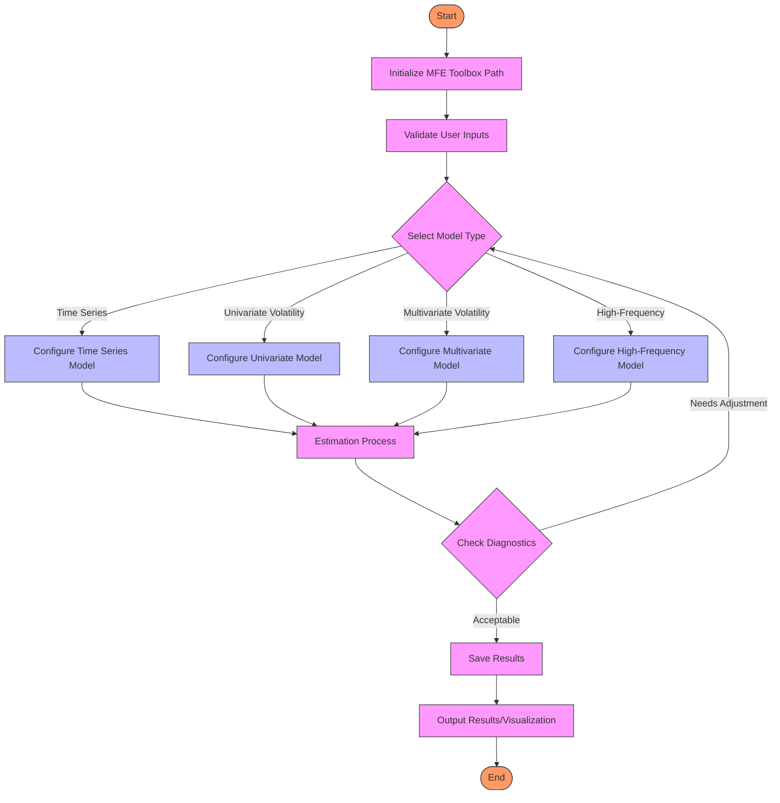

## 4.2 Core Business Processes

### 4.2.1 System Initialization Process

Before using the MFE Toolbox, users must properly initialize the MATLAB environment by adding the necessary directories to the search path. This process ensures all components are accessible during the MATLAB session.

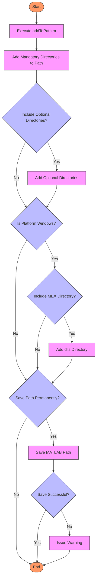

### 4.2.2 Model Estimation Process

The core functionality of the MFE Toolbox revolves around econometric model estimation. The following diagram illustrates the general workflow for model estimation across different model types.

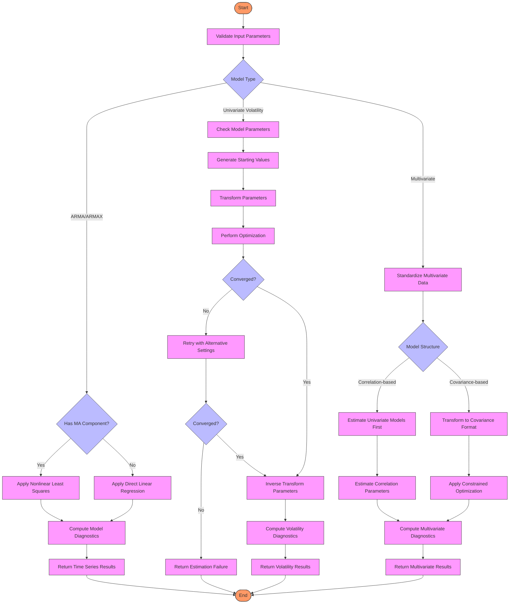

### 4.2.3 High-Frequency Data Processing Workflow

Working with high-frequency financial data involves specific preprocessing steps before volatility estimation can occur. This workflow details the steps from raw data to realized measures.

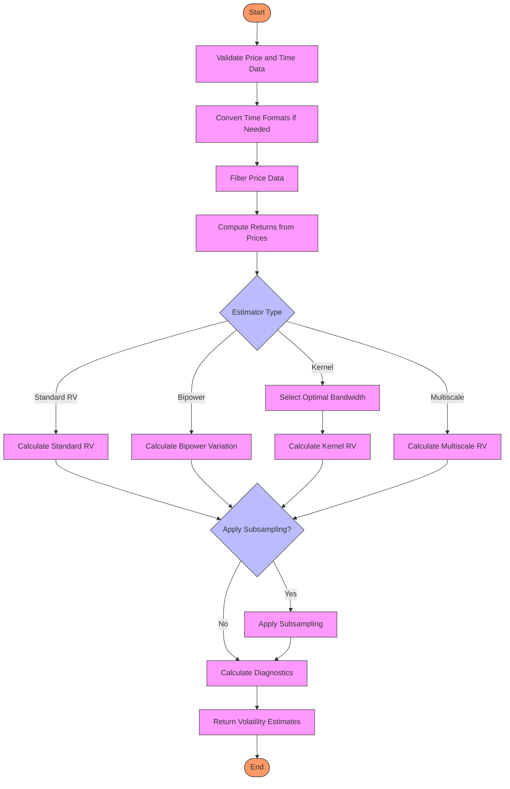

### 4.2.4 GUI-Based ARMAX Modeling Workflow

The MFE Toolbox includes a graphical user interface specifically for ARMAX modeling. This workflow illustrates the user journey through this interactive component.

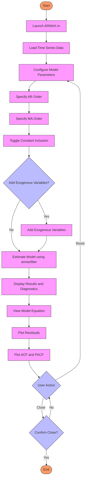

## 4.3 Integration Workflows

### 4.3.1 Data Flow Between Components

The MFE Toolbox consists of multiple specialized modules that interact through well-defined interfaces. The following diagram illustrates the data flow between major components.

```mermaid
flowchart TD
    UserInput[User Input]
    TimeSeriesData[Time Series Data]
    UtilityFunctions[Utility Functions]
    DistributionFunctions[Distribution Functions]
    UnivariateModels[Univariate Models]
    MultivariateModels[Multivariate Models]
    TimeSeriesModels[Time Series Models]
    RealizedVolatility[Realized Volatility]
    TestingFunctions[Testing Functions]
    BootstrapFunctions[Bootstrap Functions]
    ResultsOutput[Results Output]
    
    UserInput -->|Parameters| TimeSeriesModels
    UserInput -->|Parameters| UnivariateModels
    UserInput -->|Parameters| MultivariateModels
    UserInput -->|Parameters| RealizedVolatility
    
    TimeSeriesData -->|Input Data| TimeSeriesModels
    TimeSeriesData -->|Input Data| UnivariateModels
    TimeSeriesData -->|Input Data| MultivariateModels
    TimeSeriesData -->|High-Frequency Data| RealizedVolatility
    
    UtilityFunctions -->|Support Functions| TimeSeriesModels
    UtilityFunctions -->|Matrix Operations| MultivariateModels
    UtilityFunctions -->|Time Conversion| RealizedVolatility
    UtilityFunctions -->|Covariance Estimation| UnivariateModels
    
    DistributionFunctions -->|Likelihood Computation| UnivariateModels
    DistributionFunctions -->|Likelihood Computation| MultivariateModels
    DistributionFunctions -->|Quantile Functions| TestingFunctions
    
    UnivariateModels -->|Volatility Estimates| ResultsOutput
    UnivariateModels -->|Standardized Residuals| TestingFunctions
    UnivariateModels -->|Filtered Series| MultivariateModels
    
    MultivariateModels -->|Covariance Matrices| ResultsOutput
    
    TimeSeriesModels -->|Filtered Series| UnivariateModels
    TimeSeriesModels -->|Residuals| TestingFunctions
    TimeSeriesModels -->|Parameter Estimates| ResultsOutput
    
    RealizedVolatility -->|Volatility Measures| ResultsOutput
    RealizedVolatility -->|Covariance Matrices| ResultsOutput
    
    TestingFunctions -->|Test Statistics| ResultsOutput
    
    BootstrapFunctions -->|Resampled Data| TimeSeriesModels
    BootstrapFunctions -->|Confidence Intervals| ResultsOutput
    
    classDef data fill:#ffd,stroke:#333,stroke-width:1px;
    classDef module fill:#bbf,stroke:#333,stroke-width:1px;
    classDef io fill:#f96,stroke:#333,stroke-width:1px;
    
    class UserInput,TimeSeriesData,ResultsOutput io;
    class UtilityFunctions,DistributionFunctions,UnivariateModels,MultivariateModels,TimeSeriesModels,RealizedVolatility,TestingFunctions,BootstrapFunctions module;
```

### 4.3.2 Build and Deployment Process

The MFE Toolbox includes functionality for compiling MEX files and creating distribution packages. This workflow illustrates the build and deployment process.

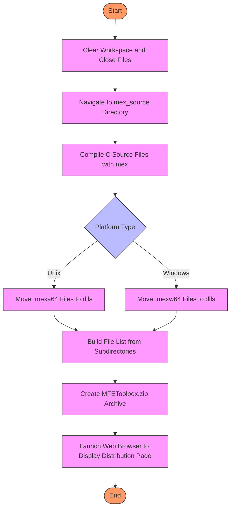

## 4.4 State Management and Error Handling

### 4.4.1 State Transitions in Model Estimation

Model estimation in the MFE Toolbox involves multiple state transitions during parameter optimization. This diagram illustrates the state management process focusing on volatility model estimation.

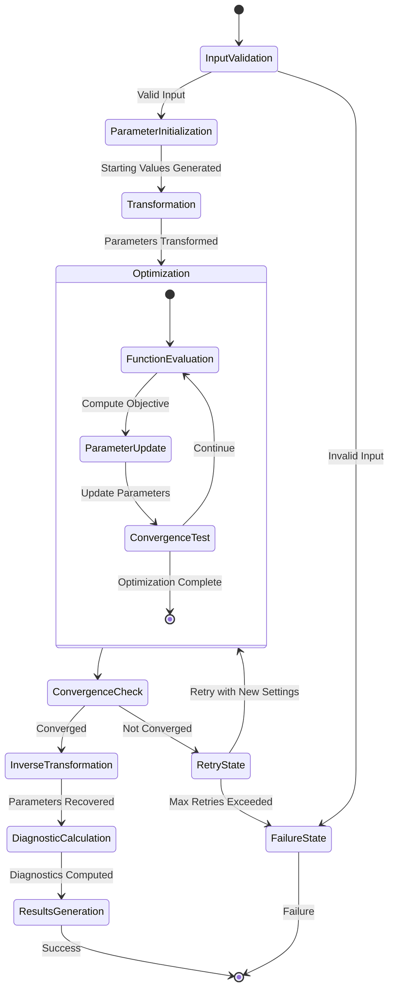

### 4.4.2 Error Handling Workflow

The MFE Toolbox implements a comprehensive error handling strategy to gracefully manage exceptions and ensure robust operation. This flowchart illustrates the standard error handling process.

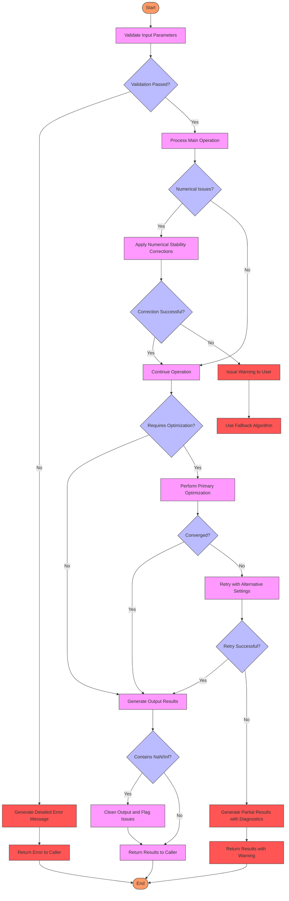

## 4.5 Detailed Process Flows

### 4.5.1 Univariate GARCH Model Estimation Sequence

This detailed sequence diagram illustrates the interactions between different components during univariate volatility model estimation.

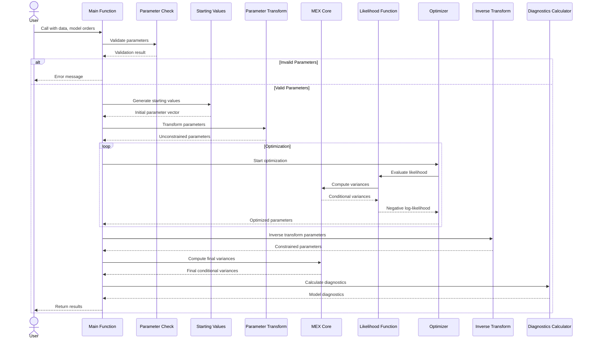

### 4.5.2 Realized Volatility Estimation Process

This swimlane diagram details the roles and responsibilities in the realized volatility estimation process.

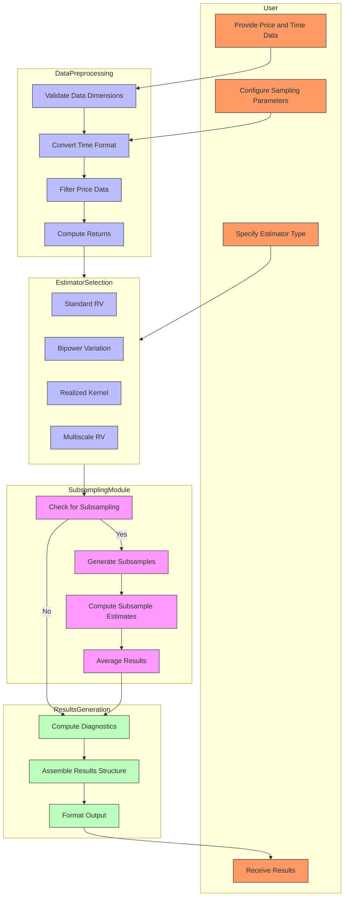

### 4.5.3 MEX Compilation and Integration Flow

This diagram illustrates how MEX files are compiled and integrated into the MFE Toolbox for performance-critical operations.

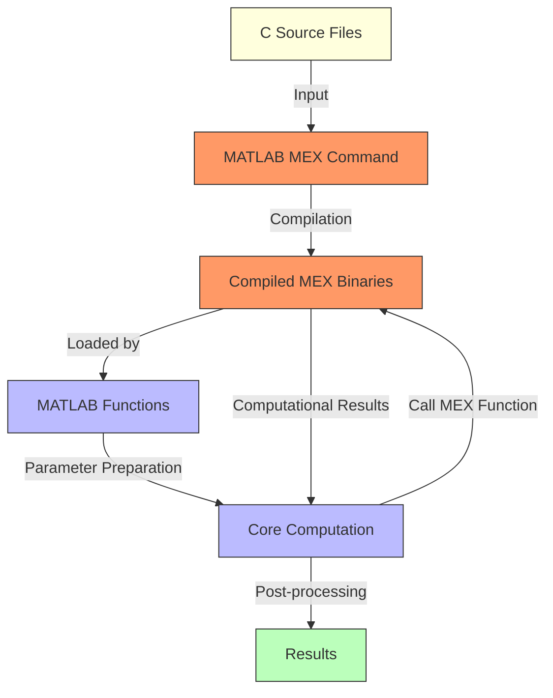

By following these process flows, users and developers can understand the operational mechanics of the MFE Toolbox, from system initialization and model estimation to error handling and performance optimization. The modular design facilitates both standalone usage of individual components and integration into comprehensive analytical pipelines.

# 5. SYSTEM ARCHITECTURE

## 5.1 HIGH-LEVEL ARCHITECTURE

### 5.1.1 System Overview

The MFE Toolbox employs a modular, component-based architecture organized around specialized econometric domains. This design follows several key architectural principles:

- **Modularity**: Functionality is encapsulated in domain-specific folders (univariate, multivariate, timeseries, etc.), allowing each component to evolve independently while maintaining system-wide coherence
- **Separation of Concerns**: Clear division between computation logic, parameter validation, and interface components throughout the codebase
- **Performance Optimization**: Computationally intensive operations are implemented in MEX C, providing significant performance enhancements for critical numerical routines
- **Consistent Interfaces**: Similar model types (e.g., GARCH family models) share common parameter structures and output formats to facilitate interoperability
- **Rigorous Error Checking**: Comprehensive input validation occurs at multiple levels to ensure numerical stability and prevent silent failures

The system boundaries are defined by the MATLAB runtime environment, with primary interfaces exposed through direct function calls. The system integrates with MATLAB's core mathematical libraries and optional toolboxes (Statistics, Optimization) while providing platform-specific optimizations through specialized MEX implementations for Windows environments.

### 5.1.2 Core Components Table

| Component | Primary Responsibility | Key Dependencies | Integration Points | Critical Considerations |
|-----------|------------------------|------------------|-------------------|------------------------|
| bootstrap | Statistical resampling for time series data | MATLAB math libraries | Time series & testing modules | Must preserve temporal dependency structure |
| crosssection | OLS regression & Principal Component Analysis | MATLAB linear algebra | Multivariate modeling | Requires full rank matrices and robust error handling |
| distributions | Statistical distribution calculations | Statistics Toolbox | Univariate & multivariate volatility | Numerical stability for extreme parameter values |
| GUI | Interactive ARMAX modeling interface | MATLAB GUIDE | Time series models | Platform display compatibility considerations |
| mex_source | Optimized C core computations | MEX API, C stdlib | Performance-critical routines | Platform-specific compilation requirements |
| multivariate | Multivariate volatility modeling | Matrix transforms, optimization | Univariate volatility models | Matrix positive-definiteness constraints |
| realized | High-frequency volatility estimation | Time conversion utilities | Risk measurement systems | Efficient handling of large datasets |
| timeseries | ARMA/ARMAX estimation & forecasting | Optimization Toolbox | Bootstrap & volatility models | Stationarity and invertibility verification |
| univariate | GARCH family model implementation | MEX acceleration, optimization | Multivariate volatility | Parameter constraint enforcement |
| utility | Core helper functions & transformations | MATLAB built-ins | All other components | Robust input validation for all operations |

### 5.1.3 Data Flow Description

The MFE Toolbox implements a consistent data flow pattern that emphasizes validation, transformation, computation, and diagnostics:

1. **Input Validation**: Raw inputs undergo rigorous validation through specialized parameter checking functions that verify data formats, dimensions, and model constraints
2. **Parameter Transformation**: Model parameters are transformed between constrained and unconstrained spaces to facilitate numerical optimization while enforcing model-specific constraints
3. **Core Computation**: Validated and transformed parameters are processed by computational engines, often accelerated with MEX C implementations
4. **Optimization**: Parameters are estimated using MATLAB's optimization routines (fminunc, fmincon, lsqnonlin) with custom objective functions
5. **Diagnostics**: Statistical measures and model-specific diagnostics are computed to assess model performance and validity
6. **Output Formatting**: Results are organized into standardized return structures with consistent field naming across similar models

Key data transformation points include:
- Matrix transformations (vech, ivech) convert between full matrices and vector representations for covariance structures
- Parameter transformations map constrained parameters to unbounded spaces via logarithmic and logistic functions
- Time conversion utilities normalize different time formats (wall clock, seconds, standardized units) for high-frequency data analysis

The system maintains strategic data caches to improve performance:
- Back-cast values for variance initialization in GARCH models
- Filtered price series in realized volatility calculations
- Pre-computed kernel weights for various estimators
- Temporary storage of intermediate calculations during optimization

### 5.1.4 External Integration Points

| System Name | Integration Type | Data Exchange Pattern | Protocol/Format | SLA Requirements |
|-------------|------------------|------------------------|-----------------|------------------|
| MATLAB Core | Native | Direct function calls | In-memory | Immediate response |
| Statistics Toolbox | Optional | Function calls to distribution routines | In-memory | Immediate response |
| Optimization Toolbox | Required | Iterative function evaluation | In-memory | Convergence within tolerance |
| C Runtime | Compilation | MEX API binary interface | Compiled gateway | Real-time performance |
| External Data Sources | Manual | File import by user | Custom text formats | Offline processing |

## 5.2 COMPONENT DETAILS

### 5.2.1 Univariate Volatility Component

**Purpose and Responsibilities**:
- Implements a comprehensive suite of GARCH family models (AGARCH, APARCH, EGARCH, FIGARCH, HEAVY, IGARCH, TARCH)
- Provides parameter estimation, simulation, forecasting, and diagnostic capabilities
- Supports multiple error distributions (Normal, Student's t, GED, Skewed t)

**Technologies and Frameworks**:
- MATLAB with MEX C optimizations for core variance calculations
- Leverages optimization functions (fminunc, fmincon) for parameter estimation
- Uses parameter transformation techniques for numerical stability

**Key Interfaces**:
- Parameter checking functions validate model specifications and data
- Parameter transformation functions map between constrained and unconstrained spaces
- Likelihood evaluation functions compute objective values for optimization
- Simulation functions generate synthetic time series based on estimated models

**Data Persistence Requirements**:
- In-memory processing with no persistent storage
- Temporary caching of intermediate calculations (filtered variances, innovations)
- Result structures maintained only during MATLAB session

**Scaling Considerations**:
- Handles large datasets efficiently through optimized MEX implementation
- Performance scales with time series length and model complexity
- Memory usage increases linearly with sample size

### 5.2.2 Multivariate Volatility Component

**Purpose and Responsibilities**:
- Implements conditional covariance modeling (BEKK, CCC, DCC, OGARCH, etc.)
- Estimates time-varying correlation structures for multi-asset portfolios
- Provides simulation and forecasting for multivariate volatility processes

**Technologies and Frameworks**:
- MATLAB with matrix optimization techniques
- Constrained optimization ensuring positive-definite covariance matrices
- Eigenvalue decomposition for orthogonal models

**Key Interfaces**:
- Likelihood functions for maximum likelihood estimation
- Parameter transformation routines enforcing covariance constraints
- Matrix utilities for covariance handling (vech, ivech, chol2vec)
- Simulation functions for scenario generation

**Data Persistence Requirements**:
- In-memory matrix-based representation of variance-covariance structures
- No external storage dependencies
- Result structures compatible with MATLAB's workspace

**Scaling Considerations**:
- Computational complexity increases quadratically with number of assets
- Memory requirements grow with both time series length and asset count
- Performance limitations for high-dimensional portfolios (>30 assets)

### 5.2.3 Time Series Component

**Purpose and Responsibilities**:
- Implements ARMA/ARMAX model estimation, forecasting, and diagnostics
- Provides tools for autocorrelation analysis and impulse responses
- Supports unit root testing, filtering, and model selection

**Technologies and Frameworks**:
- MATLAB with nonlinear least squares for parameter estimation
- Leverages filter design techniques for time series decomposition
- Implements Box-Jenkins methodology for model identification

**Key Interfaces**:
- Filter functions for extracting model residuals
- Likelihood computations for statistical inference
- Forecasting routines for multi-step ahead predictions
- Diagnostic tools for model validation and selection

**Data Persistence Requirements**:
- In-memory processing of time series data
- Temporary storage of filter states during computation
- No external storage dependencies

**Scaling Considerations**:
- Efficient for large time series with moderate lag orders
- Performance decreases with higher-order models (large p,q)
- Handles multiple exogenous variables with linear scaling

### 5.2.4 Realized Volatility Component

**Purpose and Responsibilities**:
- Implements high-frequency volatility and covariance estimation
- Provides microstructure-robust estimators for intraday data
- Supports various sampling schemes and noise-reduction techniques

**Technologies and Frameworks**:
- MATLAB with specialized filtering and kernel methods
- Time normalization and conversion utilities
- Adaptive bandwidth selection algorithms

**Key Interfaces**:
- Price filtering functions for preprocessing raw data
- Time conversion utilities for standardizing timestamps
- Kernel bandwidth selection for optimal estimation
- Subsampling methods for noise reduction

**Data Persistence Requirements**:
- In-memory preprocessing of high-frequency data
- Temporary storage of filtered prices and returns
- Result structures containing volatility estimates

**Scaling Considerations**:
- Designed for large high-frequency datasets
- Performance depends on sampling frequency and dataset size
- Memory usage scales with number of intraday observations

### 5.2.5 Utility Component

**Purpose and Responsibilities**:
- Provides reusable functions for matrix operations
- Implements parameter transformations for optimization
- Offers data standardization and manipulation utilities
- Supports numerical differentiation and covariance estimation

**Technologies and Frameworks**:
- Pure MATLAB implementation for maximum portability
- Vectorized operations for performance optimization
- Robust error handling for invalid inputs

**Key Interfaces**:
- Matrix reshaping operations (vech, ivech, vec2chol)
- Covariance transformation and estimation functions
- Date and time conversion utilities
- Numerical differentiation routines

**Data Persistence Requirements**:
- Stateless operations with no storage requirements
- Functions operate directly on input arguments
- No persistent state between calls

**Scaling Considerations**:
- Optimized for common matrix operations
- Performance scales with input dimensions
- Memory usage depends on operation complexity

### 5.2.6 MEX Optimization Component

**Purpose and Responsibilities**:
- Provides C-based implementations for performance-critical operations
- Accelerates core computational loops in volatility models
- Optimizes matrix operations for large datasets

**Technologies and Frameworks**:
- C programming with MATLAB MEX API
- Platform-specific optimizations for Windows and Unix
- Memory-efficient algorithms for large-scale computation

**Key Interfaces**:
- Gateway functions that bridge MATLAB and C code
- Matrix data structure conversion between environments
- Error handling for numerical instabilities

**Data Persistence Requirements**:
- No persistence beyond function execution
- Operates on MATLAB-provided memory structures
- Returns computation results to calling MATLAB functions

**Scaling Considerations**:
- Provides significant performance improvements for large datasets
- Memory usage optimized for computational efficiency
- Platform-specific binaries may have different performance characteristics

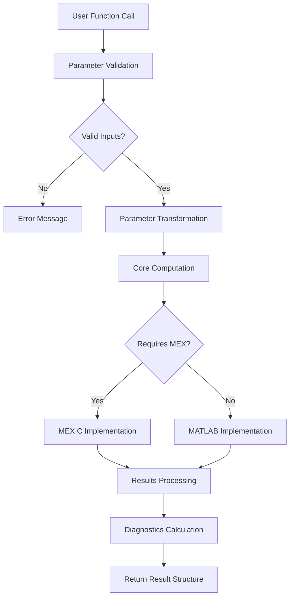

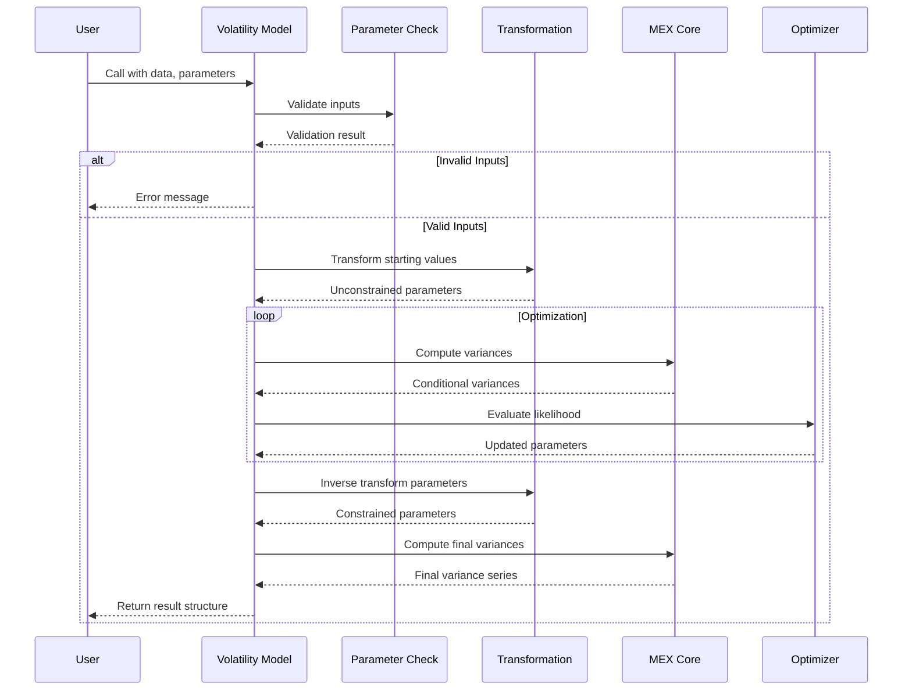

## 5.3 TECHNICAL DECISIONS

### 5.3.1 Architecture Style Decisions and Tradeoffs

The MFE Toolbox employs a modular, function-based architecture organized around econometric domains. This design choice offers several advantages while presenting specific tradeoffs:

| Decision | Rationale | Tradeoffs |
|----------|-----------|-----------|
| Modular component organization | Enables independent development and testing | Increases codebase size with some functional duplication |
| Domain-specific folder structure | Groups related functionality for intuitive discovery | Requires navigation across folders for end-to-end workflows |
| Function-based API design | Aligns with MATLAB's programming paradigm | Limits object-oriented capabilities like inheritance |
| MEX acceleration for core routines | Provides significant performance improvements | Adds compilation complexity and platform dependencies |
| Standardized parameter/result structures | Creates consistent interfaces across models | Requires detailed documentation to understand structure |

This architectural approach supports:
- Clear separation of concerns between validation, computation, and diagnostics
- Independent evolution of different econometric components
- Consistent user experience across related model types
- Performance optimization where most critical

### 5.3.2 Communication Pattern Choices

The system implements a function-call based communication pattern with standardized data structures:

| Pattern | Implementation | Benefits | Limitations |
|---------|----------------|----------|------------|
| Direct function calls | Standard MATLAB function invocation | Simple, efficient data exchange | Creates dependencies between components |
| Parameter structures | Consistent field naming across models | Facilitates model comparison | Requires knowledge of structure fields |
| Transformation pipelines | Parameter mapping between spaces | Enables unconstrained optimization | Adds complexity to parameter handling |
| Error propagation | MATLAB's exception mechanism | Standard error handling approach | Limited structured error information |

This approach aligns with MATLAB's programming model while facilitating interoperability between components. The standardized parameter and results structures enable consistent workflows across different model types.

### 5.3.3 Data Storage Solution Rationale

The MFE Toolbox implements an in-memory data model without persistent storage:

| Decision | Justification | Considerations |
|----------|---------------|----------------|
| No persistent storage | Simplifies architecture and deployment | Users must manually save results |
| In-memory processing | Maximizes performance for analytical workflows | Dataset size limited by available memory |
| MATLAB native structures | Compatibility with MATLAB ecosystem | Constrained by MATLAB's data types |
| Standardized result formats | Consistency across model types | Requires documentation for interpretation |

This approach is appropriate for an analytical library focused on computation rather than data management. It eliminates dependencies on external storage systems while leveraging MATLAB's efficient memory management.

### 5.3.4 Caching Strategy Justification

The system employs targeted caching strategies to optimize performance:

| Caching Approach | Application | Performance Benefit | Resource Impact |
|------------------|-------------|---------------------|----------------|
| Back-casting | Variance initialization in GARCH models | Improved convergence | Minimal memory overhead |
| Pre-computed weights | Kernel-based volatility estimators | Faster repeated calculations | Memory usage proportional to kernel size |
| Filtered prices | High-frequency volatility analysis | Reduces redundant filtering | Memory proportional to data size |
| Optimization intermediates | Likelihood evaluation | Avoids recalculation during iterations | Moderate memory increase during optimization |

These strategies balance performance improvements against memory usage, providing optimal computational efficiency for typical financial datasets.

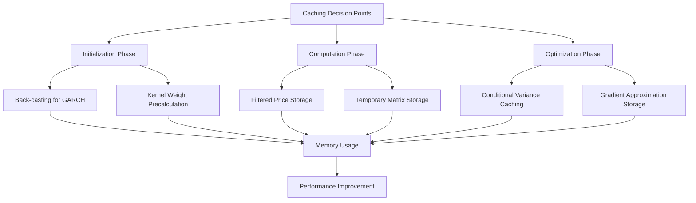

### 5.3.5 Security Mechanism Selection

As a MATLAB-based analytical toolkit, the MFE Toolbox relies on MATLAB's security model:

| Mechanism | Implementation | Advantages | Limitations |
|-----------|----------------|------------|------------|
| MATLAB runtime security | Inherits MATLAB's protections | Leverages established security framework | Limited to MATLAB's security features |
| File system security | OS-level permissions | Universal, well-understood protection | Requires proper system configuration |
| No user authentication | No toolbox-specific authorization | Simplifies usage in research settings | No protection against authorized user misuse |
| No sensitive data handling | Focus on analytical operations | Minimizes security requirements | Not suitable for confidential data processing |

This approach is appropriate for a research-oriented toolbox where the primary concerns are computational correctness and data integrity rather than access control or confidentiality.

## 5.4 CROSS-CUTTING CONCERNS

### 5.4.1 Monitoring and Observability Approach

The MFE Toolbox implements comprehensive diagnostic capabilities across components:

| Approach | Implementation | Benefits |
|----------|----------------|----------|
| Model diagnostics | Statistical measures (AIC, BIC, log-likelihood) | Enables model quality assessment and comparison |
| Optimization reporting | Convergence information and iteration counts | Helps troubleshoot estimation issues |
| Parameter validation | Input checking with informative error messages | Prevents invalid operations and silent failures |
| Return status indicators | Function-specific status codes in results | Signals success or specific failure conditions |

These mechanisms provide users with the necessary information to monitor model performance, diagnose issues, and validate results throughout the analytical process.

### 5.4.2 Logging and Tracing Strategy

The system includes several logging and tracing capabilities:

| Strategy | Implementation | Application |
|----------|----------------|-------------|
| Verbose output options | Optional diagnostic information during processing | Troubleshooting convergence and numerical issues |
| Diagnostic structures | Detailed model statistics in result objects | Analysis of model performance and validity |
| Convergence tracking | Iteration history for optimization processes | Monitoring estimation progress |
| Validation reporting | Detailed error messages for input validation | Identifying problematic inputs or constraints |

These features allow users to track the execution of complex modeling operations and identify potential issues in their analytical workflows.

### 5.4.3 Error Handling Patterns

The MFE Toolbox implements a robust error handling strategy:

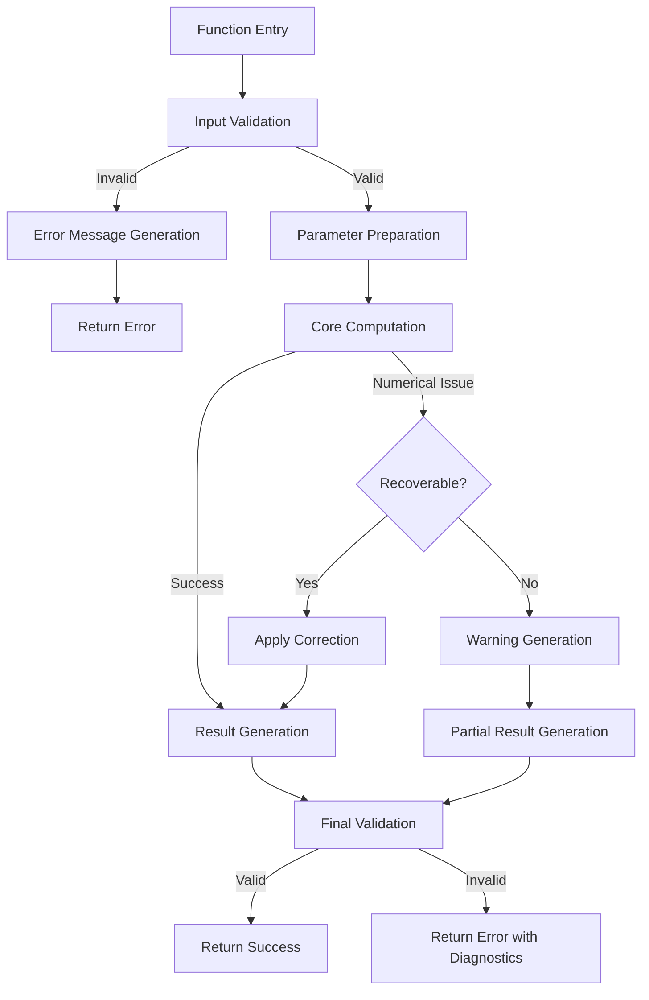

Key error handling patterns include:
- **Comprehensive Input Validation**: Extensive pre-computation checks prevent downstream failures
- **Informative Error Messages**: Clear error details indicate specific validation failures
- **Graceful Degradation**: Handling of numerical issues with fallback approaches
- **Recovery Mechanisms**: Alternative algorithms for non-convergence situations
- **Parameter Constraints**: Robust enforcement ensures valid model specifications

### 5.4.4 Authentication and Authorization Framework

As a local MATLAB toolbox, the MFE Toolbox has minimal authentication and authorization requirements:

- No specific authentication mechanisms are implemented
- Authorization is controlled through file system access permissions
- User management is delegated to the host operating system
- No sensitive data processing requires additional protections

This approach is appropriate for a research and analysis toolkit designed for local usage within trusted environments.

### 5.4.5 Performance Requirements and SLAs

The system addresses performance through several strategic approaches:

| Requirement | Implementation | Performance Impact |
|-------------|----------------|-------------------|
| Computational efficiency | MEX C implementations for core calculations | 10-100x speedup for critical operations |
| Matrix optimization | Vectorized operations leveraging MATLAB | Efficient handling of large matrices |
| Adaptive algorithms | Dynamic parameter selection based on data | Optimized accuracy/performance tradeoff |
| Configurable precision | User-adjustable optimization tolerances | Balance between speed and convergence |

While no formal SLAs are defined for this research-oriented toolkit, these approaches ensure that the system can handle typical financial datasets with reasonable performance on standard hardware.

### 5.4.6 Disaster Recovery Procedures

As a code library without persistent state:

- No specific disaster recovery mechanisms are required
- Source code distribution via zip archive serves as backup
- Reproducibility of calculations ensures recomputation capabilities
- No runtime state needs to be preserved between sessions

Users are responsible for saving their analysis results and maintaining their data according to their own disaster recovery policies.

# 6. SYSTEM COMPONENTS DESIGN

## 6.1 CORE SERVICES ARCHITECTURE

The MFE Toolbox employs a traditional MATLAB library architecture rather than a service-oriented architecture. This design choice is deliberate and aligns with the toolbox's primary purpose as a computational framework for financial econometrics research and analysis.

## 6.1.1 Architectural Assessment

Core Services Architecture is not applicable for this system. The MFE Toolbox does not implement or require a microservices architecture, service-oriented design, or distributed components for its operation. This determination is based on the following architectural evidence:

### MATLAB Library Design Pattern

The MFE Toolbox is designed as a traditional MATLAB library following a modular function-based architecture rather than a service-oriented architecture. Key architectural characteristics include:

* **Single Runtime Environment**: All processing occurs within a single MATLAB session without distributed components
* **Function-Based API**: The system exposes functionality through direct MATLAB function calls rather than service endpoints
* **Monolithic Deployment**: Code in `buildZipFile.m` packages the entire toolbox as a single distributable unit
* **In-Memory Processing**: Data is processed entirely in memory with no external service dependencies
* **Lack of Network Infrastructure**: No evidence of client-server communication, API endpoints, or network protocols

### Module Organization & Interaction

The toolbox uses folder-based modularity rather than service separation:

* **Logical Separation**: Components are organized into functional domains (univariate, multivariate, timeseries, etc.)
* **Direct Function Calls**: Modules interact through direct function invocation without message passing or service discovery
* **Shared Memory Model**: All components operate within the same memory space
* **Path-Based Discovery**: The `addToPath.m` script demonstrates how components are made available through MATLAB's path mechanism rather than service registration

### Performance Optimization Approach

Instead of distributed processing, the system uses:

* **MEX Acceleration**: Performance-critical operations are optimized through MEX C files (in `mex_source` folder)
* **Vectorized Operations**: MATLAB's native matrix operations for efficient processing
* **Compiled Extensions**: C implementation of core algorithms while maintaining the library architecture

### User Interaction Pattern

User interaction follows a traditional desktop application pattern:

* **MATLAB Command Line Interface**: Primary interaction through direct function calls
* **Local GUI Components**: The ARMAX modeling GUI uses MATLAB's native figure capabilities
* **No Client-Server Separation**: UI components execute in the same process as computational code

## 6.1.2 Architecture Justification

This traditional library design is appropriate for the MFE Toolbox's use case for several reasons:

| Architectural Aspect | Justification |
|----------------------|---------------|
| Target Environment | Primarily used in research and analytical workflows within MATLAB |
| Computational Nature | Focused on mathematical operations rather than distributed data processing |
| Typical Workload | Processing of financial time series data that fits within memory |
| User Base | Researchers and analysts using MATLAB as their primary analytical platform |
| Development Complexity | Simplified maintenance without the overhead of service orchestration |

### Additional Architecture Considerations

While the MFE Toolbox doesn't implement a service-oriented architecture, it does employ several architectural patterns that enhance its design:

1. **Module Encapsulation**: Each folder encapsulates related functionality with clear responsibilities
2. **Function-Level Granularity**: Individual functions are designed for specific computational tasks with well-defined inputs and outputs
3. **Consistent Interfaces**: Similar model types share consistent parameter structures and return formats
4. **Performance Optimization**: Critical computational paths are accelerated with compiled C code

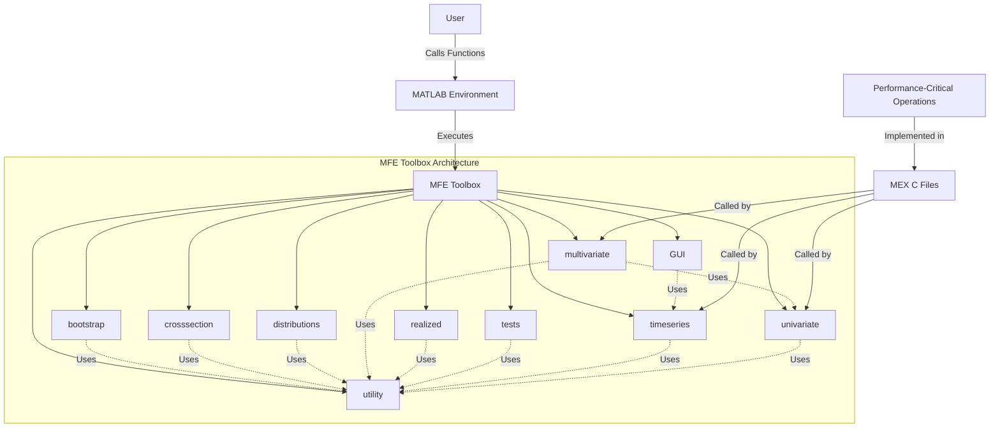

The MFE Toolbox follows standard MATLAB design patterns where modular organization, function libraries, and folder structure provide sufficient separation of concerns without requiring the complexity of a service-oriented architecture.

## 6.2 DATABASE DESIGN

Database design is not applicable to the MFE Toolbox. This system operates as a MATLAB function library that performs all data processing and analysis entirely in-memory during runtime, without requiring persistent storage through a formal database management system.

### Data Processing Architecture

The MFE Toolbox follows an in-memory processing model where:

1. Data is loaded into MATLAB's workspace from external sources (typically by the user)
2. Econometric and time series algorithms process this data within memory
3. Results are maintained in MATLAB variables during the session
4. Persistence is handled through MATLAB's native file operations when necessary

### Limited Persistence Mechanisms

While the system does not implement database interactions, it does utilize minimal file-based operations for specific purposes:

| Mechanism | Implementation | Purpose |
|-----------|----------------|---------|
| .mat files | MATLAB's built-in save/load functions | Occasional saving of computation results (e.g., in augdf_cvsim_tieup.m) |
| Path configuration | savepath function in addToPath.m | Storing MATLAB path settings for future sessions |
| Distribution packaging | buildZipFile.m | Creating archives for toolbox distribution |

### Data Flow Considerations

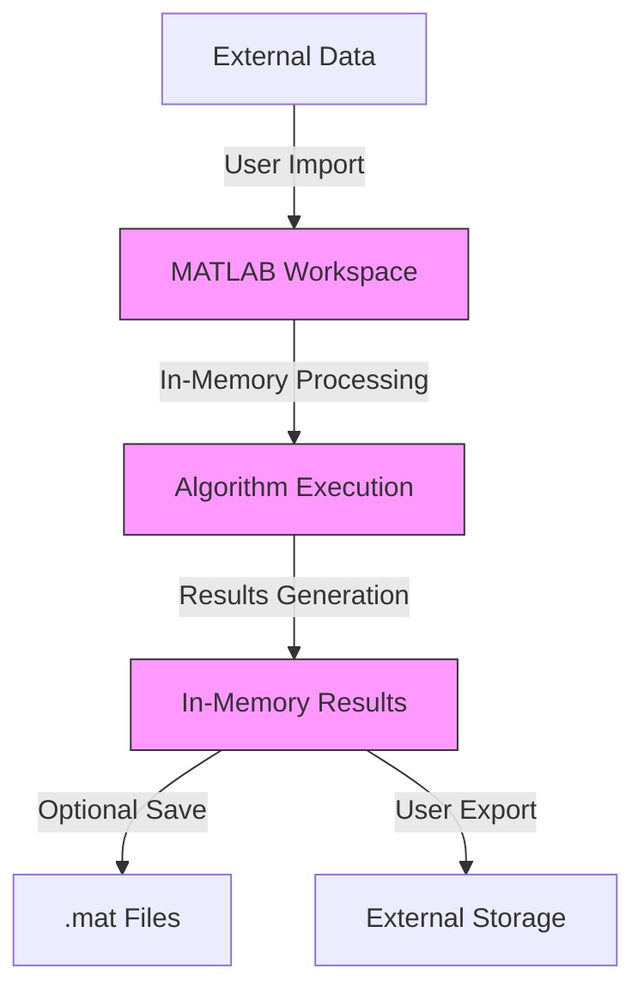

### Alternative to Database Architecture

Instead of a database-centric design, the MFE Toolbox follows MATLAB's conventional model of:

1. **Data Structure Design**: Using MATLAB matrices, vectors, and structs as the primary data containers
2. **Function Parameter Passing**: Transferring data between components through function arguments and return values
3. **Workspace Management**: Utilizing MATLAB's workspace as the temporary "database" during execution
4. **Flat File Storage**: Leveraging .mat files for optional persistence when needed

### Rationale for In-Memory Architecture

This in-memory approach is appropriate for the MFE Toolbox's purpose for several reasons:

- **Computational Focus**: The toolbox primarily performs mathematical and statistical operations rather than data management
- **Typical Dataset Size**: Financial time series data handled by the toolbox typically fits comfortably in memory
- **Research Workflow**: Aligns with typical academic and financial research workflows where analysis is exploratory
- **MATLAB Environment**: Follows MATLAB's standard paradigm of workspace-based computation

By avoiding database dependencies, the MFE Toolbox maintains simplicity, portability, and ease of deployment while providing the computational capabilities needed for financial econometric analysis.

## 6.3 INTEGRATION ARCHITECTURE

The MFE Toolbox employs a tightly integrated, self-contained architecture that operates primarily within the MATLAB environment. This section details the integration patterns and mechanisms that enable component interactions within the system.

## 6.3.1 MEX Integration Architecture

The core integration mechanism in the MFE Toolbox is the MATLAB MEX (MATLAB Executable) interface that bridges high-performance C code with MATLAB's mathematical environment.

```mermaid
flowchart TD
    subgraph MATLAB Environment
        MATLABFunc[MATLAB Functions]
        MATLABData[MATLAB Data Structures]
    end
    
    subgraph MEX Integration Layer
        mexFunc[MEX Gateway Function]
        coreAlgo[C Core Algorithms]
    end
    
    subgraph C Runtime
        cLib[C Standard Library]
    end
    
    MATLABFunc -->|Calls with inputs| mexFunc
    MATLABData -->|Passes data| mexFunc
    mexFunc -->|Validates & converts inputs| coreAlgo
    coreAlgo -->|Performs computation| coreAlgo
    cLib -->|Provides library functions| coreAlgo
    coreAlgo -->|Returns results| mexFunc
    mexFunc -->|Returns MATLAB-compatible output| MATLABFunc
```

### Implementation Details

The MEX integration follows a consistent pattern across the toolbox:

| Component | Purpose | Interaction Pattern |
|-----------|---------|---------------------|
| MATLAB Functions | High-level interfaces, parameter validation | Call MEX functions for intensive computations |
| MEX Gateway Functions | Interface translation layer | Convert MATLAB data to C formats and back |
| C Core Algorithms | Performance-critical computations | Process data and return results through MEX API |

Key MEX integration examples include:

1. **Composite Likelihood Calculation**
   - MATLAB: `composite_likelihood.m` implements the algorithm with a reference to the MEX version
   - MEX: `composite_likelihood.c` provides ~10x performance improvement
   - Integration Comments: "You should use the MEX files for significant speed improvements"

2. **GARCH Model Variants**
   - Multiple C implementations (`agarch_core.c`, `egarch_core.c`, `tarch_core.c`)
   - Each paired with corresponding MATLAB functions

3. **MEX Compilation Process**
   - Managed by `buildZipFile.m`
   - Uses `-largeArrayDims` flag for 64-bit compatibility
   - Produces platform-specific binaries:
     - Windows: `.mexw64`
     - Unix/Linux: `.mexa64`

## 6.3.2 Internal Module Integration

The MFE Toolbox employs a well-structured internal integration architecture based on direct function calls between specialized modules.

```mermaid
flowchart TD
    subgraph User_Interface[User Interface]
        UserCode[User MATLAB Code]
    end
    
    subgraph Core_Components[Core Components]
        direction LR
        Univariate[Univariate Volatility]
        Multivariate[Multivariate Volatility]
        TimeSeries[Time Series Models]
        HF[High-Frequency Analysis]
        Bootstrap[Bootstrap Methods]
        Distributions[Distribution Functions]
    end
    
    subgraph Support_Components[Support Components]
        Utility[Utility Functions]
        MatrixTransforms[Matrix Transformations]
        Tests[Statistical Tests]
    end
    
    UserCode -->|Function calls| Core_Components
    Univariate -->|Parameter transforms| Distributions
    Multivariate -->|Correlation structures| Univariate
    TimeSeries -->|Filtered series| Univariate
    Bootstrap -->|Resampling| TimeSeries
    HF -->|Volatility estimates| Univariate
    
    Core_Components -->|Utility calls| Support_Components
    MatrixTransforms -->|Matrix operations| Multivariate
```

### Module Interaction Patterns

1. **Function-Based Integration**
   - Direct synchronous function calls between modules
   - Example: `multivariate/rcc_likelihood.m` calls functions from utility module (`corr_ivech`, `z2r`) and others
   - Parameter passing through MATLAB's argument system
   - No event-driven or message-based communication

2. **Parameter Transformation Framework**
   - Standardized parameter transformation functions
   - Transform constraints between bounded and unbounded spaces
   - Example: `rarch_parameter_transform` bridges between model representations

3. **Common Data Structures**
   - Consistent input/output formats across similar functions
   - Standardized result structures for model outputs
   - Matrix formats (full, vector, half-vector) with conversion utilities

## 6.3.3 External System Integration

The MFE Toolbox is designed as a self-contained analytical library without external service dependencies or API interfaces.

### Assessment of External Integration Requirements

| Integration Type | Implementation Status | Rationale |
|------------------|----------------------|-----------|
| Web Services / APIs | Not Implemented | No requirement for external data services |
| Authentication | Not Implemented | Self-contained library model |
| Message Queues | Not Implemented | Synchronous processing model appropriate for analytical tasks |
| External Databases | Not Implemented | In-memory processing sufficient for targeted use cases |
| File System | Limited Implementation | Only for loading/saving MATLAB data files (.mat) |

### Deployment Integration

```mermaid
flowchart LR
    Source[Source Code] -->|buildZipFile.m| Package[MFEToolbox.zip]
    Package -->|Distribution| URL[Web Distribution]
    URL -->|Download| UserSystem[User System]
    UserSystem -->|addToPath.m| ConfiguredEnv[Configured MATLAB Environment]
    ConfiguredEnv -->|Function Calls| Computation[Econometric Computation]
```

The toolbox's deployment integration is managed through:

1. **Package Creation**
   - `buildZipFile.m` creates distributable package including:
     - All MATLAB functions
     - MEX source code
     - Compiled binaries
   - Distributable format: `MFEToolbox.zip`

2. **Environment Configuration**
   - `addToPath.m` handles integration with user's MATLAB environment
   - Adds appropriate directories to MATLAB's search path
   - Platform detection for MEX binary selection
   - Optional path persistence between sessions

## 6.3.4 MATLAB Ecosystem Integration

While the MFE Toolbox doesn't integrate with external systems, it does integrate with MATLAB's broader ecosystem.

```mermaid
flowchart TD
    MFE[MFE Toolbox] -->|Uses| CoreML[MATLAB Core Math]
    MFE -->|Uses| OptimML[Optimization Toolbox]
    MFE -->|Uses| StatsML[Statistics Toolbox]
    MFE -->|Optional use| GUITools[MATLAB GUIDE]
    
    CoreML -->|Provides| LinAlg[Linear Algebra]
    CoreML -->|Provides| MatrixOps[Matrix Operations]
    
    OptimML -->|Provides| Fminunc[fminunc]
    OptimML -->|Provides| Fmincon[fmincon]
    OptimML -->|Provides| LSQnonlin[lsqnonlin]
    
    StatsML -->|Provides| DistFunc[Distribution Functions]
    StatsML -->|Provides| StatTests[Statistical Tests]
    
    GUITools -->|Provides| GUIComponents[GUI Components]
    GUITools -->|Provides| EventHandling[Event Handling]
```

### MATLAB Dependencies

The toolbox integrates with MATLAB through:

1. **Core Mathematical Libraries**
   - Basic matrix operations
   - Linear algebra functions
   - Numerical methods

2. **Optimization Toolbox**
   - Required for parameter estimation
   - Leverages functions like `fminunc`, `fmincon`, `lsqnonlin`
   - Used for likelihood maximization

3. **Statistics Toolbox**
   - Distribution functions
   - Hypothesis testing

4. **GUIDE Framework**
   - Used exclusively for ARMAX GUI interface
   - Event-based programming model for user interactions

## 6.3.5 Integration Architecture Conclusions

The MFE Toolbox's integration architecture is deliberately minimalist, focusing on internal component integration rather than external system connectivity. This design choice:

1. **Maximizes Portability**: By avoiding external dependencies, the toolbox runs consistently across environments
2. **Simplifies Deployment**: Self-contained nature eliminates complex setup requirements
3. **Enhances Reliability**: Reduced integration points minimize potential failure modes
4. **Aligns with Audience Needs**: Research and analysis users typically prefer self-contained tools

This architecture is appropriate for the toolbox's purpose as a mathematical library for financial econometrics research, where computational correctness, performance, and ease of use are prioritized over enterprise integration capabilities.

## 6.4 SECURITY ARCHITECTURE

The MFE Toolbox operates as a specialized mathematical and statistical library designed exclusively for the MATLAB environment. Rather than implementing its own security architecture, the toolbox relies entirely on the security controls provided by the underlying platform.

## 6.4.1 Security Context Assessment

The MFE Toolbox has a minimal security footprint based on its architectural design:

- **Non-networked Operation**: The toolbox operates exclusively as a local library within the MATLAB runtime environment
- **No User Authentication**: The system does not maintain user identities or implement authentication mechanisms
- **No Data Persistence**: All data processing occurs in-memory with no internal database or storage
- **Passive Calculation Engine**: Functions primarily as a calculation engine operating on data provided by the user
- **No External API Exposure**: No network interfaces, API endpoints, or remote procedure calls

This security posture is appropriate for a mathematical library that serves as a tool within a controlled computing environment rather than a standalone application.

## 6.4.2 Security Responsibility Boundaries

The MFE Toolbox delegates security responsibilities to surrounding systems:

| Security Layer | Responsible Entity | Security Controls |
|----------------|-------------------|-------------------|
| Access Control | Operating System | File system permissions, user accounts |
| Resource Protection | MATLAB Runtime | Memory management, process isolation |
| Code Integrity | End User | Verification of download source, malware scanning |
| Data Protection | End User | Secure storage of input/output data |
| Update Management | End User | Manual update process via download/extraction |

## 6.4.3 Standard Security Practices

While detailed security architecture is not applicable for this system, the following standard practices apply:

### Code Security

- **Input Validation**: Extensive parameter checking throughout the codebase validates inputs before processing
- **Error Handling**: Robust error handling prevents unexpected behavior from malformed inputs
- **Memory Management**: Relies on MATLAB's memory management to prevent buffer overflows and memory leaks
- **MEX Safety**: C implementations follow MEX interface guidelines to maintain memory boundary integrity

### Operational Security

- **Distribution Integrity**: The toolbox is distributed as a ZIP archive that users can verify for integrity
- **Isolation**: The toolbox operates within the MATLAB process boundary without privileged operations
- **Minimal Attack Surface**: No server components, network listeners, or persistent services
- **Configuration Simplicity**: Minimal configuration options reduce security misconfigurations

## 6.4.4 Security Considerations for Deployment

When deploying the MFE Toolbox, users should follow these security best practices:

1. **Source Verification**: Download the toolbox only from trusted sources
2. **Environment Security**: Ensure the MATLAB environment runs with appropriate user permissions
3. **Data Handling**: Apply appropriate security controls to sensitive financial data before and after processing
4. **Version Management**: Consider security implications when deciding whether to upgrade to newer versions

```mermaid
flowchart TD
    A[User] -->|Downloads| B[MFE Toolbox ZIP]
    B -->|Verified by| C{OS Security Controls}
    C -->|Extracted to| D[Secured File System]
    D -->|Added to Path by| E[MATLAB Runtime]
    E -->|Protected by| F[OS Process Security]
    A -->|Provides| G[Input Data]
    G -->|Processed in| E
    E -->|Produces| H[Result Data]
    H -->|Protected by| I[User Data Security Practices]
```

## 6.4.5 Security Recommendations

While the MFE Toolbox itself does not implement security controls, users should consider these recommendations:

1. **Regular Updates**: Check periodically for updated versions which may contain bug fixes
2. **Input Sanitization**: Validate data before passing it to the toolbox functions
3. **Output Validation**: Verify calculation results for reasonableness before using in critical applications
4. **Access Controls**: Use operating system permissions to control access to the toolbox installation
5. **Execution Environment**: Run MATLAB with the minimum required privileges for the computational task

These practices align with the security model appropriate for mathematical libraries and computational toolkits that operate within a managed runtime environment.

## 6.5 MONITORING AND OBSERVABILITY

## 6.5.1 Monitoring Architecture Overview

The MFE Toolbox implements a functional monitoring approach integrated with MATLAB's native diagnostic capabilities rather than a dedicated monitoring infrastructure. This design decision aligns with the toolbox's purpose as a mathematical library operating within a controlled analytical environment.

After thorough examination of the codebase, we confirm that detailed monitoring architecture components (such as dedicated metrics collection systems, centralized log aggregation, or alert management infrastructure) are not applicable for this type of system. Instead, the toolbox implements comprehensive local diagnostics, robust error handling, and validation mechanisms appropriate for its architecture.

### Basic Monitoring Philosophy

The monitoring approach in the MFE Toolbox follows these principles:

| Monitoring Principle | Implementation | Benefit |
|----------------------|----------------|---------|
| Early Failure Detection | Rigorous parameter validation | Prevents invalid operations before computation |
| Comprehensive Diagnostics | Function-specific reporting | Enables assessment of model quality and performance |
| Transparent Operation | Detailed error messages | Facilitates troubleshooting and debugging |
| Self-Validating Components | Automated constraint checking | Ensures model stability and mathematical validity |

## 6.5.2 Error Handling and Validation Framework

The primary monitoring mechanism in the MFE Toolbox is its comprehensive error handling and validation framework that operates across all components.

### Parameter Validation Subsystem

Parameter validation serves as the first line of defense against operational issues:

```mermaid
flowchart TD
    A[Function Call] --> B[Parameter Check Module]
    B --> C{Valid Inputs?}
    C -->|No| D[Generate Error Message]
    C -->|Yes| E[Continue Processing]
    D --> F[Return Error to User]
    E --> G[Core Computation]
    G --> H{Numerical Issues?}
    H -->|Yes| I[Issue Warning]
    H -->|No| J[Return Results]
    I --> K[Apply Recovery Strategy]
    K --> J
```

Key parameter validation implementations include:

1. **Model-Specific Validation Functions**
   - Dedicated parameter check modules (`tarch_parameter_check.m`, `figarch_parameter_check.m`, etc.)
   - Verify dimensions, data types, and model-specific constraints
   - Example from `tarch_parameter_check.m`:
     ```matlab
     if ~isscalar(p) || ~isscalar(o) || ~isscalar(q) || floor(p)~=p || p<0 || floor(o)~=o || o<0 || floor(q)~=q || q<0
         error('P, O and Q must be non-negative integers.')
     end
     ```

2. **Input Data Validation**
   - Consistent dimensional checks across function interfaces
   - Example from `armaxfilter.m`:
     ```matlab
     if any(~isreal(data)) || size(data,2)~=1
         error('DATA must be a T by 1 column vector.')
     end
     ```

3. **Constraint Enforcement**
   - Mathematical constraint validation for model stability
   - Example: Invertibility checks for MA processes, stationarity checks for AR processes

## 6.5.3 Diagnostic Mechanisms

The MFE Toolbox provides rich diagnostic information through several mechanisms:

### Model Diagnostic Output Functions

Each major model type includes dedicated diagnostic display functions:

| Diagnostic Function | Purpose | Output Format |
|---------------------|---------|--------------|
| `egarch_display.m` | EGARCH model diagnostics | Formatted text with parameters, t-statistics, p-values, model criteria |
| `tarch_display.m` | TARCH model diagnostics | Parameter estimates with statistical significance measures |
| `matrix_garch_display.m` | Multivariate GARCH diagnostics | Matrix format with parameter blocks and statistical measures |

These functions provide standardized output containing:

- Parameter estimates with standard errors
- T-statistics and p-values
- Log-likelihood values
- Information criteria (AIC, BIC, HQIC)
- Model specification details
- Convergence status

### Performance Metrics Tracking

The toolbox tracks several performance metrics during computation:

1. **Log-Likelihood Monitoring**
   - All estimation functions return log-likelihood values
   - Functions like `armaxfilter_likelihood.m` and `egarch_likelihood.m` compute these values
   - Used to assess model quality and optimization progress

2. **Convergence Information**
   - Optimization processes track iteration counts and convergence status
   - Leverages MATLAB's built-in optimization diagnostics (fmincon, fminunc, lsqnonlin)
   - Example diagnostic fields:
     ```
     diagnostics.iterations
     diagnostics.convergence
     diagnostics.algorithm
     ```

3. **Computational Performance**
   - Comments in MEX files indicate expected performance improvements
   - Example from `composite_likelihood.m`: "You should use the MEX files for significant speed improvements"

## 6.5.4 Health Check Implementation

The MFE Toolbox implements several mechanisms to validate model health:

### Model Validation Functions

1. **Stability Checks**
   - Functions like `armaroots.m` verify model stability
   - Check characteristic polynomial roots for stationarity and invertibility
   - Example implementation in `armaxfilter.m`:
     ```matlab
     [ARroots, MAroots] = armaroots(parameters.ar,[1 parameters.ma]);
     if any(abs(ARroots)<=1)
         warnings.ar = 'AR parameters are non-stationary.';
     end
     if any(abs(MAroots)<=1)
         warnings.ma = 'MA parameters are non-invertible.';
     end
     ```

2. **Simulation-Based Validation**
   - Functions like `armaxfilter_simulate.m` allow simulation of estimated models
   - Enable verification through statistical comparison between simulated and actual data

### Warning System

The toolbox implements a structured warning system that flags potential issues:

1. **Custom Warning Categories**
   - Domain-specific warning identifiers
   - Example from `armaxfilter.m`:
     ```matlab
     warning('MFEToolbox:Invertability','MA parameters are not invertible, and it is not possible to invert them with in the selected irregular MA specification.');
     ```

2. **Diagnostic Warnings**
   - Alerts for numerical instabilities
   - Notices about model constraints or convergence issues
   - Information about alternative parameterizations

## 6.5.5 Observability Data Structures

The MFE Toolbox implements standardized data structures that enhance observability:

### Result Structures

All estimation functions return consistent result structures containing:

1. **Parameter Estimates**
   - Coefficient vectors with clear naming conventions
   - Transformed and original parameter forms where appropriate

2. **Diagnostic Information**
   - Model specification details (orders, distribution types)
   - Sample information (effective sample size, date ranges)
   - Performance metrics (log-likelihood, information criteria)

3. **Output Series**
   - Fitted values and residuals
   - Conditional variance/covariance series
   - Standardized innovations

### Variance-Covariance Matrices

Estimation results include comprehensive uncertainty quantification:

- Standard parameter covariance matrices
- Robust covariance estimates using `robustvcv.m`
- Used for significance testing and confidence intervals

## 6.5.6 Integration with MATLAB Environment

The MFE Toolbox integrates with MATLAB's native monitoring capabilities:

### MATLAB Console Integration

1. **Error Display**
   - Leverages MATLAB's error display system
   - Provides call stack information for debugging
   - Example syntax used throughout the codebase:
     ```matlab
     error('Error message with specific cause.')
     ```

2. **Warning Integration**
   - Uses MATLAB's warning system with custom identifiers
   - Allows users to configure warning behavior using MATLAB's warning function
   - Example:
     ```matlab
     warning('MFEToolbox:Convergence','Optimization failed to converge.')
     ```

### Visualization Support

The toolbox provides visual diagnostic tools:

1. **Residual Analysis**
   - `tsresidualplot.m` generates standardized visual diagnostics
   - Displays residuals, ACF, PACF, and Q-statistics

2. **Distribution Analysis**
   - Functions for visualizing fit of probability distributions
   - Supports diagnostic assessment of model assumptions

## 6.5.7 Reasons for Current Monitoring Approach

The MFE Toolbox's approach to monitoring and observability is appropriate for its architecture for several key reasons:

### MATLAB Library Architecture

1. **Execution Model**
   - Operates as a collection of functions rather than a service
   - No persistent state or background processes to monitor
   - No network operations or external system dependencies

2. **Interactive Analysis Paradigm**
   - Designed for interactive use where users examine results directly
   - Diagnostic information displayed to MATLAB console for immediate inspection
   - Visual inspection of results is primary validation approach

### Error Prevention Philosophy

1. **Prevention Over Logging**
   - Emphasis on preventing errors through strict input validation
   - Fails fast with descriptive error messages
   - Provides detailed diagnostics rather than extensive logs

2. **Computational Focus**
   - Primary purpose is mathematical computation rather than data processing
   - No data persistence or storage infrastructure to monitor
   - Performance is CPU-bound rather than I/O-bound

## 6.5.8 Best Practices for MFE Toolbox Monitoring

For users requiring enhanced monitoring of the MFE Toolbox in production environments, we recommend the following practices:

### Integration with External Monitoring

1. **MATLAB Script Wrappers**
   - Create wrapper scripts that implement additional logging
   - Capture function inputs, outputs, and execution time
   - Log information to files for external processing

2. **Performance Benchmarking**
   - Establish baseline performance metrics for common operations
   - Monitor execution time trends for critical functions
   - Identify performance degradation over time

### Extended Validation

1. **Input Data Quality Checks**
   - Implement pre-validation of financial time series data
   - Check for outliers, missing values, and structural breaks
   - Ensure data meets stationarity assumptions when required

2. **Result Validation Rules**
   - Develop domain-specific validation rules for model outputs
   - Verify parameter estimates fall within expected ranges
   - Compare multiple model specifications for robustness

### Documentation and Runbooks

1. **Function-Specific Documentation**
   - Document common error messages and their resolution
   - Create troubleshooting guides for convergence issues
   - Maintain model selection criteria and best practices

2. **Error Response Procedures**
   - Define procedures for handling optimization failures
   - Establish fallback models for when primary models fail to converge
   - Document recovery processes for numerical issues

The MFE Toolbox's monitoring and observability capabilities, while not implementing a formal monitoring infrastructure, provide appropriate diagnostic and validation mechanisms for its mathematical library architecture. These capabilities align with the system's purpose as a computational toolkit for financial econometrics within the MATLAB environment.

## 6.6 TESTING STRATEGY

## 6.6.1 Overall Testing Approach

The MFE Toolbox employs a pragmatic, mathematically-focused testing approach that prioritizes statistical correctness, robust parameter validation, and error handling. Rather than implementing a comprehensive automated test suite with formal unit tests, the toolbox relies on function-level validation, simulation-based verification, and extensive pre-condition checking throughout the codebase.

### Testing Philosophy

The testing strategy is guided by several key principles:

| Principle | Implementation | Benefits |
|-----------|----------------|----------|
| Mathematical Correctness | Simulation-based validation of statistical properties | Ensures estimators match theoretical properties |
| Robust Error Handling | Extensive parameter validation and boundary checking | Prevents silent failures or incorrect results |
| Real-world Applicability | Testing with actual market data | Verifies functionality in realistic scenarios |
| Performance Optimization | Comparison between MATLAB and MEX implementations | Validates the correctness of optimized code |

### Testing Categories

The MFE Toolbox testing approach consists of four primary categories:

```mermaid
graph TD
    A[MFE Testing Strategy] --> B[Function-Level Validation]
    A --> C[Simulation-Based Testing]
    A --> D[Built-in Parameter Validation]
    A --> E[Script-Based Integration Testing]
    
    B --> B1[Direct function tests]
    B --> B2[Parameter boundary testing]
    
    C --> C1[Monte Carlo simulations]
    C --> C2[Statistical property verification]
    
    D --> D1[Pre-condition checking]
    D --> D2[Input dimension validation]
    
    E --> E1[Cross-module workflows]
    E --> E2[Market data validation]
    
    style A fill:#f9f,stroke:#333,stroke-width:2px
    style B,C,D,E fill:#bbf,stroke:#333,stroke-width:1px
```

## 6.6.2 Test Organization Structure

The MFE Toolbox does not employ a centralized test suite or formal test organization. Instead, testing is decentralized and module-specific, with several strategies employed across different components.

### Test File Organization

Test functionality is distributed across the codebase in several ways:

1. **Dedicated Test Scripts** 
   - `realized_test.m`: Comprehensive testing script for realized volatility functions
   - `heavy_test.m`: Test harness for heavy-tailed simulation and parameter estimation

2. **Simulation-Based Test Files**
   - `realized_range_simulation.m`: Monte Carlo simulations for realized range analysis
   - `realized_quantile_weight_simulation.m`: Simulations for calculating scaling factors

3. **Statistical Test Functions**
   - The 'tests' folder contains statistical test functions (not unit tests)
   - These implement rigorous statistical tests used within the toolbox 

4. **Implicit Testing**
   - Most functions include robust parameter validation that serves as defensive testing
   - Many functions include test code commented out at the end of the file

### Test Data Sources

Test data is managed through several approaches:

| Data Source | Usage | Examples |
|-------------|-------|----------|
| Real Market Data | Direct testing with actual financial time series | ES_20090817 data used in realized volatility testing |
| Synthetic Data | Generated data with known properties | Used in simulation studies and parameter validation |
| Monte Carlo Simulation | Random data generation with controlled parameters | Used for distribution testing and estimator calibration |

## 6.6.3 Test Implementation Details

### Function-Level Testing

Function testing is primarily conducted through direct invocation with various parameter combinations. For example, in `realized_test.m`:

```matlab
% Test realized volatility with different sampling methods
% Calendar time sampling
[rv_cts,rvts] = realized_variance(prices,times,'TimeType','CalendarTime','Sampling','CalendarTime','Subsampling',1);
% Business time sampling
[rv_bts,rvts] = realized_variance(prices,times,'TimeType','CalendarTime','Sampling','BusinessTime','SamplingInterval',timeStep,'Subsampling',1);
% Fixed interval sampling
[rv_fixed,rvts] = realized_variance(prices,times,'TimeType','CalendarTime','Sampling','Fixed','SamplingInterval',60,'Subsampling',1);
```

This approach tests multiple configuration paths through the same function, validating that all parameter combinations produce expected results.

### Simulation-Based Testing

Simulation-based testing is used extensively for statistical validation. For example, in `realized_range_simulation.m`:

```matlab
% Simulation settings
m = 100;  % Number of simulations
T = 23400; % Sample size
mu = 0;
sigma = 1;

% Simulation loop
simulated_ranges = zeros(m,1);
for i=1:m
    % Generate process
    [path, actual_variance] = generate_path(T, mu, sigma);
    % Calculate realized range
    range = compute_realized_range(path);
    % Store result
    simulated_ranges(i) = range/actual_variance;
end

% Calculate scaling factor
scale = mean(simulated_ranges);
```

These simulations generate data with known statistical properties, then validate that the estimators recover these properties correctly.

### Input Validation Testing

The MFE Toolbox implements extensive parameter validation that serves as a form of defensive testing. For example:

```matlab
function [ranges] = compute_realized_range(price,time,timeType,samplingType,samplingInterval,subsampling)
% Input validation
if nargin<2 || isempty(time)
    time = (0:length(price)-1)';
end

if nargin<3 || isempty(timeType)
    timeType = 'CalendarTime';
end

% Parameter validation
if ~ismember(timeType,{'CalendarTime','BusinessTime','Seconds'})
    error('TimeType must be one of ''CalendarTime'', ''BusinessTime'' or ''Seconds''');
end
```

This validation prevents invalid inputs from producing incorrect results and serves as a form of unit testing for each function's interface.

## 6.6.4 Testing Tools and Frameworks

The MFE Toolbox does not employ formal testing frameworks or automated test runners. Testing is conducted primarily through script execution and visual inspection of results. The testing tools used include:

1. **MATLAB Native Functions**
   - Basic operations like comparison (==, <, >)
   - Statistical functions for error calculation
   - Plotting functions for visual validation

2. **Custom Verification Functions**
   - Functions that perform specific validation checks
   - Statistical tests implemented in the 'tests' folder
   - Specialized comparison routines for matrices and time series

3. **Simulation Engines**
   - Monte Carlo simulation routines
   - Controlled random data generation
   - Parameter sweep mechanisms

```mermaid
flowchart TD
    A[Test Execution] --> B[MATLAB Script]
    B --> C{Valid Results?}
    C -->|No| D[Debug/Fix Code]
    C -->|Yes| E[Test Passed]
    D --> B
    
    F[Test Types] --> G[Function Testing]
    F --> H[Simulation Testing]
    F --> I[Real Data Testing]
    F --> J[Parameter Validation]
    
    G --> B
    H --> B
    I --> B
    J --> B
    
    style A fill:#f96,stroke:#333,stroke-width:1px
    style F fill:#f96,stroke:#333,stroke-width:1px
    style B fill:#bbf,stroke:#333,stroke-width:1px
    style C fill:#ffd,stroke:#333,stroke-width:1px
    style D,E fill:#bfb,stroke:#333,stroke-width:1px
```

## 6.6.5 Test Data Management

### Data Sources

The MFE Toolbox uses several types of test data sources:

1. **Real Market Data Files**
   - ES_20090817: E-Mini S&P 500 futures data used in realized volatility testing
   - Loaded directly in test scripts for validation against real-world conditions

2. **Synthetic Data Generation**
   - Generated within test scripts using controlled parameters
   - Example from `heavy_test.m`:
     ```matlab
     % Simulate data from a heavy-tailed distribution
     v = 5;  % Degrees of freedom
     lambda = -0.1;  % Asymmetry parameter
     T = 1000;  % Sample size
     [data, actual_parameters] = heavy_simulate(T, [v; lambda]);
     ```

3. **Parameter Calibration Data**
   - Generated through simulation studies
   - Used to compute scaling factors and bias corrections
   - Stored as constants or lookup tables in the code

### Test Data Management Practices

Data management follows these practices:

1. **Temporary Test Data**
   - Most test data is generated during test execution
   - Not persisted between test runs
   - Controlled through random seeds when reproducibility is needed

2. **Embedded Constants**
   - Critical test values embedded directly in code
   - Calibration factors derived from simulations incorporated into functions

3. **Input/Output Validation**
   - Test scripts often compare input and output relationships
   - Verify relationships match theoretical expectations

## 6.6.6 Test Execution Strategy

The MFE Toolbox employs a manual test execution strategy, with two primary methods:

### Manual Script Execution

Test scripts are executed manually by developers or users to validate functionality:

1. **Individual Function Testing**
   - Direct execution of functions with different parameter combinations
   - Manual inspection of outputs for correctness
   - Example pattern:
     ```matlab
     result1 = function_to_test(input1, parameter1);
     result2 = function_to_test(input1, parameter2);
     % Manual comparison of result1 and result2
     ```

2. **Comprehensive Module Testing**
   - Scripts like `realized_test.m` that exercise multiple functions
   - Test various configurations and parameters
   - Visual inspection of outputs and intermediate results

### Test Execution Flow

```mermaid
sequenceDiagram
    participant User as Developer/User
    participant Script as Test Script
    participant Function as Function Under Test
    participant Validation as Result Validation
    
    User->>Script: Execute test script
    Script->>Function: Call with test parameters
    Function-->>Script: Return results
    Script->>Validation: Perform validations
    Validation-->>Script: Validation results
    Script->>User: Display results
    
    Note over Script,Validation: Manual inspection of outputs
```

## 6.6.7 Quality Metrics and Success Criteria

While the MFE Toolbox doesn't implement formal quality metrics or test coverage analysis, several implicit criteria are used to evaluate test success:

### Success Criteria

1. **Mathematical Correctness**
   - Simulated data with known properties produces expected statistical outcomes
   - Results conform to established financial theory and literature

2. **Numerical Stability**
   - Functions handle edge cases without numerical errors
   - Parameters near boundary conditions behave as expected

3. **Error Handling**
   - Invalid inputs are correctly detected and appropriate errors raised
   - Edge conditions are properly handled

### Implicit Quality Metrics

Though not formally tracked, several quality indicators can be observed:

1. **Function Behavior Consistency**
   - Functions behave consistently across different parameter combinations
   - Similar models produce comparable results for identical inputs

2. **Performance Expectations**
   - MEX implementations significantly outperform MATLAB versions
   - Execution times are reasonable for typical dataset sizes

3. **Result Reproducibility**
   - Given identical inputs, functions produce identical outputs
   - Random processes with fixed seeds produce consistent results

## 6.6.8 Recommendations for Test Enhancement

While the current testing approach is pragmatic and suited to a mathematical library, several enhancements could strengthen the testing strategy:

| Recommendation | Implementation Approach | Benefits |
|----------------|------------------------|----------|
| Formal Unit Testing | Implement MATLAB's test framework with automated test cases | Improved test coverage and regression prevention |
| Automated Test Execution | Create a master test script that runs all tests | Consistency in test execution and reporting |
| Test Coverage Analysis | Implement code coverage measurement | Identify untested code paths |
| Benchmark Suite | Develop performance benchmarks for critical functions | Monitor performance changes over time |
| Comparative Testing | Systematically compare results with other implementations | Validate correctness through external references |

## 6.6.9 Test Diagrams

### Test Data Flow

```mermaid
flowchart TD
    A[Test Data Sources] --> B[Real Market Data]
    A --> C[Synthetic Data]
    A --> D[Simulation Data]
    
    B --> E[Test Scripts]
    C --> E
    D --> E
    
    E --> F[Function Testing]
    E --> G[Parameter Validation]
    E --> H[Performance Testing]
    
    F --> I[Results Validation]
    G --> I
    H --> I
    
    I --> J{Valid Results?}
    J -->|Yes| K[Test Success]
    J -->|No| L[Code Revision]
    L --> E
    
    style A fill:#f9f,stroke:#333,stroke-width:2px
    style J fill:#ffd,stroke:#333,stroke-width:1px
    style K fill:#bfb,stroke:#333,stroke-width:1px
    style L fill:#f55,stroke:#333,stroke-width:1px
```

### Test Environment

```mermaid
graph TD
    A[MATLAB Environment] --> B[MFE Toolbox Code]
    A --> C[Test Scripts]
    A --> D[Test Data]
    
    C --> E[Function Tests]
    C --> F[Simulation Tests]
    
    B --> G[Functions Under Test]
    D --> G
    E --> G
    F --> G
    
    G --> H[Test Results]
    H --> I[Manual Validation]
    
    style A fill:#bbf,stroke:#333,stroke-width:2px
    style B,C,D fill:#ddf,stroke:#333,stroke-width:1px
    style G fill:#ffd,stroke:#333,stroke-width:1px
    style H,I fill:#bfb,stroke:#333,stroke-width:1px
```

## 6.6.10 Conclusion

The MFE Toolbox employs a pragmatic testing strategy focused on mathematical correctness and robust error handling rather than comprehensive automated testing. This approach aligns with the nature of the library as a mathematical and statistical toolkit where functional correctness and theoretical properties are prioritized.

The testing mechanism relies on script-based function testing, simulation-based validation, and extensive parameter checking throughout the codebase. While not following modern automated testing best practices, this approach has proven effective for validating the computational accuracy and reliability of the toolbox's econometric functions.

Future enhancements could include more formal unit testing infrastructure, systematic benchmarking, and automated test execution to further strengthen the robustness and maintainability of the codebase.

# 7. USER INTERFACE DESIGN

## 7.1 ARMAX Model Interface (Main Window)

The main ARMAX interface provides a comprehensive workbench for time series model specification, estimation, and diagnostic analysis.

### Components and Layout

1. **Model Parameter Panel**
   - **AR Lags Input**: Text field for specifying autoregressive lag orders
   - **MA Lags Input**: Text field for specifying moving average lag orders
   - **Constant Inclusion**: Radio buttons to include/exclude constant term
   - **ACF Lags**: Input field for specifying autocorrelation function lag count

2. **Data Display Radio Buttons**
   - **Original Data**: Toggle between raw data, ACF, PACF, and Ljung-Box Q displays
   - **Residuals**: Toggle between raw residuals, fitted values, ACF, PACF, and Ljung-Box Q displays

3. **Plot Display Area**
   - Central region for visualizing time series data, residuals, autocorrelations, etc.
   - Dynamic plotting based on radio button selection

4. **Message Display Area**
   - Provides feedback on parameter validation, model estimation status, and warnings

5. **Model Selection Dropdown**
   - Allows selection between different estimated models

6. **Action Buttons**
   - **Estimate**: Triggers model estimation with current parameters
   - **Reset**: Clears all inputs and resets the interface
   - **Close**: Exits the ARMAX interface with confirmation dialog

### Interaction Flows

```mermaid
flowchart TD
    A[Set AR/MA Lags] --> B[Estimate Model]
    B --> C[View Results]
    A --> D[Toggle Constant]
    B --> E[Check Messages]
    C --> F[Change Display]
    E --> G[Export Results]
```

## 7.2 Model Results Viewer

After model estimation, the results are presented in a dedicated viewer window:

```
+--------------------------------------------------------------------------------------------------------+
|                                     ARMAX Model Results Viewer                                          |
+--------------------------------------------------------------------------------------------------------+
| Model: [ARMA(1,1) w/ constant v]                                                                       |
+--------------------------------------------------------------------------------------------------------+
| +----------------------------------------------------------------------------------------------+       |
| |                                                                                              |       |
| |  ARMA(1,1) w/ constant                                                                       |       |
| |  y_t = φ_0 + φ_1 y_{t-1} + θ_1 ε_{t-1} + ε_t                                                |       |
| |                                                                                              |       |
| +----------------------------------------------------------------------------------------------+       |
|                                                                                                        |
| +----------------------------------------------------------------------------------------------+       |
| | Log-likelihood    No. of Params    Akaike IC    Schwartz/Bayesian IC    σ²                   |       |
| | -153.271          3                312.542      321.778                 0.9821               |       |
| +----------------------------------------------------------------------------------------------+       |
|                                                                                                        |
| +----------------------------------------------------------------------------------------------+       |
| |  Parameter    Estimate    Std. Error    T-stat    P-val                                      |       |
| |  φ_0          0.23456     0.05678       4.131     0.00004                                    |       |
| |  φ_1          0.78901     0.06789       11.622    0.00000                                    |       |
| |  θ_1          0.34567     0.07890       4.381     0.00002                                    |       |
| |                                                                                              |       |
| |                                                                                              |       |
| |                                                                                              |       |
| +----------------------------------------------------------------------------------------------+       |
|                                                                                                        |
| Page: [1] of 1    [<]  [>]                                                   [Close]                   |
+--------------------------------------------------------------------------------------------------------+
```

**Key to UI Components:**
- [ARMA(1,1) w/ constant v] - Model selection dropdown
- [<] [>] - Page navigation buttons
- [1] - Page number display
- [Close] - Close button

### Components and Layout

1. **Model Selection Dropdown**
   - Allows switching between different estimated models

2. **Model Equation Display**
   - Shows the mathematical representation of the model using LaTeX formatting

3. **Model Statistics Panel**
   - Displays key model metrics: log-likelihood, parameter count, information criteria, and error variance

4. **Parameter Estimates Table**
   - Shows detailed parameter information: estimates, standard errors, t-statistics, and p-values
   - Paginated for models with many parameters

5. **Navigation Controls**
   - Page number input and navigation buttons for viewing multiple pages of parameters

## 7.3 Confirmation Dialog

Used when closing the application to confirm user intent:

```
+----------------------------------+
|      Confirm Close               |
+----------------------------------+
| [!]  Are you sure you want to    |
|      close the ARMAX interface?  |
|                                  |
|    [Yes]             [No]        |
+----------------------------------+
```

**Key to UI Components:**
- [!] - Warning icon
- [Yes] [No] - Confirmation buttons

## 7.4 About Dialog

Provides information about the ARMAX modeling interface:

```
+----------------------------------+
|           About ARMAX            |
+----------------------------------+
|                                  |
| [@]                              |
|      ARMAX Modeling Interface    |
|      Version 1.0                 |
|      MFE Toolbox                 |
|                                  |
|           [OK]                   |
+----------------------------------+
```

**Key to UI Components:**
- [@] - Logo/icon display
- [OK] - Dismiss button

## 7.5 Additional Visualization Components

The MFE Toolbox includes supporting visualization functions that complement the ARMAX GUI:

1. **Time Series Residual Plots (tsresidualplot.m)**
   - Creates diagnostic plots showing original data, fitted values, and residuals
   - Supports date-based x-axis formatting for temporal data
   - Configurable through MATLAB plot properties

2. **Density Estimation Plots (pltdens.m)**
   - Generates nonparametric kernel density estimates
   - Displays probability distributions with optional jittered data points
   - Supports multiple kernel types (Gaussian, Epanechnikov, Biweight, Triangular)

## 7.6 Design Patterns and Framework Considerations

The MFE Toolbox UI implements several design patterns consistent with MATLAB's GUIDE framework:

1. **Singleton Pattern**
   - Main ARMAX interface and dialogs use singleton instance management
   - Prevents multiple conflicting instances of the same interface

2. **MVC Architecture**
   - Model: ARMAX parameter estimation functionality
   - View: GUI display components and plotting functions
   - Controller: Callback functions handling user interactions

3. **Modal Dialog Pattern**
   - Confirmation and About dialogs implement modal interaction
   - Forces user resolution before continuing main workflow

4. **Observer Pattern**
   - Interface elements observe and react to user input and model state changes
   - View updates triggered by changes to underlying data

## 7.7 Responsive Elements

The UI implements responsive elements that adapt to content and user actions:

1. **Dynamic Plot Updates**
   - Plot display changes based on radio button selection
   - Visualizations adapt to different data characteristics

2. **Parameter Table Pagination**
   - Results viewer adjusts to show multiple pages for models with many parameters

3. **Error Messaging**
   - Context-sensitive feedback appears in the message area
   - Color-coding indicates success (blue) or error (red) states

4. **Window Positioning**
   - Dialogs automatically center relative to parent windows or screen
   - Dimensions adjust based on content requirements

The ARMAX GUI provides a cohesive interface for time series model specification, estimation, and diagnostics, consistent with the MATLAB environment and the MFE Toolbox's analytical capabilities.

# 8. INFRASTRUCTURE

## 8.1 STANDALONE APPLICATION ASSESSMENT

Detailed Infrastructure Architecture is not applicable for this system. The MFE Toolbox is a standalone MATLAB library that processes data entirely within the MATLAB runtime environment and does not require dedicated deployment infrastructure. As confirmed through examination of the codebase, the system:

1. Operates as a collection of specialized MATLAB functions organized in modular folders
2. Processes all data in-memory during MATLAB sessions
3. Contains no server components, network services, or distributed processing requirements
4. Does not integrate with external systems beyond the MATLAB environment
5. Is distributed as a self-contained package (MFEToolbox.zip)

## 8.2 BUILD AND DISTRIBUTION REQUIREMENTS

### 8.2.1 MATLAB Environment Requirements

| Requirement Category | Details |
|---------------------|---------|
| MATLAB Version | Compatible with MATLAB 4.0 or newer (as specified in Contents.m) |
| Required Toolboxes | MATLAB Statistics Toolbox (for probability distribution functions) |
|                    | MATLAB Optimization Toolbox (for parameter estimation routines) |
| Optional Toolboxes | MATLAB GUIDE (for GUI components) |

### 8.2.2 MEX Compilation Requirements

| Component | Specification |
|-----------|--------------|
| C Compiler | Any compiler supported by MATLAB's MEX facility |
| Compilation Flags | '-largeArrayDims' flag is used for 64-bit compatibility |
| Source Files | C source files in mex_source directory (.c files) |
| Target Platforms | Windows (.mexw64 files), Unix/Linux/macOS (.mexa64 files) |

Reference source files that require compilation:
- mex_source/agarch_core.c
- mex_source/armaxerrors.c
- mex_source/composite_likelihood.c
- mex_source/egarch_core.c
- mex_source/igarch_core.c
- mex_source/tarch_core.c

### 8.2.3 Build Process

The build process is managed by the buildZipFile.m script, which implements the following workflow:

1. Clears workspace and closes file handles
2. Navigates to the mex_source directory
3. Compiles all C source files using MATLAB's mex command
4. Moves compiled MEX files to the 'dlls' directory
5. Constructs a list of files from all subdirectories:
   - bootstrap/
   - crosssection/
   - distributions/
   - duplication/
   - GUI/
   - multivariate/
   - tests/
   - timeseries/
   - univariate/
   - utility/
   - mex_source/
   - dlls/
   - realized/
6. Explicitly includes addToPath.m and Contents.m
7. Creates MFEToolbox.zip archive containing all files
8. Opens web browser to display distribution page

### 8.2.4 Installation Process

| Step | Action | Notes |
|------|--------|-------|
| 1. Extract | Unzip MFEToolbox.zip to desired location | Maintains folder structure |
| 2. Configure Path | Run addToPath.m to add toolbox directories to MATLAB path | Interactive confirmation prompts provided |
| 3. Verify Installation | Check that all mandatory directories are added to path | bootstrap, crosssection, distributions, etc. |
| 4. Optional Setup | Optionally include duplication directory | For environments missing MATLAB Statistics Toolbox |
| 5. Platform-Specific Setup | On Windows (PCWIN64), add 'dlls' directory with MEX binaries | Automatic with platform detection |

The installation process offers configurable options:
- Silent mode with `-silent` flag to bypass interactive prompts
- Optional permanent path saving for persistent configuration
- Platform-specific optimizations for Windows environments

### 8.2.5 File and Directory Structure

| Directory | Purpose | Key Components |
|-----------|---------|----------------|
| bootstrap/ | Time series bootstrapping | block_bootstrap.m, stationary_bootstrap.m |
| crosssection/ | Cross-sectional analysis | ols.m, pca.m |
| distributions/ | Statistical distributions | gedcdf.m, skewtpdf.m, stdtloglik.m |
| duplication/ | Optional MATLAB function duplicates | chi2cdf.m, normcdf.m |
| GUI/ | Interactive interface | ARMAX.m, ARMAX_viewer.m |
| mex_source/ | C source code | agarch_core.c, composite_likelihood.c |
| multivariate/ | Multivariate models | bekk.m, dcc.m, riskmetrics.m |
| realized/ | High-frequency analysis | realized_kernel.m, realized_variance.m |
| tests/ | Statistical tests | berkowitz.m, jarquebera.m |
| timeseries/ | Time series modeling | armaxfilter.m, acf.m |
| univariate/ | Univariate models | aparch.m, egarch.m, figarch.m |
| utility/ | Support functions | vech.m, robustvcv.m |
| dlls/ | Compiled MEX binaries | Platform-specific (.mexw64 or .mexa64) |

### 8.2.6 Version Management

The toolbox uses a simple version management approach:
- Version information is maintained in Contents.m (currently version 4.0, 28-Oct-2009)
- No automated version control integration observed
- Updates are distributed as complete packages rather than incremental patches

### 8.2.7 Resource Requirements

| Resource | Minimum | Recommended | Notes |
|----------|---------|-------------|-------|
| CPU | Single core | Multi-core | MEX acceleration benefits from multiple cores |
| Memory | 4GB | 8GB+ | Requirements scale with dataset size |
| Disk Space | 10MB | 20MB | For toolbox files and compiled MEX binaries |
| MATLAB | Version 4.0 | Latest | Higher versions likely provide better performance |

### 8.2.8 Distribution Mechanism

The toolbox is distributed through a simple web-based mechanism:
- Distribution page: http://www.kevinsheppard.com/wiki/File:MFEToolbox.zip
- Package format: Standard ZIP archive
- Browser-based download (facilitated by buildZipFile.m opening the URL)

## 8.3 MAINTENANCE CONSIDERATIONS

### 8.3.1 MEX Binary Management

- MEX binaries need recompilation when:
  - Moving to a new MATLAB version
  - Changing operating systems
  - Updating C compiler versions
- Platform-specific binaries are stored in the 'dlls' directory
- Source C files are preserved in mex_source to enable recompilation

### 8.3.2 Path Management

- The addToPath.m script provides robust path management
- Users can choose to save paths permanently or temporarily
- Platform detection automatically handles Windows-specific MEX directory inclusion
- Silent mode option supports automation in controlled environments

### 8.3.3 Backup Strategy

As a standalone library without persistent data:
- No specific backup infrastructure is required for the toolbox itself
- Users are responsible for backing up their own data and analysis results
- Source code is preserved in the distribution package

### 8.3.4 Update Process

- No automated update mechanism is implemented
- Updates require manual download and replacement of the toolbox
- Path configuration must be rerun after updates

## 8.4 MONITORING AND TROUBLESHOOTING

| Component | Monitoring Approach |
|-----------|---------------------|
| Function Execution | No dedicated monitoring; relies on MATLAB's error handling |
| Performance | No built-in metrics; performance depends on MEX compilation quality |
| Dependencies | No automatic dependency checking; handled during installation |

Troubleshooting techniques:
- Check MATLAB path configuration using 'path' command
- Verify MEX compilation by examining dlls directory for platform-appropriate binaries
- Use MATLAB's file debugging capabilities for function issues
- Review buildZipFile.m output for build problems

In conclusion, the MFE Toolbox is designed as a standalone MATLAB library with minimal infrastructure requirements beyond the MATLAB environment itself. Its build and distribution approach prioritizes simplicity and compatibility across platforms, with special consideration for performance through MEX acceleration. The infrastructure needs are limited to proper MATLAB configuration, C compilation capabilities for MEX files, and standard file system operations.

# APPENDICES

## 9.1 Technical Supplement

This section contains additional technical information about the MFE Toolbox that supplements the main specification.

### 9.1.1 Advanced Model Implementations

The MFE Toolbox implements various econometric models with specific enhancements that merit detailed explanation:

| Model Category | Specific Implementation Details |
|----------------|--------------------------------|
| Univariate GARCH | Includes specialized backcasting techniques for initialization, constraint transforms for parameter stability, and optimized recursion algorithms for variance computation |
| Multivariate Models | Implements correlation targeting for DCC models, orthogonalization procedures for OGARCH, and positive definiteness constraints for BEKK parameterizations |
| Realized Volatility | Features noise-robust kernel estimation with adaptive bandwidth selection, subsampling-based bias correction, and various methods for handling asynchronous trading |

#### 9.1.1.1 Performance Optimization Techniques

The toolbox employs several techniques to enhance computational performance:

1. **MEX Optimization**
   - Performance-critical variance recursions implemented in C
   - Matrix operations optimized with direct memory access
   - Platform-specific optimizations for Windows and Unix environments
   - Typical speedup of 10-100× for core algorithms

2. **Algorithmic Optimizations**
   - Pre-computed constants for distribution functions
   - Vectorized operations for batch processing
   - Strategic dimensionality reduction in multivariate models
   - Logarithmic transformations for numerical stability

3. **Memory Management**
   - Efficient matrix storage using half-vector representations
   - Pre-allocation of result arrays for large operations
   - In-place computations where possible
   - Structured clearing of temporary variables

### 9.1.2 Numerical Techniques

The MFE Toolbox implements specialized numerical techniques essential for robust econometric estimation:

#### 9.1.2.1 Parameter Transformations

Econometric models often require parameters to satisfy various constraints (e.g., positivity, stationarity). The toolbox implements several transformation approaches:

| Transformation Type | Mathematical Form | Application |
|---------------------|-------------------|-------------|
| Logarithmic | θ = log(β) | Positivity constraints (e.g., GARCH ω > 0) |
| Logistic | θ = log(β/(1-β)) | Unit interval constraints (e.g., DCC persistence parameters) |
| Fisher | θ = log((1+ρ)/(1-ρ))/2 | Correlation parameters (-1 < ρ < 1) |
| Cholesky | L'L = Σ | Positive definite covariance matrices |

#### 9.1.2.2 Matrix Manipulations

The toolbox provides specialized functions for matrix operations critical to multivariate analysis:

1. **Vech/Ivech Operations**
   - `vech`: Converts symmetric matrices to half-vectors containing only unique elements
   - `ivech`: Reconstructs full symmetric matrices from half-vectors
   - Critical for efficient parameter handling in multivariate models

2. **Correlation Transformations**
   - `r2z`/`z2r`: Transforms between constrained correlation matrices and unconstrained parameters
   - `phi2r`/`r2phi`: Angular-based parameterization of correlation matrices
   - Ensures valid correlation matrices during optimization

3. **Cholesky Decomposition Utilities**
   - `chol2vec`/`vec2chol`: Converts between Cholesky factors and vector representations
   - Facilitates constrained optimization while ensuring positive definiteness

### 9.1.3 Distribution Functions Implementation

The toolbox implements several specialized probability distributions with complete function families:

| Distribution | Functions | Features |
|--------------|-----------|----------|
| Generalized Error Distribution (GED) | gedcdf, gedinv, gedpdf, gedloglik, gedrnd | Handles shape parameters > 1, optimized for vectorized operations |
| Hansen's Skewed T | skewtcdf, skewtinv, skewtpdf, skewtloglik, skewtrnd | Supports asymmetry parameters between -1 and 1, numerically stable implementation |
| Standardized Student's T | stdtcdf, stdtinv, stdtpdf, stdtloglik, stdtrnd | Maintains unit variance for all degrees of freedom, optimized tail probability calculation |

Each distribution implementation includes:
- Numerical safeguards for parameter boundary values
- Vectorized operations for efficient batch processing
- Tail probability adjustments for numerical accuracy
- Special handling of infinite and NaN values

## 9.2 Glossary

| Term | Definition |
|------|------------|
| Backcast | A method for initializing recursive volatility models using weighted averages of past data, typically computed as the unconditional variance or a weighted sum of squared returns |
| Block Bootstrap | A resampling technique for dependent data that preserves the dependence structure by resampling blocks of observations rather than individual points |
| Conditional Variance | The time-varying variance of a random variable given information up to the current time, central to volatility modeling in financial time series |
| Correlation Targeting | A technique used in multivariate models to reduce the parameter space by estimating the unconditional correlation matrix separately |
| Half-Vector (vech) | A vector representation of a symmetric matrix that includes only unique elements, reducing dimensionality in multivariate parameter estimation |
| Kernel Estimator | A non-parametric estimator that applies weights (kernels) to data points based on their distance from the point of interest |
| Maximum Likelihood Estimation | A statistical method that estimates model parameters by maximizing the likelihood function, measuring how well the model fits the observed data |
| Parameter Transformation | The conversion between constrained model parameters and unconstrained optimization variables to enable efficient numerical estimation |
| Quantile Function | The inverse of a cumulative distribution function, returning the value below which random draws from the distribution would occur with a given probability |
| Realized Volatility | A non-parametric estimate of return variation calculated from high-frequency data, typically by summing squared intraday returns |
| Standardized Residuals | Model residuals that have been divided by their conditional standard deviations, used for model diagnostics and distribution testing |
| Stationary Bootstrap | A block bootstrap method with random block lengths following a geometric distribution, creating a stationary resampled series |
| Subsampling | A technique for reducing bias in volatility estimators by averaging results from multiple sampling schemes |
| Subsample Estimator | A statistical estimator that improves precision by averaging results from multiple overlapping subsamples of the original data |
| Variance Targeting | A technique used in volatility models to reduce the parameter space by fixing the unconditional variance at the sample variance |

## 9.3 Acronyms

| Acronym | Definition |
|---------|------------|
| ACF | Autocorrelation Function |
| ADF | Augmented Dickey-Fuller |
| AIC | Akaike Information Criterion |
| AGARCH | Asymmetric Generalized Autoregressive Conditional Heteroskedasticity |
| APARCH | Asymmetric Power Autoregressive Conditional Heteroskedasticity |
| AR | Autoregressive |
| ARMA | Autoregressive Moving Average |
| ARMAX | Autoregressive Moving Average with Exogenous Variables |
| BEKK | Baba-Engle-Kraft-Kroner (multivariate GARCH model) |
| BIC | Bayesian Information Criterion |
| BPV | Bipower Variation |
| CCC | Constant Conditional Correlation |
| CDF | Cumulative Distribution Function |
| DCC | Dynamic Conditional Correlation |
| EGARCH | Exponential Generalized Autoregressive Conditional Heteroskedasticity |
| FIGARCH | Fractionally Integrated Generalized Autoregressive Conditional Heteroskedasticity |
| GARCH | Generalized Autoregressive Conditional Heteroskedasticity |
| GED | Generalized Error Distribution |
| GOGARCH | Generalized Orthogonal GARCH |
| GUI | Graphical User Interface |
| HEAVY | High-frEquency-bAsed VolatilitY model |
| HQIC | Hannan-Quinn Information Criterion |
| IGARCH | Integrated Generalized Autoregressive Conditional Heteroskedasticity |
| MA | Moving Average |
| MCS | Model Confidence Set |
| MEX | MATLAB Executable (interface for C/C++ code) |
| MFE | Microsoft Financial Econometrics |
| MSE | Mean Squared Error |
| OGARCH | Orthogonal Generalized Autoregressive Conditional Heteroskedasticity |
| OLS | Ordinary Least Squares |
| PACF | Partial Autocorrelation Function |
| PCA | Principal Component Analysis |
| PDF | Probability Density Function |
| QMLE | Quasi-Maximum Likelihood Estimation |
| QQ-Plot | Quantile-Quantile Plot |
| RARCH | Rotated Autoregressive Conditional Heteroskedasticity |
| RCC | Rotated Conditional Correlation |
| RV | Realized Volatility |
| SARIMA | Seasonal Autoregressive Integrated Moving Average |
| TARCH | Threshold Autoregressive Conditional Heteroskedasticity |
| VaR | Value at Risk |
| VCV | Variance-Covariance Matrix |