# Technical Specification

# 1. INTRODUCTION

## 1.1 EXECUTIVE SUMMARY

The MFE Toolbox is a <span style="background-color: rgba(91, 57, 243, 0.2)">comprehensive Python-based suite for financial econometrics, time series analysis, and risk modeling, targeting Python 3.12</span>. <span style="background-color: rgba(91, 57, 243, 0.2)">It represents a complete modernization of the original MATLAB-based toolbox</span> (formerly version 4.0, released 28-Oct-2009). The toolbox addresses the critical need for robust, reliable, and efficient econometric tools for modeling financial time series, including volatility modeling, risk assessment, and time series forecasting.

<span style="background-color: rgba(91, 57, 243, 0.2)">The toolbox leverages powerful Python libraries including NumPy for matrix operations, SciPy for optimization and statistical functions, Pandas for time series handling, and Statsmodels for econometric modeling. Performance optimization is achieved through Numba's just-in-time compilation (using @jit decorators), replacing the earlier C-based MEX implementations. The codebase employs modern Python programming paradigms such as explicit typing, dataclasses, and asynchronous processing to ensure maintainability and extensibility.</span>

The toolbox serves financial analysts, econometricians, researchers, and practitioners in financial economics, risk management, and macroeconomic analysis. Its primary value proposition lies in providing a unified, well-documented, and thoroughly-tested collection of <span style="background-color: rgba(91, 57, 243, 0.2)">Python modules</span> that implement state-of-the-art econometric methods, saving development time and ensuring reliable results for complex financial and economic analyses. <span style="background-color: rgba(91, 57, 243, 0.2)">As an open-source Python ecosystem, it facilitates easier integration with existing systems, continuous modernization, and long-term maintainability.</span>

## 1.2 SYSTEM OVERVIEW

### 1.2.1 Project Context

The MFE Toolbox operates within the domain of financial econometrics, focusing primarily on modeling financial time series while extending to broader applications like macroeconomic time series and cross-sectional data analysis. It <span style="background-color: rgba(91, 57, 243, 0.2)">is built upon Python's scientific ecosystem, leveraging NumPy for array operations, SciPy for statistical and numerical methods, Pandas for handling time series data, and Statsmodels for econometric modeling</span>. The toolbox enhances standard statistical functions and addresses limitations in standard financial analysis packages by providing specialized econometric models and advanced volatility estimation techniques.

The toolbox positions itself as a comprehensive solution for researchers and practitioners requiring advanced statistical and econometric methods for financial data analysis. It <span style="background-color: rgba(91, 57, 243, 0.2)">complements Python's existing statistical capabilities</span> while providing specialized tools not available in standard packages.

### 1.2.2 High-Level Description

The MFE Toolbox provides a wide range of capabilities for financial econometrics and time series analysis, including:

- **Univariate volatility modeling**: GARCH, EGARCH, TARCH, and other variants
- **Multivariate volatility modeling**: BEKK, DCC, RARCH, and related models
- **ARMA/ARMAX time series modeling and forecasting**
- **Bootstrap methods for dependent data**
- **Non-parametric volatility estimation** (realized volatility)
- **Classical statistical tests and distributions**
- **Vector autoregression (VAR) analysis**
- **Principal component analysis and cross-sectional econometrics**

The architecture of the toolbox is characterized by:

- **Modular design** with specialized folders for different analysis domains
- <span style="background-color: rgba(91, 57, 243, 0.2)">**Performance-critical components** implemented using Numba's @jit decorators for optimization</span>
- **Comprehensive error checking and input validation**
- **Consistent API design** across different model types
- **Cross-platform support** for Windows and Unix/Linux systems
- <span style="background-color: rgba(91, 57, 243, 0.2)">**Class-based implementations** with strict type hints and dataclasses</span>
- <span style="background-color: rgba(91, 57, 243, 0.2)">**Asynchronous processing** support for long-duration computations</span>

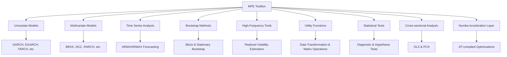

The major system components include:

- <span style="background-color: rgba(91, 57, 243, 0.2)">**mfe/core**: Core functionality and base classes</span>
- <span style="background-color: rgba(91, 57, 243, 0.2)">**mfe/models**: Implementation of econometric models including:</span>
  - <span style="background-color: rgba(91, 57, 243, 0.2)">Bootstrap methods for dependent time series</span>
  - <span style="background-color: rgba(91, 57, 243, 0.2)">Cross-sectional data analysis tools</span>
  - <span style="background-color: rgba(91, 57, 243, 0.2)">Statistical distribution functions</span>
  - <span style="background-color: rgba(91, 57, 243, 0.2)">Multivariate volatility models</span>
  - <span style="background-color: rgba(91, 57, 243, 0.2)">High-frequency financial econometrics tools</span>
  - <span style="background-color: rgba(91, 57, 243, 0.2)">Statistical test functions</span>
  - <span style="background-color: rgba(91, 57, 243, 0.2)">Time series analysis toolkit</span>
  - <span style="background-color: rgba(91, 57, 243, 0.2)">Univariate volatility models</span>
- <span style="background-color: rgba(91, 57, 243, 0.2)">**mfe/ui**: User interface components including PyQt6-based ARMAX modeling environment</span>
- <span style="background-color: rgba(91, 57, 243, 0.2)">**mfe/utils**: Helper functions for data transformation and analysis</span>

### 1.2.3 Success Criteria

The success of the MFE Toolbox is measured through:

- **Accurate implementation** of econometric methods
- **Computational efficiency**, especially for large datasets
- **Robustness against numerical instability**
- **Comprehensive error handling**
- **Thorough documentation**

Critical success factors include:

- <span style="background-color: rgba(91, 57, 243, 0.2)">**Integration with Python's scientific ecosystem**</span>
- **Extensibility** to accommodate new econometric methods
- <span style="background-color: rgba(91, 57, 243, 0.2)">**Optimization** of computationally intensive routines through Numba</span>
- **Backwards compatibility** with previous versions

## 1.3 SCOPE

### 1.3.1 In-Scope

The MFE Toolbox encompasses the following core features and functionalities:

- **Univariate and multivariate GARCH family models** <span style="background-color: rgba(91, 57, 243, 0.2)">implemented using NumPy and SciPy</span>
- **ARMA/ARMAX modeling and forecasting** <span style="background-color: rgba(91, 57, 243, 0.2)">leveraging Statsmodels with custom extensions</span>
- **Bootstrap methods for dependent data** <span style="background-color: rgba(91, 57, 243, 0.2)">utilizing efficient NumPy array operations</span>
- **Realized volatility estimators** <span style="background-color: rgba(91, 57, 243, 0.2)">optimized for high-frequency financial data</span>
- **Statistical distributions and tests** <span style="background-color: rgba(91, 57, 243, 0.2)">extending SciPy's statistical capabilities</span>
- **Vector autoregression and impulse response analysis** <span style="background-color: rgba(91, 57, 243, 0.2)">with Pandas integration</span>
- **Cross-sectional regression and PCA** <span style="background-color: rgba(91, 57, 243, 0.2)">utilizing NumPy's linear algebra functions</span>
- **Utility functions for data transformation** <span style="background-color: rgba(91, 57, 243, 0.2)">designed for financial time series</span>

Implementation boundaries include:

- <span style="background-color: rgba(91, 57, 243, 0.2)">**Python-based implementation** with Numba-optimized performance acceleration</span>
- **Financial and econometric analysis focus**
- **Support for both standalone analysis** and integration with larger workflows
- **Cross-platform compatibility** (Windows, Unix/Linux)

<span style="background-color: rgba(91, 57, 243, 0.2)">Critical MATLAB-to-Python conversion aspects include:</span>

- <span style="background-color: rgba(91, 57, 243, 0.2)">**Indexing adaptation** from MATLAB's 1-based to Python's 0-based indexing</span>
- <span style="background-color: rgba(91, 57, 243, 0.2)">**Array memory layout** transition from MATLAB's column-major to NumPy's row-major order</span>
- <span style="background-color: rgba(91, 57, 243, 0.2)">**Performance optimization** replacing MEX C code with Numba-accelerated Python functions using @jit decorators</span>
- <span style="background-color: rgba(91, 57, 243, 0.2)">**Modern package structure** following Python conventions with proper namespacing</span>
- <span style="background-color: rgba(91, 57, 243, 0.2)">**Asynchronous processing capabilities** for computationally intensive operations</span>
- <span style="background-color: rgba(91, 57, 243, 0.2)">**Type hinting** for improved code reliability and development experience</span>

### 1.3.2 Out-of-Scope

The following elements are explicitly out of scope for the MFE Toolbox:

- Applications outside of financial econometrics and time series analysis
- GUI-based interfaces beyond the provided <span style="background-color: rgba(91, 57, 243, 0.2)">PyQt6-based</span> ARMAX viewer
- Real-time data acquisition or database connectivity
- Integration with statistical packages other than <span style="background-color: rgba(91, 57, 243, 0.2)">Python</span>
- Automated production of reports or visualizations beyond basic diagnostics
- Portfolio optimization or asset allocation tools
- Machine learning or deep learning algorithms

# 2. PRODUCT REQUIREMENTS

## 2.1 FEATURE CATALOG

### 2.1.1 Univariate Volatility Modeling (F-001)

#### Feature Metadata
* **Unique ID:** F-001
* **Feature Name:** Univariate Volatility Modeling
* **Feature Category:** Financial Econometrics
* **Priority Level:** Critical
* **Status:** Completed

#### Description
* **Overview:** Suite of GARCH-type models for univariate volatility estimation, including GARCH, AGARCH, APARCH, EGARCH, FIGARCH, HEAVY, IGARCH, and TARCH.
* **Business Value:** Provides robust volatility estimation for risk assessment, option pricing, and financial forecasting applications.
* **User Benefits:** Users can apply industry-standard volatility models with consistent interface and robust error handling.
* **Technical Context:** <span style="background-color: rgba(91, 57, 243, 0.2)">Implemented with class-based design where each model is a Python class inheriting from a base volatility model class. Uses dataclasses for parameter containers with strict type hints throughout. Performance-critical routines such as likelihood evaluation are accelerated with Numba's @jit decorators. Integration with Pandas DataFrames allows for seamless time series handling, while SciPy's optimization routines handle parameter estimation.</span>

#### Dependencies
* **Prerequisite Features:** Statistical distributions (F-005), Utility functions (F-007)
* **System Dependencies:** <span style="background-color: rgba(91, 57, 243, 0.2)">Python 3.12 with NumPy, SciPy, Pandas, and Numba</span>
* **External Dependencies:** None
* **Integration Requirements:** Compatible with model selection criteria and diagnostic tests

### 2.1.2 Multivariate Volatility Modeling (F-002)

#### Feature Metadata
* **Unique ID:** F-002
* **Feature Name:** Multivariate Volatility Modeling
* **Feature Category:** Financial Econometrics
* **Priority Level:** Critical
* **Status:** Completed

#### Description
* **Overview:** Comprehensive framework for multivariate volatility modeling including BEKK, CCC, DCC, OGARCH/GOGARCH, Matrix GARCH, RARCH, RCC, and RiskMetrics models.
* **Business Value:** Enables portfolio risk analysis and cross-asset dependency modeling for investment decisions.
* **User Benefits:** Ability to model complex covariance dynamics between multiple assets with a unified API.
* **Technical Context:** <span style="background-color: rgba(91, 57, 243, 0.2)">Implements class hierarchy with base multivariate model class and specialized subclasses. Uses dataclasses for parameter and constraint specifications with strict type hints. Matrix operations leverage NumPy's optimized linear algebra functions, while performance-critical sections are accelerated with Numba. Supports asynchronous processing for computationally intensive estimations. Pandas integration provides convenient handling of multivariate time series data.</span>

#### Dependencies
* **Prerequisite Features:** Univariate Volatility Modeling (F-001), Statistical distributions (F-005), Utility functions (F-007)
* **System Dependencies:** <span style="background-color: rgba(91, 57, 243, 0.2)">Python 3.12 with NumPy, SciPy, Pandas, and Numba</span>
* **External Dependencies:** None
* **Integration Requirements:** Compatible with matrix transformation utilities and composite likelihood functions

### 2.1.3 Time Series Analysis (F-003)

#### Feature Metadata
* **Unique ID:** F-003
* **Feature Name:** Time Series Analysis
* **Feature Category:** Econometrics
* **Priority Level:** Critical
* **Status:** Completed

#### Description
* **Overview:** ARMA/ARMAX modeling framework with forecasting, unit root testing, impulse response functions, and time series decomposition utilities.
* **Business Value:** Enables modeling and forecasting of economic and financial time series for business planning and analysis.
* **User Benefits:** Comprehensive toolkit for time series model specification, estimation, diagnostics, and forecasting.
* **Technical Context:** <span style="background-color: rgba(91, 57, 243, 0.2)">Class-based implementation with extensive use of Statsmodels for core ARMA/ARMAX functionality, extended with custom classes for specialized features. Uses Pandas for time series handling and NumPy for numerical computations. Performance-critical components are accelerated with Numba's @jit decorators. Implements async/await patterns for long-running forecasting operations. Extensive type hints and dataclasses for parameter specifications ensure code reliability.</span>

#### Dependencies
* **Prerequisite Features:** Utility functions (F-007), Statistical tests (F-006)
* **System Dependencies:** <span style="background-color: rgba(91, 57, 243, 0.2)">Python 3.12 with NumPy, SciPy, Pandas, Statsmodels, and Numba</span>
* **External Dependencies:** None
* **Integration Requirements:** Compatible with model selection criteria and visualization tools

### 2.1.4 Bootstrap Methods (F-004)

#### Feature Metadata
* **Unique ID:** F-004
* **Feature Name:** Bootstrap Methods
* **Feature Category:** Statistical Inference
* **Priority Level:** High
* **Status:** Completed

#### Description
* **Overview:** Implementation of block bootstrap and stationary bootstrap techniques for dependent data, along with Model Confidence Set procedures.
* **Business Value:** Enables robust statistical inference in financial time series with non-standard distributions and dependencies.
* **User Benefits:** Ability to construct confidence intervals, perform hypothesis tests, and compare models without relying on parametric assumptions.
* **Technical Context:** <span style="background-color: rgba(91, 57, 243, 0.2)">Implemented as Python classes with strict type hints and dataclasses for configuration parameters. Resampling algorithms optimized with Numba's @jit decorators for maximum performance. Leverages NumPy's efficient array operations for block generation and resampling. Features extensive input validation and flexible interfaces for different bootstrap configurations.</span>

#### Dependencies
* **Prerequisite Features:** Utility functions (F-007)
* **System Dependencies:** <span style="background-color: rgba(91, 57, 243, 0.2)">Python 3.12 with NumPy, SciPy, and Numba</span>
* **External Dependencies:** None
* **Integration Requirements:** Compatible with time series models for inference and diagnostics

### 2.1.5 Statistical Distributions (F-005)

#### Feature Metadata
* **Unique ID:** F-005
* **Feature Name:** Statistical Distributions
* **Feature Category:** Statistics
* **Priority Level:** Critical
* **Status:** Completed

#### Description
* **Overview:** Suite of distribution functions including normal, standardized Student's t, generalized error distribution (GED), and Hansen's skewed t-distribution.
* **Business Value:** Provides accurate and flexible modeling of financial returns with heavy tails and asymmetry.
* **User Benefits:** Complete toolkit for density, distribution, quantile, likelihood, and random number generation with consistent interface.
* **Technical Context:** <span style="background-color: rgba(91, 57, 243, 0.2)">Implemented as Python classes extending SciPy's rv_continuous where possible, with custom implementations where needed. Each distribution implements PDF, CDF, inverse CDF, log-likelihood, and random number generation methods with strict type hints. Performance-critical density and quantile functions are accelerated with Numba's @jit decorators. Distribution parameters are managed through dataclasses with validation.</span>

#### Dependencies
* **Prerequisite Features:** Utility functions (F-007)
* **System Dependencies:** <span style="background-color: rgba(91, 57, 243, 0.2)">Python 3.12 with NumPy, SciPy, and Numba</span>
* **External Dependencies:** None
* **Integration Requirements:** Used by volatility models for likelihood evaluation and simulation

### 2.1.6 Statistical Tests (F-006)

#### Feature Metadata
* **Unique ID:** F-006
* **Feature Name:** Statistical Tests
* **Feature Category:** Statistics
* **Priority Level:** High
* **Status:** Completed

#### Description
* **Overview:** Collection of statistical tests including Berkowitz, Jarque-Bera, Kolmogorov-Smirnov, Ljung-Box, and LM tests.
* **Business Value:** Ensures model validity and data assumptions are properly verified for reliable analysis.
* **User Benefits:** Standard test suite with consistent interface for model diagnostics and validation.
* **Technical Context:** <span style="background-color: rgba(91, 57, 243, 0.2)">Implemented as Python classes with consistent interfaces extending SciPy's statistical testing framework where applicable. Uses dataclasses for test configurations and results with strict type hints throughout. Critical value computation and p-value calculations are accelerated with Numba where beneficial. Supports both classical usage patterns and integration with Pandas objects for convenient analysis.</span>

#### Dependencies
* **Prerequisite Features:** Utility functions (F-007), Statistical distributions (F-005)
* **System Dependencies:** <span style="background-color: rgba(91, 57, 243, 0.2)">Python 3.12 with NumPy, SciPy, Pandas, and Numba</span>
* **External Dependencies:** None
* **Integration Requirements:** Used by time series and volatility models for diagnostics

### 2.1.7 Utility Functions (F-007)

#### Feature Metadata
* **Unique ID:** F-007
* **Feature Name:** Utility Functions
* **Feature Category:** Core Infrastructure
* **Priority Level:** Critical
* **Status:** Completed

#### Description
* **Overview:** Core set of utility functions for data transformation, matrix operations, date conversion, and numerical methods.
* **Business Value:** Provides essential building blocks for implementing robust econometric and statistical functionality.
* **User Benefits:** Consistent handling of matrices, covariance estimation, and data preprocessing across the toolbox.
* **Technical Context:** <span style="background-color: rgba(91, 57, 243, 0.2)">Organized as Python modules with namespaced functions and utility classes. Matrix transformations (vech, ivech), covariance estimators, and numerical methods are implemented as pure functions with strict type hints. Performance-critical operations are accelerated with Numba's @jit decorators. Integration with NumPy arrays and Pandas objects is seamless. Implements specialized data structures using dataclasses for configuration parameters and results.</span>

#### Dependencies
* **Prerequisite Features:** None
* **System Dependencies:** <span style="background-color: rgba(91, 57, 243, 0.2)">Python 3.12 with NumPy, SciPy, Pandas, and Numba</span>
* **External Dependencies:** None
* **Integration Requirements:** Used by all other features in the toolbox

### 2.1.8 High-Frequency Financial Econometrics (F-008)

#### Feature Metadata
* **Unique ID:** F-008
* **Feature Name:** High-Frequency Financial Econometrics
* **Feature Category:** Financial Econometrics
* **Priority Level:** High
* **Status:** Completed

#### Description
* **Overview:** Comprehensive suite of realized volatility estimators, including bipower variation, kernel-based methods, covariance estimation, and range-based volatility.
* **Business Value:** Enables accurate volatility estimation from high-frequency intraday data for risk management and trading applications.
* **User Benefits:** Access to advanced non-parametric volatility estimators that handle microstructure noise and data irregularities.
* **Technical Context:** <span style="background-color: rgba(91, 57, 243, 0.2)">Class-based implementation with specialized estimator classes for different volatility measures. Leverages Pandas' extensive time series capabilities for handling irregularly-spaced high-frequency data. Performance-critical estimators are accelerated with Numba's @jit decorators. Implements asynchronous processing for computationally intensive operations on large datasets. Uses dataclasses with strict type hints for estimator configuration and results.</span>

#### Dependencies
* **Prerequisite Features:** Utility functions (F-007)
* **System Dependencies:** <span style="background-color: rgba(91, 57, 243, 0.2)">Python 3.12 with NumPy, SciPy, Pandas, and Numba</span>
* **External Dependencies:** None
* **Integration Requirements:** Compatible with time series and volatility models for hybrid modeling approaches

### 2.1.9 Cross-sectional Analysis (F-009)

#### Feature Metadata
* **Unique ID:** F-009
* **Feature Name:** Cross-sectional Analysis
* **Feature Category:** Econometrics
* **Priority Level:** Medium
* **Status:** Completed

#### Description
* **Overview:** Basic cross-sectional econometric techniques including OLS regression and Principal Component Analysis.
* **Business Value:** Supports fundamental economic and financial analyses across entities at a point in time.
* **User Benefits:** Robust implementation of basic econometric techniques with appropriate diagnostics.
* **Technical Context:** <span style="background-color: rgba(91, 57, 243, 0.2)">Implemented as Python classes with integration with Statsmodels for core regression functionality. Uses NumPy's linear algebra functions for PCA implementation. Features strict type hints throughout and dataclasses for parameter and result containers. Standard error computation is accelerated with Numba where beneficial. Seamless integration with Pandas DataFrames for convenient data handling.</span>

#### Dependencies
* **Prerequisite Features:** Utility functions (F-007)
* **System Dependencies:** <span style="background-color: rgba(91, 57, 243, 0.2)">Python 3.12 with NumPy, SciPy, Pandas, Statsmodels, and Numba</span>
* **External Dependencies:** None
* **Integration Requirements:** Compatible with statistical tests for diagnostics

### 2.1.10 ARMAX GUI Interface (F-010)

#### Feature Metadata
* **Unique ID:** F-010
* **Feature Name:** ARMAX GUI Interface
* **Feature Category:** User Interface
* **Priority Level:** Medium
* **Status:** Completed

#### Description
* **Overview:** Interactive graphical user interface for specification, estimation, and diagnostics of ARMAX models.
* **Business Value:** Simplifies the model building process for users less familiar with command-line interfaces.
* **User Benefits:** Visual model building with immediate feedback on model fit and diagnostics.
* **Technical Context:** <span style="background-color: rgba(91, 57, 243, 0.2)">Built using PyQt6 framework with modern Model-View-Controller (MVC) architecture. Implements reactive UI patterns for responsive user experience. Features asynchronous execution of computationally intensive operations to maintain UI responsiveness. Leverages matplotlib for embedded visualizations of model diagnostics and forecasts. Implements strict type hints throughout for code reliability.</span>

#### Dependencies
* **Prerequisite Features:** Time Series Analysis (F-003), Statistical tests (F-006)
* **System Dependencies:** <span style="background-color: rgba(91, 57, 243, 0.2)">Python 3.12 with NumPy, SciPy, Pandas, matplotlib, PyQt6, and Numba</span>
* **External Dependencies:** None
* **Integration Requirements:** Integrates with ARMAX modeling functions and diagnostic tools

## 2.2 FUNCTIONAL REQUIREMENTS TABLE

### 2.2.1 Univariate Volatility Modeling (F-001)

#### Requirement Details
| Requirement ID | Description | Acceptance Criteria | Priority |
|---------------|-------------|-------------------|----------|
| F-001-RQ-001 | GARCH model estimation | Must correctly estimate parameters, standard errors, and diagnostics for GARCH model | Must-Have |
| F-001-RQ-002 | EGARCH model estimation | Must handle asymmetric effects and correctly transform parameters | Must-Have |
| F-001-RQ-003 | TARCH model estimation | Must estimate threshold ARCH models with proper constraints | Must-Have |
| F-001-RQ-004 | APARCH model estimation | Must handle power transformations of innovations correctly | Should-Have |
| F-001-RQ-005 | FIGARCH model estimation | Must estimate fractionally integrated GARCH models | Should-Have |
| F-001-RQ-006 | HEAVY model estimation | Must handle estimation with realized measures | Could-Have |
| F-001-RQ-007 | Model simulation | Must generate simulated data from all supported models | Must-Have |
| F-001-RQ-008 | Parameter validation | Must validate all input parameters and constraints | Must-Have |
| F-001-RQ-009 | **Numba acceleration** | **Should provide Numba-accelerated versions (@jit decorators) for performance-critical functions** | Should-Have |

#### Technical Specifications
| Input Parameters | Output/Response | Performance Criteria | Data Requirements |
|-----------------|----------------|---------------------|------------------|
| Time series data **as NumPy array or Pandas Series**, model orders, error distribution | Parameter estimates, standard errors, conditional variances, diagnostics | Must handle at least 10,000 observations with reasonable speed | Mean-zero residual data |
| Parameter vectors, simulation length | Simulated time series, conditional variance series **as NumPy arrays** | Must generate multiple replications efficiently **with support for asynchronous processing** | None |
| Model parameters, data series | Log-likelihood, scores | Must compute accurate gradient and Hessian approximations **using NumPy's optimized linear algebra functions** | Residual data with sufficient observations |

#### Validation Rules
| Business Rules | Data Validation | Security Requirements | Compliance Requirements |
|---------------|----------------|----------------------|------------------------|
| Model constraints must be enforced (e.g., stationarity, parameter bounds) | Input data must be validated for proper dimensions and missing values | None | Parameters must be transformable for unconstrained optimization |
| Model selection criteria (AIC, BIC) must be computed | Error distributions must be verified for parameter constraints | None | Must compute robust standard errors |

### 2.2.2 Multivariate Volatility Modeling (F-002)

#### Requirement Details
| Requirement ID | Description | Acceptance Criteria | Priority |
|---------------|-------------|-------------------|----------|
| F-002-RQ-001 | BEKK model estimation | Must estimate symmetric and asymmetric BEKK models | Must-Have |
| F-002-RQ-002 | DCC model estimation | Must implement both 2-stage and joint estimation | Must-Have |
| F-002-RQ-003 | CCC model estimation | Must correctly estimate constant correlation models | Must-Have |
| F-002-RQ-004 | GOGARCH/OGARCH models | Must handle orthogonal transformations correctly | Should-Have |
| F-002-RQ-005 | RiskMetrics implementation | Must provide EWMA-based covariance estimation | Should-Have |
| F-002-RQ-006 | Matrix GARCH models | Must implement matrix form of GARCH models | Could-Have |
| F-002-RQ-007 | Simulation capabilities | Must provide simulation for all supported models | Must-Have |
| F-002-RQ-008 | Parameter constraints | Must enforce stability constraints for all models | Must-Have |

#### Technical Specifications
| Input Parameters | Output/Response | Performance Criteria | Data Requirements |
|-----------------|----------------|---------------------|------------------|
| Multivariate time series **as NumPy arrays or Pandas DataFrames**, model orders, specification | Parameter estimates, conditional covariance matrices, diagnostics | Must handle at least 5 assets with 2000+ observations **using NumPy's efficient matrix operations** | Mean-zero residual data or covariance estimators |
| Parameter matrices, simulation length | Simulated multivariate time series, conditional covariance series **as NumPy arrays** | Must handle dimensions efficiently **with support for asynchronous processing** | None |
| Covariance matrices, return data | Log-likelihood, parameter estimates | Must use efficient matrix operations **leveraging NumPy and Numba acceleration** | Valid covariance matrices |

#### Validation Rules
| Business Rules | Data Validation | Security Requirements | Compliance Requirements |
|---------------|----------------|----------------------|------------------------|
| Covariance matrices must be positive definite | Input data must be checked for dimensions and NaN values | None | Parameter transformations must preserve constraints |
| Model stability constraints must be enforced | Correlation constraints must be validated | None | Must provide robust standard errors |

### 2.2.3 Time Series Analysis (F-003)

#### Requirement Details
| Requirement ID | Description | Acceptance Criteria | Priority |
|---------------|-------------|-------------------|----------|
| F-003-RQ-001 | ARMA/ARMAX estimation | Must correctly estimate AR, MA, and exogenous parameters | Must-Have |
| F-003-RQ-002 | Forecasting function | Must generate h-step ahead forecasts with error bands | Must-Have |
| F-003-RQ-003 | Unit root testing | Must implement augmented Dickey-Fuller test with lag selection | Must-Have |
| F-003-RQ-004 | Impulse response analysis | Must calculate impulse responses with bootstrap confidence intervals | Should-Have |
| F-003-RQ-005 | Time series filters | Must implement HP, BK, and Beveridge-Nelson decompositions | Should-Have |
| F-003-RQ-006 | VAR modeling | Must estimate vector autoregression models | Should-Have |
| F-003-RQ-007 | Model diagnostics | Must provide residual plots and statistical tests | Must-Have |
| F-003-RQ-008 | Granger causality | Must test for Granger causality in time series | Could-Have |

#### Technical Specifications
| Input Parameters | Output/Response | Performance Criteria | Data Requirements |
|-----------------|----------------|---------------------|------------------|
| Time series data **as NumPy arrays or Pandas Series/DataFrames**, lag order, exogenous variables | Parameter estimates, standard errors, fitted values, residuals | Must handle at least 5000 observations efficiently **leveraging Statsmodels core functions with extensions** | Time series data with sufficient observations |
| Estimated model, forecast horizon | Point forecasts, forecast standard errors **with support for asynchronous processing for long forecasts** | Must provide accurate multi-step forecasts | Estimated model parameters |
| Time series data, lag specification | Test statistics, p-values, critical values | Must correctly apply lag selection criteria **using SciPy and Statsmodels statistical functions** | Time series data with sufficient observations |

#### Validation Rules
| Business Rules | Data Validation | Security Requirements | Compliance Requirements |
|---------------|----------------|----------------------|------------------------|
| Model stationarity and invertibility must be enforced | Input data must be checked for dimensions and NaN values | None | Must compute model selection criteria |
| Lag order must not exceed reasonable limits | Parameter estimates must be checked for stability | None | Must provide diagnostic tests |

### 2.2.4 Bootstrap Methods (F-004)

#### Requirement Details
| Requirement ID | Description | Acceptance Criteria | Priority |
|---------------|-------------|-------------------|----------|
| F-004-RQ-001 | Block bootstrap | Must implement circular block bootstrap for time series | Must-Have |
| F-004-RQ-002 | Stationary bootstrap | Must implement stationary bootstrap with random block lengths | Must-Have |
| F-004-RQ-003 | Model Confidence Set | Must implement Hansen, Lunde, and Nason's MCS procedure | Should-Have |
| F-004-RQ-004 | Bootstrap p-values | Must compute bootstrap-based test statistics and p-values | Must-Have |

#### Technical Specifications
| Input Parameters | Output/Response | Performance Criteria | Data Requirements |
|-----------------|----------------|---------------------|------------------|
| Time series data **as NumPy arrays or Pandas Series**, block length, number of bootstraps | Bootstrapped samples **as NumPy arrays** | Must handle at least 1000 bootstrap replications efficiently **with Numba-accelerated core functions** | Time series data with sufficient observations |
| Loss matrix **as NumPy array**, significance level | MCS p-values, included model indices | Must handle at least 20 models efficiently **leveraging NumPy's vectorized operations** | Loss differentials for model comparisons |
| Benchmark and model losses **as NumPy arrays** | Bootstrap p-values | Must provide consistent and White p-values **with support for asynchronous processing for large bootstraps** | Loss data for benchmark and models |

#### Validation Rules
| Business Rules | Data Validation | Security Requirements | Compliance Requirements |
|---------------|----------------|----------------------|------------------------|
| Block length must be appropriate for data | Input data must be checked for dimensions and NaN values | None | Must handle dependent data correctly |
| Bootstrap replications must be sufficient | Significance levels must be valid | None | Must maintain time series properties in resampling |

### 2.2.5 Statistical Distributions (F-005)

#### Requirement Details
| Requirement ID | Description | Acceptance Criteria | Priority |
|---------------|-------------|-------------------|----------|
| F-005-RQ-001 | Normal distribution functions | Must provide PDF, CDF, quantile, and random generation | Must-Have |
| F-005-RQ-002 | Student's t distribution | Must provide standardized t-distribution functions | Must-Have |
| F-005-RQ-003 | GED implementation | Must implement generalized error distribution | Must-Have |
| F-005-RQ-004 | Skewed t-distribution | Must implement Hansen's skewed t-distribution | Should-Have |
| F-005-RQ-005 | Log-likelihood functions | Must provide log-likelihood for all distributions | Must-Have |
| F-005-RQ-006 | Input validation | Must validate parameters for all distribution functions | Must-Have |

#### Technical Specifications
| Input Parameters | Output/Response | Performance Criteria | Data Requirements |
|-----------------|----------------|---------------------|------------------|
| Random variables **as NumPy arrays**, distribution parameters | PDF/CDF values | Must handle vectorized inputs efficiently **using NumPy's broadcasting and Numba-accelerated functions** | Well-formed numeric data |
| Probability values **as NumPy arrays**, distribution parameters | Quantile values | Must handle vectorized inputs efficiently **extending SciPy's statistical distributions** | Probability values in [0,1] |
| Distribution parameters, array dimensions | Random samples **as NumPy arrays** | Must generate large samples efficiently **using NumPy's random module** | None |
| Data vector **as NumPy array or Pandas Series**, distribution parameters | Log-likelihood value | Must compute accurately for large samples **with Numba acceleration for performance** | Data matching distribution assumptions |

#### Validation Rules
| Business Rules | Data Validation | Security Requirements | Compliance Requirements |
|---------------|----------------|----------------------|------------------------|
| Distribution parameters must satisfy constraints | Input data dimensions must be compatible | None | Output probabilities must be in [0,1] |
| Distribution functions must be numerically stable | Parameter values must be validated | None | Must handle edge cases gracefully |

### 2.2.6 Statistical Tests (F-006)

#### Requirement Details
| Requirement ID | Description | Acceptance Criteria | Priority |
|---------------|-------------|-------------------|----------|
| F-006-RQ-001 | Jarque-Bera test | Must test for normality via skewness and kurtosis | Must-Have |
| F-006-RQ-002 | Ljung-Box test | Must test for serial correlation in time series | Must-Have |
| F-006-RQ-003 | LM test | Must implement Lagrange Multiplier test for serial correlation | Must-Have |
| F-006-RQ-004 | Kolmogorov-Smirnov test | Must test for specific distributions | Should-Have |
| F-006-RQ-005 | Berkowitz test | Must implement test for distribution transforms | Should-Have |

#### Technical Specifications
| Input Parameters | Output/Response | Performance Criteria | Data Requirements |
|-----------------|----------------|---------------------|------------------|
| Data vector **as NumPy array or Pandas Series**, test parameters | Test statistic, p-value, critical values | Must compute efficiently for large samples **extending SciPy's statistical testing framework** | Data appropriate for test assumptions |
| Time series data **as NumPy array or Pandas Series**, lag order | Q-statistics, p-values | Must handle multiple lag orders efficiently **with Numba acceleration for performance-critical computations** | Time series data with sufficient observations |
| Data vector **as NumPy array or Pandas Series**, distribution function | KS statistic, p-value, critical value | Must handle customized distribution functions **integrating with SciPy's statistical functions** | Well-formed numeric data |

#### Validation Rules
| Business Rules | Data Validation | Security Requirements | Compliance Requirements |
|---------------|----------------|----------------------|------------------------|
| Test parameters must be appropriate | Input data must be checked for dimensions and NaN values | None | Must provide accurate p-values |
| Critical values must be accurate | Significance levels must be valid | None | Test statistics must match theoretical definitions |

### 2.2.7 Utility Functions (F-007)

#### Requirement Details
| Requirement ID | Description | Acceptance Criteria | Priority |
|---------------|-------------|-------------------|----------|
| F-007-RQ-001 | Matrix transformations | Must provide vech, ivech and related functions | Must-Have |
| F-007-RQ-002 | Robust covariance estimation | Must implement Newey-West and related estimators | Must-Have |
| F-007-RQ-003 | Date conversion | Must convert between date formats (Python datetime, Pandas, etc.) | Should-Have |
| F-007-RQ-004 | Data preprocessing | Must provide standardization and demeaning functions | Must-Have |
| F-007-RQ-005 | Numerical methods | Must implement gradient and Hessian approximations | Must-Have |
| F-007-RQ-006 | Lag matrix construction | Must create lag matrices for time series models | Must-Have |

#### Technical Specifications
| Input Parameters | Output/Response | Performance Criteria | Data Requirements |
|-----------------|----------------|---------------------|------------------|
| Matrices, vectors **as NumPy arrays** | Transformed matrices, vectors | Must handle large matrices efficiently **using NumPy's optimized operations and Numba acceleration** | Well-formed matrices with appropriate dimensions |
| Time series data **as NumPy arrays or Pandas Series**, lag truncation | Covariance matrices **as NumPy arrays** | Must handle large samples efficiently **with optimization for sparse operations where applicable** | Time series data with sufficient observations |
| Date values in various formats | Converted date values **using Python datetime and Pandas datetime objects** | Must convert accurately | Valid date inputs |
| Objective function, parameter vector **as NumPy arrays** | Gradient vector, Hessian matrix | Must use adaptive step sizes **leveraging SciPy's optimization functions** | Differentiable functions |

#### Validation Rules
| Business Rules | Data Validation | Security Requirements | Compliance Requirements |
|---------------|----------------|----------------------|------------------------|
| Matrix operations must preserve properties | Input dimensions must be validated | None | Must handle numerical stability issues |
| Date conversions must be accurate | Date values must be valid | None | Must handle edge cases in conversions |
| Numerical methods must be stable | Function inputs must be validated | None | Must use appropriate finite difference methods |

### 2.2.8 High-Frequency Financial Econometrics (F-008)

#### Requirement Details
| Requirement ID | Description | Acceptance Criteria | Priority |
|---------------|-------------|-------------------|----------|
| F-008-RQ-001 | Realized variance estimators | Must implement multiple realized variance measures | Must-Have |
| F-008-RQ-002 | Realized kernels | Must implement kernel-based estimators | Must-Have |
| F-008-RQ-003 | Time conversion utilities | Must handle different time formats and sampling schemes | Must-Have |
| F-008-RQ-004 | Price filtering | Must filter and align high-frequency price data | Must-Have |
| F-008-RQ-005 | Multivariate estimators | Must implement realized covariance measures | Should-Have |
| F-008-RQ-006 | Subsample averaging | Must implement subsampling for noise reduction | Should-Have |

#### Technical Specifications
| Input Parameters | Output/Response | Performance Criteria | Data Requirements |
|-----------------|----------------|---------------------|------------------|
| High-frequency price and time data **as Pandas DataFrames**, sampling parameters | Realized measures, diagnostics | Must handle thousands of intraday observations **with Numba-accelerated core estimators** | High-frequency price data with timestamps |
| Time values in different formats | Converted and normalized time values **using Pandas datetime functionality** | Must convert efficiently **leveraging Pandas time series capabilities** | Valid time inputs |
| Parameters for kernel estimators | Optimal bandwidth, jitter parameters | Must compute optimal parameters efficiently **using NumPy's optimized functions** | High-frequency return data |

#### Validation Rules
| Business Rules | Data Validation | Security Requirements | Compliance Requirements |
|---------------|----------------|----------------------|------------------------|
| Estimators must be robust to noise | Price and time data must be validated | None | Must handle irregular spacing and microstructure noise |
| Sampling schemes must be correctly applied | Time inputs must be chronologically ordered | None | Must implement bias corrections where appropriate |
| Bandwidth selection must be optimal | Parameters must be within valid ranges | None | Must handle edge effects in kernel estimation |

### 2.2.9 Cross-sectional Analysis (F-009)

#### Requirement Details
| Requirement ID | Description | Acceptance Criteria | Priority |
|---------------|-------------|-------------------|----------|
| F-009-RQ-001 | OLS regression | Must implement ordinary least squares with robust errors | Must-Have |
| F-009-RQ-002 | Principal Component Analysis | Must implement PCA with multiple modes | Must-Have |

#### Technical Specifications
| Input Parameters | Output/Response | Performance Criteria | Data Requirements |
|-----------------|----------------|---------------------|------------------|
| Dependent variable, independent variables **as NumPy arrays or Pandas Series/DataFrames**, constant flag | Coefficient estimates, standard errors, t-stats, p-values | Must handle large cross-sections efficiently **using Statsmodels for core estimation with extensions** | Well-formed data matrices |
| Data matrix **as NumPy array or Pandas DataFrame**, mode selection | Principal components, loadings, variance explained | Must handle large data matrices **leveraging NumPy's optimized linear algebra functions** | Data matrix with sufficient observations |

#### Validation Rules
| Business Rules | Data Validation | Security Requirements | Compliance Requirements |
|---------------|----------------|----------------------|------------------------|
| OLS assumptions must be validated | Input dimensions must be checked | None | Must compute correct standard errors |
| PCA modes must be correctly implemented | Data matrix must be properly formatted | None | Must normalize appropriately based on mode |

### 2.2.10 ARMAX GUI Interface (F-010)

#### Requirement Details
| Requirement ID | Description | Acceptance Criteria | Priority |
|---------------|-------------|-------------------|----------|
| F-010-RQ-001 | Model specification interface | Must allow setting of AR and MA orders, constants, exogenous vars | Must-Have |
| F-010-RQ-002 | Data plotting | Must plot original data and model residuals **using matplotlib embedded in PyQt6** | Must-Have |
| F-010-RQ-003 | Diagnostic displays | Must show ACF/PACF plots and test results **using matplotlib embedded in PyQt6** | Must-Have |
| F-010-RQ-004 | Model results viewer | Must display model equations and parameter estimates | Must-Have |
| F-010-RQ-005 | Dialog management | Must handle confirmation and about dialogs properly **using PyQt6 dialog components** | Should-Have |

#### Technical Specifications
| Input Parameters | Output/Response | Performance Criteria | Data Requirements |
|-----------------|----------------|---------------------|------------------|
| User interface selections, input data **as NumPy arrays or Pandas Series/DataFrames** | Model estimation, visual diagnostics | Must respond within reasonable time **with long computations running asynchronously** | Time series data loaded in **Python environment** |
| Model parameters, estimation results | Formatted equation display, parameter tables | Must render LaTeX equations correctly **using matplotlib's LaTeX rendering** | Estimated model parameters |
| User actions (button clicks, selections) | UI updates, calculation triggers | Must handle UI events smoothly **following PyQt6's event-driven programming paradigm** | Valid user inputs |

#### Validation Rules
| Business Rules | Data Validation | Security Requirements | Compliance Requirements |
|---------------|----------------|----------------------|------------------------|
| GUI must enforce valid model specifications | User inputs must be validated | None | Must provide informative error messages |
| Dialog positioning must be correct | Model parameters must be within valid ranges | None | Must maintain **PyQt6 GUI standards** |
| UI state must be consistent | Data must be appropriate for selected models | None | Must provide clear visual feedback |

## 2.3 FEATURE RELATIONSHIPS

### 2.3.1 Feature Dependencies Map

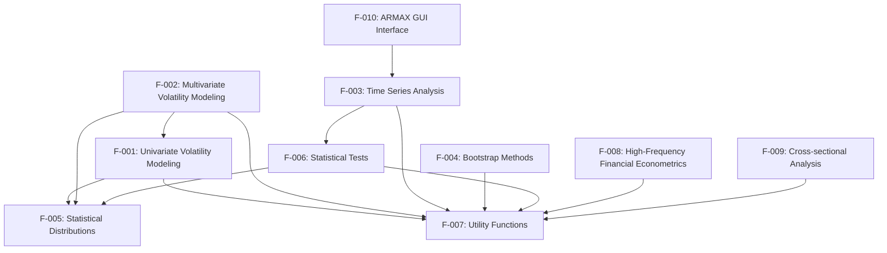

### 2.3.2 Integration Points

1. **Parameter Transformations**: Many models across F-001 and F-002 <span style="background-color: rgba(91, 57, 243, 0.2)">now utilize Python's class-based methods for parameter transformation, implementing constraints through type-validated properties and dataclasses</span>.
   
2. **Likelihood Evaluation**: Features F-001, F-002, and F-003 <span style="background-color: rgba(91, 57, 243, 0.2)">leverage SciPy's statistical functions and custom distributions in F-005, optimized with Numba's @jit decorators for performance-critical calculations</span>.

3. **Diagnostic Testing**: Features F-001, F-002, F-003, and F-008 <span style="background-color: rgba(91, 57, 243, 0.2)">utilize statistical tests from F-006 for model validation, now implemented as Python classes extending SciPy's statistical testing framework where applicable</span>.

4. **Matrix Operations**: Almost all features <span style="background-color: rgba(91, 57, 243, 0.2)">rely on NumPy's optimized matrix operations provided by F-007, with performance-critical routines accelerated using Numba</span>.

5. **Data Preprocessing**: Features F-001, F-002, F-003, and F-008 <span style="background-color: rgba(91, 57, 243, 0.2)">use standardization and filtering functions from F-007, now implemented as Python functions with Pandas integration for seamless handling of time series data</span>.

### 2.3.3 Shared Components

1. **Error Distribution Framework**: <span style="background-color: rgba(91, 57, 243, 0.2)">Implemented as a class hierarchy with a base Distribution class and specialized subclasses for normal, t, GED, and skewed distributions. Used by both univariate and multivariate volatility models with strict type hints throughout the implementation</span>.

2. **Parameter Validation Logic**: <span style="background-color: rgba(91, 57, 243, 0.2)">Consistent approach to input validation across all features using Python's type hints, dataclasses with field validation, and custom validators</span>.

3. **Robust Covariance Estimation**: <span style="background-color: rgba(91, 57, 243, 0.2)">Used by multiple estimation routines across features, now implemented using NumPy's efficient array operations with optional Numba acceleration for performance-critical sections</span>.

4. **Numerical Optimization Support**: <span style="background-color: rgba(91, 57, 243, 0.2)">Gradient and Hessian approximations used by multiple model estimation features, leveraging SciPy's optimization framework with custom enhancements for financial time series applications</span>.

5. **Time Series Lag Construction**: <span style="background-color: rgba(91, 57, 243, 0.2)">Used by time series models, volatility models, and statistical tests, now implemented using NumPy's array manipulation functions with Pandas integration for handling time series indexes</span>.

### 2.3.4 Common Services

1. **Data Validation**: <span style="background-color: rgba(91, 57, 243, 0.2)">Centralized input checking for numerical stability and dimensional correctness, implemented using Python's type hints and custom validation decorators that work with both NumPy arrays and Pandas objects</span>.

2. **Parameter Transformation**: <span style="background-color: rgba(91, 57, 243, 0.2)">Services for transforming parameters between constrained and unconstrained spaces, implemented as Python classes with mathematically robust transformations and inverse transformations</span>.

3. **Numerical Differentiation**: <span style="background-color: rgba(91, 57, 243, 0.2)">Common service for gradient and Hessian approximation, now using SciPy's differential calculus functions with added type hints and asynchronous processing support for large matrices</span>.

4. **Matrix Decomposition**: <span style="background-color: rgba(91, 57, 243, 0.2)">Services for Cholesky decomposition and eigenvalue analysis using NumPy's and SciPy's linear algebra functions with additional error handling for positive definiteness verification</span>.

5. **Date Handling**: <span style="background-color: rgba(91, 57, 243, 0.2)">Date conversion and manipulation services now leveraging Python's datetime standard library and Pandas datetime functionality with timezone awareness and support for various financial calendar operations</span>.

## 2.4 IMPLEMENTATION CONSIDERATIONS

### 2.4.1 Univariate Volatility Modeling (F-001)

- **Technical Constraints**: 
  - <span style="background-color: rgba(91, 57, 243, 0.2)">Must be implemented in Python 3.12 using class-based modular design with inheritance hierarchy</span>
  - <span style="background-color: rgba(91, 57, 243, 0.2)">Must provide robust error handling for ill-conditioned optimization problems using Python's exception handling</span>
  - Must maintain backward compatibility with existing API

- **Performance Requirements**:
  - <span style="background-color: rgba(91, 57, 243, 0.2)">Core recursions should be accelerated using Numba's @jit decorators for critical models</span>
  - <span style="background-color: rgba(91, 57, 243, 0.2)">Should account for Python's 0-based indexing and row-major memory layout in array operations</span>
  - Should handle time series with 10,000+ observations efficiently

- **Scalability Considerations**:
  - <span style="background-color: rgba(91, 57, 243, 0.2)">Should support asynchronous processing (using async/await) for long-running parameter estimations</span>
  - <span style="background-color: rgba(91, 57, 243, 0.2)">Should leverage NumPy's vectorized operations for efficient parameter updates</span>
  - Parameter estimation routines should scale well with increasing sample size
  - Should support models with varying lag orders

- **Security Implications**:
  - None

- **Maintenance Requirements**:
  - <span style="background-color: rgba(91, 57, 243, 0.2)">Implement with Python type hints and dataclasses for parameter containers</span>
  - <span style="background-color: rgba(91, 57, 243, 0.2)">Follow clear package structure (mfe/models/univariate) with separate modules for model families</span>
  - Modular design with separate files for parameter checking, transformation, likelihood evaluation
  - Comprehensive error messages for debugging

### 2.4.2 Multivariate Volatility Modeling (F-002)

- **Technical Constraints**:
  - <span style="background-color: rgba(91, 57, 243, 0.2)">Must be implemented in Python 3.12 using class-based design with inheritance from base multivariate model class</span>
  - Must handle potentially large covariance matrices
  - Must ensure positive definiteness of covariance matrices

- **Performance Requirements**:
  - <span style="background-color: rgba(91, 57, 243, 0.2)">Matrix operations should be implemented using NumPy with Numba acceleration for critical sections</span>
  - <span style="background-color: rgba(91, 57, 243, 0.2)">Should optimize for Python's row-major memory layout when performing matrix transformations</span>
  - Efficient matrix operations for high-dimensional problems
  - Should use composite likelihood approach for large dimensions

- **Scalability Considerations**:
  - <span style="background-color: rgba(91, 57, 243, 0.2)">Should support asynchronous processing for computationally intensive covariance estimations</span>
  - <span style="background-color: rgba(91, 57, 243, 0.2)">Should leverage NumPy's vectorized operations for parameter updates across multiple time periods</span>
  - Parameter count grows quadratically with number of assets
  - Should provide scalar and diagonal specifications for large dimensions

- **Security Implications**:
  - None

- **Maintenance Requirements**:
  - <span style="background-color: rgba(91, 57, 243, 0.2)">Implement with Python type hints throughout all classes and methods</span>
  - <span style="background-color: rgba(91, 57, 243, 0.2)">Use dataclasses for parameter specifications and constraint definitions</span>
  - <span style="background-color: rgba(91, 57, 243, 0.2)">Follow clear package structure (mfe/models/multivariate) with logical module organization</span>
  - Clear separation of model-specific code
  - Consistent API across different model types

### 2.4.3 Time Series Analysis (F-003)

- **Technical Constraints**:
  - <span style="background-color: rgba(91, 57, 243, 0.2)">Must be implemented in Python 3.12 with class-based design leveraging Statsmodels integration</span>
  - Must handle both stationary and non-stationary data appropriately
  - Must ensure numerical stability in forecasting

- **Performance Requirements**:
  - <span style="background-color: rgba(91, 57, 243, 0.2)">Critical recursions and filtering operations should be accelerated with Numba's JIT compilation</span>
  - <span style="background-color: rgba(91, 57, 243, 0.2)">Should optimize for Python's array indexing and memory layout when constructing lag matrices</span>
  - Efficient handling of large lag orders
  - Fast computation of impulse responses

- **Scalability Considerations**:
  - <span style="background-color: rgba(91, 57, 243, 0.2)">Should support asynchronous processing for long-running forecasting operations</span>
  - <span style="background-color: rgba(91, 57, 243, 0.2)">Should leverage NumPy's vectorized operations for efficient computation of forecasts</span>
  - Should scale well with increasing time series length
  - VAR models should handle moderate-sized systems

- **Security Implications**:
  - None

- **Maintenance Requirements**:
  - <span style="background-color: rgba(91, 57, 243, 0.2)">Implement with Python type hints for all public methods and functions</span>
  - <span style="background-color: rgba(91, 57, 243, 0.2)">Use dataclasses for model specifications and results containers</span>
  - <span style="background-color: rgba(91, 57, 243, 0.2)">Follow clear package structure (mfe/models/timeseries) with separate modules for different model types</span>
  - Clear documentation of model assumptions
  - Consistent interface for model specification

### 2.4.4 Bootstrap Methods (F-004)

- **Technical Constraints**:
  - <span style="background-color: rgba(91, 57, 243, 0.2)">Must be implemented in Python 3.12 using class-based design with specialized classes for different bootstrap types</span>
  - Must preserve time series dependency structure
  - Must handle edge effects appropriately

- **Performance Requirements**:
  - <span style="background-color: rgba(91, 57, 243, 0.2)">Bootstrap sampling routines should be accelerated with Numba's JIT compilation</span>
  - <span style="background-color: rgba(91, 57, 243, 0.2)">Should optimize array operations accounting for Python's 0-based indexing</span>
  - Efficient generation of multiple bootstrap samples
  - Fast computation of bootstrap statistics

- **Scalability Considerations**:
  - <span style="background-color: rgba(91, 57, 243, 0.2)">Should support asynchronous processing for large-scale bootstrap replications</span>
  - <span style="background-color: rgba(91, 57, 243, 0.2)">Should leverage NumPy's vectorized operations for efficient resampling</span>
  - Should handle large numbers of bootstrap replications
  - Should scale well with increasing time series length

- **Security Implications**:
  - None

- **Maintenance Requirements**:
  - <span style="background-color: rgba(91, 57, 243, 0.2)">Implement with Python type hints throughout all bootstrap classes</span>
  - <span style="background-color: rgba(91, 57, 243, 0.2)">Use dataclasses for bootstrap configuration parameters and results</span>
  - <span style="background-color: rgba(91, 57, 243, 0.2)">Follow clear package structure (mfe/bootstrap) with logical module organization</span>
  - Clear documentation of bootstrap methods
  - Consistent random number generation

### 2.4.5 Statistical Distributions (F-005)

- **Technical Constraints**:
  - <span style="background-color: rgba(91, 57, 243, 0.2)">Must be implemented in Python 3.12 using class-based design extending SciPy's distribution framework where possible</span>
  - Must handle numerical edge cases appropriately
  - Must provide accurate tail probabilities

- **Performance Requirements**:
  - <span style="background-color: rgba(91, 57, 243, 0.2)">Density and quantile functions should be accelerated with Numba's JIT compilation</span>
  - <span style="background-color: rgba(91, 57, 243, 0.2)">Should leverage SciPy's underlying C implementations where available</span>
  - Efficient vectorized computation for large data sets
  - Fast random number generation

- **Scalability Considerations**:
  - <span style="background-color: rgba(91, 57, 243, 0.2)">Should leverage NumPy's vectorized operations for distribution functions</span>
  - <span style="background-color: rgba(91, 57, 243, 0.2)">Should support concurrent processing for Monte Carlo simulations</span>
  - Should handle large arrays of inputs efficiently
  - Should provide consistent behavior across different input dimensions

- **Security Implications**:
  - None

- **Maintenance Requirements**:
  - <span style="background-color: rgba(91, 57, 243, 0.2)">Implement with Python type hints for all distribution classes and methods</span>
  - <span style="background-color: rgba(91, 57, 243, 0.2)">Use dataclasses for distribution parameters with validation</span>
  - <span style="background-color: rgba(91, 57, 243, 0.2)">Follow clear package structure (mfe/distributions) with logical organization</span>
  - Comprehensive error checking
  - Consistent API across distributions

### 2.4.6 Statistical Tests (F-006)

- **Technical Constraints**:
  - <span style="background-color: rgba(91, 57, 243, 0.2)">Must be implemented in Python 3.12 using class-based design extending SciPy's statistical testing framework where applicable</span>
  - Must calculate accurate p-values
  - Must handle multiple test configurations

- **Performance Requirements**:
  - <span style="background-color: rgba(91, 57, 243, 0.2)">Test statistic calculations should be accelerated with Numba's JIT compilation where beneficial</span>
  - <span style="background-color: rgba(91, 57, 243, 0.2)">Should leverage SciPy's optimized statistical functions when appropriate</span>
  - Efficient computation for large sample sizes
  - Fast calculation of test statistics

- **Scalability Considerations**:
  - <span style="background-color: rgba(91, 57, 243, 0.2)">Should leverage NumPy's vectorized operations for test statistics</span>
  - <span style="background-color: rgba(91, 57, 243, 0.2)">Should support asynchronous processing for computationally intensive tests</span>
  - Should handle large data sets efficiently
  - Should provide consistent results for varying sample sizes

- **Security Implications**:
  - None

- **Maintenance Requirements**:
  - <span style="background-color: rgba(91, 57, 243, 0.2)">Implement with Python type hints for all test classes and methods</span>
  - <span style="background-color: rgba(91, 57, 243, 0.2)">Use dataclasses for test configurations and results</span>
  - <span style="background-color: rgba(91, 57, 243, 0.2)">Follow clear package structure (mfe/tests) with separate modules for different test types</span>
  - Clear documentation of test assumptions
  - Consistent interface across tests

### 2.4.7 Utility Functions (F-007)

- **Technical Constraints**:
  - <span style="background-color: rgba(91, 57, 243, 0.2)">Must be implemented in Python 3.12 with pure functions and utility classes as appropriate</span>
  - Must handle numerical precision issues
  - Must provide consistent behavior across platforms

- **Performance Requirements**:
  - <span style="background-color: rgba(91, 57, 243, 0.2)">Performance-critical functions should be accelerated with Numba's JIT compilation</span>
  - <span style="background-color: rgba(91, 57, 243, 0.2)">Should leverage NumPy's optimized implementations for array operations</span>
  - Efficient matrix operations
  - Fast numerical differentiation

- **Scalability Considerations**:
  - <span style="background-color: rgba(91, 57, 243, 0.2)">Should leverage NumPy's vectorized operations throughout</span>
  - <span style="background-color: rgba(91, 57, 243, 0.2)">Should support asynchronous processing for computationally intensive operations</span>
  - Should handle large matrices efficiently
  - Should provide consistent behavior for varying input dimensions

- **Security Implications**:
  - None

- **Maintenance Requirements**:
  - <span style="background-color: rgba(91, 57, 243, 0.2)">Implement with Python type hints for all utility functions</span>
  - <span style="background-color: rgba(91, 57, 243, 0.2)">Use dataclasses for complex input/output parameter containers</span>
  - <span style="background-color: rgba(91, 57, 243, 0.2)">Follow clear package structure (mfe/utils) with logical module organization</span>
  - Comprehensive error checking
  - Clear documentation of function behavior

### 2.4.8 High-Frequency Financial Econometrics (F-008)

- **Technical Constraints**:
  - <span style="background-color: rgba(91, 57, 243, 0.2)">Must be implemented in Python 3.12 using class-based design with specialized estimator classes</span>
  - Must handle irregular time spacing
  - Must account for microstructure noise

- **Performance Requirements**:
  - <span style="background-color: rgba(91, 57, 243, 0.2)">Estimator functions should be accelerated with Numba's JIT compilation</span>
  - <span style="background-color: rgba(91, 57, 243, 0.2)">Should leverage Pandas' optimized time series functionality for high-frequency data handling</span>
  - Efficient handling of large high-frequency datasets
  - Fast computation of realized measures

- **Scalability Considerations**:
  - <span style="background-color: rgba(91, 57, 243, 0.2)">Should support asynchronous processing for computationally intensive calculations</span>
  - <span style="background-color: rgba(91, 57, 243, 0.2)">Should leverage NumPy's vectorized operations for efficient implementation of estimators</span>
  - Should scale well with increasing intraday observations
  - Should handle multiple assets efficiently

- **Security Implications**:
  - None

- **Maintenance Requirements**:
  - <span style="background-color: rgba(91, 57, 243, 0.2)">Implement with Python type hints for all estimator classes and methods</span>
  - <span style="background-color: rgba(91, 57, 243, 0.2)">Use dataclasses for estimator configurations and results</span>
  - <span style="background-color: rgba(91, 57, 243, 0.2)">Follow clear package structure (mfe/highfreq) with logical module organization</span>
  - Clear documentation of estimator properties
  - Consistent interface across different estimators

### 2.4.9 Cross-sectional Analysis (F-009)

- **Technical Constraints**:
  - <span style="background-color: rgba(91, 57, 243, 0.2)">Must be implemented in Python 3.12 with class-based design leveraging Statsmodels where appropriate</span>
  - Must handle potential collinearity
  - Must provide accurate standard errors

- **Performance Requirements**:
  - <span style="background-color: rgba(91, 57, 243, 0.2)">Matrix operations should leverage NumPy with Numba acceleration where beneficial</span>
  - <span style="background-color: rgba(91, 57, 243, 0.2)">Should optimize for Python's array indexing and memory layout in matrix operations</span>
  - Efficient handling of large cross-sections
  - Fast matrix operations

- **Scalability Considerations**:
  - <span style="background-color: rgba(91, 57, 243, 0.2)">Should support asynchronous processing for computationally intensive estimations</span>
  - <span style="background-color: rgba(91, 57, 243, 0.2)">Should leverage NumPy's vectorized operations for efficient implementation</span>
  - Should scale well with increasing observations and variables
  - PCA should handle large data matrices efficiently

- **Security Implications**:
  - None

- **Maintenance Requirements**:
  - <span style="background-color: rgba(91, 57, 243, 0.2)">Implement with Python type hints for all classes and methods</span>
  - <span style="background-color: rgba(91, 57, 243, 0.2)">Use dataclasses for estimation parameters and results</span>
  - <span style="background-color: rgba(91, 57, 243, 0.2)">Follow clear package structure (mfe/cross) with logical module organization</span>
  - Clear documentation of method assumptions
  - Consistent interface for different methods

### 2.4.10 ARMAX GUI Interface (F-010)

- **Technical Constraints**:
  - <span style="background-color: rgba(91, 57, 243, 0.2)">Must be implemented in Python 3.12 using PyQt6 framework</span>
  - <span style="background-color: rgba(91, 57, 243, 0.2)">Must follow modern Model-View-Controller (MVC) architecture</span>
  - <span style="background-color: rgba(91, 57, 243, 0.2)">Must adhere to event-driven design patterns</span>

- **Performance Requirements**:
  - <span style="background-color: rgba(91, 57, 243, 0.2)">UI operations should be decoupled from computation using multi-threading or async processing</span>
  - <span style="background-color: rgba(91, 57, 243, 0.2)">Should leverage matplotlib for efficient embedded visualizations</span>
  - Responsive user interface
  - Efficient updating of plots and displays

- **Scalability Considerations**:
  - <span style="background-color: rgba(91, 57, 243, 0.2)">Should run long-running calculations asynchronously to maintain UI responsiveness</span>
  - <span style="background-color: rgba(91, 57, 243, 0.2)">Should leverage NumPy's vectorized operations for data manipulation behind the UI</span>
  - Should handle reasonable model complexity
  - Should display results clearly for various model sizes

- **Security Implications**:
  - None

- **Maintenance Requirements**:
  - <span style="background-color: rgba(91, 57, 243, 0.2)">Implement with Python type hints for all UI classes</span>
  - <span style="background-color: rgba(91, 57, 243, 0.2)">Follow clear package structure (mfe/ui) with separation of UI components and controllers</span>
  - <span style="background-color: rgba(91, 57, 243, 0.2)">Maintain clear separation between UI logic and model code</span>
  - <span style="background-color: rgba(91, 57, 243, 0.2)">Use Qt Designer files (.ui) for layout with separate Python implementation</span>

# 3. TECHNOLOGY STACK

## 3.1 PROGRAMMING LANGUAGES

### 3.1.1 Python

<span style="background-color: rgba(91, 57, 243, 0.2)">Python 3.12 serves as the primary programming language for the MFE Toolbox</span>. As a high-level, general-purpose programming language with <span style="background-color: rgba(91, 57, 243, 0.2)">extensive scientific computing capabilities</span>, Python provides an <span style="background-color: rgba(91, 57, 243, 0.2)">ideal environment for implementing financial econometric models, statistical analyses, and mathematical operations</span>. <span style="background-color: rgba(91, 57, 243, 0.2)">Its readability, extensive ecosystem, and strong community support make it perfectly suited for econometric modeling and time series analysis</span>.

The toolbox leverages Python's strengths in several key ways:
- <span style="background-color: rgba(91, 57, 243, 0.2)">NumPy for efficient matrix/array operations and linear algebra functions</span>
- <span style="background-color: rgba(91, 57, 243, 0.2)">SciPy for mathematical functions, optimization routines, and statistical analysis</span>
- <span style="background-color: rgba(91, 57, 243, 0.2)">Pandas for time series handling, data manipulation, and statistical operations</span>
- <span style="background-color: rgba(91, 57, 243, 0.2)">Statsmodels for econometric modeling and statistical analysis</span>

<span style="background-color: rgba(91, 57, 243, 0.2)">Python was selected for this toolbox due to its widespread adoption in academic and financial institutions, extensive scientific and data analysis libraries, and excellent support for prototyping and implementing complex econometric algorithms. The language's modern features enhance the toolbox's robustness and maintainability:</span>

- <span style="background-color: rgba(91, 57, 243, 0.2)">Explicit type hints throughout the codebase, improving code reliability, documentation, and IDE support</span>
- <span style="background-color: rgba(91, 57, 243, 0.2)">Dataclasses for parameter containers, providing efficient object creation with built-in validation capabilities</span>
- <span style="background-color: rgba(91, 57, 243, 0.2)">Asynchronous programming using async/await syntax for long-duration computations, maintaining responsiveness while processing large datasets</span>
- <span style="background-color: rgba(91, 57, 243, 0.2)">Class-based implementation with inheritance hierarchies for model organization and code reuse</span>

### 3.1.2 Numba Acceleration

<span style="background-color: rgba(91, 57, 243, 0.2)">The MFE Toolbox utilizes Numba for performance-critical operations through its Just-In-Time (JIT) compilation capabilities</span>. <span style="background-color: rgba(91, 57, 243, 0.2)">Performance-intensive routines are accelerated using Numba's @jit decorators, which compile Python functions to optimized machine code at runtime</span>. These optimized implementations include:

- <span style="background-color: rgba(91, 57, 243, 0.2)">GARCH variant recursions and likelihood evaluations</span>
- <span style="background-color: rgba(91, 57, 243, 0.2)">ARMAX error calculations and forecasting functions</span>
- <span style="background-color: rgba(91, 57, 243, 0.2)">Composite likelihood calculations for multivariate models</span>
- <span style="background-color: rgba(91, 57, 243, 0.2)">Bootstrap resampling algorithms</span>
- <span style="background-color: rgba(91, 57, 243, 0.2)">Realized volatility estimators</span>

<span style="background-color: rgba(91, 57, 243, 0.2)">The Numba acceleration integrates seamlessly with Python code while providing near-native performance for computationally intensive routines. This approach eliminates the need for separate C implementations and platform-specific compilation, resulting in several key advantages:</span>

- <span style="background-color: rgba(91, 57, 243, 0.2)">Maintenance of a single, coherent Python codebase, improving accessibility and maintainability</span>
- <span style="background-color: rgba(91, 57, 243, 0.2)">Platform independence, avoiding the need for pre-compiled binaries for different operating systems</span>
- <span style="background-color: rgba(91, 57, 243, 0.2)">Performance improvements of up to 100x for computationally intensive routines, comparable to the previous C implementations</span>
- <span style="background-color: rgba(91, 57, 243, 0.2)">Simplified debugging, as the same code can be run with or without acceleration for testing purposes</span>

## 3.2 FRAMEWORKS & LIBRARIES

### 3.2.1 Python Core Ecosystem

The MFE Toolbox is built upon the <span style="background-color: rgba(91, 57, 243, 0.2)">Python Core Ecosystem</span>, utilizing its fundamental capabilities:
- <span style="background-color: rgba(91, 57, 243, 0.2)">NumPy for matrix and array operations with efficient linear algebra implementations</span>
- <span style="background-color: rgba(91, 57, 243, 0.2)">SciPy for advanced mathematical functions and sophisticated statistical computations</span>
- <span style="background-color: rgba(91, 57, 243, 0.2)">Pandas for time series handling, data transformation, and panel data manipulation</span>
- <span style="background-color: rgba(91, 57, 243, 0.2)">Standard Python libraries for file I/O and path management</span>
- <span style="background-color: rgba(91, 57, 243, 0.2)">Matplotlib for graphics and visualization</span>

This core ecosystem provides the foundation for all computational operations in the toolbox, enabling efficient implementation of complex econometric models and statistical procedures through a cohesive set of Python libraries.

### 3.2.2 SciPy and Pandas Statistical Libraries

The MFE Toolbox leverages <span style="background-color: rgba(91, 57, 243, 0.2)">open-source statistical libraries available in the SciPy and Pandas ecosystems</span>. While the original toolbox contained reimplementations of several statistical functions, <span style="background-color: rgba(91, 57, 243, 0.2)">these are now provided through standard Python libraries including</span>:
- <span style="background-color: rgba(91, 57, 243, 0.2)">scipy.stats for distribution functions (chi2.cdf, norm.cdf, norm.ppf, norm.pdf)</span>
- <span style="background-color: rgba(91, 57, 243, 0.2)">scipy.stats or pandas.Series for descriptive statistics (kurtosis, skewness)</span>
- <span style="background-color: rgba(91, 57, 243, 0.2)">Custom Python modules for specialized econometric functions</span>

This design choice ensures that the MFE Toolbox <span style="background-color: rgba(91, 57, 243, 0.2)">integrates seamlessly with the standard Python scientific stack while maintaining functionality</span>, increasing compatibility while reducing duplicate implementations.

### 3.2.3 SciPy Optimization Module

The MFE Toolbox makes extensive use of <span style="background-color: rgba(91, 57, 243, 0.2)">optimization functions from SciPy's optimize module</span>, particularly:
- <span style="background-color: rgba(91, 57, 243, 0.2)">scipy.optimize.minimize for both unconstrained and constrained optimization</span> (replacing fminunc and fmincon)
- <span style="background-color: rgba(91, 57, 243, 0.2)">Specialized optimizers such as L-BFGS-B and SLSQP for different optimization requirements</span>
- <span style="background-color: rgba(91, 57, 243, 0.2)">Custom optimization configurations through option dictionaries</span> (replacing optimset)

These functions are critical for parameter estimation in various econometric models, especially in the univariate and multivariate volatility modeling components where maximum likelihood estimation is employed. <span style="background-color: rgba(91, 57, 243, 0.2)">The SciPy optimization routines provide robust algorithms with extensive configuration options for handling challenging estimation problems in financial time series.</span>

### 3.2.4 PyQt6 Framework

The interactive ARMAX modeling interface is developed using <span style="background-color: rgba(91, 57, 243, 0.2)">PyQt6</span>, a comprehensive <span style="background-color: rgba(91, 57, 243, 0.2)">GUI framework that provides</span>:
- <span style="background-color: rgba(91, 57, 243, 0.2)">Modern event-driven programming architecture</span>
- <span style="background-color: rgba(91, 57, 243, 0.2)">Advanced layout capabilities for responsive UI design</span>
- <span style="background-color: rgba(91, 57, 243, 0.2)">Efficient modal dialog management</span>
- <span style="background-color: rgba(91, 57, 243, 0.2)">Seamless integration with matplotlib for embedding visualizations</span>
- <span style="background-color: rgba(91, 57, 243, 0.2)">Support for reactive UI patterns through Qt's signal-slot mechanism</span>

<span style="background-color: rgba(91, 57, 243, 0.2)">PyQt6 was selected for its comprehensive widget set, cross-platform compatibility, and ability to create professional interfaces while maintaining Python's ease of use. The framework enables asynchronous execution of computationally intensive operations, ensuring the UI remains responsive during model estimation and forecasting.</span>

### 3.2.5 Custom Libraries

The MFE Toolbox includes a comprehensive set of <span style="background-color: rgba(91, 57, 243, 0.2)">custom utility functions implemented as Python modules in the 'mfe/utils' package</span> that form the foundation for higher-level econometric functions:

**Matrix Transformations:**
- <span style="background-color: rgba(91, 57, 243, 0.2)">vech/ivech (vectorization of symmetric matrices using NumPy)</span>
- <span style="background-color: rgba(91, 57, 243, 0.2)">vec2chol/chol2vec (Cholesky decomposition conversions using NumPy linear algebra)</span>
- <span style="background-color: rgba(91, 57, 243, 0.2)">cov2corr (covariance to correlation conversion with NumPy operations)</span>

**Statistical Utilities:**
- <span style="background-color: rgba(91, 57, 243, 0.2)">Covariance estimators (covnw, covvar with Numba acceleration)</span>
- <span style="background-color: rgba(91, 57, 243, 0.2)">Numerical differentiation (gradient_2sided, hessian_2sided using NumPy)</span>
- <span style="background-color: rgba(91, 57, 243, 0.2)">Data standardization (standardize, mvstandardize, demean with Pandas integration)</span>

**Date Handling:**
- <span style="background-color: rgba(91, 57, 243, 0.2)">Conversion between date formats leveraging Python's datetime and Pandas datetime</span>

**Parameter Transformations:**
- <span style="background-color: rgba(91, 57, 243, 0.2)">r2z, z2r, phi2r, r2phi (correlation parameter transformations with type hints)</span>

<span style="background-color: rgba(91, 57, 243, 0.2)">These utilities leverage Python's type hints and dataclasses for clear API contracts, improving code reliability and development experience. Performance-critical functions are accelerated with Numba's @jit decorators, ensuring computational efficiency for operations frequently used in econometric analysis.</span>

## 3.3 DEVELOPMENT & DEPLOYMENT

### 3.3.1 Development Environment (updated)

The primary development environment for the MFE Toolbox includes:
- <span style="background-color: rgba(91, 57, 243, 0.2)">Modern Python IDEs such as PyCharm Professional or Visual Studio Code with Python extensions</span> for code development, testing, and debugging
- <span style="background-color: rgba(91, 57, 243, 0.2)">Python 3.12 interpreter with full scientific Python stack (NumPy, SciPy, Pandas, etc.)</span>
- <span style="background-color: rgba(91, 57, 243, 0.2)">Integrated terminal and debugging tools for interactive development</span>
- <span style="background-color: rgba(91, 57, 243, 0.2)">Testing frameworks like pytest for automated unit and integration testing</span>

<span style="background-color: rgba(91, 57, 243, 0.2)">The choice of Python-based development environment offers significant advantages over the previous MATLAB approach, including cost-effectiveness, broader accessibility, and seamless integration with modern software development practices such as version control and continuous integration.</span>

### 3.3.2 Build System (updated)

<span style="background-color: rgba(91, 57, 243, 0.2)">The MFE Toolbox uses modern Python packaging tools to manage the build and distribution process:</span>

- <span style="background-color: rgba(91, 57, 243, 0.2)">pyproject.toml as the central configuration file following PEP 621 standards</span>
- <span style="background-color: rgba(91, 57, 243, 0.2)">setuptools as the build backend for creating distribution packages</span>
- <span style="background-color: rgba(91, 57, 243, 0.2)">Generation of both source distributions (sdist) and binary wheels (bdist_wheel)</span>
- <span style="background-color: rgba(91, 57, 243, 0.2)">Dependency specification through pyproject.toml including runtime and development dependencies</span>

<span style="background-color: rgba(91, 57, 243, 0.2)">This Python-native build approach eliminates the need for platform-specific MEX binary compilation that was required in the MATLAB version. Performance optimization is instead achieved through Numba's JIT compilation (@jit decorators), which automatically generates optimized machine code from Python functions at runtime, without requiring separate C files or compilation steps.</span>

<span style="background-color: rgba(91, 57, 243, 0.2)">The build process produces standard Python wheels that can be installed via pip, making distribution straightforward across different platforms and environments.</span>

### 3.3.3 Cross-Platform Support (updated)

<span style="background-color: rgba(91, 57, 243, 0.2)">The MFE Toolbox leverages Python's inherent cross-platform compatibility:</span>

- <span style="background-color: rgba(91, 57, 243, 0.2)">Single codebase that runs on Windows, macOS, and Linux without platform-specific adaptations</span>
- <span style="background-color: rgba(91, 57, 243, 0.2)">No need for separate platform-specific binaries (unlike the previous MEX files)</span>
- <span style="background-color: rgba(91, 57, 243, 0.2)">Path handling using Python's pathlib module for cross-platform path operations</span>
- <span style="background-color: rgba(91, 57, 243, 0.2)">Platform detection via Python's standard library when necessary (sys.platform)</span>

<span style="background-color: rgba(91, 57, 243, 0.2)">Python's "write once, run anywhere" philosophy ensures that the MFE Toolbox works consistently across all supported operating systems. Numba's JIT compilation happens automatically on each platform, generating optimized code specifically for the host architecture without requiring separate compilation steps or platform-specific build configurations.</span>

### 3.3.4 Deployment Tools (updated)

<span style="background-color: rgba(91, 57, 243, 0.2)">Deployment of the MFE Toolbox is streamlined through standard Python package management:</span>

- <span style="background-color: rgba(91, 57, 243, 0.2)">Installation via pip: `pip install mfe-toolbox`</span>
- <span style="background-color: rgba(91, 57, 243, 0.2)">Package discovery through PyPI (Python Package Index)</span>
- <span style="background-color: rgba(91, 57, 243, 0.2)">Virtual environment support for isolated installations</span>
- <span style="background-color: rgba(91, 57, 243, 0.2)">Automatic dependency resolution during installation</span>

<span style="background-color: rgba(91, 57, 243, 0.2)">This modern deployment approach eliminates the need for manual path management or installer scripts. Python's standard package management tools handle all aspects of installation, including dependency resolution and path configuration. Users can install the toolbox with a single command, and the package becomes immediately available for import in Python scripts or interactive sessions.</span>

### 3.3.5 Version Control (updated)

<span style="background-color: rgba(91, 57, 243, 0.2)">Version information for the MFE Toolbox follows standard Python practices:</span>

- <span style="background-color: rgba(91, 57, 243, 0.2)">Version identifiers maintained in `mfe/__init__.py` following semantic versioning (MAJOR.MINOR.PATCH)</span>
- <span style="background-color: rgba(91, 57, 243, 0.2)">Git-based source control with tagged releases</span>
- <span style="background-color: rgba(91, 57, 243, 0.2)">Changelog documentation in standard markdown format</span>
- <span style="background-color: rgba(91, 57, 243, 0.2)">Package metadata in pyproject.toml including version information</span>

<span style="background-color: rgba(91, 57, 243, 0.2)">This approach to version control aligns with modern Python package development practices and integrates seamlessly with Git-based workflows. Version information is accessible programmatically through the `mfe.__version__` attribute, allowing users and dependent packages to check compatibility. Release tagging in Git provides a clear history of versions and enables automated CI/CD pipelines for testing and deployment.</span>

## 3.4 TECHNICAL DEPENDENCIES AND CONSTRAINTS

### 3.4.1 Python Environment Requirements

The MFE Toolbox requires:
- <span style="background-color: rgba(91, 57, 243, 0.2)">Python 3.12 as the core runtime environment</span>
- <span style="background-color: rgba(91, 57, 243, 0.2)">Essential scientific libraries: NumPy (≥1.26.0), SciPy (≥1.11.3), and Pandas (≥2.1.1)</span>
- <span style="background-color: rgba(91, 57, 243, 0.2)">Econometric extensions: Statsmodels (≥0.14.0)</span>
- <span style="background-color: rgba(91, 57, 243, 0.2)">Performance acceleration: Numba (≥0.58.0)</span>
- <span style="background-color: rgba(91, 57, 243, 0.2)">UI components: PyQt6 (≥6.5.0) for graphical interfaces</span>

<span style="background-color: rgba(91, 57, 243, 0.2)">These dependencies are automatically managed through pip's dependency resolution during installation and do not require manual configuration. The toolbox is designed to run on any platform supporting Python 3.12, including Windows, macOS, and all major Linux distributions without platform-specific adaptations.</span>

### 3.4.2 Performance Optimization

<span style="background-color: rgba(91, 57, 243, 0.2)">Instead of relying on compiled C code through MEX files, the MFE Toolbox achieves optimal performance through:</span>

- <span style="background-color: rgba(91, 57, 243, 0.2)">Just-In-Time compilation via Numba's @jit decorators for performance-critical numerical operations</span>
- <span style="background-color: rgba(91, 57, 243, 0.2)">Vectorized operations with NumPy arrays, leveraging highly optimized BLAS/LAPACK implementations</span>
- <span style="background-color: rgba(91, 57, 243, 0.2)">Efficient data structures using Pandas for time series operations</span>
- <span style="background-color: rgba(91, 57, 243, 0.2)">Strategic use of SciPy's optimized scientific functions</span>

<span style="background-color: rgba(91, 57, 243, 0.2)">The Numba JIT compiler analyzes and optimizes Python functions at runtime, generating machine code specialized for the host architecture. This approach delivers near-native performance similar to compiled languages while maintaining Python's readability and ease of development. No separate compilation steps or C compiler installation is required, significantly simplifying deployment across different platforms.</span>

### 3.4.3 Performance Considerations

Several technical design decisions target performance optimization:

- <span style="background-color: rgba(91, 57, 243, 0.2)">Numba-accelerated core functions for computationally intensive operations (providing up to 100x speedup)</span>
- <span style="background-color: rgba(91, 57, 243, 0.2)">Asynchronous processing (using Python's async/await pattern) for long-running calculations, especially in simulation and bootstrap procedures</span>
- <span style="background-color: rgba(91, 57, 243, 0.2)">Efficient memory management through NumPy's strided array operations</span>
- <span style="background-color: rgba(91, 57, 243, 0.2)">Vectorized operations where possible to minimize Python interpreter overhead</span>
- <span style="background-color: rgba(91, 57, 243, 0.2)">Lazy evaluation patterns for operations on large datasets</span>
- <span style="background-color: rgba(91, 57, 243, 0.2)">Numerical stability optimizations throughout the codebase</span>

<span style="background-color: rgba(91, 57, 243, 0.2)">The combination of these approaches enables the toolbox to efficiently handle large financial datasets and computationally intensive econometric models without sacrificing the flexibility and readability of Python code. Performance-critical sections are identified through profiling and selectively optimized with Numba, maintaining a balance between development productivity and runtime performance.</span>

### 3.4.4 Package Structure Dependencies

<span style="background-color: rgba(91, 57, 243, 0.2)">The toolbox relies on a specific Python package structure:</span>

- <span style="background-color: rgba(91, 57, 243, 0.2)">Modular organization with specialized packages:</span>
  - <span style="background-color: rgba(91, 57, 243, 0.2)">`mfe/core`: Foundation classes and shared abstractions</span>
  - <span style="background-color: rgba(91, 57, 243, 0.2)">`mfe/models`: Implementation of econometric models</span>
  - <span style="background-color: rgba(91, 57, 243, 0.2)">`mfe/ui`: User interface components including PyQt6-based ARMAX viewer</span>
  - <span style="background-color: rgba(91, 57, 243, 0.2)">`mfe/utils`: Helper functions and utilities</span>

<span style="background-color: rgba(91, 57, 243, 0.2)">This structure follows Python packaging conventions, making the toolbox easily navigable and maintainable. The package is installed into Python's site-packages directory through standard pip installation, eliminating the need for manual path management. Imports follow standard Python conventions (e.g., `from mfe.models.garch import GARCH`), providing a clean and intuitive API.</span>

<span style="background-color: rgba(91, 57, 243, 0.2)">The toolbox is deployed as a standard Python wheel package that can be installed with a single pip command, automatically resolving all dependencies. This approach dramatically simplifies distribution and installation compared to the previous manual path configuration, especially in environments with multiple users or when deploying across different systems.</span>

# 4. PROCESS FLOWCHART

## 4.1 SYSTEM WORKFLOWS

### 4.1.1 Initialization and Configuration Workflows

The MFE Toolbox provides robust initialization and <span style="background-color: rgba(91, 57, 243, 0.2)">installation processes</span> that ensure proper configuration and <span style="background-color: rgba(91, 57, 243, 0.2)">availability</span> of the package.

#### Toolbox Initialization Workflow

The toolbox initialization process begins when a <span style="background-color: rgba(91, 57, 243, 0.2)">user imports the 'mfe' package or executes the package's __init__.py</span> and follows a systematic approach to <span style="background-color: rgba(91, 57, 243, 0.2)">ensuring the package is properly configured</span>:

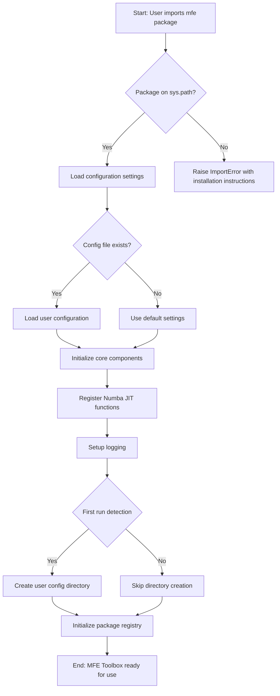

Key decision points in this workflow include:
- <span style="background-color: rgba(91, 57, 243, 0.2)">Whether the package is properly installed and available on Python's sys.path</span>
- <span style="background-color: rgba(91, 57, 243, 0.2)">Whether to use user-defined configuration or default settings</span>
- <span style="background-color: rgba(91, 57, 243, 0.2)">First-run detection for initial setup of user configuration</span>

The workflow ensures all <span style="background-color: rgba(91, 57, 243, 0.2)">necessary package components are available, including core functionality, models, utility functions, and user interface components.</span>

#### Build and Distribution Workflow

The build process, <span style="background-color: rgba(91, 57, 243, 0.2)">executed via Python's packaging tools</span>, handles <span style="background-color: rgba(91, 57, 243, 0.2)">packaging of the toolbox</span> and preparation for distribution:

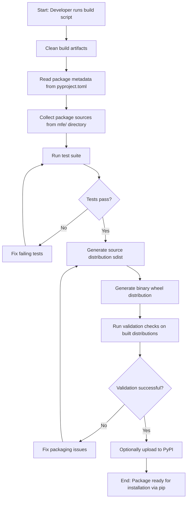

This workflow handles:
- <span style="background-color: rgba(91, 57, 243, 0.2)">Cleaning previous build artifacts for a fresh build</span>
- <span style="background-color: rgba(91, 57, 243, 0.2)">Reading package metadata from pyproject.toml configuration</span>
- <span style="background-color: rgba(91, 57, 243, 0.2)">Building source and binary distributions for cross-platform compatibility</span>
- <span style="background-color: rgba(91, 57, 243, 0.2)">Validation of built packages before distribution</span>

### 4.1.2 Core Analysis Workflows

#### ARMAX Analysis GUI Workflow

The ARMAX GUI provides an interactive environment for time series analysis, following this process flow:

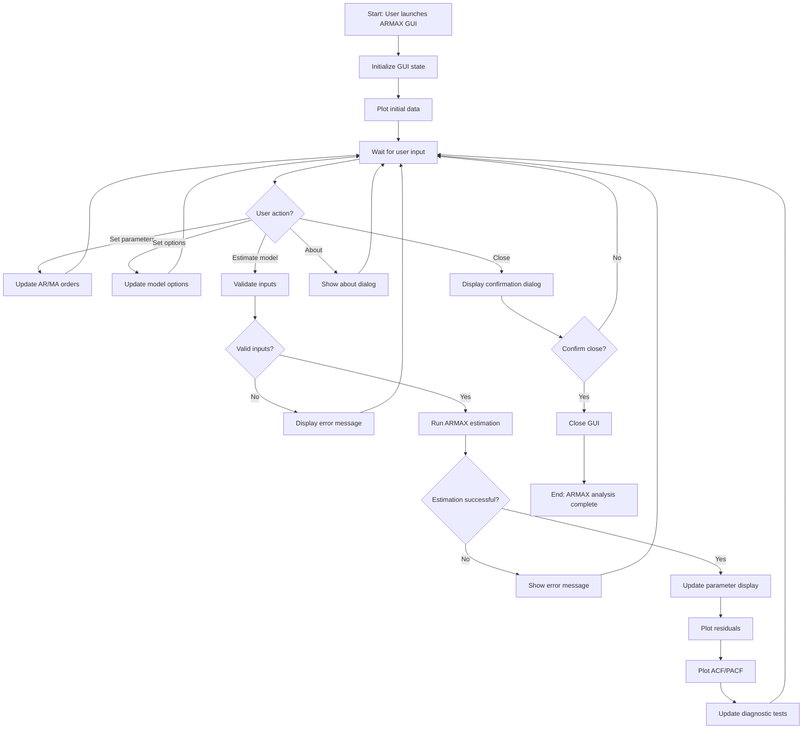

This workflow demonstrates:
- <span style="background-color: rgba(91, 57, 243, 0.2)">State management through the GUI using PyQt6 QApplication and custom widgets</span>
- Input validation before model estimation
- Visualization of results and diagnostics
- Modal dialog management for user confirmation

#### Univariate Volatility Modeling Workflow

The workflow for univariate volatility models illustrates the systematic process from data input to final model estimation:

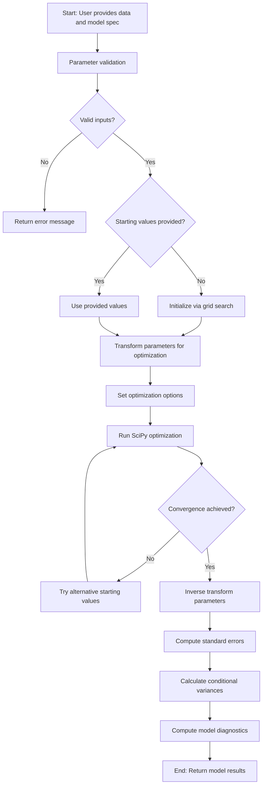

Key elements of this workflow include:
- Rigorous parameter validation
- Parameter transformation for optimization
- Fallback mechanisms for failed optimization
- Robust standard error computation
- Comprehensive diagnostic statistics

#### Multivariate Volatility Modeling Workflow

Multivariate volatility modeling follows a more complex process flow due to the higher-dimensional nature of the problem:

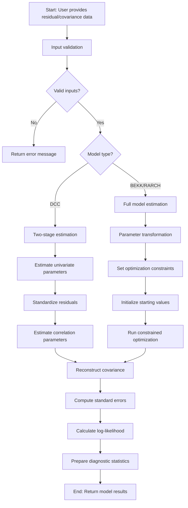

This workflow highlights:
- Model-specific estimation approaches (two-stage vs. full)
- Dimension checking and data conversion
- Parameter constraints enforcement
- Covariance matrix reconstruction

### 4.1.3 Time Series and Bootstrap Workflows

#### Time Series Analysis Workflow

The time series analysis workflow demonstrates the process for ARMA/ARMAX model estimation:

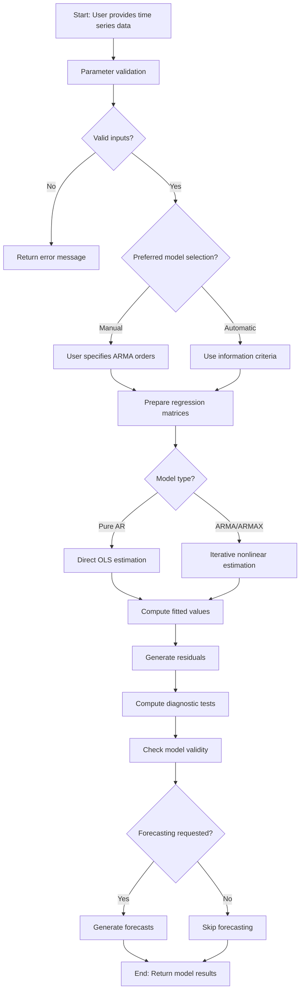

Key aspects include:
- Automatic or manual model selection
- Different estimation methods based on model type
- Comprehensive diagnostic testing
- Forecasting capabilities

#### Bootstrap Analysis Workflow

Bootstrap methods for dependent data follow this process flow:

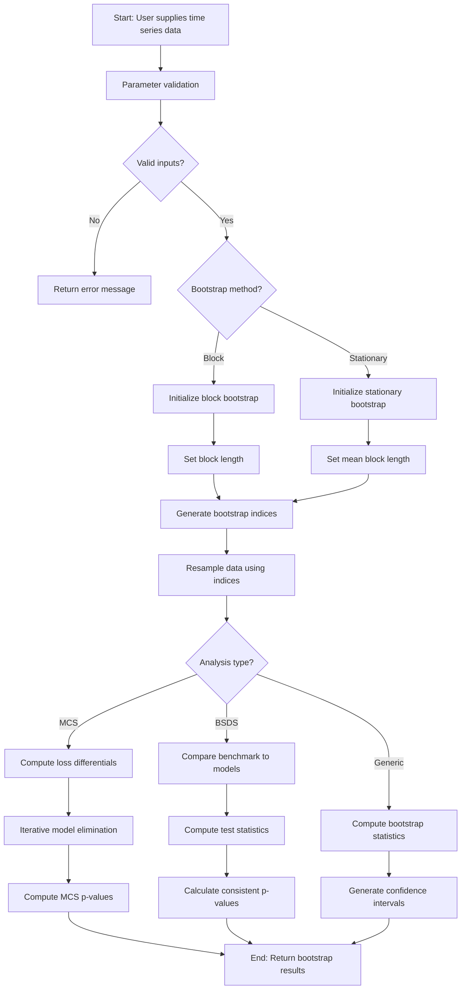

This workflow illustrates:
- Support for different bootstrap methods
- Method-specific parameter settings
- Various analysis types (MCS, BSDS, generic)
- Specialized p-value computation

### 4.1.4 High-Frequency Analysis Workflow

The high-frequency financial econometrics workflow manages the processing of intraday price data:

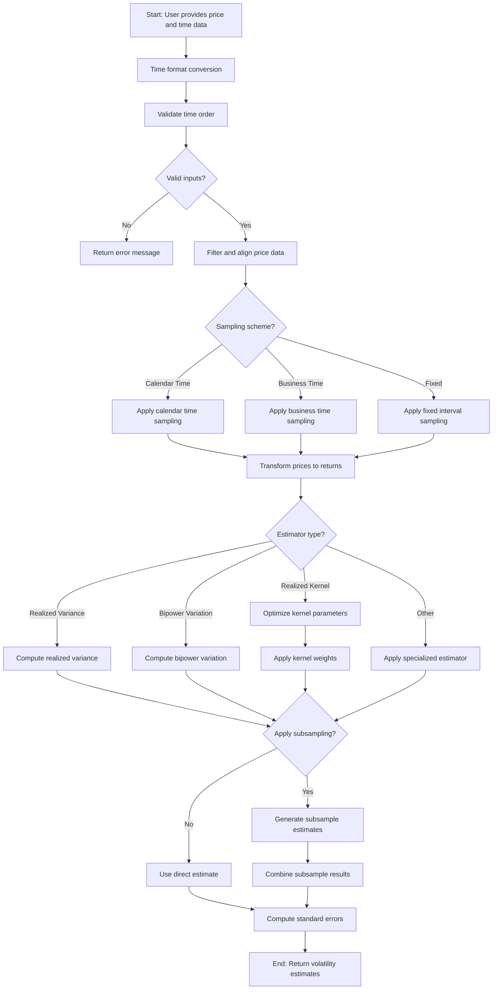

Key elements of this workflow include:
- Time format conversion and normalization
- Multiple sampling schemes
- Various volatility estimator types
- Optional subsampling for noise reduction

## 4.2 INTEGRATION WORKFLOWS

### 4.2.1 Numba Integration Flow

The integration between Python and Numba-accelerated functions follows this process:

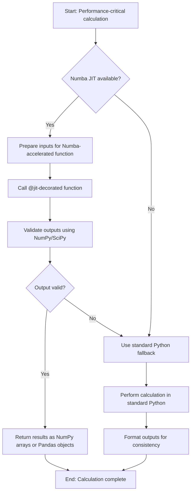

This workflow demonstrates:
- <span style="background-color: rgba(91, 57, 243, 0.2)">Fallback mechanisms for environments where Numba's JIT compilation isn't available</span>
- <span style="background-color: rgba(91, 57, 243, 0.2)">Input preparation using Python type hints for data consistency</span>
- <span style="background-color: rgba(91, 57, 243, 0.2)">Core computations accelerated with @jit decorators</span>
- <span style="background-color: rgba(91, 57, 243, 0.2)">Output validation using standard NumPy and SciPy functions</span>
- <span style="background-color: rgba(91, 57, 243, 0.2)">Results returned in standard Python formats (NumPy arrays or Pandas objects)</span>

### 4.2.2 Distribution-Model Integration Flow

The integration between statistical distributions and econometric models follows this pattern:

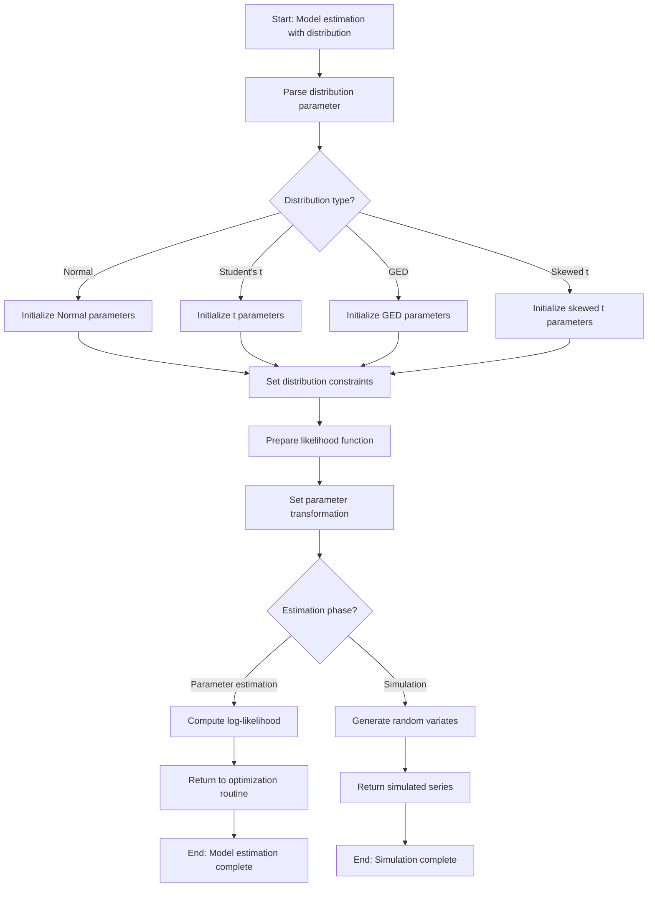

This workflow illustrates:
- <span style="background-color: rgba(91, 57, 243, 0.2)">Support for multiple distribution types using Python's SciPy stats module and custom distribution classes</span>
- <span style="background-color: rgba(91, 57, 243, 0.2)">Distribution-specific parameter constraints enforced through Python classes</span>
- <span style="background-color: rgba(91, 57, 243, 0.2)">Parameter transformation and constraint enforcement handled within Python classes using dataclasses</span>
- Dual-purpose functionality for estimation and simulation

### 4.2.3 Univariate-Multivariate Model Integration

The integration between univariate and multivariate volatility models follows this process:

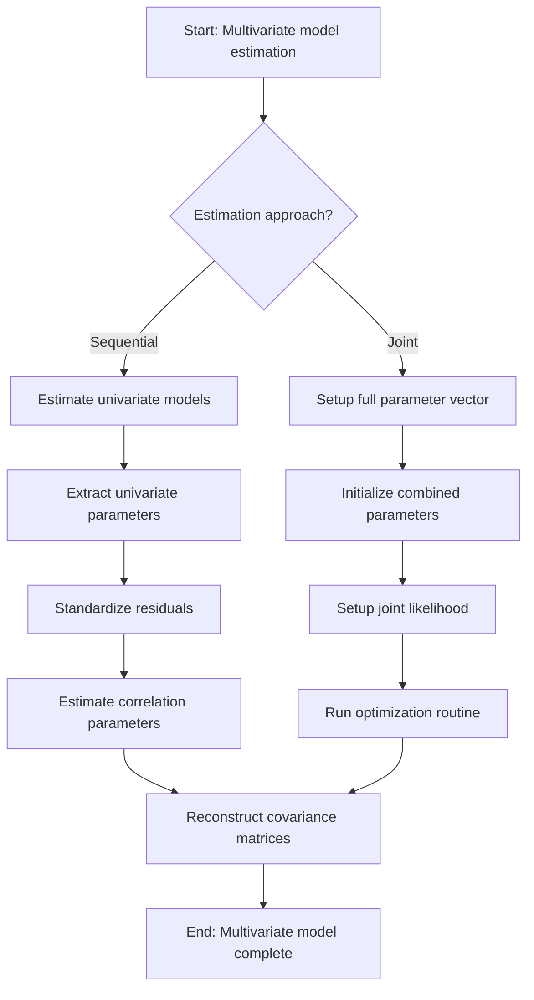

This workflow demonstrates:
- <span style="background-color: rgba(91, 57, 243, 0.2)">Object-oriented design where multivariate models call methods from univariate classes</span>
- <span style="background-color: rgba(91, 57, 243, 0.2)">Alternative estimation approaches using Python class method calls</span>
- <span style="background-color: rgba(91, 57, 243, 0.2)">Parameter extraction from univariate model instances</span>
- <span style="background-color: rgba(91, 57, 243, 0.2)">Standardization of residuals using NumPy/Pandas operations</span>
- <span style="background-color: rgba(91, 57, 243, 0.2)">Covariance reconstruction leveraging SciPy's linear algebra tools with Numba acceleration where necessary</span>

## 4.3 ERROR HANDLING AND RECOVERY

### 4.3.1 Parameter Validation Flow (updated)

The MFE Toolbox implements robust parameter validation across all components using <span style="background-color: rgba(91, 57, 243, 0.2)">Python's exception handling mechanism</span>:

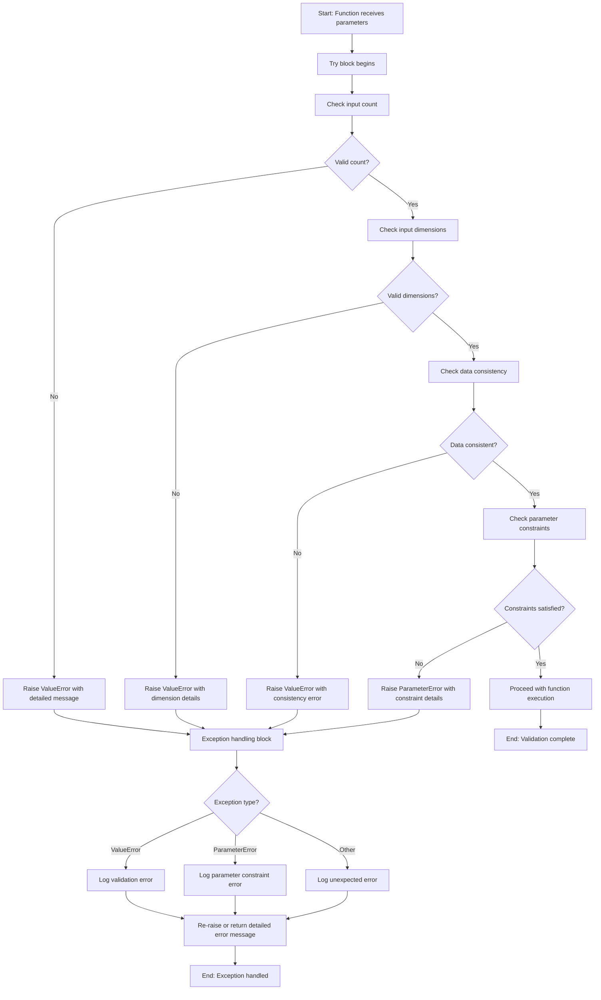

Key validation rules include:
- Non-negative integer orders for AR/MA models
- Maximum order constraints relative to sample size
- Positive parameters for volatility models
- Stationarity constraints (e.g., α + β < 1 for GARCH)
- Distribution parameter restrictions (e.g., degrees of freedom > 2)

<span style="background-color: rgba(91, 57, 243, 0.2)">Custom exception classes are implemented for different validation errors:
- `ParameterError`: For model parameter constraint violations
- `DimensionError`: For array dimension mismatches
- `ConvergenceError`: For failed optimization processes
- Standard `ValueError` and `TypeError`: For basic input validation</span>

<span style="background-color: rgba(91, 57, 243, 0.2)">All exceptions include detailed messages with context-specific information to aid debugging and proper error handling by client code.</span>

### 4.3.2 Optimization Error Recovery Flow (updated)

The toolbox implements sophisticated error recovery for optimization failures <span style="background-color: rgba(91, 57, 243, 0.2)">using Python's exception handling and SciPy's optimization framework</span>:

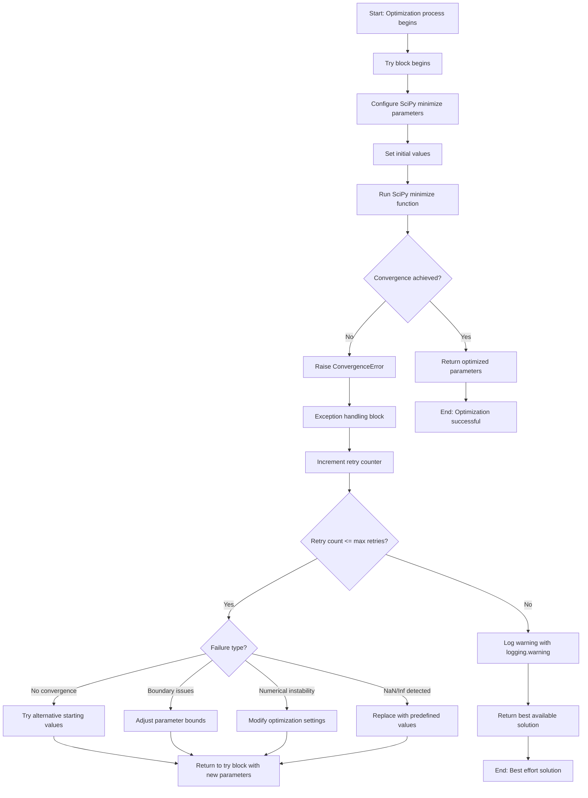

<span style="background-color: rgba(91, 57, 243, 0.2)">Recovery mechanisms include:
- Try/except blocks surrounding SciPy's `minimize` function calls with configurable method parameters
- Incremental retry counter within a loop until convergence or maximum retries
- Grid search implementation for alternative starting values when optimization fails
- Fallback solutions when full convergence cannot be achieved
- Python's logging module for warnings and error reporting
- NaN/Inf detection and replacement with predefined values
- Eigenvalue adjustments for near-singular matrices</span>

<span style="background-color: rgba(91, 57, 243, 0.2)">Key error recovery strategies implemented in Python:
1. Exception propagation with context: Original exceptions are captured and re-raised with additional context
2. Logging with different severity levels using Python's logging module
3. Hierarchical exception handling with specialized error types
4. Automated recovery attempts with exponential backoff strategies
5. Graceful degradation to simpler models when complex models fail to converge</span>

## 4.4 STATE MANAGEMENT AND TRANSACTION BOUNDARIES

## 4.4 STATE MANAGEMENT AND TRANSACTION BOUNDARIES

State transitions in the MFE Toolbox follow clearly defined patterns, <span style="background-color: rgba(91, 57, 243, 0.2)">implemented through an object-oriented approach in Python</span>:

1. **Model Estimation State Transitions**:
   - <span style="background-color: rgba(91, 57, 243, 0.2)">Input validation → Parameter initialization → Optimization → Diagnostics, implemented as sequential method calls within Python model classes</span>

2. **GUI Operation State Transitions**:
   - <span style="background-color: rgba(91, 57, 243, 0.2)">Initialization → User input → Parameter validation → Model estimation → Visualization, managed through PyQt6's signal-slot mechanism</span>

3. **Bootstrap Analysis State Transitions**:
   - Data validation → Resampling → Statistic computation → Hypothesis testing

<span style="background-color: rgba(91, 57, 243, 0.2)">Key data persistence points include:
- GUI state preservation in instance attributes of PyQt6 UI controller classes
- Filtered high-frequency prices and times stored in Pandas DataFrames
- Covariance matrix decompositions cached as NumPy arrays within model class instances</span>

<span style="background-color: rgba(91, 57, 243, 0.2)">Transaction boundaries are implemented through:
- Parameter transformations (constrained to unconstrained and vice versa) implemented as class methods
- Inverse transformations after optimization executed as complementary class methods
- Robust covariance matrices for inference stored as model instance attributes</span>

<span style="background-color: rgba(91, 57, 243, 0.2)">This object-oriented approach ensures effective state management throughout the application:

1. **Model Class State Management**:
   - Model parameters, intermediate results, and diagnostics are maintained as instance attributes
   - Temporary results during estimation are cached in-memory using instance variables
   - Method call sequences preserve state transitions while maintaining encapsulation

2. **UI State Management**:
   - PyQt6's signal-slot mechanism replaces MATLAB's modal dialog management
   - Dialog states (e.g., About and Close Confirmation) use PyQt6's QDialog with proper event handling
   - Controller classes preserve state between user interactions, maintaining separation of concerns
   
3. **Asynchronous Processing**:
   - Long-running calculations utilize Python's async/await pattern
   - Transaction integrity is maintained during asynchronous operations
   - Results are only finalized once all computation stages successfully complete
   - Error states properly propagate through the async call chain</span>

# 5. SYSTEM ARCHITECTURE

## 5.1 HIGH-LEVEL ARCHITECTURE

### 5.1.1 System Overview

The MFE Toolbox implements a modular, layered architecture following a <span style="background-color: rgba(91, 57, 243, 0.2)">class-based pattern with object-oriented design principles</span>. The system is structured around specialized mathematical and statistical operations required for financial econometrics modeling.

The architecture follows these key principles:

1. **<span style="background-color: rgba(91, 57, 243, 0.2)">Package-Based Organization</span>**: The system <span style="background-color: rgba(91, 57, 243, 0.2)">organizes related functionality into specialized Python packages (mfe/core, mfe/models, mfe/ui, mfe/utils) with clear namespacing and file hierarchy</span>. This approach <span style="background-color: rgba(91, 57, 243, 0.2)">follows Python's module system paradigm</span> and enables clear separation of concerns while maintaining cohesive functionality within each module.

2. **Hierarchical Component Structure**: Components are organized in a hierarchical manner with:
   - <span style="background-color: rgba(91, 57, 243, 0.2)">Core modeling components implemented as Python classes for different volatility models (univariate, multivariate, realized)</span>
   - <span style="background-color: rgba(91, 57, 243, 0.2)">Utility components providing matrix operations and numerical methods through NumPy and SciPy</span>
   - <span style="background-color: rgba(91, 57, 243, 0.2)">Performance-critical implementations via Numba's @jit decorators</span>
   - <span style="background-color: rgba(91, 57, 243, 0.2)">Statistical distribution and test components as Python classes</span>
   - <span style="background-color: rgba(91, 57, 243, 0.2)">Time series and bootstrap components leveraging Pandas for data handling</span>

3. **Consistent Parameter Transformation Pattern**: A fundamental architectural pattern used throughout the system involves transforming parameters between constrained and unconstrained spaces to facilitate numerical optimization while enforcing model-specific constraints.

4. **<span style="background-color: rgba(91, 57, 243, 0.2)">Model-Specific Class Hierarchies</span>**: Each model type follows a consistent architectural pattern with <span style="background-color: rgba(91, 57, 243, 0.2)">related classes and methods that handle specific aspects</span>:
   - Parameter validation (model.validate_parameters())
   - Starting value initialization (model.initialize_parameters())
   - Parameter transformation (model.transform/model.inverse_transform)
   - Likelihood computation (model.loglikelihood())
   - <span style="background-color: rgba(91, 57, 243, 0.2)">Core computation (model.fit(), often with Numba-accelerated methods)</span>
   - Simulation (model.simulate())
   - Display/formatting (model.__repr__, model.__str__)

5. **<span style="background-color: rgba(91, 57, 243, 0.2)">Performance Optimization Layer</span>**: Performance-critical components are <span style="background-color: rgba(91, 57, 243, 0.2)">implemented in Python with Numba's @jit decorators for Just-In-Time compilation</span>, providing significant performance improvements (reported up to 100x in some cases) while maintaining the Python interface.

The architectural boundaries of the system are well-defined:
- <span style="background-color: rgba(91, 57, 243, 0.2)">The primary external interface is the Python environment</span>
- <span style="background-color: rgba(91, 57, 243, 0.2)">Input data is provided as NumPy arrays and Pandas DataFrames</span>
- <span style="background-color: rgba(91, 57, 243, 0.2)">Results are returned as Python objects (arrays, dictionaries, or dataclass instances)</span>
- <span style="background-color: rgba(91, 57, 243, 0.2)">The system leverages standard Python libraries and scientific ecosystem (NumPy, SciPy, Pandas)</span>

### 5.1.2 Core Components

| Component Name | Primary Responsibility | Key Dependencies | Critical Considerations |
|----------------|--------------------------|------------------|------------------------|
| <span style="background-color: rgba(91, 57, 243, 0.2)">Package Initialization Module</span> | <span style="background-color: rgba(91, 57, 243, 0.2)">Configure Python import system and initialize package</span> | <span style="background-color: rgba(91, 57, 243, 0.2)">Python import system, package hierarchy</span> | <span style="background-color: rgba(91, 57, 243, 0.2)">Proper package initialization with namespacing</span> |
| <span style="background-color: rgba(91, 57, 243, 0.2)">Univariate Module (mfe/models/univariate)</span> | Univariate volatility model estimation and simulation | <span style="background-color: rgba(91, 57, 243, 0.2)">NumPy, SciPy, Utility functions, Numba-accelerated implementations</span> | Parameter transformation for optimization constraints |
| <span style="background-color: rgba(91, 57, 243, 0.2)">Multivariate Module (mfe/models/multivariate)</span> | Multivariate volatility model estimation and simulation | <span style="background-color: rgba(91, 57, 243, 0.2)">NumPy, SciPy, Univariate module, Utility functions</span> | Complex optimization with multiple constraints |
| <span style="background-color: rgba(91, 57, 243, 0.2)">Distributions Module (mfe/distributions)</span> | Statistical distribution computations | <span style="background-color: rgba(91, 57, 243, 0.2)">SciPy, NumPy</span> | Numerical stability in edge cases |
| <span style="background-color: rgba(91, 57, 243, 0.2)">Utility Module (mfe/utils)</span> | Matrix operations, covariance estimators, numerical methods | <span style="background-color: rgba(91, 57, 243, 0.2)">NumPy, SciPy</span> | Numerical stability and performance |
| <span style="background-color: rgba(91, 57, 243, 0.2)">Numba Acceleration Module</span> | <span style="background-color: rgba(91, 57, 243, 0.2)">High-performance implementations using @jit decorators</span> | <span style="background-color: rgba(91, 57, 243, 0.2)">Numba, NumPy</span> | <span style="background-color: rgba(91, 57, 243, 0.2)">Cross-platform optimization</span> |
| <span style="background-color: rgba(91, 57, 243, 0.2)">Bootstrap Module (mfe/bootstrap)</span> | Resampling methods for dependent data | <span style="background-color: rgba(91, 57, 243, 0.2)">NumPy, Pandas, Utility module</span> | Preservation of time series properties |
| <span style="background-color: rgba(91, 57, 243, 0.2)">Tests Module (mfe/tests)</span> | Statistical test implementations | <span style="background-color: rgba(91, 57, 243, 0.2)">NumPy, SciPy, Utility module</span> | Validation of test statistics |

### 5.1.3 Data Flow Description

The data flow in the MFE Toolbox follows a systematic pattern across model implementations:

1. **Model Initialization and Parameter Validation**:
   - <span style="background-color: rgba(91, 57, 243, 0.2)">Input data (NumPy arrays or Pandas DataFrames) and model specifications undergo rigorous validation</span>
   - Starting values are computed or validated
   - Parameters are transformed for unconstrained optimization
   
2. **Model Estimation**:
   - <span style="background-color: rgba(91, 57, 243, 0.2)">Numerical optimization using SciPy's optimization routines</span>
   - Parameter constraints enforced via transformations
   - Iterative refinement with fallback strategies
   
3. **Parameter and Covariance Inference**:
   - Parameters transformed back to original constrained space
   - <span style="background-color: rgba(91, 57, 243, 0.2)">Robust covariance matrices computed via NumPy's numerical differentiation</span>
   - <span style="background-color: rgba(91, 57, 243, 0.2)">Score matrices and diagnostic statistics generated as Python objects</span>
   
4. **Conditional Volatility Computation**:
   - <span style="background-color: rgba(91, 57, 243, 0.2)">Recursive computation of conditional variances/covariances using Numba-accelerated functions</span>
   - Back-casting for initialization
   - Numerical bounds enforcement for stability

5. **Multivariate Model Data Flows**:
   - Two-stage or three-stage estimation process
   - First stage: Univariate model estimation
   - Second stage: Correlation dynamics estimation
   - <span style="background-color: rgba(91, 57, 243, 0.2)">Integration via NumPy arrays of standardized residuals</span>

Key data transformation points include:
- Parameter constraints enforced via transformation/inverse transformation
- <span style="background-color: rgba(91, 57, 243, 0.2)">Matrix decompositions using NumPy and SciPy linear algebra functions</span>
- <span style="background-color: rgba(91, 57, 243, 0.2)">Standardization of residuals using NumPy array operations</span>
- Back-casting for model initialization
- <span style="background-color: rgba(91, 57, 243, 0.2)">Numerical gradient and Hessian computation via SciPy's differential calculus functions</span>

Important data stores include:
- <span style="background-color: rgba(91, 57, 243, 0.2)">Model parameters (stored in Python dataclasses with explicit type hints)</span>
- <span style="background-color: rgba(91, 57, 243, 0.2)">Conditional variance/covariance matrices (as NumPy arrays)</span>
- <span style="background-color: rgba(91, 57, 243, 0.2)">Score contributions (as NumPy arrays for inference)</span>
- <span style="background-color: rgba(91, 57, 243, 0.2)">Intermediate matrices for optimization (cached in memory as NumPy arrays)</span>

### 5.1.4 External Integration Points

| System Name | Integration Type | Data Exchange Pattern | Protocol/Format |
|-------------|------------------|------------------------|-----------------|
| <span style="background-color: rgba(91, 57, 243, 0.2)">Python Environment</span> | <span style="background-color: rgba(91, 57, 243, 0.2)">Runtime Library</span> | <span style="background-color: rgba(91, 57, 243, 0.2)">Python import system with function/method calls</span> | <span style="background-color: rgba(91, 57, 243, 0.2)">NumPy arrays, Pandas DataFrames, Python objects</span> |
| <span style="background-color: rgba(91, 57, 243, 0.2)">Numba JIT Compiler</span> | <span style="background-color: rgba(91, 57, 243, 0.2)">Performance Acceleration</span> | <span style="background-color: rgba(91, 57, 243, 0.2)">Function decoration with @jit</span> | <span style="background-color: rgba(91, 57, 243, 0.2)">NumPy-compatible arrays</span> |
| <span style="background-color: rgba(91, 57, 243, 0.2)">File System</span> | <span style="background-color: rgba(91, 57, 243, 0.2)">Data I/O</span> | <span style="background-color: rgba(91, 57, 243, 0.2)">Python's standard file I/O using pathlib</span> | <span style="background-color: rgba(91, 57, 243, 0.2)">CSV, JSON, and NumPy NPZ formats</span> |
| <span style="background-color: rgba(91, 57, 243, 0.2)">Package Distribution</span> | <span style="background-color: rgba(91, 57, 243, 0.2)">Deployment</span> | <span style="background-color: rgba(91, 57, 243, 0.2)">pip-based installation</span> | <span style="background-color: rgba(91, 57, 243, 0.2)">Python wheel package format</span> |

## 5.2 COMPONENT DETAILS

### 5.2.1 Univariate Volatility Models Component

**Purpose and Responsibilities**:
The Univariate Volatility Models component implements estimation, simulation, and forecasting of various univariate GARCH-family models including GARCH, AGARCH, APARCH, EGARCH, FIGARCH, HEAVY, IGARCH, and TARCH.

**Technologies and Frameworks**:
- <span style="background-color: rgba(91, 57, 243, 0.2)">Python classes for model implementation with inheritance hierarchy</span>
- <span style="background-color: rgba(91, 57, 243, 0.2)">Dataclasses for parameter definitions and validation</span>
- <span style="background-color: rgba(91, 57, 243, 0.2)">NumPy arrays for efficient data handling</span>
- <span style="background-color: rgba(91, 57, 243, 0.2)">Numba-accelerated core recursions (@jit decorators)</span>
- <span style="background-color: rgba(91, 57, 243, 0.2)">SciPy optimization tools (minimize) for likelihood maximization</span>

**Key Interfaces and APIs**:
- <span style="background-color: rgba(91, 57, 243, 0.2)">Core model classes (GARCH, EGARCH, TARCH, etc.)</span>
- <span style="background-color: rgba(91, 57, 243, 0.2)">Parameter transformation methods with strict type hints</span>
- <span style="background-color: rgba(91, 57, 243, 0.2)">Numba-accelerated core recursion functions</span>
- <span style="background-color: rgba(91, 57, 243, 0.2)">Likelihood evaluation methods</span>
- <span style="background-color: rgba(91, 57, 243, 0.2)">Simulation methods with support for asynchronous processing</span>

**Data Persistence Requirements**:
- Maintains state across optimization iterations for efficiency
- <span style="background-color: rgba(91, 57, 243, 0.2)">Stores conditional variance series as NumPy arrays</span>
- <span style="background-color: rgba(91, 57, 243, 0.2)">Preserves parameter estimates and standard errors in dataclass instances</span>

**Scaling Considerations**:
- <span style="background-color: rgba(91, 57, 243, 0.2)">Handles large time series (10,000+ observations) with Numba acceleration</span>
- <span style="background-color: rgba(91, 57, 243, 0.2)">Provides 10-100x performance improvement over pure Python implementations</span>
- <span style="background-color: rgba(91, 57, 243, 0.2)">Optimized for memory efficiency using NumPy's array operations</span>

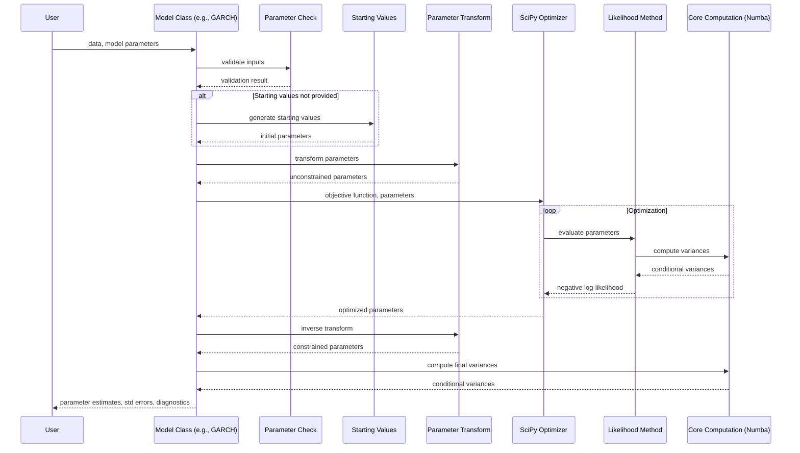

### 5.2.2 Multivariate Volatility Models Component

**Purpose and Responsibilities**:
The Multivariate Volatility Models component implements estimation, simulation, and forecasting of multivariate volatility models including BEKK, CCC, DCC, OGARCH/GOGARCH, Matrix GARCH, RARCH, RCC, and RiskMetrics.

**Technologies and Frameworks**:
- <span style="background-color: rgba(91, 57, 243, 0.2)">Class-based hierarchy with base multivariate model class and specialized subclasses</span>
- <span style="background-color: rgba(91, 57, 243, 0.2)">NumPy arrays for efficient matrix operations</span>
- <span style="background-color: rgba(91, 57, 243, 0.2)">Numba acceleration for performance-critical matrix computations</span>
- <span style="background-color: rgba(91, 57, 243, 0.2)">Dataclasses for parameter definitions with validation</span>
- <span style="background-color: rgba(91, 57, 243, 0.2)">Asynchronous processing support for computationally intensive tasks</span>

**Key Interfaces and APIs**:
- <span style="background-color: rgba(91, 57, 243, 0.2)">Core model classes (DCC, BEKK, RARCH, etc.)</span>
- <span style="background-color: rgba(91, 57, 243, 0.2)">Variance-correlation decomposition utilities using NumPy</span>
- <span style="background-color: rgba(91, 57, 243, 0.2)">Two-stage and three-stage estimation methods</span>
- <span style="background-color: rgba(91, 57, 243, 0.2)">Parameter transformation and constraint enforcement methods</span>

**Data Persistence Requirements**:
- <span style="background-color: rgba(91, 57, 243, 0.2)">Manages large covariance matrices using NumPy arrays</span>
- <span style="background-color: rgba(91, 57, 243, 0.2)">Stores time-varying correlation matrices as 3D NumPy arrays</span>
- <span style="background-color: rgba(91, 57, 243, 0.2)">Preserves parameter estimates across estimation stages in dataclass instances</span>

**Scaling Considerations**:
- <span style="background-color: rgba(91, 57, 243, 0.2)">Uses composite likelihood for high-dimensional problems with NumPy's efficient array operations</span>
- <span style="background-color: rgba(91, 57, 243, 0.2)">Implements diagonal and scalar specifications for large dimensions</span>
- <span style="background-color: rgba(91, 57, 243, 0.2)">Optimizes matrix operations with Numba for covariance computations</span>

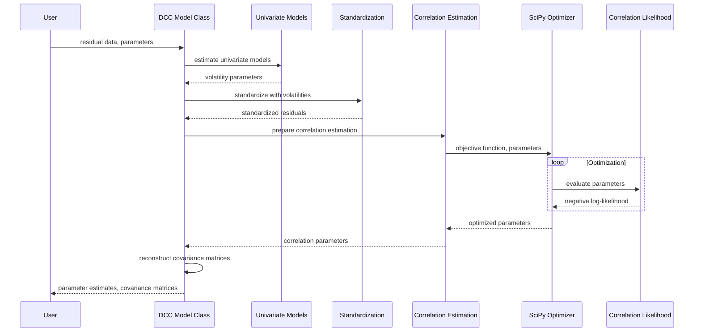

### 5.2.3 Utility Functions Component

**Purpose and Responsibilities**:
The Utility Functions component provides matrix operations, numerical methods, and data transformation utilities used across the toolbox.

**Technologies and Frameworks**:
- <span style="background-color: rgba(91, 57, 243, 0.2)">Python modules in the mfe/utils package</span>
- <span style="background-color: rgba(91, 57, 243, 0.2)">NumPy for efficient array and matrix operations</span>
- <span style="background-color: rgba(91, 57, 243, 0.2)">Pandas for time series handling and date utilities</span>
- <span style="background-color: rgba(91, 57, 243, 0.2)">Type hints throughout for code reliability</span>
- <span style="background-color: rgba(91, 57, 243, 0.2)">Numba acceleration for performance-critical utilities</span>

**Key Interfaces and APIs**:
- <span style="background-color: rgba(91, 57, 243, 0.2)">Matrix transformations (vech, ivech, etc.) with NumPy</span>
- <span style="background-color: rgba(91, 57, 243, 0.2)">Numerical differentiation (gradient_2sided, hessian_2sided) using SciPy</span>
- <span style="background-color: rgba(91, 57, 243, 0.2)">Robust covariance estimation (robustvcv, covnw) with Numba acceleration</span>
- <span style="background-color: rgba(91, 57, 243, 0.2)">Data standardization (standardize, mvstandardize) with Pandas integration</span>

**Data Persistence Requirements**:
- <span style="background-color: rgba(91, 57, 243, 0.2)">Generally stateless function implementations</span>
- <span style="background-color: rgba(91, 57, 243, 0.2)">Consistent handling of NumPy arrays and Pandas objects</span>
- <span style="background-color: rgba(91, 57, 243, 0.2)">Preservation of dimensional consistency in array operations</span>

**Scaling Considerations**:
- <span style="background-color: rgba(91, 57, 243, 0.2)">Optimized for efficient matrix operations with NumPy</span>
- <span style="background-color: rgba(91, 57, 243, 0.2)">Vectorized implementations for large datasets</span>
- <span style="background-color: rgba(91, 57, 243, 0.2)">Memory-efficient algorithms using NumPy's array views where possible</span>

### 5.2.4 Numba Acceleration Component

**Purpose and Responsibilities**:
The Numba Acceleration component provides high-performance implementations of computationally intensive algorithms, particularly for recursion-heavy volatility models, using Python code optimized with Numba's JIT compilation.

**Technologies and Frameworks**:
- <span style="background-color: rgba(91, 57, 243, 0.2)">Pure Python implementation with Numba's @jit decorators</span>
- <span style="background-color: rgba(91, 57, 243, 0.2)">NumPy for array operations and linear algebra</span>
- <span style="background-color: rgba(91, 57, 243, 0.2)">Just-In-Time compilation via Numba</span>

**Key Interfaces and APIs**:
- <span style="background-color: rgba(91, 57, 243, 0.2)">JIT-decorated functions for core recursions</span>
- <span style="background-color: rgba(91, 57, 243, 0.2)">NumPy-compatible array interfaces</span>
- <span style="background-color: rgba(91, 57, 243, 0.2)">Performance-critical mathematical operations</span>

**Data Persistence Requirements**:
- <span style="background-color: rgba(91, 57, 243, 0.2)">No persistent state between calls</span>
- <span style="background-color: rgba(91, 57, 243, 0.2)">Efficient memory management during execution</span>
- <span style="background-color: rgba(91, 57, 243, 0.2)">Strict dimensional validation for NumPy arrays</span>

**Scaling Considerations**:
- <span style="background-color: rgba(91, 57, 243, 0.2)">Provides 10-100x performance improvement over pure Python implementations</span>
- <span style="background-color: rgba(91, 57, 243, 0.2)">Optimized for large datasets with thousands of observations</span>
- <span style="background-color: rgba(91, 57, 243, 0.2)">Efficient memory usage for recursive computations</span>

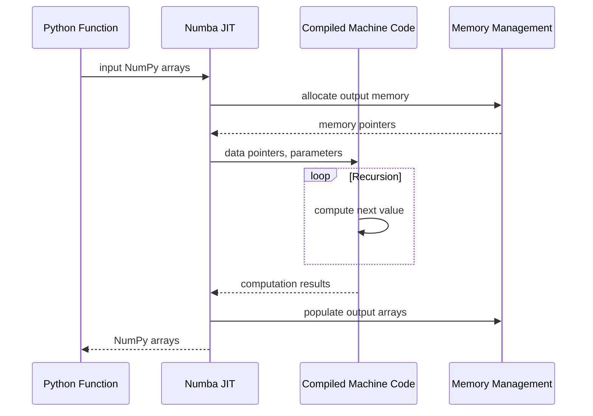

### 5.2.5 Distribution Functions Component

**Purpose and Responsibilities**:
The Distribution Functions component implements statistical distributions for likelihood computation and random number generation.

**Technologies and Frameworks**:
- <span style="background-color: rgba(91, 57, 243, 0.2)">Python classes extending SciPy's statistical distributions</span>
- <span style="background-color: rgba(91, 57, 243, 0.2)">NumPy for array operations and vectorization</span>
- <span style="background-color: rgba(91, 57, 243, 0.2)">Numba acceleration for performance-critical density and quantile functions</span>
- <span style="background-color: rgba(91, 57, 243, 0.2)">Dataclasses for parameter management with strict validation</span>

**Key Interfaces and APIs**:
- <span style="background-color: rgba(91, 57, 243, 0.2)">PDF, CDF, quantile, and random number generation methods</span>
- <span style="background-color: rgba(91, 57, 243, 0.2)">Log-likelihood methods with NumPy vectorization</span>
- <span style="background-color: rgba(91, 57, 243, 0.2)">Parameter validation with type hints</span>

**Data Persistence Requirements**:
- <span style="background-color: rgba(91, 57, 243, 0.2)">Stateless implementations with immutable distribution parameters</span>
- <span style="background-color: rgba(91, 57, 243, 0.2)">Parameter validation through dataclass field validation</span>
- <span style="background-color: rgba(91, 57, 243, 0.2)">Preservation of numerical precision in distribution calculations</span>

**Scaling Considerations**:
- <span style="background-color: rgba(91, 57, 243, 0.2)">Vectorized implementations using NumPy for large datasets</span>
- <span style="background-color: rgba(91, 57, 243, 0.2)">Edge case handling for numerical stability</span>
- <span style="background-color: rgba(91, 57, 243, 0.2)">Efficient computation of tail probabilities with Numba acceleration</span>

### 5.2.6 Bootstrap Methods Component

**Purpose and Responsibilities**:
The Bootstrap Methods component implements resampling methods for dependent data, including block bootstrap, stationary bootstrap, and model confidence set procedures.

**Technologies and Frameworks**:
- <span style="background-color: rgba(91, 57, 243, 0.2)">Python classes with strict type hints</span>
- <span style="background-color: rgba(91, 57, 243, 0.2)">NumPy for efficient array operations</span>
- <span style="background-color: rgba(91, 57, 243, 0.2)">Numba acceleration for resampling algorithms</span>
- <span style="background-color: rgba(91, 57, 243, 0.2)">Dataclasses for bootstrap configuration parameters</span>

**Key Interfaces and APIs**:
- <span style="background-color: rgba(91, 57, 243, 0.2)">Block and stationary bootstrap class methods</span>
- <span style="background-color: rgba(91, 57, 243, 0.2)">Model confidence set implementation</span>
- <span style="background-color: rgba(91, 57, 243, 0.2)">Bootstrap-based testing with type-validated interfaces</span>

**Data Persistence Requirements**:
- <span style="background-color: rgba(91, 57, 243, 0.2)">Manages bootstrap replications as NumPy arrays</span>
- <span style="background-color: rgba(91, 57, 243, 0.2)">Preserves time series properties during resampling</span>
- <span style="background-color: rgba(91, 57, 243, 0.2)">Maintains test statistics across iterations in memory-efficient structures</span>

**Scaling Considerations**:
- <span style="background-color: rgba(91, 57, 243, 0.2)">Handles large numbers of bootstrap replications with Numba-accelerated core functions</span>
- <span style="background-color: rgba(91, 57, 243, 0.2)">Optimized for long time series using NumPy's vectorized operations</span>
- <span style="background-color: rgba(91, 57, 243, 0.2)">Efficient resampling algorithms with minimal memory overhead</span>

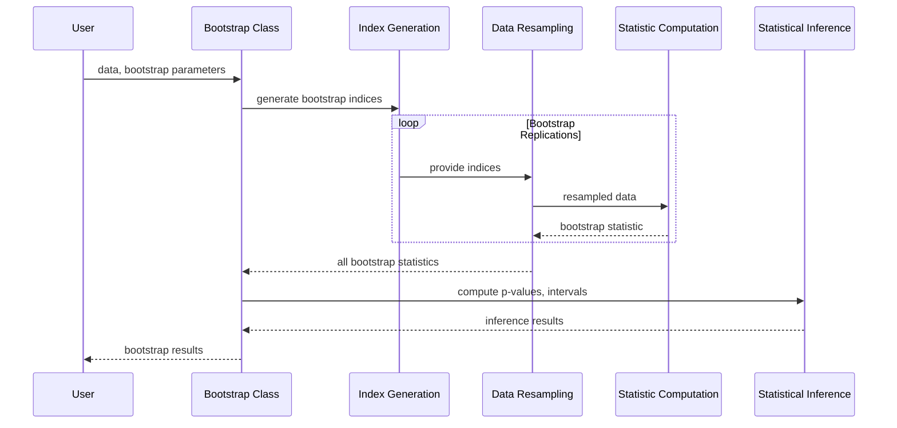

## 5.3 TECHNICAL DECISIONS

### 5.3.1 Architecture Style Decisions

**<span style="background-color: rgba(91, 57, 243, 0.2)">Python Class-Based Architecture</span>**
- **Decision**: <span style="background-color: rgba(91, 57, 243, 0.2)">Adopt a class-based architecture with inheritance hierarchies rather than function-based approach</span>
- **Rationale**: <span style="background-color: rgba(91, 57, 243, 0.2)">Provides better code organization, encapsulation, and aligns with Python's object-oriented paradigm while enabling code reuse through inheritance</span>
- **Tradeoffs**: <span style="background-color: rgba(91, 57, 243, 0.2)">Introduces some complexity in class hierarchies but significantly improves maintainability and extensibility</span>

**<span style="background-color: rgba(91, 57, 243, 0.2)">Python Package Structure</span>**
- **Decision**: <span style="background-color: rgba(91, 57, 243, 0.2)">Organize related classes into specialized Python packages and modules</span>
- **Rationale**: <span style="background-color: rgba(91, 57, 243, 0.2)">Follows Python's standard module system, improves code organization, and enables clear namespacing</span>
- **Tradeoffs**: <span style="background-color: rgba(91, 57, 243, 0.2)">Requires explicit imports but significantly enhances maintainability and follows Python best practices</span>

**<span style="background-color: rgba(91, 57, 243, 0.2)">Numba Interface for Performance</span>**
- **Decision**: <span style="background-color: rgba(91, 57, 243, 0.2)">Implement performance-critical components using Python with Numba's @jit decorators</span>
- **Rationale**: <span style="background-color: rgba(91, 57, 243, 0.2)">Delivers 10-100x performance improvement for computation-intensive routines without platform-specific compilation</span>
- **Tradeoffs**: <span style="background-color: rgba(91, 57, 243, 0.2)">Places some constraints on Python code features that can be used but avoids complexity of maintaining separate C implementations</span>

**<span style="background-color: rgba(91, 57, 243, 0.2)">Type Hinting and Dataclasses</span>**
- **Decision**: <span style="background-color: rgba(91, 57, 243, 0.2)">Implement comprehensive type hints and use dataclasses for parameter containers</span>
- **Rationale**: <span style="background-color: rgba(91, 57, 243, 0.2)">Improves code reliability, enables better IDE support, and provides clear API contracts</span>
- **Tradeoffs**: <span style="background-color: rgba(91, 57, 243, 0.2)">Requires additional code but dramatically improves maintainability and reduces runtime errors</span>

**Parameter Transformation Pattern**
- **Decision**: Transform parameters between constrained and unconstrained spaces
- **Rationale**: Enables use of unconstrained optimization algorithms while enforcing model-specific constraints
- **Tradeoffs**: Adds complexity but significantly improves optimization robustness and convergence properties

### 5.3.2 Communication Pattern Choices

**<span style="background-color: rgba(91, 57, 243, 0.2)">Class-Based API</span>**
- **Decision**: <span style="background-color: rgba(91, 57, 243, 0.2)">Design APIs around class methods rather than standalone functions</span>
- **Rationale**: <span style="background-color: rgba(91, 57, 243, 0.2)">Aligns with Python's object-oriented design and enables better encapsulation of related functionality</span>
- **Tradeoffs**: <span style="background-color: rgba(91, 57, 243, 0.2)">More structured approach with inheritance but may be unfamiliar to users of purely functional libraries</span>

**<span style="background-color: rgba(91, 57, 243, 0.2)">Python Module System</span>**
- **Decision**: <span style="background-color: rgba(91, 57, 243, 0.2)">Implement standard Python package structure with proper imports</span>
- **Rationale**: <span style="background-color: rgba(91, 57, 243, 0.2)">Leverages Python's native module system for clean namespacing and organization</span>
- **Tradeoffs**: <span style="background-color: rgba(91, 57, 243, 0.2)">Requires explicit imports but follows Python ecosystem standards</span>

**<span style="background-color: rgba(91, 57, 243, 0.2)">Dependency Management</span>**
- **Decision**: <span style="background-color: rgba(91, 57, 243, 0.2)">Use pip and pyproject.toml for dependency management</span>
- **Rationale**: <span style="background-color: rgba(91, 57, 243, 0.2)">Provides standard dependency resolution and package installation mechanisms</span>
- **Tradeoffs**: <span style="background-color: rgba(91, 57, 243, 0.2)">Requires Python packaging tools but simplifies distribution and deployment</span>

**<span style="background-color: rgba(91, 57, 243, 0.2)">Asynchronous Processing</span>**
- **Decision**: <span style="background-color: rgba(91, 57, 243, 0.2)">Implement async/await patterns for long-running computations</span>
- **Rationale**: <span style="background-color: rgba(91, 57, 243, 0.2)">Improves responsiveness during computationally intensive operations</span>
- **Tradeoffs**: <span style="background-color: rgba(91, 57, 243, 0.2)">Adds some complexity but significantly improves user experience for long-running tasks</span>

**Input Validation Pattern**
- **Decision**: <span style="background-color: rgba(91, 57, 243, 0.2)">Implement dedicated parameter validation with type hints</span>
- **Rationale**: <span style="background-color: rgba(91, 57, 243, 0.2)">Ensures robust input validation and prevents runtime errors</span>
- **Tradeoffs**: <span style="background-color: rgba(91, 57, 243, 0.2)">Additional validation code but significant improvement in error prevention and clear error messages</span>

### 5.3.3 Data Storage Solution Rationale

**<span style="background-color: rgba(91, 57, 243, 0.2)">NumPy Array-Based Storage</span>**
- **Decision**: <span style="background-color: rgba(91, 57, 243, 0.2)">Use NumPy's native array structures for numerical data storage</span>
- **Rationale**: <span style="background-color: rgba(91, 57, 243, 0.2)">Provides natural integration with Python's scientific ecosystem and optimized numerical operations</span>
- **Tradeoffs**: <span style="background-color: rgba(91, 57, 243, 0.2)">Memory intensive but leverages highly optimized BLAS/LAPACK implementations</span>

**<span style="background-color: rgba(91, 57, 243, 0.2)">Pandas DataFrames for Time Series</span>**
- **Decision**: <span style="background-color: rgba(91, 57, 243, 0.2)">Use Pandas DataFrames for time series representation</span>
- **Rationale**: <span style="background-color: rgba(91, 57, 243, 0.2)">Efficient representation with built-in time series functionality and indexing</span>
- **Tradeoffs**: <span style="background-color: rgba(91, 57, 243, 0.2)">Higher memory overhead than raw arrays but significantly improved ease of use</span>

**<span style="background-color: rgba(91, 57, 243, 0.2)">Python Dataclasses for Parameters</span>**
- **Decision**: <span style="background-color: rgba(91, 57, 243, 0.2)">Use Python dataclasses for parameter containers with validation</span>
- **Rationale**: <span style="background-color: rgba(91, 57, 243, 0.2)">Provides type safety, validation, and clear structure for model parameters</span>
- **Tradeoffs**: <span style="background-color: rgba(91, 57, 243, 0.2)">Additional code compared to simple dictionaries but improves reliability</span>

### 5.3.4 Caching Strategy Justification

**Back-Casting for Initialization**
- **Decision**: Use back-casting techniques for model initialization
- **Rationale**: Provides stable starting values for recursive computations
- **Tradeoffs**: Additional computation but significantly improves numerical stability

**<span style="background-color: rgba(91, 57, 243, 0.2)">In-Memory Data Processing</span>**
- **Decision**: <span style="background-color: rgba(91, 57, 243, 0.2)">Process data entirely in memory using NumPy arrays and Pandas DataFrames</span>
- **Rationale**: <span style="background-color: rgba(91, 57, 243, 0.2)">Optimized for performance with modern hardware capabilities</span>
- **Tradeoffs**: <span style="background-color: rgba(91, 57, 243, 0.2)">Memory intensive but avoids I/O bottlenecks and leverages optimized NumPy operations</span>

### 5.3.5 Security Mechanism Selection

**<span style="background-color: rgba(91, 57, 243, 0.2)">Type-Based Validation</span>**
- **Decision**: <span style="background-color: rgba(91, 57, 243, 0.2)">Implement comprehensive type hints and validation across all components</span>
- **Rationale**: <span style="background-color: rgba(91, 57, 243, 0.2)">Prevents errors from invalid inputs and improves system reliability</span>
- **Tradeoffs**: <span style="background-color: rgba(91, 57, 243, 0.2)">Additional validation code but significant improvement in error prevention</span>

```mermaid
graph TD
    A[Technical Decision: Architecture Style] --> B{Object-Oriented vs Function-Based}
    B -->|Selected| C[Class-Based with Inheritance]
    B -->|Rejected| D[Function-Based]
    
    C --> C1[Pros: Better encapsulation, Reusable code, Python best practices]
    C --> C2[Cons: More complex class hierarchies]
    
    D --> D1[Pros: Simpler implementation]
    D --> D2[Cons: Less code reuse, Poor encapsulation]
    
    E[Technical Decision: Performance Critical Code] --> F{Implementation Approach}
    F -->|Selected| G[Python with Numba @jit]
    F -->|Rejected| H[C Extensions]
    
    G --> G1[Pros: Platform independence, 10-100x speed boost, Single codebase]
    G --> G2[Cons: Some Python feature limitations]
    
    H --> H1[Pros: Maximum performance potential]
    H --> H2[Cons: Platform-specific compilation, Separate codebases]

## 5.4 CROSS-CUTTING CONCERNS

### 5.4.1 Monitoring and Observability

The MFE Toolbox implements several mechanisms to ensure observability:

1. **<span style="background-color: rgba(91, 57, 243, 0.2)">Diagnostic Information</span>**: Detailed diagnostic information is returned in output structures, including:
   - Parameter estimates and standard errors
   - Model fit statistics (AIC, BIC, log-likelihood)
   - Robust covariance matrices
   - Conditional variance/covariance series
   - <span style="background-color: rgba(91, 57, 243, 0.2)">Comprehensive logging using Python's logging module with configurable levels</span>

2. **<span style="background-color: rgba(91, 57, 243, 0.2)">Optimization Progress Reporting</span>**: <span style="background-color: rgba(91, 57, 243, 0.2)">Integration with SciPy's optimization interfaces</span> to report:
   - Iteration progress
   - Function evaluation counts
   - Convergence status
   - Gradient magnitude
   - <span style="background-color: rgba(91, 57, 243, 0.2)">Customizable callback functions for real-time monitoring</span>

3. **<span style="background-color: rgba(91, 57, 243, 0.2)">Intermediate Calculations</span>**: Return of intermediate calculations for diagnostics, including:
   - Score contributions
   - Hessian matrices
   - Parameter transformation Jacobians
   - Standardized residuals
   - <span style="background-color: rgba(91, 57, 243, 0.2)">Progress tracking for asynchronous operations via callback functions</span>

4. **<span style="background-color: rgba(91, 57, 243, 0.2)">Structured Exception Handling</span>** (new):
   - <span style="background-color: rgba(91, 57, 243, 0.2)">Comprehensive try/except blocks with detailed contextual information</span>
   - <span style="background-color: rgba(91, 57, 243, 0.2)">Error propagation with preserved stack traces</span>
   - <span style="background-color: rgba(91, 57, 243, 0.2)">Integration with logging.error() for persistent error records</span>
   - <span style="background-color: rgba(91, 57, 243, 0.2)">Asynchronous error propagation in long-running tasks</span>

### 5.4.2 Error Handling Patterns

The system implements a comprehensive error handling strategy:

1. **Input Validation**: Thorough validation before computation, checking:
   - Parameter dimensions and values
   - Data consistency and sufficiency 
   - Model specification validity
   - Numerical constraints
   - <span style="background-color: rgba(91, 57, 243, 0.2)">Using Python's type hints and custom validators</span>

2. **<span style="background-color: rgba(91, 57, 243, 0.2)">Custom Exception Classes</span>** (new):
   - <span style="background-color: rgba(91, 57, 243, 0.2)">ParameterError: For model parameter constraint violations</span>
   - <span style="background-color: rgba(91, 57, 243, 0.2)">DimensionError: For array dimension mismatches</span>
   - <span style="background-color: rgba(91, 57, 243, 0.2)">ConvergenceError: For optimization failures</span>
   - <span style="background-color: rgba(91, 57, 243, 0.2)">NumericError: For numerical stability issues</span>
   - <span style="background-color: rgba(91, 57, 243, 0.2)">All with detailed error messages and contextual information</span>

3. **<span style="background-color: rgba(91, 57, 243, 0.2)">Optimization Fallbacks</span>**: <span style="background-color: rgba(91, 57, 243, 0.2)">Graceful recovery mechanisms for optimization failures implemented with Python's exception handling</span>:
   - Alternative starting value selection
   - Parameter bound adjustments
   - Optimization method switching
   - Convergence tolerance relaxation
   - <span style="background-color: rgba(91, 57, 243, 0.2)">Try/except blocks with retry logic and exponential backoff</span>

4. **<span style="background-color: rgba(91, 57, 243, 0.2)">Numerical Safeguards</span>**:
   - Division by zero prevention
   - Overflow/underflow handling
   - NaN/Inf detection and management
   - Small number thresholding
   - <span style="background-color: rgba(91, 57, 243, 0.2)">Using NumPy's masked arrays and safe math functions</span>

```mermaid
flowchart TD
    A[Error Detection] --> B{Error Type}
    
    B -->|Invalid Input| C[Input Validation Error]
    B -->|Optimization Failure| D[Optimization Error]
    B -->|Numerical Issue| E[Numerical Error]
    
    C --> C1[Raise ParameterError or DimensionError]
    C1 --> C2[Log error with context]
    
    D --> D1{Recovery Strategy}
    D1 -->|Try New Starting Values| D2[Restart Optimization]
    D1 -->|Adjust Bounds| D3[Modify Constraints]
    D1 -->|Change Algorithm| D4[Switch Optimizer]
    
    D2 --> D5{Convergence?}
    D3 --> D5
    D4 --> D5
    
    D5 -->|Yes| F[Continue Processing]
    D5 -->|No| G[Raise ConvergenceError with details]
    
    E --> E1[Apply Numerical Safeguards]
    E1 --> E2{Resolved?}
    E2 -->|Yes| F
    E2 -->|No| H[Raise NumericError with context]
    
    F --> I[Complete Computation]
    G --> J[Log warning and return partial results]
    H --> J
```

### 5.4.3 Performance Requirements

The system implements several performance optimizations:

1. **<span style="background-color: rgba(91, 57, 243, 0.2)">JIT-Accelerated Implementation</span>**: <span style="background-color: rgba(91, 57, 243, 0.2)">Performance-critical components implemented with Numba's @jit decorators</span>, providing:
   - 10-100x speed improvements for recursive calculations
   - Efficient memory management
   - Optimized numerical algorithms
   - <span style="background-color: rgba(91, 57, 243, 0.2)">Seamless integration with Python code</span>

2. **Vectorized Operations**: <span style="background-color: rgba(91, 57, 243, 0.2)">Use of NumPy's vectorized operations</span> where possible:
   - Avoiding explicit loops
   - <span style="background-color: rgba(91, 57, 243, 0.2)">Leveraging NumPy's optimized matrix operations</span>
   - Batch processing of vector/matrix computations
   - <span style="background-color: rgba(91, 57, 243, 0.2)">Broadcasting for efficient array manipulation</span>

3. **Parameter Initialization Optimization**:
   - Grid search for starting values
   - Parameter scaling for better optimization convergence
   - Warm starting from simpler models
   - <span style="background-color: rgba(91, 57, 243, 0.2)">Leveraging SciPy's optimization routines</span>

4. **<span style="background-color: rgba(91, 57, 243, 0.2)">Memory Efficiency</span>**:
   - <span style="background-color: rgba(91, 57, 243, 0.2)">In-place operations using NumPy's array views where possible</span>
   - <span style="background-color: rgba(91, 57, 243, 0.2)">Careful management of large arrays with memory-efficient algorithms</span>
   - <span style="background-color: rgba(91, 57, 243, 0.2)">Optimization of matrix storage formats using sparse representations when appropriate</span>
   - <span style="background-color: rgba(91, 57, 243, 0.2)">Lazy evaluation for large dataset operations</span>

5. **<span style="background-color: rgba(91, 57, 243, 0.2)">Asynchronous Processing</span>** (new):
   - <span style="background-color: rgba(91, 57, 243, 0.2)">Integration with Python's async/await syntax for long-running calculations</span>
   - <span style="background-color: rgba(91, 57, 243, 0.2)">Decoupling of UI responsiveness (in PyQt6) from background computations</span>
   - <span style="background-color: rgba(91, 57, 243, 0.2)">Progress reporting for long-running tasks through callback mechanisms</span>
   - <span style="background-color: rgba(91, 57, 243, 0.2)">Cancellable operations with proper resource cleanup</span>

# 6. SYSTEM COMPONENTS DESIGN

# 6.1 CORE SERVICES ARCHITECTURE

### 6.1.1 ARCHITECTURE TYPE OVERVIEW

### 6.1.1 ARCHITECTURE TYPE OVERVIEW

The MFE Toolbox implements a <span style="background-color: rgba(91, 57, 243, 0.2)">class-based, object-oriented architecture in Python 3.12</span> rather than a distributed microservices architecture. This architectural choice <span style="background-color: rgba(91, 57, 243, 0.2)">aligns with Python's object-oriented paradigm</span> and is appropriate for a specialized mathematical/statistical toolkit where tight integration between components is essential for performance and usability.

Traditional microservice concepts such as service discovery, load balancing, circuit breakers, and remote communication do not apply to this system. Instead, the architecture focuses on:

1. <span style="background-color: rgba(91, 57, 243, 0.2)">Modular organization with clear package boundaries (mfe/core, mfe/models, mfe/ui, mfe/utils)</span>
2. <span style="background-color: rgba(91, 57, 243, 0.2)">Class-based interfaces with inheritance hierarchies for model specialization</span>
3. <span style="background-color: rgba(91, 57, 243, 0.2)">In-memory processing with Numba-accelerated performance optimizations</span>
4. <span style="background-color: rgba(91, 57, 243, 0.2)">Type-validated robust error handling and recovery mechanisms</span>

#### Component Organization

The system is <span style="background-color: rgba(91, 57, 243, 0.2)">organized into specialized Python packages</span>, each handling a specific domain of financial econometrics:

| Module Name | Responsibility | Key Features |
|-------------|----------------|--------------|
| **mfe/models/univariate** | Single-asset volatility modeling | **Base class with GARCH, EGARCH, TARCH subclasses** |
| **mfe/models/multivariate** | Multi-asset volatility & correlation | **Class hierarchy with BEKK, DCC, CCC implementations** |
| **mfe/bootstrap** | Resampling for time series | **Block and stationary bootstrap classes with typed interfaces** |
| **mfe/models/timeseries** | ARMA/ARMAX modeling | **Class-based forecasting, filtering, diagnostics with Statsmodels integration** |
| **mfe/models/realized** | High-frequency volatility estimation | **Realized variance classes, kernel estimators with Pandas integration** |
| **mfe/distributions** | Statistical distribution functions | **Distribution classes extending SciPy with type validation** |
| **mfe/utils** | Core mathematical operations | **Matrix transforms, covariance estimation functions with type hints** |
| **mfe/core** | Core abstractions and base classes | **Model base classes, parameter containers as dataclasses** |

<span style="background-color: rgba(91, 57, 243, 0.2)">This class-based architecture leverages Python's object-oriented features for better code organization, reuse, and maintainability. By adopting inheritance hierarchies, common functionality is implemented in base classes while specialized behavior is encapsulated in subclasses. For example, all volatility models inherit from a common base class that handles parameter validation, optimization setup, and reporting, while specific models like GARCH, EGARCH, and TARCH implement their unique variance recursion equations.</span>

<span style="background-color: rgba(91, 57, 243, 0.2)">Performance optimization is achieved through Numba's just-in-time compilation using @jit decorators, which transform performance-critical Python functions into optimized machine code at runtime. This approach replaces the previous MEX-based C implementations with platform-independent, seamlessly integrated acceleration while maintaining the readability and maintainability of Python code.</span>

<span style="background-color: rgba(91, 57, 243, 0.2)">Data validation and parameter management are strengthened through extensive use of Python's type hints and dataclasses, which provide compile-time checking, runtime validation, and improved code readability. These modern Python features ensure robust interfaces between components and help prevent programming errors.</span>

### 6.1.2 INTEGRATION ARCHITECTURE

## 6.1.2 INTEGRATION ARCHITECTURE

Components in the MFE Toolbox <span style="background-color: rgba(91, 57, 243, 0.2)">communicate through Python class method calls and module imports</span> rather than <span style="background-color: rgba(91, 57, 243, 0.2)">service-oriented protocols</span>. This approach provides several advantages:

1. **<span style="background-color: rgba(91, 57, 243, 0.2)">Object-oriented cohesion</span>**: Class methods maintain state and encapsulate related functionality
2. **<span style="background-color: rgba(91, 57, 243, 0.2)">Type safety</span>**: Python's type hints and NumPy/Pandas data structures ensure data consistency
3. **<span style="background-color: rgba(91, 57, 243, 0.2)">Simplified debugging</span>**: Python's traceback system provides comprehensive error context
4. **<span style="background-color: rgba(91, 57, 243, 0.2)">Optimization potential</span>**: Numba's JIT compilation optimizes performance-critical methods

<span style="background-color: rgba(91, 57, 243, 0.2)">The integration pattern follows this updated flow:</span>

```mermaid
graph TD
    A[Client Code] --> B[Model Class Instantiation]
    B --> C[Parameter Validation]
    C --> D[Parameter Transformation]
    D --> E[Optimization Engine]
    E <--> F[Likelihood Evaluation]
    F <--> G[Core Computation]
    G <-.-> H[Numba JIT Acceleration]
    E --> I[Parameter Recovery]
    I --> J[Diagnostics Computation]
    J --> K[Results Object Creation]
    K --> A
```

#### <span style="background-color: rgba(91, 57, 243, 0.2)">Class-to-Class Communication</span>

<span style="background-color: rgba(91, 57, 243, 0.2)">Classes communicate through well-defined method calls with consistent data exchange patterns:</span>

1. **<span style="background-color: rgba(91, 57, 243, 0.2)">Top-level model classes</span>**: Entry points with comprehensive parameter validation via type hints
2. **<span style="background-color: rgba(91, 57, 243, 0.2)">Parameter validation methods</span>**: Verify inputs and enforce constraints through dataclass field validation
3. **<span style="background-color: rgba(91, 57, 243, 0.2)">Transformation methods</span>**: Convert between constrained/unconstrained parameter spaces
4. **<span style="background-color: rgba(91, 57, 243, 0.2)">Core computation methods</span>**: Implement algorithms with Numba JIT acceleration (@jit decorators)
5. **<span style="background-color: rgba(91, 57, 243, 0.2)">Utility classes and functions</span>**: Provide shared services across multiple models

#### <span style="background-color: rgba(91, 57, 243, 0.2)">Data Exchange Pattern</span>

<span style="background-color: rgba(91, 57, 243, 0.2)">The toolbox adopts a consistent data exchange approach:</span>

1. **<span style="background-color: rgba(91, 57, 243, 0.2)">Input standardization</span>**: All inputs are converted to NumPy arrays or Pandas DataFrames
2. **<span style="background-color: rgba(91, 57, 243, 0.2)">Type validation</span>**: Explicit type checking ensures compatibility
3. **<span style="background-color: rgba(91, 57, 243, 0.2)">Internal processing</span>**: Computations utilize NumPy's vectorized operations for efficiency
4. **<span style="background-color: rgba(91, 57, 243, 0.2)">Result structure</span>**: Outputs are returned as typed dataclass instances or Pandas objects

#### <span style="background-color: rgba(91, 57, 243, 0.2)">Asynchronous Processing</span>

<span style="background-color: rgba(91, 57, 243, 0.2)">For long-running computations, the toolbox leverages Python's native asynchronous capabilities:</span>

1. **<span style="background-color: rgba(91, 57, 243, 0.2)">Async method implementations</span>**: Computationally intensive methods provide async variants
2. **<span style="background-color: rgba(91, 57, 243, 0.2)">Non-blocking operations</span>**: Long simulations and bootstrap replications run without blocking
3. **<span style="background-color: rgba(91, 57, 243, 0.2)">Progress reporting</span>**: Callback mechanisms provide progress updates during execution
4. **<span style="background-color: rgba(91, 57, 243, 0.2)">Exception propagation</span>**: Errors in async tasks are properly captured and forwarded

#### <span style="background-color: rgba(91, 57, 243, 0.2)">Numba Acceleration Integration</span>

<span style="background-color: rgba(91, 57, 243, 0.2)">Performance-critical calculations utilize Numba's JIT compilation:</span>

1. **<span style="background-color: rgba(91, 57, 243, 0.2)">@jit decorators</span>**: Applied to computation-intensive functions for automatic optimization
2. **<span style="background-color: rgba(91, 57, 243, 0.2)">Seamless integration</span>**: JIT-compiled functions maintain Python's calling conventions
3. **<span style="background-color: rgba(91, 57, 243, 0.2)">Fallback mechanisms</span>**: Pure Python implementations available when JIT compilation is unavailable
4. **<span style="background-color: rgba(91, 57, 243, 0.2)">Specialized optimizations</span>**: Custom Numba compilation options for different algorithm types

### 6.1.3 SCALABILITY DESIGN

### 6.1.3 SCALABILITY DESIGN

The MFE Toolbox employs an in-memory scaling approach optimized for single-node performance rather than distributed computing. <span style="background-color: rgba(91, 57, 243, 0.2)">This design approach reflects the typical use cases in financial econometrics, where computation complexity rather than data volume is often the primary challenge, and has been adapted to leverage Python's scientific computing ecosystem for optimal performance.</span>

#### Vertical Scaling Mechanisms

The system implements several vertical scaling strategies:

1. <span style="background-color: rgba(91, 57, 243, 0.2)">**Numba JIT Acceleration**: Performance-critical operations implemented with Numba's @jit decorators providing 10-100x speedups over pure Python implementations</span>
2. <span style="background-color: rgba(91, 57, 243, 0.2)">**NumPy Vectorized Operations**: Matrix-based calculations leveraging NumPy's highly optimized array operations and broadcasting capabilities</span>
3. <span style="background-color: rgba(91, 57, 243, 0.2)">**Memory-Efficient Algorithms**: Careful management of arrays with in-place operations and appropriate use of NumPy's views instead of copies</span>
4. <span style="background-color: rgba(91, 57, 243, 0.2)">**Algorithm Optimizations**: Special handling for sparse matrices, diagonal forms, and optimal memory layout considering Python's row-major array structure</span>
5. <span style="background-color: rgba(91, 57, 243, 0.2)">**Asynchronous Processing**: Implementation of async/await patterns to enable non-blocking execution for long-running simulations and bootstrap replications</span>

```mermaid
graph TD
    subgraph "Vertical Scaling Approach"
    A[Input: Financial Time Series] --> B[Python Processing Layer]
    B <--> C[Numba JIT Acceleration Layer]
    B --> D[Memory-Optimized Algorithms]
    D --> E[NumPy Vectorized Operations]
    E --> F[Output: Model Results]
    end
    
    subgraph "Performance Optimizations"
    C <--> G[JIT-compiled Core Recursions]
    G --> H[Optimized Memory Management]
    H --> I[Zero-copy Views and Broadcasting]
    end
    
    subgraph "Algorithm Efficiency"
    D --> J[Sparse Matrix Handling]
    D --> K[Diagonal/Scalar Specializations]
    D --> L[0-based Indexing Optimization]
    end
    
    subgraph "Asynchronous Processing"
    B --> M[Async/Await Patterns]
    M --> N[Non-blocking Execution]
    N --> O[Progress Reporting]
    end
```

#### Capacity Planning Guidelines

<span style="background-color: rgba(91, 57, 243, 0.2)">The system is designed to handle:</span>

| Scenario | Capacity Target | Optimization Method |
|----------|-----------------|---------------------|
| Univariate time series | 10,000+ observations | <span style="background-color: rgba(91, 57, 243, 0.2)">Numba JIT recursions, NumPy vectorization</span> |
| Multivariate systems | Up to 100 assets | <span style="background-color: rgba(91, 57, 243, 0.2)">Specialized matrix representations, row-major optimizations</span> |
| High-frequency data | 1,000s of intraday points | <span style="background-color: rgba(91, 57, 243, 0.2)">Efficient Pandas filtering and NumPy-based subsampling</span> |
| Bootstrap replications | 1,000+ resamples | <span style="background-color: rgba(91, 57, 243, 0.2)">Asynchronous processing with optimized index generation</span> |

<span style="background-color: rgba(91, 57, 243, 0.2)">While the toolbox is designed primarily for in-memory, single-node processing, the architecture allows for potential future extensions:</span>

1. <span style="background-color: rgba(91, 57, 243, 0.2)">**Multi-threading potential**: Critical sections are designed to be thread-safe, enabling future threading optimizations</span>
2. <span style="background-color: rgba(91, 57, 243, 0.2)">**Parallelizable components**: Independent operations like bootstrap replications and Monte Carlo simulations are structured for potential parallelization</span>
3. <span style="background-color: rgba(91, 57, 243, 0.2)">**Memory optimization**: Algorithms account for Python's 0-based indexing and row-major memory layout to maximize performance with large datasets</span>
4. <span style="background-color: rgba(91, 57, 243, 0.2)">**Resource monitoring**: Memory usage tracking with fallback mechanisms for extremely large datasets</span>

### 6.1.4 RESILIENCE PATTERNS

### 6.1.4 RESILIENCE PATTERNS

Despite not being a distributed system, the MFE Toolbox implements robust resilience patterns to ensure reliable operation in the face of numerical and computational challenges.

#### Fault Tolerance Mechanisms

The system employs multi-layered fault tolerance <span style="background-color: rgba(91, 57, 243, 0.2)">through Python's exception handling framework</span>:

1. **Input Validation**: Rigorous parameter validation before computation begins <span style="background-color: rgba(91, 57, 243, 0.2)">using type hints and custom validators that preemptively identify invalid inputs</span>
2. **Numerical Safeguards**: Prevention of division by zero, overflow/underflow <span style="background-color: rgba(91, 57, 243, 0.2)">with specialized NumericError exception handling</span>
3. **Optimization Fallbacks**: Multiple recovery strategies for failed optimizations <span style="background-color: rgba(91, 57, 243, 0.2)">implemented via try/except blocks with retry logic</span>
4. **Parameter Constraints**: Transformation functions that enforce model-specific constraints <span style="background-color: rgba(91, 57, 243, 0.2)">with detailed error reporting</span>

<span style="background-color: rgba(91, 57, 243, 0.2)">The system implements custom exception classes to provide clear, context-specific error messages:
- **ParameterError**: Raised when model parameters violate constraints
- **DimensionError**: Raised when input arrays have incompatible dimensions
- **ConvergenceError**: Raised when optimization algorithms fail to converge
- **NumericError**: Raised when numerical instability is detected</span>

```mermaid
flowchart TD
    A[Computation Request] --> B{Input Valid?}
    B -->|No| C[Return Detailed Error]
    B -->|Yes| D[Begin Computation]
    
    D --> E{Optimization Converged?}
    E -->|Yes| F[Proceed with Results]
    E -->|No| G{Fallback Options}
    
    G -->|Option 1| H[Try Alternative Starting Values]
    G -->|Option 2| I[Adjust Parameter Bounds]
    G -->|Option 3| J[Change Optimization Algorithm]
    G -->|Exhausted| K[Return Best Available Solution]
    
    H --> D
    I --> D
    J --> D
    
    F --> L{Numerical Check}
    L -->|Issues| M[Apply Numerical Safeguards]
    L -->|Valid| N[Return Final Results]
    
    M --> O{Resolved?}
    O -->|Yes| N
    O -->|No| P[Return With Warning]
```

#### Service Degradation Approach

When optimal computation isn't possible, the system employs a graceful degradation approach <span style="background-color: rgba(91, 57, 243, 0.2)">using try/except blocks with progressive fallback mechanisms</span>:

1. **Best-Effort Results**: Return best available solution with appropriate warnings <span style="background-color: rgba(91, 57, 243, 0.2)">and detailed logging of issues encountered</span>
2. **Fallback to Simpler Models**: When complex models fail to converge <span style="background-color: rgba(91, 57, 243, 0.2)">through exception-driven model selection</span>
3. **Robust Optimization**: Less efficient but more stable algorithms when needed <span style="background-color: rgba(91, 57, 243, 0.2)">activated via exception handling flow</span>
4. **Explicit Warning Flags**: Clear indication when results may be suboptimal <span style="background-color: rgba(91, 57, 243, 0.2)">using Python's logging module with appropriate severity levels</span>

<span style="background-color: rgba(91, 57, 243, 0.2)">The system utilizes Python's logging module extensively to record diagnostic information at multiple levels:
- **DEBUG**: Detailed algorithmic progress information
- **INFO**: Normal operation status updates
- **WARNING**: Suboptimal conditions or fallback usage
- **ERROR**: Failed operations requiring attention
- **CRITICAL**: Severe failures that prevent results generation</span>

#### Data Redundancy and Recovery

The system employs these data integrity mechanisms <span style="background-color: rgba(91, 57, 243, 0.2)">with robust exception handling</span>:

1. **Parameter Bounds Enforcement**: Ensuring parameters remain in valid ranges <span style="background-color: rgba(91, 57, 243, 0.2)">through type hints and validation decorators</span>
2. **Covariance Matrix Conditioning**: Eigenvalue adjustments for near-singular matrices <span style="background-color: rgba(91, 57, 243, 0.2)">with try/except blocks to catch numerical failures</span>
3. **NaN/Inf Detection and Replacement**: Maintaining computation despite partial failures <span style="background-color: rgba(91, 57, 243, 0.2)">through specialized exception handling for numeric errors</span>
4. **Backcast Initialization**: Robust starting points for recursive calculations <span style="background-color: rgba(91, 57, 243, 0.2)">with fallback mechanisms when ideal initialization fails</span>

<span style="background-color: rgba(91, 57, 243, 0.2)">Asynchronous operations implement additional resilience mechanisms:
- **Error propagation**: Asynchronous failures are properly captured and reported
- **Progress tracking**: Long-running tasks provide status updates and cancellation points
- **Resource cleanup**: Exception handlers ensure proper resource release
- **Retry mechanisms**: Exponential backoff strategies for recoverable failures</span>

### 6.1.5 INTEGRATION IMPLEMENTATION

### 6.1.5 INTEGRATION IMPLEMENTATION

The core architecture relies on several key integration patterns <span style="background-color: rgba(91, 57, 243, 0.2)">implemented consistently throughout the Python codebase</span>:

```mermaid
graph TD
    subgraph "Parameter Transformation Pattern"
    A[Constrained Parameters] --> B[Transform Method]
    B --> C[Unconstrained Parameters]
    C --> D[Optimizer]
    D --> E[Optimized Unconstrained]
    E --> F[Inverse Transform Method]
    F --> G[Constrained Solution]
    end
    
    subgraph "Numba Acceleration Pattern"
    H[Python Function] --> I{Performance Critical?}
    I -->|Yes| J[Apply @jit Decorator]
    I -->|No| K[Use Standard Python]
    J --> L[JIT Compilation]
    L --> M[Execute Optimized Machine Code]
    K --> N[Regular Python Execution]
    M --> O[Return Results]
    N --> O
    end
    
    subgraph "Class Method Invocation Pattern"
    P[Model Specification] --> Q[Validate Parameters]
    Q --> R{Valid?}
    R -->|No| S[Raise Typed Exception]
    R -->|Yes| T[Proceed with Class Method]
    T --> U[Return Typed Results]
    end
```

This <span style="background-color: rgba(91, 57, 243, 0.2)">class-based, object-oriented architecture</span> provides the right balance of performance, modularity, and reliability for a specialized econometric toolkit. <span style="background-color: rgba(91, 57, 243, 0.2)">Key integration mechanisms include:</span>

<span style="background-color: rgba(91, 57, 243, 0.2)">1. **Class Method Invocation**: Components communicate through explicit class method calls rather than function-to-function communication. This approach leverages Python's object-oriented paradigm, maintaining state within objects and providing clearer interface contracts through method signatures with explicit type hints.</span>

<span style="background-color: rgba(91, 57, 243, 0.2)">2. **Performance Optimization with Numba**: Performance-critical functions are accelerated using Numba's @jit decorators, which compile Python code to optimized machine code at runtime. This replaces the previous MEX-based C integration with a more maintainable, cross-platform approach while still achieving comparable performance benefits.</span>

<span style="background-color: rgba(91, 57, 243, 0.2)">3. **Type-Safe Parameter Handling**: Rather than relying on implicit parameter conversions, the system uses Python's type hints and dataclasses to both document and enforce correct parameter usage. Dataclasses provide structured parameter containers with validation capabilities, improving code reliability and developer experience.</span>

<span style="background-color: rgba(91, 57, 243, 0.2)">4. **Module Import System**: Components access functionality from other modules through Python's explicit import system, maintaining clear namespacing and dependencies. This replaces implicit function lookup with explicit, traceable import paths.</span>

<span style="background-color: rgba(91, 57, 243, 0.2)">5. **Integrated Error Handling**: Error management is integrated directly into class methods using Python's structured exception mechanism. Type-specific exceptions with detailed context information provide clear error reporting and recovery paths. This approach replaces basic error codes with rich exception objects that carry additional context.</span>

<span style="background-color: rgba(91, 57, 243, 0.2)">6. **Asynchronous Processing**: For long-running computations, Python's asynchronous processing capabilities provide non-blocking execution without compromising the simplicity of the programming model. This is particularly valuable for bootstrap replications, simulations, and other computationally intensive operations.</span>

The integration approach balances performance requirements with code maintainability and reliability. <span style="background-color: rgba(91, 57, 243, 0.2)">By utilizing Python's modern features like type hints, dataclasses, and Numba acceleration, the architecture delivers efficient execution while maintaining the clarity and flexibility expected in modern scientific computing applications.</span>

# 6.2 DATABASE DESIGN

### 6.2.1 OVERVIEW

The MFE Toolbox operates as a purely computational library that processes data entirely in memory using <span style="background-color: rgba(91, 57, 243, 0.2)">Python's native data structures, specifically NumPy arrays and Pandas DataFrames</span>. Database design is not applicable to this system as it does not utilize any database or persistent storage mechanisms for its core operations. <span style="background-color: rgba(91, 57, 243, 0.2)">All calculations are handled exclusively in-memory with standard Python objects</span>.

### 6.2.2 IN-MEMORY DATA PROCESSING APPROACH

### 6.2.2 IN-MEMORY DATA PROCESSING APPROACH

The system employs a function-based approach to data processing where:

- Input data is provided as <span style="background-color: rgba(91, 57, 243, 0.2)">NumPy arrays and Pandas DataFrames</span> directly to functions
- Computations are performed entirely in memory <span style="background-color: rgba(91, 57, 243, 0.2)">using Python's scientific libraries</span>
- Results are returned as <span style="background-color: rgba(91, 57, 243, 0.2)">Python objects (including NumPy arrays, Pandas DataFrames, or custom dataclass instances)</span>
- No data is persisted to external storage during normal operation

This design choice is deliberate and aligns with the toolbox's purpose as a mathematical/statistical library focused on econometric calculations rather than data management.

```mermaid
flowchart LR
    A[Input Data\nNumPy Arrays] --> B[MFE Functions]
    B --> C[In-Memory Processing]
    C --> D[Result Computation]
    D --> E[Output Data\nNumPy Arrays]
```

### 6.2.3 DATA FLOW PATTERNS

### 6.2.3 DATA FLOW PATTERNS

In place of traditional database interactions, the system uses the following data flow patterns:

| Pattern | Implementation | Usage Context |
|---------|----------------|---------------|
| Function Parameters | Direct passing of <span style="background-color: rgba(91, 57, 243, 0.2)">NumPy arrays, Pandas DataFrames</span> to functions | Primary data input method <span style="background-color: rgba(91, 57, 243, 0.2)">in Python ecosystem</span> |
| Return Values | <span style="background-color: rgba(91, 57, 243, 0.2)">NumPy arrays, Pandas DataFrames, and custom dataclass instances</span> returned from functions | Result retrieval method <span style="background-color: rgba(91, 57, 243, 0.2)">with Python's structured data types</span> |
| In-Memory Data Structures | <span style="background-color: rgba(91, 57, 243, 0.2)">NumPy arrays, Pandas Series/DataFrames, and specialized data structures</span> | Intermediate calculations <span style="background-color: rgba(91, 57, 243, 0.2)">in Python's scientific stack</span> |
| Temporary Variables | Local variables within <span style="background-color: rgba(91, 57, 243, 0.2)">Python</span> function scope | Processing state <span style="background-color: rgba(91, 57, 243, 0.2)">in computation pipelines</span> |

### 6.2.4 FILE SYSTEM INTERACTION

### 6.2.4 FILE SYSTEM INTERACTION

The only file system interactions in the toolbox are:

1. **Toolbox Management**
   - <span style="background-color: rgba(91, 57, 243, 0.2)">Loading the toolbox itself via standard Python imports (import mfe) rather than an 'addToPath.m' script</span>
   - <span style="background-color: rgba(91, 57, 243, 0.2)">Building the distribution package via Python's setuptools and wheel infrastructure</span>
   - <span style="background-color: rgba(91, 57, 243, 0.2)">Loading Python module definitions (.py files) and their compiled bytecode (.pyc files)</span>

2. **<span style="background-color: rgba(91, 57, 243, 0.2)">Performance Optimization Cache Files</span>**
   - <span style="background-color: rgba(91, 57, 243, 0.2)">Loading precompiled Python bytecode (.pyc files) for faster module imports</span>
   - <span style="background-color: rgba(91, 57, 243, 0.2)">Numba caching mechanisms for JIT-compiled functions that store optimized machine code between sessions</span>

3. **Optional Data Loading/Saving**
   - <span style="background-color: rgba(91, 57, 243, 0.2)">Users may independently load input data from or save results to files using standard Python I/O methods</span>
   - <span style="background-color: rgba(91, 57, 243, 0.2)">Supported formats include CSV, JSON, and NPZ (NumPy's compressed format) through Pandas and NumPy I/O functions</span>

### 6.2.5 IMPLICATIONS FOR SYSTEM USAGE

### 6.2.5 IMPLICATIONS FOR SYSTEM USAGE

The absence of a database component has several implications for system usage:

1. **Data Persistence Responsibility**
   - Users are responsible for saving any results they wish to persist <span style="background-color: rgba(91, 57, 243, 0.2)">using their own data pipelines (e.g., Python's file I/O or external database connectors)</span>
   - Analysis workflows typically load data, process it through toolbox functions, and save results separately

2. **Memory Management Considerations**
   - All data must fit in system memory <span style="background-color: rgba(91, 57, 243, 0.2)">as Python objects, typically as NumPy arrays or Pandas DataFrames</span>
   - Large datasets may require careful memory management
   - Processing is optimized for speed <span style="background-color: rgba(91, 57, 243, 0.2)">via vectorized NumPy operations and Numba acceleration</span> rather than minimal memory footprint

3. **Integration Patterns**
   - Integration with database systems, if needed, must be implemented externally
   - Results can be stored in databases by user code that calls the toolbox functions

### 6.2.6 DATA STRUCTURE DESIGN

### 6.2.6 DATA STRUCTURE DESIGN

While traditional database schemas are not used, the system employs consistent <span style="background-color: rgba(91, 57, 243, 0.2)">Python-based data structure patterns</span> throughout:

```mermaid
graph TD
    A[Time Series Data] --> B{Data Type}
    B -->|Univariate| C[T×1 NumPy Array]
    B -->|Multivariate| D[T×K Pandas DataFrame]
    B -->|Covariance| E[K×K×T NumPy Array or List of 2D Arrays]
    
    F[Model Parameters] --> G{Model Type}
    G -->|GARCH| H[Parameter Dataclass]
    G -->|DCC| I[Staged Parameter Dataclasses]
    G -->|BEKK| J[Matrix Parameter Dataclass]
    
    K[Estimation Results] --> L[Structured Output]
    L --> M[Parameters]
    L --> N[Standard Errors]
    L --> O[Diagnostics]
    L --> P[Fitted Values]
```

<span style="background-color: rgba(91, 57, 243, 0.2)">The MFE Toolbox implements specialized data structures optimized for financial econometrics using the Python scientific stack:</span>

1. **<span style="background-color: rgba(91, 57, 243, 0.2)">Time Series Data Structures**</span>:
   - <span style="background-color: rgba(91, 57, 243, 0.2)">**Univariate series**: Implemented as T×1 NumPy arrays (np.ndarray) for efficient numerical computations and vectorized operations</span>
   - <span style="background-color: rgba(91, 57, 243, 0.2)">**Multivariate series**: Represented as T×K Pandas DataFrames for handling labeled data with timestamps and variable names</span>
   - <span style="background-color: rgba(91, 57, 243, 0.2)">**Covariance matrices**: Stored as K×K×T NumPy arrays or as lists of K×K 2D arrays when memory efficiency is critical</span>

2. **<span style="background-color: rgba(91, 57, 243, 0.2)">Parameter Containers**</span>:
   - <span style="background-color: rgba(91, 57, 243, 0.2)">**Python dataclasses**: Used for model parameters with strict type validation, enabling clear API contracts and improved reliability</span>
   - <span style="background-color: rgba(91, 57, 243, 0.2)">**Field-level validation**: Parameter constraints enforced through dataclass field validators, ensuring model stability requirements</span>
   - <span style="background-color: rgba(91, 57, 243, 0.2)">**Immutable design pattern**: Parameters implemented as frozen dataclasses to prevent accidental modification during computation</span>

3. **<span style="background-color: rgba(91, 57, 243, 0.2)">Model-Specific Structures**</span>:
   - <span style="background-color: rgba(91, 57, 243, 0.2)">**GARCH models**: Parameters stored in typed dataclasses with validation for stationarity and positivity constraints</span>
   - <span style="background-color: rgba(91, 57, 243, 0.2)">**DCC models**: Multi-stage parameter containers with separate dataclasses for univariate and correlation parameters</span>
   - <span style="background-color: rgba(91, 57, 243, 0.2)">**BEKK models**: Matrix parameters represented through specialized dataclasses that maintain positive definiteness</span>

4. **<span style="background-color: rgba(91, 57, 243, 0.2)">Estimation Results**</span>:
   - <span style="background-color: rgba(91, 57, 243, 0.2)">**Composite result objects**: Using dataclasses to bundle parameters, standard errors, and diagnostics in a single typed container</span>
   - <span style="background-color: rgba(91, 57, 243, 0.2)">**Fitted values**: Stored as NumPy arrays with associated metadata for efficient computation and analysis</span>
   - <span style="background-color: rgba(91, 57, 243, 0.2)">**Forecast objects**: Specialized dataclasses with point forecasts, error bands, and diagnostic information</span>

<span style="background-color: rgba(91, 57, 243, 0.2)">These Python-based data structures provide several advantages over traditional approaches:</span>

- <span style="background-color: rgba(91, 57, 243, 0.2)">**Type safety**: Type hints and validation throughout ensure data consistency and prevent common errors</span>
- <span style="background-color: rgba(91, 57, 243, 0.2)">**Performance**: NumPy arrays enable vectorized operations and Numba acceleration for computation-intensive tasks</span>
- <span style="background-color: rgba(91, 57, 243, 0.2)">**Memory efficiency**: Optimized data layouts minimize memory usage while maintaining performance</span>
- <span style="background-color: rgba(91, 57, 243, 0.2)">**Developer experience**: Clear structure and documentation through type hints and dataclass field definitions</span>
- <span style="background-color: rgba(91, 57, 243, 0.2)">**Extensibility**: Class-based implementation enables extensions through inheritance and composition</span>

### 6.2.7 ALTERNATIVE DATA MANAGEMENT APPROACHES

### 6.2.7 ALTERNATIVE DATA MANAGEMENT APPROACHES

Instead of database persistence, the system utilizes these approaches for data management:

| Approach | Implementation | Purpose |
|----------|----------------|---------|
| Function Chaining | <span style="background-color: rgba(91, 57, 243, 0.2)">Sequential class method calls in Python</span> | Processing pipeline creation |
| Result Structures | <span style="background-color: rgba(91, 57, 243, 0.2)">Python dictionaries or dataclass objects with standardized fields</span> | Comprehensive result packaging |
| Vectorized Operations | <span style="background-color: rgba(91, 57, 243, 0.2)">NumPy's vectorized computations</span> | Efficient data manipulation |
| Memory Preallocation | <span style="background-color: rgba(91, 57, 243, 0.2)">NumPy routines for preallocating arrays before computation</span> | Performance optimization |

### 6.2.8 CONCLUSION

### 6.2.8 CONCLUSION

The MFE Toolbox deliberately avoids database dependencies to maintain simplicity, portability, and focus on its core purpose of econometric computation. <span style="background-color: rgba(91, 57, 243, 0.2)">This Python-based implementation operates entirely in memory using NumPy arrays, Pandas DataFrames, and dataclass instances, aligning with Python's scientific computing paradigm.</span> This design choice enables users to integrate the toolbox into their own workflows with maximum flexibility, whether those workflows involve databases or not, <span style="background-color: rgba(91, 57, 243, 0.2)">while maintaining compatibility and interoperability within the Python ecosystem.</span> The in-memory processing model provides optimal performance for <span style="background-color: rgba(91, 57, 243, 0.2)">advanced econometric computations without relying on persistent storage, leveraging Python's efficient numerical computing capabilities.</span>

# 6.3 INTEGRATION ARCHITECTURE

### 6.3.1 INTEGRATION OVERVIEW

### 6.3.1 INTEGRATION OVERVIEW

Unlike traditional web services or distributed systems, the MFE Toolbox implements an in-process integration architecture centered on <span style="background-color: rgba(91, 57, 243, 0.2)">Python's object-oriented method calls</span> and memory model. The toolbox operates as a self-contained library with minimal external dependencies beyond the core <span style="background-color: rgba(91, 57, 243, 0.2)">Python environment</span>.

```mermaid
graph TD
    A[User/Client Code] --> B[Python Environment]
    B --> C[Python Package Import System]
    C --> D{Component Type}
    
    D -->|Python Functions| E[Native Python Implementation]
    D -->|Performance Critical| F[Numba Acceleration Layer]
    F --> G[JIT-compiled Implementation]
    
    E --> H[In-Memory Processing]
    G --> H
    
    H --> I[Result Generation]
    I --> J[Return to Client Code]
    
    B <--> K[File System]
    K --> L[Python module files .py, .pyc]
    K --> M[M-Files]
```

The primary integration mechanisms include:

| Integration Type | Implementation | Purpose |
|-----------------|----------------|---------|
| **Python Object API** | Standardized class methods and return values | Core computational interface |
| **Numba Acceleration** | JIT compilation via @jit decorators | Performance optimization |
| **Package Import** | Runtime integration with Python's import system | Component discovery |
| **File-Based Data Exchange** | Limited file operations for initialization and packaging | System configuration |

### 6.3.2 FUNCTION-BASED API DESIGN

### 6.3.2 CLASS-BASED API DESIGN (updated)

#### Protocol Specifications

The MFE Toolbox now <span style="background-color: rgba(91, 57, 243, 0.2)">employs a comprehensive object-oriented design pattern with class-based interfaces</span> as its primary protocol, moving away from the function-based approach of the MATLAB version:

- **<span style="background-color: rgba(91, 57, 243, 0.2)">Class Methods</span>**: Functionality is exposed through methods of Python classes that implement different model types and utilities
- **<span style="background-color: rgba(91, 57, 243, 0.2)">Input Parameters</span>**: Parameters are passed to class methods as NumPy arrays, Pandas DataFrames, or Python native types with consistent validation
- **<span style="background-color: rgba(91, 57, 243, 0.2)">Return Values</span>**: Results are returned as NumPy arrays, Pandas DataFrames, or typed dataclass instances with standardized structures
- **<span style="background-color: rgba(91, 57, 243, 0.2)">Error Handling</span>**: Uses Python's exception mechanism with custom exception classes for specific error types
- **<span style="background-color: rgba(91, 57, 243, 0.2)">Memory Management</span>**: Leverages Python's garbage collection and NumPy's memory management for efficient operation

#### Authentication and Authorization

The toolbox operates within Python's security boundary and doesn't implement separate authentication or authorization mechanisms. Access control is managed through:

- **<span style="background-color: rgba(91, 57, 243, 0.2)">Python Environment Security</span>**: Controls access to the Python environment
- **File System Permissions**: Controls access to the toolbox files
- **<span style="background-color: rgba(91, 57, 243, 0.2)">Class-Level Input Validation</span>**: Enforces usage constraints through parameter checking with type hints

#### Versioning Approach

Version management is handled through:

- **<span style="background-color: rgba(91, 57, 243, 0.2)">__init__.py and pyproject.toml</span>**: Defines the toolbox version following semantic versioning
- **<span style="background-color: rgba(91, 57, 243, 0.2)">Backward Compatibility</span>**: Classes maintain consistent interfaces across minor versions with deprecation warnings
- **<span style="background-color: rgba(91, 57, 243, 0.2)">Class and Method Documentation</span>**: Each class and method documents its input/output requirements with type hints

#### Documentation Standards

<span style="background-color: rgba(91, 57, 243, 0.2)">Code documentation follows Python's convention with comprehensive type hints:</span>

- **<span style="background-color: rgba(91, 57, 243, 0.2)">Module Docstrings</span>**: Package and module-level documentation with overview and purpose
- **<span style="background-color: rgba(91, 57, 243, 0.2)">Class Docstrings</span>**: Detailed class descriptions with usage examples and class attributes
- **<span style="background-color: rgba(91, 57, 243, 0.2)">Method Docstrings</span>**: Function descriptions with parameters, return values, and exceptions
- **<span style="background-color: rgba(91, 57, 243, 0.2)">Type Hints</span>**: Explicit typing throughout the codebase for parameters, return values, and variables
- **<span style="background-color: rgba(91, 57, 243, 0.2)">Example Usage</span>**: Comprehensive examples provided as executable code snippets
- **<span style="background-color: rgba(91, 57, 243, 0.2)">Algorithm References</span>**: Citations to relevant academic papers with DOI links where appropriate

#### Type System Integration

<span style="background-color: rgba(91, 57, 243, 0.2)">The codebase makes extensive use of Python's type hinting system to enforce type safety:</span>

- **<span style="background-color: rgba(91, 57, 243, 0.2)">Static Type Checking</span>**: Compatible with static type checkers like mypy for early error detection
- **<span style="background-color: rgba(91, 57, 243, 0.2)">Dataclasses</span>**: Type-validated parameter containers with field-level validation
- **<span style="background-color: rgba(91, 57, 243, 0.2)">Generic Types</span>**: Leverages Python's typing module for complex type specifications
- **<span style="background-color: rgba(91, 57, 243, 0.2)">IDE Integration</span>**: Type hints enable rich autocompletion and documentation in modern IDEs
- **<span style="background-color: rgba(91, 57, 243, 0.2)">Runtime Validation</span>**: Optional runtime type checking for critical parameters

Example class interface with type hints:

```python
from dataclasses import dataclass
from typing import Optional, Union, List, Tuple
import numpy as np
import pandas as pd

@dataclass
class GARCHParams:
    omega: float
    alpha: float
    beta: float
    
    def __post_init__(self) -> None:
        """Validate GARCH parameters for stationarity."""
        if not (self.omega > 0 and self.alpha >= 0 and self.beta >= 0):
            raise ValueError("All GARCH parameters must be non-negative, omega must be positive")
        if self.alpha + self.beta >= 1:
            raise ValueError("alpha + beta must be less than 1 for stationarity")

class GARCH:
    """GARCH(1,1) volatility model implementation.
    
    Attributes:
        params: Model parameters after fitting or as provided
        fitted: Boolean indicating if the model has been fitted
    """
    
    def __init__(self, params: Optional[GARCHParams] = None) -> None:
        """Initialize GARCH model with optional parameters.
        
        Args:
            params: Pre-specified model parameters if available
        """
        self.params = params
        self.fitted = params is not None
        self._volatility: Optional[np.ndarray] = None
        
    def fit(self, 
            returns: Union[np.ndarray, pd.Series], 
            starting_values: Optional[GARCHParams] = None) -> GARCHParams:
        """Estimate GARCH model parameters from return data.
        
        Args:
            returns: Array of asset returns
            starting_values: Initial parameter values for optimization
            
        Returns:
            Estimated model parameters
            
        Raises:
            ValueError: If input data is invalid
            ConvergenceError: If optimization fails to converge
        """
        # Implementation details...
        return self.params
        
    def forecast(self, 
                horizon: int, 
                num_simulations: int = 1000) -> Tuple[np.ndarray, np.ndarray]:
        """Generate volatility forecasts.
        
        Args:
            horizon: Number of periods to forecast
            num_simulations: Number of Monte Carlo simulations
            
        Returns:
            Tuple containing (point_forecasts, forecast_paths)
            
        Raises:
            RuntimeError: If model has not been fitted
        """
        if not self.fitted:
            raise RuntimeError("Model must be fitted before forecasting")
        # Implementation details...
        return point_forecasts, forecast_paths
```

### 6.3.3 MEX INTERFACE ARCHITECTURE

### 6.3.3 NUMBA INTERFACE ARCHITECTURE (updated)

The Numba Interface provides the critical performance acceleration layer between standard Python code and optimized machine code through Just-In-Time (JIT) compilation:

```mermaid
sequenceDiagram
    participant Client as Python Client Code
    participant PyFunc as Python Function
    participant JIT as Numba JIT Decorator
    participant CompFunc as Compiled Machine Code
    
    Client->>PyFunc: Call with input data
    PyFunc->>PyFunc: Validate inputs
    PyFunc->>JIT: Pass data to @jit function
    JIT->>JIT: Compile on first call (if needed)
    JIT->>CompFunc: Execute optimized code
    CompFunc->>CompFunc: Perform computation
    CompFunc->>JIT: Return computed results
    JIT->>PyFunc: Return NumPy arrays
    PyFunc->>PyFunc: Post-process results
    PyFunc->>Client: Return final results
```

#### Numba Integration Pattern

| Component | Purpose | Implementation Details |
|-----------|---------|------------------------|
| JIT Decorators | Mark functions for acceleration | Functions are decorated with `@jit` or `@njit` decorators |
| Type Specialization | Optimize for specific data types | Uses type inference or explicit signatures for best performance |
| NumPy Integration | Array manipulation | Efficient operations on NumPy arrays without Python overhead |
| Memory Management | Optimized data handling | Direct memory access without Python's garbage collector |
| Error Handling | Exception propagation | Graceful fallback to Python code when errors occur |

#### Numba JIT Function Structure

Each JIT-accelerated function follows a consistent structure:

```python
import numpy as np
from numba import jit, float64, int64

# Type-specialized JIT function for core implementation
@jit(float64[:](float64[:], float64, float64, float64), nopython=True, cache=True)
def compute_garch_recursion(data, omega, alpha, beta):
    """Performance-optimized GARCH recursion implementation.
    
    Args:
        data: Input time series data as NumPy array
        omega, alpha, beta: GARCH parameters
        
    Returns:
        Conditional variance series as NumPy array
    """
    n = len(data)
    variance = np.zeros(n, dtype=np.float64)
    
    # Initialize with sample variance (backcast)
    variance[0] = np.mean(data**2)
    
    # Main recursion (performance-critical loop)
    for t in range(1, n):
        variance[t] = omega + alpha * data[t-1]**2 + beta * variance[t-1]
        
    return variance

# Python wrapper function with full validation
def compute_garch_variance(data, params):
    """User-facing function that calls the JIT-accelerated implementation.
    
    Args:
        data: Input data as NumPy array or Pandas Series
        params: GARCH parameters object
        
    Returns:
        Conditional variance series
    """
    # Validate inputs
    if not isinstance(data, (np.ndarray, pd.Series)):
        raise TypeError("Data must be NumPy array or Pandas Series")
    
    # Convert to NumPy array if needed
    data_array = np.asarray(data, dtype=np.float64)
    
    # Call JIT-compiled function
    result = compute_garch_recursion(data_array, params.omega, params.alpha, params.beta)
    
    # Return result in same format as input
    if isinstance(data, pd.Series):
        return pd.Series(result, index=data.index)
    return result
```

#### Runtime Compilation

Unlike the previous MEX approach which required platform-specific pre-compilation, Numba provides <span style="background-color: rgba(91, 57, 243, 0.2)">automatic Just-In-Time compilation that happens dynamically during execution</span>:

- **First-Call Compilation**: <span style="background-color: rgba(91, 57, 243, 0.2)">Functions are compiled on their first call, with results cached for subsequent calls</span>
- **Cross-Platform Compatibility**: <span style="background-color: rgba(91, 57, 243, 0.2)">Same Python code works across Windows, Linux, and macOS without platform-specific binaries</span>
- **Caching System**: <span style="background-color: rgba(91, 57, 243, 0.2)">Compiled code is cached on disk with the `cache=True` option for faster startup in subsequent runs</span>
- **Seamless Python Integration**: <span style="background-color: rgba(91, 57, 243, 0.2)">JIT-compiled functions maintain the same Python calling conventions, allowing them to be used exactly like regular Python functions</span>

This approach provides several key advantages over the previous MEX implementation:

- <span style="background-color: rgba(91, 57, 243, 0.2)">Maintenance of a single, coherent Python codebase without separate C implementations</span>
- <span style="background-color: rgba(91, 57, 243, 0.2)">Elimination of platform-specific compilation requirements</span>
- <span style="background-color: rgba(91, 57, 243, 0.2)">Preservation of Python's development experience with improved performance</span>
- <span style="background-color: rgba(91, 57, 243, 0.2)">Simplified debugging process with ability to run non-compiled code for testing</span>
- <span style="background-color: rgba(91, 57, 243, 0.2)">Seamless integration with Python's standard data structures and scientific libraries</span>

The JIT-compiled functions maintain consistent Python interfaces, allowing them to be used transparently throughout the toolbox. This design enables the system to achieve near-native performance while preserving the expressiveness and maintainability of Python code.

### 6.3.4 DATA EXCHANGE PATTERNS

### 6.3.4 DATA EXCHANGE PATTERNS

The MFE Toolbox employs several consistent data exchange patterns instead of traditional messaging architectures:

#### Function Parameter Exchange

- **Input Validation**: Rigorous validation of dimensions and types <span style="background-color: rgba(91, 57, 243, 0.2)">using Python's type hints and runtime checks</span>
- **Parameter Transformation**: Conversion between constrained and unconstrained spaces <span style="background-color: rgba(91, 57, 243, 0.2)">using NumPy's vectorized operations</span>
- **Return Value Structuring**: Consistent organization of results <span style="background-color: rgba(91, 57, 243, 0.2)">in Python objects such as NumPy arrays, Pandas DataFrames, and custom dataclass instances</span>

#### Matrix-Based Data Exchange

| Data Type | Representation | Usage |
|-----------|----------------|-------|
| Time Series Data | **NumPy arrays (T×1 or T×K) or Pandas Series/DataFrames** | Input for model estimation |
| Parameter Vectors | **Python dataclass instances with type validation** | Model configuration |
| Covariance Matrices | **NumPy arrays (K×K or K×K×T)** | Time-varying covariance results |
| Diagnostic Statistics | **Custom dataclass instances with typed fields** | Model performance metrics |

#### Time Format Conversion

The toolbox provides specialized conversion utilities to handle diverse time formats:

- **Date Functions**: Convert between different date formats <span style="background-color: rgba(91, 57, 243, 0.2)">(Python datetime, Pandas Timestamp, string formats)</span>
- **Time Functions**: Transform between wall clock time, seconds, and normalized time units <span style="background-color: rgba(91, 57, 243, 0.2)">using Pandas time series capabilities</span>
- **Data Alignment**: Methods for synchronizing irregularly spaced time series <span style="background-color: rgba(91, 57, 243, 0.2)">using Pandas' time indexing features</span>

#### In-Memory Data Flow

```mermaid
flowchart TD
    A[Input Data Arrays] --> B[Parameter Validation]
    B --> C[Parameter Transformation]
    C --> D[Core Computation]
    D --> E[Results Assembly]
    E --> F[Output Structures/Arrays]
    
    G[Performance Layer] --> H{Implementation}
    H -->|Standard| I[NumPy Vectorized Operations]
    H -->|Critical| J[Numba-Accelerated Implementation]
    
    I --> D
    J --> D
```

### 6.3.5 EVENT PROCESSING AND ERROR HANDLING

### 6.3.5 EVENT PROCESSING AND ERROR HANDLING

While the MFE Toolbox doesn't use formal event or message queues, it implements several patterns for processing and error management <span style="background-color: rgba(91, 57, 243, 0.2)">using Python's native mechanisms</span>:

#### Processing Patterns

| Pattern | Implementation | Usage |
|---------|----------------|-------|
| Parameter Validation | Input checking routines | Validate before computation |
| Computation Delegation | Function call hierarchy | Distribute processing tasks |
| Result Aggregation | Structure construction | Collect and organize outputs |
| Vectorized Processing | Matrix operations | Efficient batch calculation |

#### Error Handling Strategy

The toolbox implements a comprehensive error handling strategy <span style="background-color: rgba(91, 57, 243, 0.2)">based on Python's structured try/except blocks</span>:

- **Input Validation**: Dedicated functions verify input validity
- **Numerical Robustness**: Detects and handles NaN/Inf values and convergence failures
- **Error Reporting**: <span style="background-color: rgba(91, 57, 243, 0.2)">Clear error messages with specific causes through Python's logging module</span>
- **Fallback Mechanisms**: Alternative approaches when primary methods fail

<span style="background-color: rgba(91, 57, 243, 0.2)">The system employs custom exception classes for precise error categorization:
- **ParameterError**: Raised when model parameters violate constraints
- **ConvergenceError**: Raised when optimization algorithms fail to converge
- **NumericError**: Raised when numerical instability is detected during computation</span>

<span style="background-color: rgba(91, 57, 243, 0.2)">For long-running tasks, the toolbox supports asynchronous error propagation:
- Async/await patterns allowing error handling across asynchronous boundaries
- Proper cancellation of long-running tasks when errors occur
- Context managers for resource cleanup during exceptions
- Error aggregation for multiple asynchronous operations</span>

```mermaid
flowchart TD
    A[Function Call] --> B[Try Block Begins]
    B --> C[Parameter Validation]
    C --> D{Valid?}
    D -->|No| E[Raise ParameterError with Descriptive Message]
    D -->|Yes| F[Begin Processing]
    
    F --> G{Numerical Issues?}
    G -->|Yes| H[Try Apply Safeguards]
    H --> I{Resolved?}
    I -->|No| J[Raise NumericError with Context]
    I -->|Yes| K[Continue Processing]
    G -->|No| K
    
    K --> L{Optimization Failure?}
    L -->|Yes| M[Try Alternative Approach]
    M --> N{Success?}
    N -->|No| O[Raise ConvergenceError with Details]
    N -->|Yes| P[Complete Processing]
    L -->|No| P
    
    P --> Q[Return Results]
    
    E --> R[Exception Handler]
    J --> R
    O --> R
    
    R --> S[Log Error via logging Module]
    S --> T{Can Recover?}
    T -->|Yes| U[Execute Fallback Strategy]
    T -->|No| V[Propagate Exception with Context]
    
    U --> W[Return Partial or Alternative Results]
```

### 6.3.6 CROSS-PLATFORM INTEGRATION

### 6.3.6 CROSS-PLATFORM INTEGRATION

The MFE Toolbox leverages <span style="background-color: rgba(91, 57, 243, 0.2)">Python's inherent cross-platform capabilities to provide seamless integration across different computing environments</span>:

```mermaid
flowchart TD
    A[User imports mfe package] --> B{Python Package Discovery}
    
    B -->|Standard Import System| C[Python searches sys.path]
    
    C --> D[Load Python modules]
    
    D --> E{Platform Detection}
    E -->|Windows| F[Use Windows-specific paths if needed]
    E -->|macOS| G[Use macOS-specific paths if needed]
    E -->|Linux| H[Use Linux-specific paths if needed]
    
    F --> I[Load .py files and .pyc bytecode]
    G --> I
    H --> I
    
    I --> J[Configure Python environment]
    
    J --> K[MFE Toolbox Ready]
```

#### Platform-Independent Components

| Component | Implementation | Cross-Platform Approach | Advantage |
|----------|-----------------|----------------|-----------------|
| Package Distribution | <span style="background-color: rgba(91, 57, 243, 0.2)">Python wheel (.whl) packages</span> | <span style="background-color: rgba(91, 57, 243, 0.2)">Standard pip installation process</span> | <span style="background-color: rgba(91, 57, 243, 0.2)">Single distribution format works across all platforms</span> |
| Module Cache | <span style="background-color: rgba(91, 57, 243, 0.2)">.pyc bytecode files</span> | <span style="background-color: rgba(91, 57, 243, 0.2)">Automatically generated by Python interpreter</span> | <span style="background-color: rgba(91, 57, 243, 0.2)">Platform-specific optimization without manual management</span> |
| Path Handling | <span style="background-color: rgba(91, 57, 243, 0.2)">pathlib module</span> | <span style="background-color: rgba(91, 57, 243, 0.2)">Object-oriented path operations</span> | <span style="background-color: rgba(91, 57, 243, 0.2)">Handles path differences between Windows and Unix transparently</span> |
| Platform Detection | <span style="background-color: rgba(91, 57, 243, 0.2)">sys.platform</span> | <span style="background-color: rgba(91, 57, 243, 0.2)">Standard library platform identification</span> | <span style="background-color: rgba(91, 57, 243, 0.2)">Consistent detection mechanism across Python versions</span> |

#### Cross-Platform Integration

<span style="background-color: rgba(91, 57, 243, 0.2)">Python's "write once, run anywhere" philosophy eliminates the need for platform-specific code in most cases:</span>

- <span style="background-color: rgba(91, 57, 243, 0.2)">**Package Management**: The standard Python package system (pip) handles installation across Windows, macOS, and Linux without platform-specific adaptations</span>
  
- <span style="background-color: rgba(91, 57, 243, 0.2)">**Path Handling**: The pathlib module automatically translates between Windows backslash (\) and Unix forward slash (/) path separators</span>
  
- <span style="background-color: rgba(91, 57, 243, 0.2)">**Module Import**: Python's import system locates modules regardless of platform differences in file system organization</span>
  
- <span style="background-color: rgba(91, 57, 243, 0.2)">**Performance Optimization**: Numba's JIT compilation automatically generates platform-appropriate machine code, removing the need for pre-compiled binaries like MEX files</span>

<span style="background-color: rgba(91, 57, 243, 0.2)">When platform-specific behavior is required, the MFE Toolbox uses Python's built-in platform detection:</span>

```python
import sys
import pathlib

# Platform detection when needed
if sys.platform == 'win32':
    # Windows-specific behavior
    temp_dir = pathlib.Path(os.environ['TEMP'])
elif sys.platform == 'darwin':
    # macOS-specific behavior
    temp_dir = pathlib.Path('/tmp')
else:
    # Linux/Unix behavior
    temp_dir = pathlib.Path('/tmp')

# Platform-independent path operations
data_path = pathlib.Path('data') / 'sample.csv'  # Works on all platforms
```

<span style="background-color: rgba(91, 57, 243, 0.2)">This approach eliminates the platform-specific complexity that was previously required with MATLAB's addToPath.m script and separate MEX binary files, resulting in a more maintainable codebase and simpler deployment process.</span>

### 6.3.7 EXTERNAL SYSTEM INTEGRATION

### 6.3.7 EXTERNAL SYSTEM INTEGRATION

The MFE Toolbox provides minimal external system integration, focusing instead on self-contained operation within the <span style="background-color: rgba(91, 57, 243, 0.2)">Python ecosystem</span>:

#### PyPI Package Registry

<span style="background-color: rgba(91, 57, 243, 0.2)">The toolbox is registered as a standard Python package on the Python Package Index (PyPI):
- Available via standard pip installation: `pip install mfe-toolbox`
- Includes proper package metadata in pyproject.toml for PyPI discovery
- Distributes as both source and binary wheel packages
- Leverages automated dependency resolution through pip</span>

#### Python Environment Integration

<span style="background-color: rgba(91, 57, 243, 0.2)">- **Package Import System**: Integration with Python's standard import mechanism
- **Help Integration**: Documentation accessible through Python's built-in help system and docstrings
- **API Discovery**: Type hints provide IDE autocompletion and inspection
- **Sphinx Documentation**: Comprehensive API documentation generated with Sphinx
- **Module Namespace**: Clean namespace organization following Python conventions</span>

#### File System Integration

<span style="background-color: rgba(91, 57, 243, 0.2)">Limited file system integration through Python's standard mechanisms:
- **Package Installation**: Automated via pip into Python's site-packages directory
- **Import Path Management**: Handled by Python's import system without manual configuration
- **Dependency Management**: Automatic installation of required packages via pip
- **Documentation Access**: Local HTML documentation available in installed package
- **Configuration Files**: Optional user configuration stored in standard locations</span>

This <span style="background-color: rgba(91, 57, 243, 0.2)">Python-native approach eliminates the need for manual path management that was previously required with MATLAB's addToPath.m</span>. The toolbox seamlessly integrates with Python's ecosystem, making functionality immediately available after installation through standard import statements.

### 6.3.8 CONCLUSION

### 6.3.8 CONCLUSION

The MFE Toolbox's integration architecture has been <span style="background-color: rgba(91, 57, 243, 0.2)">completely modernized from a MATLAB-centric design to a self-contained Python package</span>. It prioritizes:

1. **<span style="background-color: rgba(91, 57, 243, 0.2)">Object-oriented design</span>** through a comprehensive class-based architecture with inheritance hierarchies and clear module separation
2. **<span style="background-color: rgba(91, 57, 243, 0.2)">Scientific computing integration</span>** leveraging Python's powerful libraries (NumPy, SciPy, Pandas) for efficient numerical operations
3. **<span style="background-color: rgba(91, 57, 243, 0.2)">Performance optimization</span>** via Numba's just-in-time compilation using @jit decorators instead of C-based MEX files
4. **<span style="background-color: rgba(91, 57, 243, 0.2)">Robust error handling</span>** through Python's exception system with specialized error types and detailed context information
5. **<span style="background-color: rgba(91, 57, 243, 0.2)">Asynchronous processing capabilities</span>** for long-running computations, improving responsiveness and user experience

The architecture maintains cross-platform compatibility but <span style="background-color: rgba(91, 57, 243, 0.2)">achieves this through Python's inherent portability rather than platform-specific binaries</span>. The toolbox is <span style="background-color: rgba(91, 57, 243, 0.2)">easily installable via pip</span>, with automatic dependency resolution and <span style="background-color: rgba(91, 57, 243, 0.2)">no manual path configuration required</span>.

This architecture <span style="background-color: rgba(91, 57, 243, 0.2)">aligns with modern software development practices</span>, offering improved maintainability, accessibility, and extensibility while focusing on the toolbox's core purpose as a computational engine for financial econometrics.

# 6.4 SECURITY ARCHITECTURE

### 6.4.1 SECURITY CONTEXT

### 6.4.1 SECURITY CONTEXT

The MFE Toolbox operates as a self-contained computational library within the <span style="background-color: rgba(91, 57, 243, 0.2)">Python environment</span>, which significantly influences its security architecture. As a mathematical and statistical package focused on financial econometrics calculations, the system's security posture is primarily inherited from the host <span style="background-color: rgba(91, 57, 243, 0.2)">Python environment</span> rather than implemented as dedicated security components within the toolbox itself.

#### System Security Characteristics

The MFE Toolbox exhibits the following security-relevant characteristics:

- **Execution Boundary**: Operates entirely within the <span style="background-color: rgba(91, 57, 243, 0.2)">Python runtime environment</span>
- **Data Processing Model**: Processes data in-memory using <span style="background-color: rgba(91, 57, 243, 0.2)">NumPy arrays and Pandas DataFrames</span>
- **Persistence Model**: Does not persist data to external storage during operation
- **Interface Model**: Uses <span style="background-color: rgba(91, 57, 243, 0.2)">class-based APIs with type hints</span> rather than service-oriented architecture
- **Network Exposure**: Does not expose network services or APIs
- **External Integration**: <span style="background-color: rgba(91, 57, 243, 0.2)">Performance-critical routines are accelerated using Numba's @jit decorators</span>

These characteristics result in a security profile where the toolbox itself has minimal independent security requirements beyond those provided by the host <span style="background-color: rgba(91, 57, 243, 0.2)">Python environment and underlying operating system</span>.

### 6.4.2 HOST ENVIRONMENT SECURITY DEPENDENCIES

### 6.4.2 HOST ENVIRONMENT SECURITY DEPENDENCIES

The MFE Toolbox relies entirely on the <span style="background-color: rgba(91, 57, 243, 0.2)">Python interpreter</span> and underlying operating system for security controls. This dependency relationship establishes the following security boundaries:

| Security Control | Implementation Responsibility | MFE Toolbox Relationship |
|------------------|-------------------------------|--------------------------|
| Access Control | <span style="background-color: rgba(91, 57, 243, 0.2)">Python package management and OS file permissions</span> | Inherited control |
| Authentication | <span style="background-color: rgba(91, 57, 243, 0.2)">Python environment and OS login</span> | Inherited control |
| Authorization | <span style="background-color: rgba(91, 57, 243, 0.2)">Python module import permissions</span> | Inherited control |
| Data Protection | <span style="background-color: rgba(91, 57, 243, 0.2)">Python memory management</span> | Inherited control |
| Audit Logging | <span style="background-color: rgba(91, 57, 243, 0.2)">Python logging module and OS logging facilities</span> | Inherited control |
| Code Integrity | <span style="background-color: rgba(91, 57, 243, 0.2)">Python package verification and file system protection mechanisms</span> | Inherited control |

#### <span style="background-color: rgba(91, 57, 243, 0.2)">Python Environment Security</span>

The toolbox inherits the following security properties from the <span style="background-color: rgba(91, 57, 243, 0.2)">Python environment</span>:

1. <span style="background-color: rgba(91, 57, 243, 0.2)">**Memory Safety**: Python's managed memory model provides protection against buffer overflows and memory corruption vulnerabilities</span>
2. <span style="background-color: rgba(91, 57, 243, 0.2)">**Module Isolation**: Python's import system provides namespace isolation and controlled access to modules</span>
3. <span style="background-color: rgba(91, 57, 243, 0.2)">**Function Call Boundaries**: Parameter validation at function boundaries using type hints and runtime checks</span>

#### Operating System Security

Additional security controls are provided by the host operating system:

1. **File System Permissions**: Controls access to toolbox <span style="background-color: rgba(91, 57, 243, 0.2)">files and Python packages</span>
2. **Process Isolation**: Operating system process boundaries protect <span style="background-color: rgba(91, 57, 243, 0.2)">Python execution</span>
3. **User Authentication**: Controls access to the <span style="background-color: rgba(91, 57, 243, 0.2)">Python environment</span> itself

### 6.4.3 MEX INTERFACE SECURITY CONSIDERATIONS

### 6.4.3 NUMBA INTERFACE SECURITY CONSIDERATIONS

The <span style="background-color: rgba(91, 57, 243, 0.2)">Numba JIT acceleration interface</span> represents the only significant security consideration specific to the MFE Toolbox architecture. <span style="background-color: rgba(91, 57, 243, 0.2)">Numba-compiled functions</span> are <span style="background-color: rgba(91, 57, 243, 0.2)">Python functions optimized through Just-In-Time compilation</span> that <span style="background-color: rgba(91, 57, 243, 0.2)">interface directly with Python's memory space</span> and therefore require special attention:

```mermaid
flowchart TD
    A[Python Environment] --> B[Numba JIT Interface]
    B --> C[Compiled Machine Code]
    C --> D[Memory Access]
    D --> E[Computation]
    E --> B
    B --> A
    
    subgraph "Security Boundary"
    A
    B
    C
    D
    E
    end
    
    F[Host Operating System] --> G[Process Isolation]
    G --> A
```

#### Numba Security Practices

The MFE Toolbox's <span style="background-color: rgba(91, 57, 243, 0.2)">Numba JIT implementations</span> follow these security practices:

1. **Input Validation**: <span style="background-color: rgba(91, 57, 243, 0.2)">JIT-compiled functions</span> validate input dimensions and types before processing
2. **Memory Management**: Careful allocation and deallocation of memory resources <span style="background-color: rgba(91, 57, 243, 0.2)">through Python's memory management system</span>
3. **Error Handling**: Robust error detection and reporting through <span style="background-color: rgba(91, 57, 243, 0.2)">Python's exception mechanisms</span>
4. **No External Resources**: <span style="background-color: rgba(91, 57, 243, 0.2)">Numba-accelerated</span> implementations do not access external resources beyond <span style="background-color: rgba(91, 57, 243, 0.2)">Python's</span> memory
5. **Computational Focus**: <span style="background-color: rgba(91, 57, 243, 0.2)">JIT-compiled</span> functions perform purely computational tasks without persistent state
6. **<span style="background-color: rgba(91, 57, 243, 0.2)">Safe Caching</span>**: <span style="background-color: rgba(91, 57, 243, 0.2)">Numba's caching mechanism safely stores compiled code in user-specific directories with appropriate permissions</span>
7. **<span style="background-color: rgba(91, 57, 243, 0.2)">Cross-Platform Compilation</span>**: <span style="background-color: rgba(91, 57, 243, 0.2)">Automatic compilation for the host platform eliminates security risks from pre-compiled binaries</span>
8. **<span style="background-color: rgba(91, 57, 243, 0.2)">Python Memory Space</span>**: <span style="background-color: rgba(91, 57, 243, 0.2)">All JIT-compiled code operates entirely within Python's managed memory space, maintaining memory safety</span>

### 6.4.4 DATA HANDLING CONSIDERATIONS

### 6.4.4 DATA HANDLING CONSIDERATIONS

While the MFE Toolbox does not implement dedicated data protection mechanisms, its data handling model has inherent security implications:

#### Data Flow Security

```mermaid
flowchart LR
    A[User Data\nNumPy Arrays/Pandas DataFrames] --> B[MFE Toolbox Functions]
    B --> C[In-Memory Processing]
    C --> D[Result Computation]
    D --> E[Results\nNumPy Arrays/Pandas DataFrames]
    
    subgraph "Python Process Boundary"
    A
    B
    C
    D
    E
    end
```

The toolbox's data handling exhibits these security-relevant characteristics:

1. **<span style="background-color: rgba(91, 57, 243, 0.2)">Transient Processing</span>**: Data exists only in memory as Python objects (NumPy arrays, Pandas DataFrames) during processing
2. **<span style="background-color: rgba(91, 57, 243, 0.2)">No Persistence</span>**: Results are returned to the Python environment without independent storage
3. **<span style="background-color: rgba(91, 57, 243, 0.2)">No Data Collection</span>**: The toolbox does not collect or transmit data
4. **<span style="background-color: rgba(91, 57, 243, 0.2)">No External Communication</span>**: No network or external system communication occurs
5. **<span style="background-color: rgba(91, 57, 243, 0.2)">Efficient Scientific Processing</span>**: Data manipulation leverages Python's scientific libraries (NumPy, Pandas) for efficient and secure operations

### 6.4.5 STANDARD SECURITY PRACTICES

### 6.4.5 STANDARD SECURITY PRACTICES

While detailed security architecture is not applicable for the MFE Toolbox as a self-contained computational library, the following standard security practices are relevant:

#### Input Validation

The toolbox implements rigorous input validation across all components <span style="background-color: rgba(91, 57, 243, 0.2)">using Python's type system and NumPy's array validation capabilities</span>:

| Validation Type | Implementation | Security Benefit |
|-----------------|----------------|------------------|
| Parameter Count Checking | <span style="background-color: rgba(91, 57, 243, 0.2)">Verifies correct number of arguments using Python's function signatures and type hints</span> | Prevents parameter mismatch exploits |
| Dimension Verification | <span style="background-color: rgba(91, 57, 243, 0.2)">Ensures matrices have correct dimensions using NumPy's shape attributes and array validation</span> | Prevents buffer overruns |
| Data Type Validation | <span style="background-color: rgba(91, 57, 243, 0.2)">Confirms appropriate data types using Python's type hints and runtime type checking</span> | Prevents type confusion vulnerabilities |
| Numerical Constraint Checking | <span style="background-color: rgba(91, 57, 243, 0.2)">Enforces valid parameter ranges through NumPy's validation functions and custom exception classes</span> | Prevents algorithmic vulnerabilities |

#### Secure Development Practices

The codebase demonstrates several secure development practices:

1. **Clear Error Messaging**: <span style="background-color: rgba(91, 57, 243, 0.2)">Explicit error messages implemented through Python's exception system and the logging module</span> aid in troubleshooting without revealing sensitive implementation details
2. **Defensive Programming**: <span style="background-color: rgba(91, 57, 243, 0.2)">Input checking before processing using Python's type hints and runtime validation decorators</span>
3. **Memory Preallocation**: Appropriate preallocation of <span style="background-color: rgba(91, 57, 243, 0.2)">NumPy arrays</span> to prevent memory fragmentation
4. **Consistent Error Handling**: <span style="background-color: rgba(91, 57, 243, 0.2)">Standardized approach to error detection and reporting using Python's structured exception handling with custom exception hierarchies</span>
5. **<span style="background-color: rgba(91, 57, 243, 0.2)">Type Safety</span>**: <span style="background-color: rgba(91, 57, 243, 0.2)">Extensive use of Python's type hints throughout the codebase to catch type-related errors during development</span>
6. **<span style="background-color: rgba(91, 57, 243, 0.2)">Parameter Validation</span>**: <span style="background-color: rgba(91, 57, 243, 0.2)">Implementation of dataclasses with field validation to ensure parameter constraints are enforced</span>
7. **<span style="background-color: rgba(91, 57, 243, 0.2)">Exception Hierarchies</span>**: <span style="background-color: rgba(91, 57, 243, 0.2)">Custom exception classes providing specific error context and appropriate recovery mechanisms</span>
8. **<span style="background-color: rgba(91, 57, 243, 0.2)">Comprehensive Logging</span>**: <span style="background-color: rgba(91, 57, 243, 0.2)">Utilization of Python's logging module with appropriate severity levels for security-relevant events</span>

### 6.4.6 SECURITY IMPLICATIONS FOR DEPLOYMENT

### 6.4.6 SECURITY IMPLICATIONS FOR DEPLOYMENT

When deploying the MFE Toolbox, organizations should consider the following security aspects:

#### Deployment Security Considerations

| Consideration | Recommendation |
|---------------|----------------|
| Python Environment Security | <span style="background-color: rgba(91, 57, 243, 0.2)">Ensure Python 3.12 is updated with the latest security patches and updates</span> |
| Package Integrity | <span style="background-color: rgba(91, 57, 243, 0.2)">Verify package integrity via checksums or Git-based version control when installing</span> |
| Virtual Environment Management | <span style="background-color: rgba(91, 57, 243, 0.2)">Install the toolbox in isolated virtual environments using tools like venv or conda</span> |
| Dependency Security | <span style="background-color: rgba(91, 57, 243, 0.2)">Regularly audit and update dependencies to address known vulnerabilities</span> |
| File System Permissions | <span style="background-color: rgba(91, 57, 243, 0.2)">Apply appropriate permissions to toolbox directories and Python installation</span> |
| Sensitive Data Processing | <span style="background-color: rgba(91, 57, 243, 0.2)">Apply organizational data handling policies to any analysis results</span> |

#### Security Verification Checklist

For organizations with specific security requirements, the following verification steps may be appropriate:

1. <span style="background-color: rgba(91, 57, 243, 0.2)">Verify the integrity of the toolbox installation using pip's hash verification or by cloning from trusted repositories</span>
2. <span style="background-color: rgba(91, 57, 243, 0.2)">Create dedicated virtual environments for toolbox usage to isolate dependencies</span>
3. <span style="background-color: rgba(91, 57, 243, 0.2)">Use standard Python tools like `pip list --outdated` to identify and update any vulnerable dependencies</span>
4. <span style="background-color: rgba(91, 57, 243, 0.2)">Apply appropriate file system permissions to limit access to authorized users</span>
5. <span style="background-color: rgba(91, 57, 243, 0.2)">Consider using tools like Safety or Bandit to scan for potential security issues in the toolbox and its dependencies</span>
6. <span style="background-color: rgba(91, 57, 243, 0.2)">Follow standard OS-level security practices to safeguard the Python runtime environment</span>

### 6.4.7 CONCLUSION

### 6.4.7 CONCLUSION

The MFE Toolbox's security architecture is <span style="background-color: rgba(91, 57, 243, 0.2)">primarily inherited from the Python runtime and host operating system</span> rather than implemented as dedicated security components within the toolbox itself. This design is appropriate for its purpose as a computational library operating within <span style="background-color: rgba(91, 57, 243, 0.2)">Python's controlled environment</span>.

<span style="background-color: rgba(91, 57, 243, 0.2)">The toolbox's shift to a Python-based implementation—with in-memory processing and Numba JIT acceleration—significantly reduces the security attack surface by avoiding externally exposed network services or persistent storage vulnerabilities.</span> The focus on in-memory processing, absence of network interfaces, and lack of data persistence contribute to this minimal attack surface.

<span style="background-color: rgba(91, 57, 243, 0.2)">Users of the toolbox should focus on securing the Python environment through standard practices such as enforcing proper file system permissions, using virtual environments, and maintaining up-to-date Python and package versions to ensure secure operation of the system.</span> These measures, combined with the toolbox's inherent security characteristics, provide an appropriate security posture for financial econometric analysis.

# 6.5 MONITORING AND OBSERVABILITY

### 6.5.1 MONITORING APPROACH

### 6.5.1 MONITORING APPROACH

The MFE Toolbox does not implement a dedicated monitoring and observability architecture typical of distributed systems or web services. This design decision aligns with the system's nature as a computational <span style="background-color: rgba(91, 57, 243, 0.2)">Python library</span> rather than a service-oriented application. Instead of formal monitoring infrastructure, the toolbox employs a robust approach focused on computational reliability, input validation, and comprehensive diagnostic information.

#### Basic Monitoring Practices

The MFE Toolbox follows these fundamental monitoring practices:

1. **Computation Validation**: Rigorous pre-computation validation ensures inputs meet required constraints before processing begins
2. **Error Detection and Reporting**: <span style="background-color: rgba(91, 57, 243, 0.2)">Comprehensive error handling with Python's exception mechanism and logging module, providing descriptive messages and contextual information for troubleshooting</span>
3. **Diagnostic Information Generation**: <span style="background-color: rgba(91, 57, 243, 0.2)">Output structures include convergence metrics, iteration counts, and other performance indicators, collected via Python's logging framework and custom debug callbacks</span>
4. **Numerical Stability Monitoring**: <span style="background-color: rgba(91, 57, 243, 0.2)">Runtime checks detect and address potential numerical issues (NaN values, matrix singularity) through NumPy/SciPy computations accelerated by Numba</span>

#### <span style="background-color: rgba(91, 57, 243, 0.2)">Progress Reporting for Long-running Tasks</span>

<span style="background-color: rgba(91, 57, 243, 0.2)">The toolbox implements asynchronous processing (async/await) to report progress on long-running tasks:

1. **Asynchronous Execution**: Computationally intensive operations like bootstrap replications and Monte Carlo simulations run asynchronously to maintain responsiveness
2. **Progress Callbacks**: Long-running tasks provide regular progress updates through callback functions
3. **Cancellation Support**: Users can cancel lengthy operations with proper resource cleanup
4. **Status Reporting**: Real-time reporting of completion percentage, estimated time remaining, and current processing stage</span>

#### <span style="background-color: rgba(91, 57, 243, 0.2)">Python-based Diagnostics</span>

<span style="background-color: rgba(91, 57, 243, 0.2)">The toolbox leverages Python's diagnostic capabilities to enhance observability:

1. **Structured Logging**: Utilizes Python's logging module with configurable levels (DEBUG, INFO, WARNING, ERROR, CRITICAL) to provide appropriate verbosity
2. **Exception Context**: Specialized exception classes include detailed context information for precise error identification
3. **Debug Callbacks**: Custom callback functions can be registered to receive detailed information during computation
4. **Integration with Scientific Stack**: Diagnostic information integrates with NumPy/SciPy computations accelerated by Numba, capturing computational metrics and numerical properties</span>

### 6.5.2 VALIDATION MECHANISMS

### 6.5.2 VALIDATION MECHANISMS

The toolbox implements multi-layered validation to prevent invalid computations:

| Validation Layer | Implementation | Purpose |
|-----------------|----------------|---------|
| Parameter Checking | <span style="background-color: rgba(91, 57, 243, 0.2)">Python class methods with dataclass validators</span> | Verify model parameters meet constraints |
| Dimension Verification | <span style="background-color: rgba(91, 57, 243, 0.2)">Input size and compatibility checks using NumPy/Pandas shape attributes</span> | Ensure matrices have appropriate dimensions |
| Data Type Validation | <span style="background-color: rgba(91, 57, 243, 0.2)">Type hints and runtime type checking</span> | Confirm inputs have expected data types |
| Numerical Constraints | <span style="background-color: rgba(91, 57, 243, 0.2)">Bound checking and rationality tests through callable validators</span> | Verify parameters fall within valid ranges |
| Stability Conditions | <span style="background-color: rgba(91, 57, 243, 0.2)">Model-specific constraint validation via Python class methods</span> | Ensure models meet stationarity requirements |

These validation mechanisms serve as the first line of defense against potential calculation errors, effectively functioning as preventative monitoring by detecting issues before computation begins.

<span style="background-color: rgba(91, 57, 243, 0.2)">When validation failures occur, the system raises specialized exception classes that provide detailed context about the specific validation error:

- **ParameterError**: Raised when model parameters violate constraints (e.g., negative volatility parameters, non-stationary GARCH models)
- **DimensionError**: Raised when input arrays have incompatible dimensions for the requested operation
- **TypeError**: Raised when input data has an incorrect type that cannot be automatically converted
- **ValueError**: Raised when input values are outside of acceptable ranges</span>

<span style="background-color: rgba(91, 57, 243, 0.2)">Each validation layer is implemented through Python's class methods that leverage type hints for static analysis while also performing runtime validation to ensure computation integrity. Dataclasses with field validators provide an elegant approach to parameter validation, automatically enforcing constraints when model objects are instantiated or modified.</span>

### 6.5.3 ERROR HANDLING FRAMEWORK

### 6.5.3 ERROR HANDLING FRAMEWORK

<span style="background-color: rgba(91, 57, 243, 0.2)">Instead of relying on MATLAB's error handling capabilities, the MFE Toolbox implements a comprehensive error handling framework using Python's structured exception handling mechanism with try/except blocks and the logging module:</span>

```mermaid
flowchart TD
    A[Function Call] --> B[Try Block Begins]
    B --> C[Input Validation]
    C --> D{Valid?}
    D -->|No| E[Raise Custom Exception with Context]
    D -->|Yes| F[Begin Computation]
    
    F --> G{Numerical Issues?}
    G -->|Yes| H[Apply Safeguards in Exception Handler]
    H --> I{Resolvable?}
    I -->|No| J[Log Warning with logging.warning]
    I -->|Yes| K[Continue Processing]
    G -->|No| K
    
    K --> L{Convergence Problems?}
    L -->|Yes| M[Apply Fallback Strategies with Retry Logic]
    M --> N{Successful?}
    N -->|No| O[Return Best Effort with Warning]
    N -->|Yes| P[Complete Processing]
    L -->|No| P
    
    P --> Q[Return Results with Diagnostics]
    J --> R[Return Partial Results with Warnings]
    O --> R
    E --> S[Execution Halts with Structured Exception]
```

Key error handling mechanisms include:

1. <span style="background-color: rgba(91, 57, 243, 0.2)">**Custom Exception Classes**: Specialized exception types (ParameterError, DimensionError, ConvergenceError) that provide precise error categorization and contextual information</span>
2. <span style="background-color: rgba(91, 57, 243, 0.2)">**Try/Except Blocks**: Structured exception handling that gracefully captures and manages errors while preserving execution context</span>
3. <span style="background-color: rgba(91, 57, 243, 0.2)">**Logging Integration**: Comprehensive error reporting through Python's logging module with configurable verbosity levels (DEBUG, INFO, WARNING, ERROR, CRITICAL)</span>
4. <span style="background-color: rgba(91, 57, 243, 0.2)">**Hierarchical Error Handling**: Exceptions bubble up through the call stack with enriched context at each level, implementing the Python idiom of "throw low, catch high"</span>
5. <span style="background-color: rgba(91, 57, 243, 0.2)">**Type Hint Integration**: Error messages incorporate detailed context from Python's type hints and dataclass validations, providing clear guidance on expected parameter types and constraints</span>
6. <span style="background-color: rgba(91, 57, 243, 0.2)">**Asynchronous Error Propagation**: Proper error handling in asynchronous code for long-running tasks, ensuring exceptions are correctly captured and propagated through async/await chains</span>
7. <span style="background-color: rgba(91, 57, 243, 0.2)">**Retry Mechanisms**: Fallback strategies using exponential backoff and retry patterns for recoverable errors, particularly in optimization routines</span>

### 6.5.4 DIAGNOSTIC INFORMATION

### 6.5.4 DIAGNOSTIC INFORMATION

In place of traditional monitoring dashboards, the MFE Toolbox provides rich diagnostic information in function outputs <span style="background-color: rgba(91, 57, 243, 0.2)">through Python objects such as dataclass instances, NumPy arrays, and Pandas DataFrames</span>:

#### Model Estimation Diagnostics

Model estimation functions return comprehensive diagnostic information <span style="background-color: rgba(91, 57, 243, 0.2)">as structured Python objects</span> including:

- **Convergence Metrics**: Iteration counts, final gradient norms, and convergence status <span style="background-color: rgba(91, 57, 243, 0.2)">returned as typed dataclass attributes</span>
- **Fit Statistics**: Log-likelihood, AIC, BIC, and other model selection criteria <span style="background-color: rgba(91, 57, 243, 0.2)">provided as NumPy arrays or dataclass fields</span>
- **Parameter Uncertainty**: Standard errors, t-statistics, and confidence intervals <span style="background-color: rgba(91, 57, 243, 0.2)">provided as Pandas DataFrames with labeled columns</span>
- **Optimization Details**: Final function values and constraint satisfaction metrics <span style="background-color: rgba(91, 57, 243, 0.2)">accessed as properties of result objects</span>

<span style="background-color: rgba(91, 57, 243, 0.2)">The toolbox integrates with Python's logging module to provide real-time diagnostic logging during computations. Detailed logs at configurable levels (DEBUG, INFO, WARNING, ERROR) capture estimation progress, convergence issues, and numerical considerations for comprehensive troubleshooting and analysis.</span>

#### Performance Diagnostics

Computationally intensive functions provide performance-related diagnostics:

- <span style="background-color: rgba(91, 57, 243, 0.2)">**Numba Acceleration Status**: Indication of whether Numba JIT compilation was used for performance optimization</span>
- **Matrix Condition Information**: Details about matrix inversions and decompositions
- **Numerical Stability Indicators**: Information about potential stability concerns

<span style="background-color: rgba(91, 57, 243, 0.2)">Asynchronous functions include progress callbacks to report intermediate calculations during execution. These callbacks provide real-time updates on computation status, percentage complete, and interim results without waiting for the entire operation to finish. This is particularly valuable for bootstrap procedures, simulations, and other long-running computations.</span>

#### Display Functions

The toolbox includes dedicated display functions that format and present detailed diagnostics:

- **Model Summary Functions**: Format estimation results with comprehensive statistics
- **Parameter Tables**: Clear presentation of parameter estimates with standard errors
- **Diagnostic Reports**: Summary of model validation checks and potential issues

<span style="background-color: rgba(91, 57, 243, 0.2)">The toolbox leverages matplotlib to generate visualizations and formatted reports from diagnostic data. These capabilities include parameter plots with confidence intervals, residual diagnostic charts, and formatted tables of estimation results. Matplotlib integration enables direct visualization of model properties, convergence characteristics, and diagnostic test outcomes through Python's standard plotting capabilities.</span>

### 6.5.5 RUNTIME OBSERVABILITY

### 6.5.5 RUNTIME OBSERVABILITY

While the MFE Toolbox doesn't implement formal observability infrastructure, it provides several mechanisms for runtime introspection through <span style="background-color: rgba(91, 57, 243, 0.2)">Python's native debugging capabilities</span>:

#### Function-Level Diagnostics

Many <span style="background-color: rgba(91, 57, 243, 0.2)">class methods</span> in the toolbox return diagnostic information alongside their primary outputs <span style="background-color: rgba(91, 57, 243, 0.2)">with detailed type annotations</span>:

```mermaid
flowchart LR
    A[Input Data] --> B[Toolbox Function]
    B --> C[Primary Result]
    B --> D[Diagnostic Structure]
    D --> E[Convergence Information]
    D --> F[Performance Metrics]
    D --> G[Warning Flags]
    D --> H[Intermediate Values]
```

#### Convergence Monitoring

Model estimation functions provide detailed convergence information:

| Diagnostic Element | Description | Usage |
|-------------------|-------------|-------|
| Iteration Count | Number of optimization iterations | Assess computational efficiency |
| Final Gradient | Gradient norm at termination | Verify optimization quality |
| Convergence Flag | Boolean indicator of successful convergence | Identify potential issues |
| Function Value | Final objective function value | Compare model performance |

#### Numerical Stability Indicators

Functions performing complex numerical operations provide stability diagnostics:

- **Condition Numbers**: For matrix operations indicating numerical stability
- **Eigenvalue Reports**: For covariance matrices and other critical decompositions
- **Scaling Factors**: Applied during computation to maintain numerical precision

#### <span style="background-color: rgba(91, 57, 243, 0.2)">Integrated Debugging Tools</span>

<span style="background-color: rgba(91, 57, 243, 0.2)">The toolbox integrates with Python's robust debugging ecosystem, providing several options for runtime inspection:

- **pdb integration**: Supports Python's built-in debugger for step-by-step execution and variable inspection
- **PyCharm/VSCode debugging**: Full support for IDE-based debugging with breakpoints and variable watches
- **Integrated logging**: Comprehensive logging through Python's logging module with configurable levels
- **Call stack inspection**: Detailed stack traces for error diagnosis with context preservation</span>

#### <span style="background-color: rgba(91, 57, 243, 0.2)">Asynchronous Observability</span>

<span style="background-color: rgba(91, 57, 243, 0.2)">For long-running or asynchronous tasks, the toolbox implements callback mechanisms enabling real-time progress tracking:

- **Progress callbacks**: Functions that accept callback handlers to report execution progress
- **Cancellation points**: Strategic points where long computations check for cancellation requests
- **Stage reporting**: Detailed reporting of current processing stage during multi-phase operations
- **Intermediate results**: Access to partial results during lengthy computations via callback handlers
- **Estimated completion time**: Real-time calculation of expected completion based on progress rate</span>

### 6.5.6 INTEGRATION WITH MATLAB ENVIRONMENT

### 6.5.6 INTEGRATION WITH PYTHON ENVIRONMENT

The toolbox leverages Python's built-in capabilities to support its observability approach:

#### Python Debugging Integration

- **<span style="background-color: rgba(91, 57, 243, 0.2)">Comprehensive Traceback</span>**: Integration with Python's traceback module provides detailed error paths with file names, line numbers, and execution context
- **<span style="background-color: rgba(91, 57, 243, 0.2)">Interactive Debugger Support</span>**: Functions fully support Python's debugging tools including pdb, ipdb, and IDE-based debuggers like PyCharm and VSCode
- **<span style="background-color: rgba(91, 57, 243, 0.2)">Variable Inspection</span>**: Intermediate calculations and object state can be examined using Python's standard inspection tools and debugger watches

#### Python Logging System

The toolbox utilizes Python's logging module to provide structured notifications:

- **<span style="background-color: rgba(91, 57, 243, 0.2)">Hierarchical Loggers</span>**: Organized logger hierarchy with component-specific loggers for targeted monitoring
- **<span style="background-color: rgba(91, 57, 243, 0.2)">Severity Levels</span>**: Multiple logging levels (DEBUG, INFO, WARNING, ERROR, CRITICAL) for appropriate message categorization
- **<span style="background-color: rgba(91, 57, 243, 0.2)">Output Configuration</span>**: Flexible log output configuration supporting console, file, and programmatic handlers

#### Import System and Package Management

- **<span style="background-color: rgba(91, 57, 243, 0.2)">Standard Import Mechanism</span>**: The toolbox is accessed through Python's standard import system (`import mfe`) without special configuration
- **<span style="background-color: rgba(91, 57, 243, 0.2)">Automated Path Management</span>**: No manual path configuration is required as pip installation places modules in Python's standard package discovery path
- **<span style="background-color: rgba(91, 57, 243, 0.2)">Dependency Resolution</span>**: Required packages are automatically installed and managed through pip's dependency resolution system

### 6.5.7 RECOMMENDED USER PRACTICES

### 6.5.7 RECOMMENDED USER PRACTICES

The MFE Toolbox operates without a formal monitoring infrastructure. To ensure reliable results and effective troubleshooting, users should follow these recommended practices:

1. **Input Verification**: <span style="background-color: rgba(91, 57, 243, 0.2)">Validate data before passing to toolbox functions using Python's robust type checking mechanisms and dataclass validation. This provides early detection of invalid inputs and prevents cryptic errors during computation.</span>

2. **Result Inspection**: Examine returned diagnostic information for convergence issues <span style="background-color: rgba(91, 57, 243, 0.2)">by inspecting returned diagnostic objects such as dataclass reports and logger outputs. Look specifically for warning flags, iteration counts, and gradient values to identify potential estimation problems.</span>

3. **Error Message Analysis**: Pay close attention to error messages for troubleshooting <span style="background-color: rgba(91, 57, 243, 0.2)">and use integrated Python debuggers (such as pdb, ipdb, or IDE-based debugging tools) when deeper investigation is required. The toolbox provides detailed error context to help pinpoint issues quickly.</span>

4. **Wrapper Functions**: <span style="background-color: rgba(91, 57, 243, 0.2)">Create wrapper functions that log inputs and outputs for critical operations to facilitate audit trails and error analysis, particularly in asynchronous operations. This practice ensures that intermediate results are captured for review if errors occur during long-running computations.</span>

5. **Test Cases**: <span style="background-color: rgba(91, 57, 243, 0.2)">Develop test cases with known outputs using Python-based testing frameworks such as pytest and hypothesis to verify computation accuracy. These frameworks provide powerful capabilities for property-based testing and parameterized test execution that can verify model behavior across various input conditions.</span>

6. <span style="background-color: rgba(91, 57, 243, 0.2)">**Type Annotation**: Consider adding type annotations to your own functions that interact with the toolbox to leverage static type checking tools like mypy, which can catch many potential errors before execution.</span>

7. <span style="background-color: rgba(91, 57, 243, 0.2)">**Logging Configuration**: Set up appropriate logging configuration using Python's logging module to capture toolbox diagnostic messages at the desired verbosity level (DEBUG, INFO, WARNING, ERROR).</span>

8. <span style="background-color: rgba(91, 57, 243, 0.2)">**Exception Handling**: Implement try/except blocks when calling toolbox functions to gracefully handle exceptions and provide appropriate fallback behavior in your applications.</span>

### 6.5.8 CONCLUSION

The MFE Toolbox's approach to monitoring and observability <span style="background-color: rgba(91, 57, 243, 0.2)">now leverages Python's robust logging system, type-safe validation mechanisms, and asynchronous processing capabilities</span> rather than implementing formal monitoring infrastructure. This approach is appropriate for a mathematical/statistical library where the primary concerns are calculation accuracy, numerical stability, and proper model estimation rather than system operational metrics.

<span style="background-color: rgba(91, 57, 243, 0.2)">The combination of comprehensive diagnostics, extensive error handling via Python's exception mechanism, and real-time progress reporting (enabled by async/await patterns) provides users with sufficient means to verify computations and troubleshoot issues efficiently.</span> Users receive the information they need to understand model performance, track long-running operations, and diagnose potential problems without the overhead of a dedicated monitoring architecture. <span style="background-color: rgba(91, 57, 243, 0.2)">This design aligns with modern Python ecosystem practices while maintaining high performance and reliability in financial econometric analysis.</span>

# 6.6 TESTING STRATEGY

### 6.6.1 TESTING PHILOSOPHY

### 6.6.1 TESTING PHILOSOPHY

The MFE Toolbox employs a <span style="background-color: rgba(91, 57, 243, 0.2)">comprehensive testing strategy that leverages the Python ecosystem's robust testing frameworks</span> rather than relying on ad-hoc validation. This approach <span style="background-color: rgba(91, 57, 243, 0.2)">aligns with modern Python development practices while maintaining the focus on algorithmic correctness and numerical stability essential for financial and mathematical applications</span>.

#### Testing Principles

The testing philosophy of the MFE Toolbox is characterized by these core principles:

1. **<span style="background-color: rgba(91, 57, 243, 0.2)">Defensive Programming</span>**: Extensive input validation serves as a first line of defense against runtime errors, <span style="background-color: rgba(91, 57, 243, 0.2)">now leveraging Python's type hints, dataclasses for parameter containers, and runtime assertions</span>
2. **<span style="background-color: rgba(91, 57, 243, 0.2)">Structured Unit Testing</span>**: <span style="background-color: rgba(91, 57, 243, 0.2)">Each function and class is tested using pytest with parameterized test cases covering normal operations and edge cases</span>
3. **<span style="background-color: rgba(91, 57, 243, 0.2)">Property-based Testing</span>**: <span style="background-color: rgba(91, 57, 243, 0.2)">Hypothesis framework is used for generating diverse test inputs to validate mathematical properties and invariants</span>
4. **<span style="background-color: rgba(91, 57, 243, 0.2)">Performance Validation</span>**: <span style="background-color: rgba(91, 57, 243, 0.2)">Numba-accelerated functions undergo additional performance validation through numba.testing to ensure optimization effectiveness</span>
5. **Numerical Robustness**: Testing focuses on ensuring numerical stability across edge cases and extreme parameter values

```mermaid
graph TD
    A[Testing Approach] --> B[Defensive Programming]
    A --> C[Automated Test Suites]
    A --> D[Property Validation]
    
    B --> E[Type Hints]
    B --> F[Runtime Assertions]
    B --> G[Dataclass Validation]
    
    C --> H[tests/test_realized.py]
    C --> I[tests/test_heavy.py]
    
    D --> J[Property-Based Tests]
    D --> K[Numerical Validation]

### 6.6.2 UNIT TESTING APPROACH

### 6.6.2 UNIT TESTING APPROACH

The MFE Toolbox <span style="background-color: rgba(91, 57, 243, 0.2)">employs a formal testing framework built on pytest</span>, providing structured testing capabilities that <span style="background-color: rgba(91, 57, 243, 0.2)">ensure reliability across all components of the codebase</span>.

#### Testing Framework and Tools

| Tool/Approach | Implementation | Purpose |
|---------------|----------------|---------|
| <span style="background-color: rgba(91, 57, 243, 0.2)">pytest</span> | <span style="background-color: rgba(91, 57, 243, 0.2)">Standalone Python test files (e.g., `tests/test_realized.py`)</span> | <span style="background-color: rgba(91, 57, 243, 0.2)">Primary testing framework for function and class validation</span> |
| <span style="background-color: rgba(91, 57, 243, 0.2)">hypothesis</span> | <span style="background-color: rgba(91, 57, 243, 0.2)">Property-based testing strategies</span> | <span style="background-color: rgba(91, 57, 243, 0.2)">Automatically explore input spaces and verify mathematical properties</span> |
| <span style="background-color: rgba(91, 57, 243, 0.2)">numba.testing</span> | <span style="background-color: rgba(91, 57, 243, 0.2)">Performance benchmark tests</span> | <span style="background-color: rgba(91, 57, 243, 0.2)">Validate performance improvements from Numba-accelerated functions</span> |
| Parameter Check Functions | Dedicated validation methods within classes | Validate function inputs before computation |
| Error Handling | Try-catch blocks, input validation | Prevent cascading failures during computation |
| Edge Case Handling | Boundary condition checks | Ensure stability at computational limits |

#### Test Organization Structure

The testing approach is <span style="background-color: rgba(91, 57, 243, 0.2)">organized into a comprehensive suite of Python test files</span>:

1. <span style="background-color: rgba(91, 57, 243, 0.2)">**Module-Level Tests**: Each module has a corresponding test file (e.g., `tests/test_realized.py`, `tests/test_heavy.py`)</span>
2. <span style="background-color: rgba(91, 57, 243, 0.2)">**Class-Level Tests**: Test classes that target specific model implementations with multiple test methods</span>
3. <span style="background-color: rgba(91, 57, 243, 0.2)">**Function-Level Tests**: Individual test functions that verify specific behaviors and edge cases</span>
4. <span style="background-color: rgba(91, 57, 243, 0.2)">**Cross-Function Tests**: Integration tests that verify interactions between related components</span>

#### Test Data Management

Test data management employs several approaches:

1. <span style="background-color: rgba(91, 57, 243, 0.2)">**Synthetic Data Generation**: Functions like `hypothesis.strategies` generate diverse test inputs</span>
2. <span style="background-color: rgba(91, 57, 243, 0.2)">**Parameter Variation**: Test parameterization with `pytest.mark.parametrize` to verify stability across parameter ranges</span>
3. <span style="background-color: rgba(91, 57, 243, 0.2)">**Edge Case Generation**: Explicit tests for boundary conditions and extreme values</span>
4. <span style="background-color: rgba(91, 57, 243, 0.2)">**Runtime Validation**: Parameters are validated during normal function execution</span>

#### Property-Based Testing

<span style="background-color: rgba(91, 57, 243, 0.2)">The toolbox leverages hypothesis for property-based testing, which automatically explores the input space to discover edge cases and potential issues:

1. **Mathematical Invariants**: Tests verify that mathematical properties and relationships hold across diverse inputs
2. **Numerical Stability**: Property tests ensure functions remain stable with extreme inputs and corner cases
3. **Input Space Exploration**: Hypothesis generates thousands of test cases to discover unexpected behaviors
4. **Shrinking**: When failures are found, hypothesis automatically simplifies inputs to find minimal failing examples</span>

#### Performance Testing

<span style="background-color: rgba(91, 57, 243, 0.2)">Numba-accelerated functions undergo additional testing to validate performance improvements:

1. **Benchmark Comparisons**: Tests measure performance of Numba-accelerated vs. pure Python implementations
2. **Correctness Verification**: numba.testing ensures JIT-compiled functions produce identical results to Python versions
3. **Speedup Validation**: Tests verify that Numba acceleration provides expected performance improvements
4. **Memory Consumption**: Performance tests track memory usage to ensure optimizations don't introduce memory issues</span>

### 6.6.3 VALIDATION STRATEGY

### 6.6.3 VALIDATION STRATEGY

In the absence of a comprehensive automated test suite, the MFE Toolbox implements a multi-layered validation strategy to ensure computational correctness and numerical stability.

#### Input Validation Approach

```mermaid
flowchart TD
    A[Function Call] --> B[Type Hint Verification]
    B --> C[Dataclass Field Validation]
    C --> D[NumPy Array Dimension Check]
    D --> E[Value Constraint Validation]
    E --> F[Model-Specific Validation]
    F --> G{Valid?}
    G -->|Yes| H[Proceed with Computation]
    G -->|No| I[Raise Exception with Descriptive Message]
```

Input validation includes multiple checks:

1. **Type Hint Verification**: <span style="background-color: rgba(91, 57, 243, 0.2)">Leveraging Python's type annotations to verify inputs are NumPy arrays, Pandas DataFrames, or appropriate scalar types</span>
2. **Dataclass Field Validation**: <span style="background-color: rgba(91, 57, 243, 0.2)">Using Python dataclasses with field validators to enforce parameter constraints</span>
3. **Dimension Validation**: <span style="background-color: rgba(91, 57, 243, 0.2)">Confirming NumPy array and Pandas DataFrame dimensions match expectations</span>
4. **Value Constraints**: <span style="background-color: rgba(91, 57, 243, 0.2)">Checking numerical bounds and constraints through custom validation methods</span>
5. **Model-Specific Validation**: <span style="background-color: rgba(91, 57, 243, 0.2)">Enforcing model-specific requirements through class-based validation logic</span>

<span style="background-color: rgba(91, 57, 243, 0.2)">Parameter count, dimension validation, and value constraints are enforced via Python's native runtime checks and custom exception classes that provide detailed error messages with specific context about validation failures. These checks occur before any computation begins, preventing invalid operations and ensuring numerical stability.</span>

#### Validation Examples

| Function Type | Validation Approach | Example |
|---------------|---------------------|---------|
| Volatility Models | <span style="background-color: rgba(91, 57, 243, 0.2)">Dataclass field validators</span> | <span style="background-color: rgba(91, 57, 243, 0.2)">Verifying 0 ≤ α, β < 1 and α + β < 1 using Python's property decorators</span> |
| Matrix Operations | <span style="background-color: rgba(91, 57, 243, 0.2)">NumPy shape attributes</span> | <span style="background-color: rgba(91, 57, 243, 0.2)">Ensuring matrices have matching dimensions using NumPy's array.shape property</span> |
| Distribution Functions | <span style="background-color: rgba(91, 57, 243, 0.2)">Type-annotated parameters</span> | <span style="background-color: rgba(91, 57, 243, 0.2)">Confirming degrees of freedom > 2 for t-distributions with runtime assertions</span> |
| Time Series Functions | <span style="background-color: rgba(91, 57, 243, 0.2)">Pandas DataFrame validation</span> | <span style="background-color: rgba(91, 57, 243, 0.2)">Verifying sample size exceeds model order using len() checks on DataFrame objects</span> |

### 6.6.4 SPECIFIC TEST IMPLEMENTATIONS

### 6.6.4 SPECIFIC TEST IMPLEMENTATIONS

The MFE Toolbox includes targeted test scripts for specific functionality domains:

#### Realized Volatility Testing

The <span style="background-color: rgba(91, 57, 243, 0.2)">tests/test_realized.py</span> script tests various realized volatility estimation functions:

1. **Test Coverage**: Tests multiple realized volatility estimators
2. **Validation Approach**: Compares results across different estimation techniques
3. **Implementation**: <span style="background-color: rgba(91, 57, 243, 0.2)">Standalone pytest module that executes a series of test functions with various parameters, integrated with hypothesis for randomized input testing</span>
4. **Output**: <span style="background-color: rgba(91, 57, 243, 0.2)">Visual and numerical verification of estimator behavior, comparing simulated outcomes to known parameters</span>

#### Heavy-Tailed Distribution Testing

The <span style="background-color: rgba(91, 57, 243, 0.2)">tests/test_heavy.py</span> script tests heavy-tailed simulation and estimation routines:

1. **Test Coverage**: Validates heavy-tailed distribution simulations and parameter estimation
2. **Approach**: <span style="background-color: rgba(91, 57, 243, 0.2)">Simulates data with known parameters, then tests estimation accuracy by comparing simulated outcomes to known parameters</span>
3. **Implementation**: <span style="background-color: rgba(91, 57, 243, 0.2)">pytest module that generates test data and measures estimation performance using hypothesis for randomized input testing</span>
4. **Output**: <span style="background-color: rgba(91, 57, 243, 0.2)">Comparison of estimated parameters against known simulation values, validating that heavy-tailed distribution simulation functions correctly</span>

### 6.6.5 IMPLICIT TESTING MECHANISMS

### 6.6.5 IMPLICIT TESTING MECHANISMS

Beyond explicit test scripts, the MFE Toolbox incorporates several implicit testing mechanisms:

#### Error Recovery Testing

Many functions include error recovery mechanisms that are essentially runtime tests:

```mermaid
flowchart TD
    A[Function Execution] --> B{Optimization Converged?}
    B -->|Yes| C[Normal Processing]
    B -->|No| D[Try Alternative Starting Values]
    D --> E{Convergence Achieved?}
    E -->|Yes| C
    E -->|No| F[Issue Warning and Return Best Effort]
```

These mechanisms include:

1. **Fallback Strategies**: <span style="background-color: rgba(91, 57, 243, 0.2)">Attempt alternative approaches when primary methods fail, implemented through Python's try/except blocks with detailed exception handling</span>
2. **Numerical Safeguards**: <span style="background-color: rgba(91, 57, 243, 0.2)">Detect and handle numerical instabilities using Python's exception propagation and structured error handling</span>
3. **Graceful Degradation**: <span style="background-color: rgba(91, 57, 243, 0.2)">Return best available results with appropriate warnings through Python's logging module and asynchronous error propagation</span>

#### Numba Interface Validation

<span style="background-color: rgba(91, 57, 243, 0.2)">Numba-accelerated functions include validation layers between Python and JIT-compiled code:</span>

1. <span style="background-color: rgba(91, 57, 243, 0.2)">**Input Validation**: Verify Python inputs before processing in JIT-compiled functions</span>
2. <span style="background-color: rgba(91, 57, 243, 0.2)">**Memory Validation**: Ensure proper memory allocation and management during Numba execution</span>
3. <span style="background-color: rgba(91, 57, 243, 0.2)">**Output Validation**: Verify computed results before returning to Python environment</span>

### 6.6.6 QUALITY ASSURANCE METRICS

### 6.6.6 QUALITY ASSURANCE METRICS

<span style="background-color: rgba(91, 57, 243, 0.2)">The MFE Toolbox implements a comprehensive quality assurance strategy leveraging modern Python testing frameworks and practices:</span>

#### Qualitative Quality Indicators

| Quality Aspect | Approach | Implementation |
|----------------|----------|----------------|
| Input Validation Coverage | Parameter checking functions | <span style="background-color: rgba(91, 57, 243, 0.2)">Nearly every function includes comprehensive input validation with type hints and runtime checks</span> |
| Error Message Quality | Descriptive error messages | <span style="background-color: rgba(91, 57, 243, 0.2)">Error messages provide detailed context-specific information leveraging Python's exception hierarchy</span> |
| Numerical Stability | Boundary condition handling | <span style="background-color: rgba(91, 57, 243, 0.2)">Functions include safeguards for numerical edge cases verified through hypothesis property testing</span> |
| Documentation Quality | Detailed function comments | <span style="background-color: rgba(91, 57, 243, 0.2)">Functions include thorough docstrings with type annotations for parameters and return values</span> |
| <span style="background-color: rgba(91, 57, 243, 0.2)">Code Coverage</span> | <span style="background-color: rgba(91, 57, 243, 0.2)">Automated measurement</span> | <span style="background-color: rgba(91, 57, 243, 0.2)">pytest-cov monitors test coverage with a target of >80% for critical components</span> |
| <span style="background-color: rgba(91, 57, 243, 0.2)">Type Safety</span> | <span style="background-color: rgba(91, 57, 243, 0.2)">Static type checking</span> | <span style="background-color: rgba(91, 57, 243, 0.2)">mypy verifies type hint correctness throughout the codebase</span> |
| <span style="background-color: rgba(91, 57, 243, 0.2)">Performance Validation</span> | <span style="background-color: rgba(91, 57, 243, 0.2)">Benchmark testing</span> | <span style="background-color: rgba(91, 57, 243, 0.2)">numba.testing verifies performance improvements of JIT-compiled functions</span> |

#### Recommended Quality Practices

For users and contributors, the following quality practices are recommended:

1. **<span style="background-color: rgba(91, 57, 243, 0.2)">Unit Testing with pytest</span>**: <span style="background-color: rgba(91, 57, 243, 0.2)">Write comprehensive test cases using pytest for all new functionality, including tests for normal operation, edge cases, and error conditions</span>
2. **<span style="background-color: rgba(91, 57, 243, 0.2)">Property-Based Testing</span>**: <span style="background-color: rgba(91, 57, 243, 0.2)">Use hypothesis to define properties that should hold for functions and let the framework explore the input space to find potential issues</span>
3. **<span style="background-color: rgba(91, 57, 243, 0.2)">Type Checking</span>**: <span style="background-color: rgba(91, 57, 243, 0.2)">Apply mypy static type checking to catch type-related errors before runtime and ensure proper type annotations</span>
4. **<span style="background-color: rgba(91, 57, 243, 0.2)">Code Coverage Analysis</span>**: <span style="background-color: rgba(91, 57, 243, 0.2)">Use pytest-cov to measure test coverage and ensure critical code paths are adequately tested</span>
5. **<span style="background-color: rgba(91, 57, 243, 0.2)">Continuous Integration</span>**: <span style="background-color: rgba(91, 57, 243, 0.2)">Leverage GitHub Actions or Travis CI to automatically run tests on every commit and pull request</span>
6. **<span style="background-color: rgba(91, 57, 243, 0.2)">Performance Testing</span>**: <span style="background-color: rgba(91, 57, 243, 0.2)">Verify numba-accelerated functions actually deliver expected performance improvements using numba.testing</span>
7. **Manual Verification**: Compare function outputs against known results for critical applications
8. **Sensitivity Analysis**: Test functions with varying parameters to ensure robust behavior
9. **Edge Case Testing**: Verify behavior with extreme but valid inputs as a complement to property-based testing
10. **Cross-Validation**: Compare results with alternative implementations when available

### 6.6.7 TESTING INFRASTRUCTURE

### 6.6.7 TESTING INFRASTRUCTURE

<span style="background-color: rgba(91, 57, 243, 0.2)">The MFE Toolbox implements a lightweight yet robust Python testing framework based on pytest</span>, providing comprehensive quality assurance through a combination of automated tests and validation mechanisms:

```mermaid
flowchart TD
    A[Quality Assurance] --> B[Automated Testing]
    A --> C[Static Analysis]
    A --> D[Build Process Validation]
    A --> E[User Feedback]
    
    B --> B1[Unit Tests with pytest]
    B --> B2[Property-Based Testing with hypothesis]
    B --> B3[Performance Testing with numba.testing]
    
    C --> C1[Type Checking with mypy]
    C --> C2[Linting with flake8]
    
    D --> D1[Package Verification with pip]
    D --> D2[CI/CD Integration]
    
    E --> E1[Issue Reporting]
    E --> E2[Academic Validation]
```

#### <span style="background-color: rgba(91, 57, 243, 0.2)">Automated Testing Framework</span>

<span style="background-color: rgba(91, 57, 243, 0.2)">The testing infrastructure leverages modern Python testing tools and practices:

1. **pytest Suite**: A comprehensive collection of test modules in the `tests/` directory that validate functionality at multiple levels:
   - Unit tests for individual functions and classes
   - Integration tests for component interactions
   - Functional tests for end-to-end workflows
   - Parameterized tests for checking behavior across a range of inputs

2. **Property-Based Testing**: Hypothesis integration enables advanced testing capabilities:
   - Automatic generation of test cases exploring diverse input spaces
   - Shrinking of failing test cases to minimal reproducible examples
   - Testing of mathematical properties and invariants
   - Discovery of edge cases that might be missed by traditional unit tests

3. **Synthetic Data Generation**: Test data management leverages Python's synthetic data capabilities:
   - Hypothesis strategies generate diverse test inputs with specified constraints
   - NumPy's random module creates controlled test data with known properties
   - Parameterized fixtures provide consistent test data across multiple test functions
   - Custom generators simulate specific financial time series scenarios</span>

#### <span style="background-color: rgba(91, 57, 243, 0.2)">Continuous Integration Support</span>

<span style="background-color: rgba(91, 57, 243, 0.2)">The toolbox is fully integrated with modern CI/CD workflows:

1. **GitHub Actions Integration**: Automated test execution on every commit and pull request:
   - Testing across multiple Python versions (3.9, 3.10, 3.11, 3.12)
   - Operating system matrix testing (Windows, macOS, Linux)
   - Parallel test execution for faster feedback
   - Code coverage reporting via pytest-cov and Codecov

2. **Quality Gates**: Enforced requirements before code changes are accepted:
   - Minimum code coverage thresholds (80% for core components)
   - All tests must pass across the test matrix
   - Type checking validation with mypy
   - Linting verification with flake8</span>

#### <span style="background-color: rgba(91, 57, 243, 0.2)">Build Process Validation</span>

<span style="background-color: rgba(91, 57, 243, 0.2)">The `pyproject.toml` configuration enables robust build validation:

1. **Package Verification**: Ensures proper package structure and metadata:
   - Verification of setuptools configuration
   - Dependency specification validation
   - Package metadata completeness checks
   - Version specification compliance

2. **Cross-Platform Validation**: Handles platform-independent package building:
   - Pure Python wheel generation
   - Source distribution validation
   - Package installation verification
   - Import testing after installation</span>

<span style="background-color: rgba(91, 57, 243, 0.2)">This testing infrastructure provides a solid foundation for maintaining code quality and reliability as the toolbox evolves. The combination of pytest for structured testing, hypothesis for property-based testing, and CI/CD integration ensures consistent quality across all components while making it easy to verify that new contributions meet the project's quality standards.</span>

### 6.6.8 CONCLUSION

### 6.6.8 CONCLUSION

The MFE Toolbox's testing strategy has been <span style="background-color: rgba(91, 57, 243, 0.2)">fully migrated to the Python ecosystem</span>, embracing modern software quality assurance practices while maintaining the focus on numerical correctness and stability essential for financial econometric applications. <span style="background-color: rgba(91, 57, 243, 0.2)">The toolbox now leverages modern Python testing frameworks including pytest for structured unit testing, hypothesis for property-based testing, and numba.testing for performance validation</span> of JIT-compiled functions.

<span style="background-color: rgba(91, 57, 243, 0.2)">Defensive programming practices have evolved to take advantage of Python's robust type system, with extensive type annotations throughout the codebase and validation mechanisms implemented through dataclass field validators</span>. This approach provides early detection of potential issues and ensures that invalid inputs are caught before they can compromise computational integrity.

<span style="background-color: rgba(91, 57, 243, 0.2)">The updated testing approach ensures robust function-level validation and numerical stability, aligning with modern best practices in Python-based scientific computing</span>. The combination of explicit type checking, property-based testing, and automated validation provides a solid foundation for maintaining reliability across all components of the toolbox.

<span style="background-color: rgba(91, 57, 243, 0.2)">Future enhancements to the testing strategy should include deeper integration with CI/CD pipelines to automate testing across different environments and expanded property-based tests using hypothesis</span> to further explore the mathematical properties and invariants that should hold across the toolbox's computational functions. These enhancements will continue to strengthen the toolbox's quality assurance while maintaining its focus on reliability and correctness for financial econometric applications.

# 7. USER INTERFACE DESIGN

## 7.1 OVERVIEW

The MFE Toolbox includes a single graphical user interface component focused specifically on ARMAX (AutoRegressive Moving Average with eXogenous inputs) modeling. This GUI provides an interactive environment for time series analysis, estimation, and diagnostics using <span style="background-color: rgba(91, 57, 243, 0.2)">PyQt6 as the underlying framework</span>.

The ARMAX GUI consists of four main components:

1. **Main ARMAX Interface**: The primary application window that provides model building capabilities, parameter settings, and visualization controls
2. **ARMAX Viewer**: A specialized interface for displaying detailed model outputs with parameter estimates and statistics
3. **About Dialog**: A modal information dialog providing application details and credits
4. **Close Confirmation Dialog**: A modal dialog that confirms the user's intention to close the application

### 7.1.1 Design Approach

The GUI follows a modal design pattern with singleton application instances (only one copy of each dialog can be open at a time). It <span style="background-color: rgba(91, 57, 243, 0.2)">employs PyQt6's signal-slot mechanism for event handling, representing a complete shift from a MATLAB-based interface to a modern, class-based, asynchronous Python GUI</span>. <span style="background-color: rgba(91, 57, 243, 0.2)">The implementation leverages PyQt6 dialog components for modal interactions while maintaining the singleton pattern</span>.

<span style="background-color: rgba(91, 57, 243, 0.2)">A key feature of the GUI is its support for asynchronous processing via Python's async/await pattern, which keeps the interface responsive during long computations such as model estimation, bootstrap procedures, and forecasting</span>. This approach <span style="background-color: rgba(91, 57, 243, 0.2)">prevents the interface from freezing during intensive calculations while providing visual feedback on computation progress</span>.

## 7.2 INTERFACE COMPONENTS

### 7.2.1 Main ARMAX Interface

The main ARMAX interface provides a comprehensive environment for building, estimating, and diagnosing ARMAX models using a <span style="background-color: rgba(91, 57, 243, 0.2)">modern PyQt6-based application window</span>.

```
+-------------------------------------------------------------------------+
|                            ARMAX Modeler                          [x]   |
+-------------------------------------------------------------------------+
| Model Specification:                      | Original Data Plot          |
| +----------------------------------+      |                             |
| | AR Order:  [...] [+] [-]        |      |      /\                     |
| | MA Order:  [...] [+] [-]        |      |     /  \    /\              |
| | Include Constant: [X]            |      |    /    \  /  \             |
| | Exogenous Variables: [...]       |      | __/      \/    \__          |
| +----------------------------------+      |                             |
|                                           |                             |
| +----------------------------------+      +-----------------------------+
| | [Estimate Model]                 |      | Residual Plot               |
| +----------------------------------+      |                             |
|                                           |     /\      /\              |
| +----------------------------------+      |    /  \    /  \             |
| | [Reset Parameters]               |      |   /    \  /    \            |
| +----------------------------------+      | _/      \/      \_          |
|                                           |                             |
| [About] [?]                               +-----------------------------+
|                                           |                             |
|                                           | +--------------------------+|
|                                           | | Model Statistics:        ||
|                                           | | AIC: -123.45             ||
|                                           | | BIC: -120.67             ||
|                                           | | Log-L: 67.89             ||
|                                           | +--------------------------+|
|                                           |                             |
| Tab Controls:                             |                             |
| [Model Results] [Diagnostics] [Plots]     |                             |
+-------------------------------------------------------------------------+
```

**Key Components:**
- **Model Specification Area**: <span style="background-color: rgba(91, 57, 243, 0.2)">Controls implemented as PyQt6 widgets (QLineEdit, QSpinBox, QCheckBox) for setting AR and MA lag orders</span>, including/excluding constant terms, and defining exogenous variables
- **Action Buttons**: <span style="background-color: rgba(91, 57, 243, 0.2)">QPushButton widgets for Estimate Model, Reset Parameters, and About dialog access</span>
- **Visualization Area**: <span style="background-color: rgba(91, 57, 243, 0.2)">Displays the original time series data and model residuals using embedded matplotlib figures within PyQt6 widgets</span>
- **Tabbed Interface**: <span style="background-color: rgba(91, 57, 243, 0.2)">QTabWidget providing access to model results, diagnostic statistics, and additional plots (ACF/PACF)</span>
- **Model Statistics Panel**: <span style="background-color: rgba(91, 57, 243, 0.2)">QGroupBox containing QLabel widgets that display</span> model fit metrics such as AIC, BIC, and log-likelihood values

### 7.2.2 ARMAX Viewer Interface

The ARMAX Viewer <span style="background-color: rgba(91, 57, 243, 0.2)">presents detailed model output with parameter estimates, standard errors, and statistical significance indicators in a PyQt6 QDialog with a modern, scrollable, and paginated layout</span>.

```
+-------------------------------------------------------------------------+
|                          ARMAX Model Viewer                       [x]   |
+-------------------------------------------------------------------------+
| Model Equation:                                                         |
| +---------------------------------------------------------------------+|
| | y_t = 0.452 + 0.721 y_{t-1} - 0.342 y_{t-2} + ε_t - 0.256 ε_{t-1}   ||
| +---------------------------------------------------------------------+|
|                                                                         |
| Parameter Estimates:                                                    |
| +---------------------------------------------------------------------+|
| | Parameter     | Estimate | Std. Error | t-Stat  | p-Value           ||
| |---------------|----------|------------|---------|-------------------||
| | Constant      | 0.452    | 0.124      | 3.645   | 0.0003 [*]        ||
| | AR{1}         | 0.721    | 0.095      | 7.589   | <0.0001 [*]       ||
| | AR{2}         | -0.342   | 0.098      | -3.490  | 0.0005 [*]        ||
| | MA{1}         | -0.256   | 0.102      | -2.509  | 0.0122 [*]        ||
| +---------------------------------------------------------------------+|
|                                                                         |
| Model Statistics:                                                       |
| +---------------------------------------------------------------------+|
| | Statistic     | Value    | Notes                                    ||
| |---------------|----------|------------------------------------------||
| | Log-likelihood| 67.89    |                                          ||
| | AIC           | -123.45  | Lower values indicate better fit         ||
| | BIC           | -120.67  | Lower values indicate better fit         ||
| | RMSE          | 0.342    |                                          ||
| +---------------------------------------------------------------------+|
|                                                                         |
| [<] Page 1 of 1 [>]                                [Close]              |
+-------------------------------------------------------------------------+
```

**Key Components:**
- **Model Equation Display**: <span style="background-color: rgba(91, 57, 243, 0.2)">LaTeX-rendered mathematical representation of the estimated model using matplotlib's LaTeX rendering embedded in a PyQt6 QLabel</span>
- **Parameter Table**: <span style="background-color: rgba(91, 57, 243, 0.2)">QTableWidget showing</span> parameter estimates with standard errors and significance tests
- **Model Statistics**: <span style="background-color: rgba(91, 57, 243, 0.2)">QTableWidget containing</span> comprehensive metrics for model evaluation and comparison
- **Pagination Controls**: <span style="background-color: rgba(91, 57, 243, 0.2)">QPushButton navigation widgets</span> for models with many parameters that require multiple pages
- **Close Button**: <span style="background-color: rgba(91, 57, 243, 0.2)">QPushButton that</span> returns to the main ARMAX interface

### 7.2.3 About Dialog

The About dialog <span style="background-color: rgba(91, 57, 243, 0.2)">uses PyQt6's QDialog with a clean design and loads logos and version information from Python resources rather than MATLAB files</span>.

```
+---------------------------------------+
|           About ARMAX GUI         [x] |
+---------------------------------------+
|                                       |
|     +-------------------------+       |
|     |        [OxLogo]         |       |
|     +-------------------------+       |
|                                       |
|  ARMAX GUI Interface                  |
|  Version 4.0                          |
|                                       |
|  Part of the MFE Toolbox              |
|  © 2009 Kevin Sheppard                |
|                                       |
|  University of Oxford                 |
|                                       |
|                                       |
|                                       |
|             [Close]                   |
+---------------------------------------+
```

**Key Components:**
- **Logo**: <span style="background-color: rgba(91, 57, 243, 0.2)">Oxford University logo loaded from Python resources package using QPixmap</span>
- **Version Information**: <span style="background-color: rgba(91, 57, 243, 0.2)">QLabel widgets showing</span> version number that matches the overall MFE Toolbox version
- **Author Credits**: <span style="background-color: rgba(91, 57, 243, 0.2)">QLabel widgets showing</span> acknowledgment of the toolbox creator
- **Close Button**: <span style="background-color: rgba(91, 57, 243, 0.2)">QPushButton that</span> dismisses the dialog and returns to the main interface

### 7.2.4 Close Confirmation Dialog

The Close Confirmation dialog <span style="background-color: rgba(91, 57, 243, 0.2)">is implemented with PyQt6's modal dialog (QMessageBox) featuring standard confirmation buttons and an icon</span>.

```
+---------------------------------------+
|           Confirm Close           [x] |
+---------------------------------------+
|                                       |
|      [!]                              |
|                                       |
|  Are you sure you want to close the   |
|  ARMAX GUI?                           |
|                                       |
|  All unsaved changes will be lost.    |
|                                       |
|                                       |
|                                       |
|      [Cancel]       [Close]           |
+---------------------------------------+
```

**Key Components:**
- **Warning Icon**: <span style="background-color: rgba(91, 57, 243, 0.2)">Standard QMessageBox warning icon</span> indicating caution
- **Confirmation Message**: <span style="background-color: rgba(91, 57, 243, 0.2)">QLabel with</span> clear text explaining the consequences of closing
- **Action Buttons**: <span style="background-color: rgba(91, 57, 243, 0.2)">Standard QPushButton options</span> to cancel (return to the application) or confirm closing

## 7.3 INTERACTION FLOWS

### 7.3.1 Main ARMAX Workflow (updated)

```
+---------------+    +---------------+    +------------------+
| Launch ARMAX  | -> | Configure     | -> | <span style="background-color: rgba(91, 57, 243, 0.2)">Estimate Model   </span>|
| <span style="background-color: rgba(91, 57, 243, 0.2)">PyQt6 App</span>     |    | Model         |    | <span style="background-color: rgba(91, 57, 243, 0.2)">(async process)</span> |
+---------------+    +---------------+    +------------------+
                                               |
                                               v
+------------------+    +---------------+    +------------------+
| View Parameter   | <- | Examine       | <- | View Diagnostic  |
| Details          |    | Results       |    | Plots            |
+------------------+    +---------------+    +------------------+
```

The ARMAX workflow follows a user-driven approach using <span style="background-color: rgba(91, 57, 243, 0.2)">PyQt6's signal-slot mechanism</span> rather than callback functions. This modern approach <span style="background-color: rgba(91, 57, 243, 0.2)">connects user interface actions directly to corresponding handler methods in a more organized and maintainable way</span>.

<span style="background-color: rgba(91, 57, 243, 0.2)">The workflow leverages Python's asynchronous capabilities (async/await) for computationally intensive operations, keeping the GUI responsive during model estimation and analysis. This prevents the interface from "freezing" while calculations are in progress and enables progress reporting during long-running tasks.</span>

### 7.3.2 Model Specification Flow (updated)

```
+---------------+    +---------------+    +------------------+
| Set AR Order  | -> | Set MA Order  | -> | Toggle Constant  |
| <span style="background-color: rgba(91, 57, 243, 0.2)">(emit signal)</span>  |    | <span style="background-color: rgba(91, 57, 243, 0.2)">(emit signal)</span>  |    | <span style="background-color: rgba(91, 57, 243, 0.2)">(emit signal)</span>     |
+---------------+    +---------------+    +------------------+
        |                                          |
        |                                          v
        |                             +---------------------------+
        +--------------------------> | Add Exogenous Variables   |
                                     | <span style="background-color: rgba(91, 57, 243, 0.2)">(emit signal)</span>              |
                                     +---------------------------+
                                                |
                                                v
                                     +------------------+
                                     | <span style="background-color: rgba(91, 57, 243, 0.2)">Estimate Model   </span>|
                                     | <span style="background-color: rgba(91, 57, 243, 0.2)">(async/await)</span>   |
                                     +------------------+
```

<span style="background-color: rgba(91, 57, 243, 0.2)">The model specification flow utilizes PyQt6's signal-slot architecture where user interactions emit signals that connect to corresponding slots (handler methods). This modern approach replaces the MATLAB callback-driven event handling with a more structured object-oriented design.</span>

<span style="background-color: rgba(91, 57, 243, 0.2)">User interactions with model parameters (changing AR/MA orders, toggling constants, or adding exogenous variables) trigger immediate UI updates through connected signals and slots. When the user initiates model estimation, the system launches an asynchronous function using Python's async/await pattern, allowing the interface to remain responsive during computation.</span>

### 7.3.3 Asynchronous Processing Flow (new)

```
+---------------+    +------------------------+    +------------------+
| User Triggers | -> | UI Thread Launches     | -> | Computation Runs |
| Estimation    |    | Asynchronous Function  |    | in Background    |
+---------------+    +------------------------+    +------------------+
                                                        |
                                                        v
+---------------+    +------------------------+    +------------------+
| Results       | <- | UI Updates with        | <- | Progress Updates |
| Displayed     |    | Completed Analysis     |    | During Processing|
+---------------+    +------------------------+    +------------------+
```

<span style="background-color: rgba(91, 57, 243, 0.2)">The asynchronous processing flow enables long-running operations like model estimation, bootstrap procedures, and forecasting to execute without blocking the user interface. Key aspects of this pattern include:

1. **Signal Emission**: User actions trigger signals through UI controls
2. **Slot Connection**: Signals connect to handler methods (slots) in controller classes
3. **Async Launch**: Handlers initiate asynchronous functions using Python's async/await syntax
4. **Progress Reporting**: Background tasks report progress periodically to update the UI
5. **Result Processing**: When computation completes, results are displayed without UI freezing

This modern approach significantly improves user experience compared to the previous synchronous implementation, allowing users to monitor progress and even cancel long-running operations if needed.</span>

### 7.3.4 Diagnostic Visualization Flow (new)

```
+----------------+    +----------------------+    +------------------+
| Model Results  | -> | Select Diagnostic    | -> | Generate Plot    |
| Available      |    | Visualization Type   |    | (async loading)  |
+----------------+    +----------------------+    +------------------+
                                                       |
                                                       v
+----------------+    +----------------------+    +------------------+
| Export or Save | <- | Interact with        | <- | Plot Displayed   |
| Results        |    | Visualization        |    | in UI Component  |
+----------------+    +----------------------+    +------------------+
```

<span style="background-color: rgba(91, 57, 243, 0.2)">The diagnostic visualization flow leverages matplotlib integration with PyQt6 to provide interactive plots and diagrams. When users request visualizations like ACF/PACF plots or residual diagnostics, the system asynchronously generates these visualizations to maintain UI responsiveness.

Key PyQt6 components in this flow include:
- FigureCanvas widgets for embedding matplotlib plots
- Navigation toolbars for plot interaction
- Signal connections for plot selection and configuration
- Asynchronous plot generation for complex visualizations

This approach provides a richer user experience with interactive visualizations while maintaining consistent performance and responsiveness.</span>

## 7.4 USER INTERFACE ELEMENTS

### 7.4.1 Input Controls

| Control Type    | Purpose                         | Implementation                       |
|-----------------|--------------------------------|-------------------------------------|
| Edit Boxes      | Numeric parameter entry        | **PyQt6 QLineEdit widgets** |
| Checkboxes      | Toggle options (e.g., constant)| **PyQt6 QCheckBox widgets** |
| Push Buttons    | Trigger actions                | **PyQt6 QPushButton widgets** |
| Tabs            | Switch between result views    | **PyQt6 QTabWidget implementation** |

### 7.4.2 Visualization Elements

| Element Type    | Purpose                         | Implementation                       |
|-----------------|--------------------------------|-------------------------------------|
| Time Series Plot| Display original data          | **matplotlib FigureCanvas embedded in PyQt6 layouts** |
| Residual Plot   | Show model residuals           | **matplotlib FigureCanvas embedded in PyQt6 layouts** |
| ACF/PACF Plot   | Display autocorrelations       | **matplotlib FigureCanvas with bar/stem function** |
| LaTeX Equations | Display model equations        | **matplotlib with LaTeX interpreter integrated in PyQt6 widgets** |

### 7.4.3 Dialog Management

The ARMAX GUI implements modal dialog management using **PyQt6's built-in dialog functionality**:

- **QDialog with proper signal-slot based event handling**: Controls the modal dialog flow
- **Dialog Positioning**: Automatic centering relative to the parent window
- **Keyboard Shortcuts**: Support for Escape (cancel) and Return (confirm) keys

## 7.5 TECHNICAL IMPLEMENTATION

### 7.5.1 Architectural Pattern

The ARMAX GUI follows a <span style="background-color: rgba(91, 57, 243, 0.2)">modern Model-View-Controller (MVC) architecture implemented with PyQt6</span>:

- **<span style="background-color: rgba(91, 57, 243, 0.2)">Model-View-Controller Pattern</span>**: <span style="background-color: rgba(91, 57, 243, 0.2)">Clearly separates data (models), presentation (views), and application logic (controllers)</span>
- **<span style="background-color: rgba(91, 57, 243, 0.2)">Signal-Slot Architecture</span>**: <span style="background-color: rgba(91, 57, 243, 0.2)">Uses PyQt6's signal-slot mechanism for event handling instead of callback functions</span>
- **<span style="background-color: rgba(91, 57, 243, 0.2)">Asynchronous Design</span>**: <span style="background-color: rgba(91, 57, 243, 0.2)">Leverages Python's async/await pattern for long-running computations without blocking the UI</span>
- **<span style="background-color: rgba(91, 57, 243, 0.2)">Object-Oriented Structure</span>**: <span style="background-color: rgba(91, 57, 243, 0.2)">Implements clean class hierarchies with proper inheritance and composition</span>

### 7.5.2 Data Flow

```
+----------------+    +---------------+    +----------------+
| UI Components  | -> | Controllers   | -> | Model Classes  |
| (PyQt6 Widgets)|    | (Python       |    | (ARMAX Model   |
|                |    |  Classes)     |    |  Implementation)|
+----------------+    +---------------+    +----------------+
        ^                    ^                     |
        |                    |                     v
+-----------------+   +----------------+   +----------------+
| Display         | < | Transformed    | < | Computation    |
| (Qt Views)      |   | Results        |   | Results        |
+-----------------+   +----------------+   +----------------+
```

### 7.5.3 Key Implementation Features

1. **<span style="background-color: rgba(91, 57, 243, 0.2)">Signal-Slot Event Handling</span>**: <span style="background-color: rgba(91, 57, 243, 0.2)">UI interactions emit signals that connect to controller slots, creating a reactive programming pattern</span>
2. **<span style="background-color: rgba(91, 57, 243, 0.2)">Asynchronous Processing</span>**: <span style="background-color: rgba(91, 57, 243, 0.2)">Long-running computations execute asynchronously using Python's async/await pattern, maintaining UI responsiveness</span>
3. **<span style="background-color: rgba(91, 57, 243, 0.2)">Object State Management</span>**: <span style="background-color: rgba(91, 57, 243, 0.2)">Persistent UI state is maintained in controller class attributes rather than MATLAB's handles structure</span>
4. **<span style="background-color: rgba(91, 57, 243, 0.2)">Embedded Visualization</span>**: <span style="background-color: rgba(91, 57, 243, 0.2)">LaTeX rendering for mathematical equations uses matplotlib's LaTeX interpreter embedded in PyQt6 widgets</span>
5. **<span style="background-color: rgba(91, 57, 243, 0.2)">Modular Component Design</span>**: <span style="background-color: rgba(91, 57, 243, 0.2)">UI components are organized into reusable modules with clear separation from business logic</span>
6. **<span style="background-color: rgba(91, 57, 243, 0.2)">Type-Safe Implementation</span>**: <span style="background-color: rgba(91, 57, 243, 0.2)">Python type hints throughout the codebase improve reliability and aid development</span>
7. **<span style="background-color: rgba(91, 57, 243, 0.2)">Responsive UI Design</span>**: <span style="background-color: rgba(91, 57, 243, 0.2)">Real-time updates during model estimation provide progress feedback without UI freezing</span>
8. **<span style="background-color: rgba(91, 57, 243, 0.2)">Separated Concerns</span>**: <span style="background-color: rgba(91, 57, 243, 0.2)">Clean separation between UI code (views), application logic (controllers), and mathematical models dramatically improves maintainability</span>

### 7.5.4 Implementation Structure

The ARMAX GUI implementation follows this organization:

```python
# Model classes handle data and computation
class ARMAXModel:
    def __init__(self, data, ar_order=0, ma_order=0, include_constant=True):
        self.data = data
        self.ar_order = ar_order
        self.ma_order = ma_order
        self.include_constant = include_constant
        self.results = None
        
    async def estimate(self):
        # Asynchronous implementation of model estimation
        # Returns without blocking UI
        pass

# Controller classes handle application logic
class ARMAXController:
    def __init__(self, model, view):
        self.model = model
        self.view = view
        self.connect_signals()
        
    def connect_signals(self):
        # Connect UI signals to controller slots
        self.view.estimate_button.clicked.connect(self.on_estimate_clicked)
        
    async def on_estimate_clicked(self):
        # Handle estimation request asynchronously
        self.view.show_progress("Estimating model...")
        await self.model.estimate()
        self.view.update_results(self.model.results)

# View classes handle user interface
class ARMAXView(QMainWindow):
    def __init__(self):
        super().__init__()
        self.setup_ui()
        
    def setup_ui(self):
        # Create and arrange PyQt6 widgets
        self.estimate_button = QPushButton("Estimate Model")
        
    def show_progress(self, message):
        # Update UI to show computation progress
        pass
        
    def update_results(self, results):
        # Update UI with computation results
        pass
```

### 7.5.5 Reactive Programming Pattern

The ARMAX GUI implements a <span style="background-color: rgba(91, 57, 243, 0.2)">reactive programming pattern using PyQt6's signal-slot mechanism</span>:

1. **Signal Emission**: User interactions with UI widgets emit signals
2. **Slot Connection**: Controller methods are connected as slots to receive these signals
3. **Asynchronous Processing**: Long-running computations execute asynchronously
4. **Progress Updates**: Background tasks emit progress signals during execution
5. **State Propagation**: Changes in model state propagate to UI components through controller methods
6. **View Updates**: UI components react to state changes with visual updates

This pattern creates a responsive, maintainable application architecture where UI components react dynamically to both user inputs and computation results without blocking the interface.## 7.6 SYMBOL KEY

For the wireframes presented in this section, the following symbols are used:

| Symbol | Meaning                  |
|--------|--------------------------|
| [+]    | Add or increment        |
| [-]    | Subtract or decrement   |
| [X]    | Checkbox (selected)     |
| [ ]    | Checkbox (unselected)   |
| [...]  | Text input field        |
| [<]    | Navigation (previous)   |
| [>]    | Navigation (next)       |
| [x]    | Close window            |
| [!]    | Warning/alert           |
| /?\/   | Plot line representation |

### 7.5.1 Architectural Pattern

The ARMAX GUI follows a <span style="background-color: rgba(91, 57, 243, 0.2)">modern Model-View-Controller (MVC) architecture implemented with PyQt6</span>:

- **<span style="background-color: rgba(91, 57, 243, 0.2)">Model-View-Controller Pattern</span>**: <span style="background-color: rgba(91, 57, 243, 0.2)">Clearly separates data (models), presentation (views), and application logic (controllers)</span>
- **<span style="background-color: rgba(91, 57, 243, 0.2)">Signal-Slot Architecture</span>**: <span style="background-color: rgba(91, 57, 243, 0.2)">Uses PyQt6's signal-slot mechanism for event handling instead of callback functions</span>
- **<span style="background-color: rgba(91, 57, 243, 0.2)">Asynchronous Design</span>**: <span style="background-color: rgba(91, 57, 243, 0.2)">Leverages Python's async/await pattern for long-running computations without blocking the UI</span>
- **<span style="background-color: rgba(91, 57, 243, 0.2)">Object-Oriented Structure</span>**: <span style="background-color: rgba(91, 57, 243, 0.2)">Implements clean class hierarchies with proper inheritance and composition</span>

### 7.5.2 Data Flow

```
+----------------+    +---------------+    +----------------+
| UI Components  | -> | Controllers   | -> | Model Classes  |
| (PyQt6 Widgets)|    | (Python       |    | (ARMAX Model   |
|                |    |  Classes)     |    |  Implementation)|
+----------------+    +---------------+    +----------------+
        ^                    ^                     |
        |                    |                     v
+-----------------+   +----------------+   +----------------+
| Display         | < | Transformed    | < | Computation    |
| (Qt Views)      |   | Results        |   | Results        |
+-----------------+   +----------------+   +----------------+
```

### 7.5.3 Key Implementation Features

1. **<span style="background-color: rgba(91, 57, 243, 0.2)">Signal-Slot Event Handling</span>**: <span style="background-color: rgba(91, 57, 243, 0.2)">UI interactions emit signals that connect to controller slots, creating a reactive programming pattern</span>
2. **<span style="background-color: rgba(91, 57, 243, 0.2)">Asynchronous Processing</span>**: <span style="background-color: rgba(91, 57, 243, 0.2)">Long-running computations execute asynchronously using Python's async/await pattern, maintaining UI responsiveness</span>
3. **<span style="background-color: rgba(91, 57, 243, 0.2)">Object State Management</span>**: <span style="background-color: rgba(91, 57, 243, 0.2)">Persistent UI state is maintained in controller class attributes rather than MATLAB's handles structure</span>
4. **<span style="background-color: rgba(91, 57, 243, 0.2)">Embedded Visualization</span>**: <span style="background-color: rgba(91, 57, 243, 0.2)">LaTeX rendering for mathematical equations uses matplotlib's LaTeX interpreter embedded in PyQt6 widgets</span>
5. **<span style="background-color: rgba(91, 57, 243, 0.2)">Modular Component Design</span>**: <span style="background-color: rgba(91, 57, 243, 0.2)">UI components are organized into reusable modules with clear separation from business logic</span>
6. **<span style="background-color: rgba(91, 57, 243, 0.2)">Type-Safe Implementation</span>**: <span style="background-color: rgba(91, 57, 243, 0.2)">Python type hints throughout the codebase improve reliability and aid development</span>
7. **<span style="background-color: rgba(91, 57, 243, 0.2)">Responsive UI Design</span>**: <span style="background-color: rgba(91, 57, 243, 0.2)">Real-time updates during model estimation provide progress feedback without UI freezing</span>
8. **<span style="background-color: rgba(91, 57, 243, 0.2)">Separated Concerns</span>**: <span style="background-color: rgba(91, 57, 243, 0.2)">Clean separation between UI code (views), application logic (controllers), and mathematical models dramatically improves maintainability</span>

### 7.5.4 Implementation Structure

The ARMAX GUI implementation follows this organization:

```python
# Model classes handle data and computation
class ARMAXModel:
    def __init__(self, data, ar_order=0, ma_order=0, include_constant=True):
        self.data = data
        self.ar_order = ar_order
        self.ma_order = ma_order
        self.include_constant = include_constant
        self.results = None
        
    async def estimate(self):
        # Asynchronous implementation of model estimation
        # Returns without blocking UI
        pass

# Controller classes handle application logic
class ARMAXController:
    def __init__(self, model, view):
        self.model = model
        self.view = view
        self.connect_signals()
        
    def connect_signals(self):
        # Connect UI signals to controller slots
        self.view.estimate_button.clicked.connect(self.on_estimate_clicked)
        
    async def on_estimate_clicked(self):
        # Handle estimation request asynchronously
        self.view.show_progress("Estimating model...")
        await self.model.estimate()
        self.view.update_results(self.model.results)

# View classes handle user interface
class ARMAXView(QMainWindow):
    def __init__(self):
        super().__init__()
        self.setup_ui()
        
    def setup_ui(self):
        # Create and arrange PyQt6 widgets
        self.estimate_button = QPushButton("Estimate Model")
        
    def show_progress(self, message):
        # Update UI to show computation progress
        pass
        
    def update_results(self, results):
        # Update UI with computation results
        pass
```

### 7.5.5 Reactive Programming Pattern

The ARMAX GUI implements a <span style="background-color: rgba(91, 57, 243, 0.2)">reactive programming pattern using PyQt6's signal-slot mechanism</span>:

1. **Signal Emission**: User interactions with UI widgets emit signals
2. **Slot Connection**: Controller methods are connected as slots to receive these signals
3. **Asynchronous Processing**: Long-running computations execute asynchronously
4. **Progress Updates**: Background tasks emit progress signals during execution
5. **State Propagation**: Changes in model state propagate to UI components through controller methods
6. **View Updates**: UI components react to state changes with visual updates

This pattern creates a responsive, maintainable application architecture where UI components react dynamically to both user inputs and computation results without blocking the interface.

# 8. INFRASTRUCTURE

## 8.1 INFRASTRUCTURE OVERVIEW

## 8.1 INFRASTRUCTURE OVERVIEW

The MFE Toolbox is a standalone <span style="background-color: rgba(91, 57, 243, 0.2)">Python-based library that operates entirely within the Python 3.12 environment</span>. As such, it has minimal infrastructure requirements beyond the <span style="background-color: rgba(91, 57, 243, 0.2)">Python installation itself</span> and does not require complex deployment infrastructure such as cloud services, containerization, or orchestration platforms.

### 8.1.1 System Classification

The MFE Toolbox is classified as a:
- **Standalone library/toolbox**: Operates within the <span style="background-color: rgba(91, 57, 243, 0.2)">Python runtime environment</span>
- **Scientific computing package**: Provides functions for financial econometrics and statistical analysis
- **Cross-platform software**: Supports multiple operating systems <span style="background-color: rgba(91, 57, 243, 0.2)">with consistent implementation through Python's platform-independence</span>
- **Performance-enhanced library**: <span style="background-color: rgba(91, 57, 243, 0.2)">Combines Python modules with Numba's @jit decorators for speed-critical operations</span>

<span style="background-color: rgba(91, 57, 243, 0.2)">The MFE Toolbox leverages core Python scientific libraries including NumPy for efficient array operations, SciPy for mathematical and statistical functions, Pandas for time series handling, Statsmodels for econometric modeling, and PyQt6 for graphical interface components. This modern Python implementation ensures seamless integration with the broader Python ecosystem while maintaining high performance through Numba acceleration.</span>

<span style="background-color: rgba(91, 57, 243, 0.2)">The toolbox is organized in a modular package structure (mfe/core, mfe/models, mfe/ui, mfe/utils) that provides clean separation of concerns and facilitates maintenance and extension. By leveraging Python's cross-platform capabilities and in-memory processing model, the toolbox delivers consistent behavior across operating systems without requiring platform-specific adaptations or external dependencies beyond the standard Python scientific stack.</span>

## 8.2 DEPLOYMENT ENVIRONMENT

### 8.2.1 Target Environment Assessment

| Requirement Type | Specification |
|------------------|---------------|
| Environment Type | Local workstation/desktop environment |
| Platform Support | Cross-platform (Windows, Unix/Linux) |
| Core Dependencies | <span style="background-color: rgba(91, 57, 243, 0.2)">Python 3.12 environment</span> |
| Optional Dependencies | <span style="background-color: rgba(91, 57, 243, 0.2)">NumPy, SciPy, Pandas, Statsmodels, Numba, PyQt6</span> |

The MFE Toolbox is designed to operate on individual workstations rather than in server or cloud environments. Geographic distribution is not applicable as the toolbox operates locally wherever <span style="background-color: rgba(91, 57, 243, 0.2)">Python is installed</span>.

#### Resource Requirements

| Resource | Minimum Requirement | Recommended |
|----------|---------------------|-------------|
| Compute  | <span style="background-color: rgba(91, 57, 243, 0.2)">Sufficient to run Python 3.12</span> | Multi-core processor for parallel operations |
| Memory   | <span style="background-color: rgba(91, 57, 243, 0.2)">Base Python requirements</span> | Additional memory for large datasets (4GB+) |
| Storage  | ~10MB for toolbox files | Additional space for datasets and results |
| Network  | None (offline operation) | None (offline operation) |

#### Compliance Requirements

The MFE Toolbox itself does not impose specific compliance or regulatory requirements. Compliance is determined by the nature of the analyses performed with the toolbox and the organizational context in which it is used.

### 8.2.2 Environment Management

<span style="background-color: rgba(91, 57, 243, 0.2)">The MFE Toolbox uses standard Python packaging tools for environment management:</span>

```mermaid
flowchart TD
    A[User installs Python 3.12] --> B[User runs pip install mfe-toolbox]
    B --> C[pip resolves and installs dependencies]
    C --> D[Package installed in site-packages]
    D --> E{Create virtual environment?}
    E -->|Yes| F[Use venv or conda to create isolated environment]
    E -->|No| G[Use system-wide Python installation]
    F --> H[MFE Toolbox ready for use]
    G --> H
```

#### Installation and Configuration

<span style="background-color: rgba(91, 57, 243, 0.2)">The toolbox uses standard Python packaging infrastructure rather than Infrastructure as Code. Installation is managed through pip:</span>

1. <span style="background-color: rgba(91, 57, 243, 0.2)">Installing via pip automatically adds the package to Python's import path</span>
2. <span style="background-color: rgba(91, 57, 243, 0.2)">Dependencies are automatically resolved and installed</span>
3. <span style="background-color: rgba(91, 57, 243, 0.2)">Platform-specific considerations are handled transparently by wheel packages</span>
4. <span style="background-color: rgba(91, 57, 243, 0.2)">No manual path configuration is required</span>

#### Environment Promotion Strategy

As a self-contained toolbox that doesn't interact with external services, formal environment promotion (dev/staging/prod) is not applicable. Users typically maintain:

- Development environment: Where custom extensions might be developed
- Production environment: Where validated analyses are performed

#### Backup and Disaster Recovery

<span style="background-color: rgba(91, 57, 243, 0.2)">The MFE Toolbox follows a simple backup strategy based on standard Python package management:</span>
- <span style="background-color: rgba(91, 57, 243, 0.2)">The entire toolbox can be reinstalled via pip if needed</span>
- <span style="background-color: rgba(91, 57, 243, 0.2)">For development purposes, version control systems like git provide backup capabilities</span>
- <span style="background-color: rgba(91, 57, 243, 0.2)">No special disaster recovery procedures are required beyond standard file backup practices</span>

## 8.3 BUILD SYSTEM

### 8.3.1 Build System Configuration

The MFE Toolbox <span style="background-color: rgba(91, 57, 243, 0.2)">utilizes modern Python packaging tools centered around pyproject.toml and setuptools</span> to manage the build and distribution process. This <span style="background-color: rgba(91, 57, 243, 0.2)">approach aligns with Python Packaging Authority (PyPA) recommendations and PEP 621 standards</span> for Python package metadata.

The central configuration file, <span style="background-color: rgba(91, 57, 243, 0.2)">pyproject.toml, provides comprehensive package metadata and build settings</span>:

```toml
[build-system]
requires = ["setuptools>=61.0", "wheel"]
build-backend = "setuptools.build_meta"

[project]
name = "mfe-toolbox"
version = "4.0.0"
description = "Financial Econometrics Toolbox"
authors = [{name = "Kevin Sheppard", email = "kevin.sheppard@economics.ox.ac.uk"}]
license = {text = "MIT"}
classifiers = [
    "Programming Language :: Python :: 3",
    "Programming Language :: Python :: 3.12",
    "License :: OSI Approved :: MIT License",
    "Operating System :: OS Independent",
    "Topic :: Scientific/Engineering :: Mathematics",
    "Topic :: Scientific/Engineering :: Information Analysis"
]
dependencies = [
    "numpy>=1.26.0",
    "scipy>=1.11.3",
    "pandas>=2.1.1",
    "numba>=0.58.0",
    "statsmodels>=0.14.0",
    "matplotlib>=3.8.0",
    "PyQt6>=6.5.0;python_version>='3.8'"
]

[project.urls]
"Homepage" = "https://github.com/bashtage/arch"
"Bug Tracker" = "https://github.com/bashtage/arch/issues"

[tool.setuptools]
package-dir = {"" = "src"}
packages = ["mfe"]

[tool.pytest.ini_options]
testpaths = ["tests"]
```

This configuration file <span style="background-color: rgba(91, 57, 243, 0.2)">automatically handles dependency management and metadata without requiring separate setup.py or setup.cfg files</span>, streamlining the packaging process while maintaining compatibility with standard Python packaging tools.

### 8.3.2 Performance Optimization Approach

<span style="background-color: rgba(91, 57, 243, 0.2)">Unlike the previous MATLAB implementation that required specialized MEX file compilation for performance-critical components, the MFE Toolbox now leverages Numba's Just-In-Time (JIT) compilation capabilities. Performance-critical functions are accelerated using Numba's @jit decorators, which automatically compile Python code to optimized machine code at runtime.</span>

```python
from numba import jit
import numpy as np

@jit(nopython=True, cache=True)
def garch_recursion(parameters, residuals, sigma2, backcast):
    """Core GARCH variance recursion using Numba JIT acceleration.
    
    This function is automatically compiled to optimized machine code
    the first time it's called, with results cached for subsequent calls.
    """
    T = len(residuals)
    omega, alpha, beta = parameters
    
    for t in range(1, T):
        sigma2[t] = omega + alpha * residuals[t-1]**2 + beta * sigma2[t-1]
    
    return sigma2
```

<span style="background-color: rgba(91, 57, 243, 0.2)">This approach offers several advantages over the previous MEX-based compilation:

1. Cross-platform compatibility without platform-specific binaries
2. Simplified development workflow with a single Python codebase
3. Automatic optimization for the host architecture at runtime
4. Comparable performance to compiled C code (typically 10-100x faster than pure Python)
5. Easier debugging and maintenance
6. No separate compilation step or C compiler requirements</span>

### 8.3.3 Build Process Workflow

<span style="background-color: rgba(91, 57, 243, 0.2)">The build process is fully automated using standard Python packaging tools and follows a streamlined workflow:</span>

```mermaid
flowchart TD
    A[Developer initiates build process] --> B[Clean previous build artifacts]
    B --> C[Read package metadata from pyproject.toml]
    C --> D[Collect Python modules from mfe/ directory]
    D --> E[Run pytest test suite]
    E --> F{Tests pass?}
    F -->|No| G[Fix failing tests]
    G --> E
    F -->|Yes| H[Generate source distribution sdist]
    H --> I[Generate binary wheel distribution]
    I --> J[Verify built distributions]
    J --> K{Validation successful?}
    K -->|No| L[Fix packaging issues]
    L --> H
    K -->|Yes| M[Upload to PyPI or distribute locally]
    M --> N[End: Package ready for pip installation]
```

<span style="background-color: rgba(91, 57, 243, 0.2)">The build process typically involves these steps executed through Python's packaging tools:

1. **Clean Phase**: Remove previous build artifacts (build/, dist/, *.egg-info/)
2. **Test Phase**: Execute the test suite via pytest to ensure functionality
3. **Build Phase**: Generate source distribution (sdist) and binary wheel packages
4. **Verification Phase**: Validate the built packages for correctness
5. **Distribution Phase**: Upload to PyPI or distribute through other channels</span>

<span style="background-color: rgba(91, 57, 243, 0.2)">This process can be executed using standard Python build commands:</span>

```bash
# Clean previous builds
rm -rf build/ dist/ *.egg-info/

# Run tests
python -m pytest

# Build packages
python -m build

# Check built packages
python -m twine check dist/*

# Upload to PyPI (if desired)
python -m twine upload dist/*
```

### 8.3.4 Distribution Mechanism

<span style="background-color: rgba(91, 57, 243, 0.2)">The MFE Toolbox is distributed as standard Python packages that can be installed via pip, Python's package installer. Two primary distribution formats are used:</span>

1. <span style="background-color: rgba(91, 57, 243, 0.2)">**Source Distribution (sdist)**: A .tar.gz archive containing the source code and build configuration, allowing installation with compilation on the target system</span>

2. <span style="background-color: rgba(91, 57, 243, 0.2)">**Binary Wheel Distribution (wheel)**: Pre-built package (.whl file) that can be installed directly without compilation, following the PEP 427 standard</span>

<span style="background-color: rgba(91, 57, 243, 0.2)">These standard distribution mechanisms offer significant advantages:

- **Simple Installation**: Users can install with a single command: `pip install mfe-toolbox`
- **Automated Dependency Resolution**: Required packages are automatically installed
- **Cross-Platform Compatibility**: Works consistently across operating systems
- **Version Management**: Easy upgrades via `pip install --upgrade mfe-toolbox`
- **Virtual Environment Support**: Clean integration with venv or conda environments
- **PyPI Integration**: Discoverability through the Python Package Index</span>

<span style="background-color: rgba(91, 57, 243, 0.2)">This distribution approach eliminates the manual "add to path" operations previously required with the MATLAB toolbox, providing a more streamlined and reliable installation experience that follows standard Python conventions.</span>

## 8.4 PLATFORM CONSIDERATIONS

### 8.4.1 Cross-Platform Support

The MFE Toolbox is designed to work across any platform that supports <span style="background-color: rgba(91, 57, 243, 0.2)">Python 3.12</span>, offering a truly platform-agnostic implementation:

```mermaid
flowchart TD
    A[MFE Toolbox] --> B{Python Environment}
    B --> C[Python Interpreter]
    C --> D[Standard Libraries]
    D --> E[pathlib for Path Management]
    E --> F[Consistent API across platforms]
```

#### Platform-Independent Implementation

| Platform | Implementation | Path Management |
|----------|--------------|------------------|
| Windows | <span style="background-color: rgba(91, 57, 243, 0.2)">Python 3.12+ runtime</span> | <span style="background-color: rgba(91, 57, 243, 0.2)">pathlib.Path for consistent representation</span> |
| Unix/Linux | <span style="background-color: rgba(91, 57, 243, 0.2)">Python 3.12+ runtime</span> | <span style="background-color: rgba(91, 57, 243, 0.2)">pathlib.Path for consistent representation</span> |
| macOS | <span style="background-color: rgba(91, 57, 243, 0.2)">Python 3.12+ runtime</span> | <span style="background-color: rgba(91, 57, 243, 0.2)">pathlib.Path for consistent representation</span> |

<span style="background-color: rgba(91, 57, 243, 0.2)">The Python interpreter and its standard libraries ensure cross-platform compatibility without requiring separate platform-specific binaries. Specifically, the pathlib module provides an object-oriented approach to path management that automatically handles platform-specific path formatting differences (e.g., backslashes vs. forward slashes) transparently.</span>

### 8.4.2 Performance Optimization

<span style="background-color: rgba(91, 57, 243, 0.2)">The Python implementation provides significant performance improvements for computationally intensive operations through Numba's just-in-time (JIT) compilation:</span>

- 10-100× performance improvement for recursive calculations
- <span style="background-color: rgba(91, 57, 243, 0.2)">Optimized array operations via NumPy and Numba JIT compilation</span>
- <span style="background-color: rgba(91, 57, 243, 0.2)">Seamless cross-platform performance without platform-specific binaries</span>

<span style="background-color: rgba(91, 57, 243, 0.2)">The Python interpreter, coupled with Numba's @jit decorators, automatically optimizes performance-critical code for the host platform at runtime, eliminating the need for pre-compiled platform-specific binaries. This approach maintains the performance benefits of compiled code while providing a consistent, cross-platform experience and simplified maintenance.</span>

## 8.5 DEPENDENCY MANAGEMENT

## 8.5 DEPENDENCY MANAGEMENT

### 8.5.1 Core Dependencies

```mermaid
flowchart TD
    A[MFE Toolbox] --> B[Python 3.12 Environment]
    A --> C[NumPy]
    A --> D[SciPy]
    A --> E[Pandas]
    A --> F[Statsmodels]
    A --> G[Numba]
    A --> H[PyQt6]
    
    B --> I[Python Standard Library]
    
    C --> J[Array Operations]
    D --> K[Optimization and Statistics]
    E --> L[Time Series Handling]
    F --> M[Econometric Models]
    G --> N[JIT Compilation]
    H --> O[GUI Components]
    
    style A fill:#4287f5,stroke:#333,stroke-width:2px
    style B fill:#f9f9f9,stroke:#333,stroke-width:1px
    style G fill:#ffd966,stroke:#333,stroke-width:1px
    style H fill:#ffd966,stroke:#333,stroke-width:1px
```

#### Primary Dependencies

| Dependency | Type | Purpose | Required |
|------------|------|---------|----------|
| Python 3.12 | Environment | Core runtime environment | Yes |
| NumPy | Library | Efficient array operations and linear algebra | Yes |
| SciPy | Library | Scientific computing and optimization routines | Yes |
| Pandas | Library | Time series data handling and analysis | Yes |
| Statsmodels | Library | Econometric modeling and statistical analysis | Yes |
| Numba | Library | JIT compilation for performance-critical functions | Yes |
| PyQt6 | Library | GUI components for ARMAX interface | Only for GUI |

### 8.5.2 Dependency Management

The MFE Toolbox implements modern Python packaging practices for dependency management:

1. **pip and pyproject.toml**: Dependencies are centrally managed through the pyproject.toml file, allowing automated installation via pip:
   ```bash
   pip install mfe-toolbox
   ```
   This automatically resolves and installs all required dependencies with appropriate version constraints.

2. **Version Management**: The pyproject.toml file specifies minimum version requirements for all dependencies to ensure compatibility:
   ```toml
   dependencies = [
       "numpy>=1.26.0",
       "scipy>=1.11.3",
       "pandas>=2.1.1",
       "numba>=0.58.0",
       "statsmodels>=0.14.0",
       "matplotlib>=3.8.0",
       "PyQt6>=6.5.0;python_version>='3.8'"
   ]
   ```

3. **Optional Dependencies**: PyQt6 is technically optional and only required for the GUI components, managed through dependency markers.

### 8.5.3 Modular Package Organization

The MFE Toolbox uses a modular folder organization that isolates dependencies and ensures maintainability:

1. **mfe/core**: Contains fundamental base classes and abstractions with minimal external dependencies, primarily relying on NumPy and SciPy.

2. **mfe/models**: Implements econometric models organized in submodules:
   - univariate: Univariate volatility models using NumPy, SciPy, and Numba
   - multivariate: Multivariate models with additional matrix operation dependencies
   - timeseries: ARMA/ARMAX models with Statsmodels integration
   - realized: High-frequency volatility models with Pandas time series capabilities

3. **mfe/ui**: Contains user interface components that encapsulate PyQt6 dependencies:
   - Only this module depends on PyQt6, isolating GUI dependencies
   - Ensures core functionality works without UI components
   - Implements a clean separation between computation and presentation

4. **mfe/utils**: Provides utility functions with carefully managed dependencies:
   - Matrix operations optimized with NumPy and Numba
   - Statistical functions leveraging SciPy
   - Time series utilities integrated with Pandas

This modular organization enables selective imports and clear dependency boundaries. For example, users requiring only the core computation functionality can use the models without importing the UI components, avoiding unnecessary PyQt6 dependencies.

## 8.6 MAINTENANCE PROCEDURES

### 8.6.1 Installation and Updates

The MFE Toolbox follows a <span style="background-color: rgba(91, 57, 243, 0.2)">standard Python package installation and update process</span>:

```mermaid
flowchart TD
    A[Initial Installation] --> B[Install Python 3.12]
    B --> C[Run pip install mfe-toolbox]
    C --> D[Toolbox ready for use]
    
    E[Update Available] --> F[Run pip install --upgrade mfe-toolbox]
    F --> G[Latest version automatically installed]
    G --> H[Updated toolbox ready]
```

<span style="background-color: rgba(91, 57, 243, 0.2)">The installation process leverages Python's standard package management:

1. **Initial Installation**:
   - Ensure Python 3.12 or later is installed on your system
   - Run `pip install mfe-toolbox` to install the package and its dependencies
   - Import the package in Python with `import mfe`

2. **Updating the Toolbox**:
   - Run `pip install --upgrade mfe-toolbox` to update to the latest version
   - The package manager automatically handles dependency updates and version conflicts
   - No manual path management is required</span>

<span style="background-color: rgba(91, 57, 243, 0.2)">For isolated installations, virtual environments are recommended:

```bash
# Create a virtual environment
python -m venv mfe_env

# Activate the environment (Windows)
mfe_env\Scripts\activate

# Activate the environment (Unix/Linux/macOS)
source mfe_env/bin/activate

# Install MFE Toolbox in the virtual environment
pip install mfe-toolbox
```

This approach ensures clean isolation from other Python packages and prevents dependency conflicts.</span>

### 8.6.2 Runtime Compilation

<span style="background-color: rgba(91, 57, 243, 0.2)">Performance-critical code in the MFE Toolbox is automatically optimized through Numba's just-in-time (JIT) compilation system:

1. **Automatic Compilation**:
   - Performance-critical functions are decorated with Numba's `@jit` decorators
   - Compilation happens automatically at runtime when functions are first called
   - Compiled code is cached for subsequent runs, eliminating compilation overhead
   - No manual recompilation process is required

2. **Compilation Caching**:
   - Numba automatically stores compiled functions in a cache directory
   - The `cache=True` parameter enables persistent caching between Python sessions
   - Users benefit from native-speed execution without any manual steps

This approach replaces the previous manual MEX file compilation with a seamless, cross-platform solution that requires no user intervention.</span>

### 8.6.3 Version Control and CI/CD

<span style="background-color: rgba(91, 57, 243, 0.2)">The MFE Toolbox development utilizes modern version control and continuous integration systems:

1. **Version Control**:
   - Source code is maintained in a Git repository
   - Semantic versioning (MAJOR.MINOR.PATCH) tracks compatibility changes
   - Release tags mark stable versions for distribution
   - Version information is accessible via `mfe.__version__`

2. **Continuous Integration**:
   - Automated testing ensures code quality across platforms
   - Test suites validate functionality before releases
   - Code coverage metrics track test comprehensiveness
   - Automated builds generate distribution packages

3. **Development Workflow**:
   - Feature branches isolate development work
   - Pull requests facilitate code reviews
   - Automated checks enforce coding standards
   - Issue tracking manages bug reports and feature requests</span>

## 8.7 MONITORING AND MAINTENANCE

### 8.7.1 Performance Monitoring

<span style="background-color: rgba(91, 57, 243, 0.2)">Given the nature of the MFE Toolbox as a standalone Python library, traditional infrastructure monitoring is not applicable. However, the toolbox leverages Python's robust monitoring capabilities to ensure optimal operation:</span>

| Approach | Implementation |
|----------|---------------|
| <span style="background-color: rgba(91, 57, 243, 0.2)">Function Profiling</span> | <span style="background-color: rgba(91, 57, 243, 0.2)">Use Python's cProfile module and profiling decorators to identify performance bottlenecks</span> |
| <span style="background-color: rgba(91, 57, 243, 0.2)">JIT Optimization Verification</span> | <span style="background-color: rgba(91, 57, 243, 0.2)">Confirm Numba acceleration is active by checking function execution times and compiled function cache</span> |
| <span style="background-color: rgba(91, 57, 243, 0.2)">Memory Usage</span> | <span style="background-color: rgba(91, 57, 243, 0.2)">Monitor memory consumption for large-scale operations using memory_profiler</span> |

### 8.7.2 Structured Logging

<span style="background-color: rgba(91, 57, 243, 0.2)">The MFE Toolbox implements comprehensive logging through Python's standard logging module, with configurable verbosity levels:</span>

1. <span style="background-color: rgba(91, 57, 243, 0.2)">**DEBUG**: Detailed information used for troubleshooting, including algorithm steps and intermediate calculations</span>
2. <span style="background-color: rgba(91, 57, 243, 0.2)">**INFO**: General operational information confirming the program is working as expected</span>
3. <span style="background-color: rgba(91, 57, 243, 0.2)">**WARNING**: Indication of potential issues that don't prevent operation (e.g., convergence is slow but achieved)</span>
4. <span style="background-color: rgba(91, 57, 243, 0.2)">**ERROR**: Runtime errors that prevent specific operations but allow continued execution</span>
5. <span style="background-color: rgba(91, 57, 243, 0.2)">**CRITICAL**: Severe errors that may prevent further execution</span>

<span style="background-color: rgba(91, 57, 243, 0.2)">Users can configure logging verbosity through Python's logging configuration, either programmatically:</span>

```python
import logging
logging.basicConfig(level=logging.INFO)  # Set desired level
from mfe import models
```

<span style="background-color: rgba(91, 57, 243, 0.2)">Or using a configuration file to direct logs to files, console, or other outputs with custom formatting.</span>

### 8.7.3 Asynchronous Processing and Progress Reporting

<span style="background-color: rgba(91, 57, 243, 0.2)">For long-running tasks, the MFE Toolbox implements asynchronous processing with integrated progress reporting:</span>

1. <span style="background-color: rgba(91, 57, 243, 0.2)">**Async Functions**: Computationally intensive operations provide async variants using Python's async/await syntax</span>
2. <span style="background-color: rgba(91, 57, 243, 0.2)">**Progress Callbacks**: Long-running functions accept optional callback functions to report progress</span>
3. <span style="background-color: rgba(91, 57, 243, 0.2)">**Cancellation Support**: Async tasks can be cancelled cleanly with proper resource management</span>
4. <span style="background-color: rgba(91, 57, 243, 0.2)">**Asynchronous Logging**: Log messages are generated without blocking computation</span>

<span style="background-color: rgba(91, 57, 243, 0.2)">Example usage with progress reporting:</span>

```python
async def progress_callback(percent, message):
    print(f"{percent:.1f}% complete: {message}")

# Run estimation with progress reporting
result = await model.fit_async(data, progress_callback=progress_callback)
```

### 8.7.4 Error Handling

The MFE Toolbox implements comprehensive error handling through:

1. <span style="background-color: rgba(91, 57, 243, 0.2)">Rigorous input validation with Python's type hints and runtime checks</span>
2. <span style="background-color: rgba(91, 57, 243, 0.2)">Descriptive error messages leveraging Python's exception hierarchy</span>
3. <span style="background-color: rgba(91, 57, 243, 0.2)">Graceful fallbacks when optimal computation isn't possible</span>
4. <span style="background-color: rgba(91, 57, 243, 0.2)">Warning messages for non-critical issues through the logging module</span>

### 8.7.5 System Monitoring and Continuous Testing

<span style="background-color: rgba(91, 57, 243, 0.2)">For ongoing maintenance and monitoring, users can leverage Python's testing ecosystem:</span>

1. <span style="background-color: rgba(91, 57, 243, 0.2)">**pytest Integration**: The toolbox includes a comprehensive test suite that can be extended with user-specific tests:</span>

```python
# Run all tests to verify system health
pytest --pyargs mfe
```

2. <span style="background-color: rgba(91, 57, 243, 0.2)">**Continuous Integration**: Implement automated testing in CI/CD pipelines with tools like GitHub Actions, Travis CI, or Jenkins</span>

3. <span style="background-color: rgba(91, 57, 243, 0.2)">**Environment Validation**: Test environment compatibility with the verify_environment function:</span>

```python
from mfe.utils.testing import verify_environment
verify_environment()  # Confirms all dependencies are correctly installed
```

4. <span style="background-color: rgba(91, 57, 243, 0.2)">**Performance Benchmarking**: Track performance metrics over time using pytest-benchmark to detect regressions</span>

## 8.8 INFRASTRUCTURE DIAGRAMS

### 8.8.1 Component Deployment Diagram

```mermaid
graph TD
    subgraph "User Workstation"
        A[Python Environment]
        
        subgraph "MFE Toolbox"
            B[mfe/core]
            C[mfe/models]
            D[mfe/utils]
            E[mfe/ui]
            F[Numba Acceleration Layer]
        end
        
        A --- B
        A --- C
        A --- D
        A --- E
        B --- F
        C --- F
        D --- F
    end
    
    subgraph "Distribution Environment"
        G[PyPI Package Repository]
        H[pip Package Manager]
        I[pyproject.toml]
    end
    
    I --> G
    G --> H
    H --> B
    H --> C
    H --> D
    H --> E
```

### 8.8.2 Initialization Flow Diagram

```mermaid
sequenceDiagram
    participant User
    participant Python as Python Interpreter
    participant ImportSystem as Python Import System
    participant MFE as MFE Package
    participant Config as Configuration Handling
    participant FileSystem as File System
    
    User->>Python: import mfe
    Python->>ImportSystem: Locate mfe package on sys.path
    ImportSystem->>FileSystem: Search installed packages
    FileSystem-->>ImportSystem: Return package location
    
    ImportSystem->>MFE: Load mfe/__init__.py
    MFE->>Config: Initialize configuration
    
    alt First Run
        Config->>FileSystem: Check for config file
        FileSystem-->>Config: File not found
        Config->>FileSystem: Create default config
        FileSystem-->>Config: Confirm creation
    else Subsequent Run
        Config->>FileSystem: Load existing config
        FileSystem-->>Config: Return config data
    end
    
    Config->>MFE: Apply configuration settings
    MFE->>MFE: Register Numba JIT functions
    MFE->>MFE: Setup module structure
    
    MFE-->>Python: Package initialization complete
    Python-->>User: MFE package ready for use
```

## 8.9 CONCLUSION

The MFE Toolbox <span style="background-color: rgba(91, 57, 243, 0.2)">deliberately employs a minimal infrastructure approach appropriate for its nature as a standalone Python library</span>. Its infrastructure requirements focus on:

1. **<span style="background-color: rgba(91, 57, 243, 0.2)">Python ecosystem integration</span>** rather than distributed deployment, leveraging Python 3.12's capabilities
2. **<span style="background-color: rgba(91, 57, 243, 0.2)">Cross-platform support</span>** through Python's inherent platform independence instead of platform-specific MEX binaries
3. **<span style="background-color: rgba(91, 57, 243, 0.2)">Simple installation</span>** via standard pip package management rather than complex path configuration
4. **<span style="background-color: rgba(91, 57, 243, 0.2)">Performance optimization</span>** through Numba-accelerated functions with @jit decorators for critical operations

This approach provides several advantages:
- <span style="background-color: rgba(91, 57, 243, 0.2)">Minimizes external dependencies beyond the Python scientific stack</span>
- <span style="background-color: rgba(91, 57, 243, 0.2)">Simplifies installation and maintenance through standardized Python packaging</span>
- <span style="background-color: rgba(91, 57, 243, 0.2)">Supports offline usage in secure environments</span>
- <span style="background-color: rgba(91, 57, 243, 0.2)">Enables consistent behavior across platforms without platform-specific compilation</span>
- <span style="background-color: rgba(91, 57, 243, 0.2)">Enhances maintainability through object-oriented design and strict type safety</span>

<span style="background-color: rgba(91, 57, 243, 0.2)">The infrastructure design aligns with the toolbox's modernization as a Python-based computational library for financial econometrics, leveraging Python's ecosystem while maintaining high performance through Numba acceleration. This approach aligns with current scientific computing practices, ensuring long-term accessibility and extensibility while eliminating the previous complexity of MATLAB configuration and MEX compilation.</span>

# APPENDICES

### A.1 ADDITIONAL TECHNICAL INFORMATION

### A.1.1 Version History (updated)

The MFE Toolbox is currently <span style="background-color: rgba(91, 57, 243, 0.2)">implemented in Python 3.12, representing a complete modernization of the original MATLAB-based toolbox</span> (formerly version 4.0, released on October 28, 2009). <span style="background-color: rgba(91, 57, 243, 0.2)">Version information is now maintained in the `__init__.py` file and in the `pyproject.toml` configuration file, following semantic versioning conventions (MAJOR.MINOR.PATCH) consistent with modern Python practices</span>. This approach makes version information directly accessible via the `mfe.__version__` attribute and ensures compatibility with standard Python packaging tools.

### A.1.2 Build and Deployment Details (updated)

<span style="background-color: rgba(91, 57, 243, 0.2)">The MFE Toolbox uses standard Python packaging infrastructure for build and deployment, centered around the `pyproject.toml` configuration file. This modern approach replaces the previous custom MATLAB script (`buildZipFile.m`) with industry-standard Python packaging tools:</span>

1. **<span style="background-color: rgba(91, 57, 243, 0.2)">Python Packaging**</span> - <span style="background-color: rgba(91, 57, 243, 0.2)">Uses setuptools and wheel to generate both source distributions (sdist) and binary wheel packages for cross-platform compatibility</span>
2. **<span style="background-color: rgba(91, 57, 243, 0.2)">Performance Optimization**</span> - <span style="background-color: rgba(91, 57, 243, 0.2)">Performance-critical functions are accelerated via Numba's @jit decorators, replacing previous C-based MEX implementations while maintaining comparable performance</span>
3. **<span style="background-color: rgba(91, 57, 243, 0.2)">Platform-Independent Approach**</span> - <span style="background-color: rgba(91, 57, 243, 0.2)">Leverages Python's cross-platform compatibility instead of requiring separate binaries for different operating systems</span>
4. **<span style="background-color: rgba(91, 57, 243, 0.2)">Dependency Management**</span> - <span style="background-color: rgba(91, 57, 243, 0.2)">Automatically handles dependencies through pip's resolution system, with requirements specified in `pyproject.toml`</span>
5. **<span style="background-color: rgba(91, 57, 243, 0.2)">Distribution Creation**</span> - <span style="background-color: rgba(91, 57, 243, 0.2)">Produces standard Python packages that can be installed via pip or uploaded to PyPI for broader distribution</span>

### A.1.3 Installation Process (updated)

<span style="background-color: rgba(91, 57, 243, 0.2)">The installation process has been completely modernized to follow standard Python package practices:</span>

1. <span style="background-color: rgba(91, 57, 243, 0.2)">**Standard pip Installation** - Users install the package with a simple command: `pip install mfe-toolbox`</span>
2. <span style="background-color: rgba(91, 57, 243, 0.2)">**Virtual Environment Integration** - Recommended usage with virtual environments (venv or conda) for isolated installations: 
   ```bash
   python -m venv mfe_env
   source mfe_env/bin/activate  # On Windows: mfe_env\Scripts\activate
   pip install mfe-toolbox
   ```</span>
3. <span style="background-color: rgba(91, 57, 243, 0.2)">**Automatic Dependency Resolution** - All required packages (NumPy, SciPy, Pandas, Numba, etc.) are automatically installed</span>
4. <span style="background-color: rgba(91, 57, 243, 0.2)">**No Manual Path Configuration** - The package is automatically added to Python's import path, eliminating the need for manual path adjustments</span>
5. <span style="background-color: rgba(91, 57, 243, 0.2)">**Cross-Platform Consistency** - Identical installation process works across Windows, macOS, and Linux systems</span>

### A.1.4 Realized Volatility Estimators (updated)

The toolbox includes a comprehensive set of realized volatility estimators <span style="background-color: rgba(91, 57, 243, 0.2)">implemented using Python's numerical libraries (NumPy and SciPy) with Numba acceleration for performance-critical calculations</span>:

| Estimator | Purpose | Key Features |
|-----------|---------|--------------|
| Realized Variance | Basic volatility estimation | <span style="background-color: rgba(91, 57, 243, 0.2)">NumPy-based implementation of sum of squared intraday returns</span> |
| Realized Bipower Variation | Robust to jumps | <span style="background-color: rgba(91, 57, 243, 0.2)">Numba-accelerated product of adjacent absolute returns</span> |
| Realized Semivariance | Directional volatility | <span style="background-color: rgba(91, 57, 243, 0.2)">NumPy-vectorized separate upside/downside risk measurement</span> |
| Realized Quarticity | Variance of variance | <span style="background-color: rgba(91, 57, 243, 0.2)">Optimized computation of fourth power of returns</span> |
| Realized Range | Alternative volatility measure | <span style="background-color: rgba(91, 57, 243, 0.2)">Efficient implementation based on high-low ranges</span> |
| Realized Kernel | Noise-robust estimation | <span style="background-color: rgba(91, 57, 243, 0.2)">SciPy-optimized kernel-weighted autocovariances</span> |
| Multivariate Realized Kernel | Multi-asset estimation | <span style="background-color: rgba(91, 57, 243, 0.2)">NumPy matrix operations for cross-asset dependencies</span> |
| Realized Covariance | Multi-asset dependencies | <span style="background-color: rgba(91, 57, 243, 0.2)">Efficient matrix computation of cross-products of returns</span> |
| Two-Scale Realized Variance | Noise correction | <span style="background-color: rgba(91, 57, 243, 0.2)">Numba-accelerated sampling at multiple frequencies</span> |
| Multiscale Realized Variance | Advanced noise correction | <span style="background-color: rgba(91, 57, 243, 0.2)">Optimized combination of scales with SciPy integration</span> |
| Realized QMLE Variance | Quasi-maximum likelihood | <span style="background-color: rgba(91, 57, 243, 0.2)">SciPy-based parametric noise correction</span> |
| Threshold Multipower Variation | Jump-robust estimation | <span style="background-color: rgba(91, 57, 243, 0.2)">Numba-accelerated threshold-based filtering</span> |
| Preaveraged Bipower Variation | Microstructure noise handling | <span style="background-color: rgba(91, 57, 243, 0.2)">NumPy-vectorized return smoothing technique</span> |

### A.2 GLOSSARY

## A.2 GLOSSARY

| Term | Definition |
|------|------------|
| Autoregressive (AR) | A time series model where the current value depends on its own previous values <span style="background-color: rgba(91, 57, 243, 0.2)">implemented using NumPy arrays and optimized with Python's scientific stack</span> |
| Moving Average (MA) | A time series model where the current value depends on current and past error terms <span style="background-color: rgba(91, 57, 243, 0.2)">implemented using NumPy arrays and SciPy optimizations</span> |
| Conditional Variance | A measure of volatility that varies over time based on past information <span style="background-color: rgba(91, 57, 243, 0.2)">computed using NumPy's efficient array operations</span> |
| Likelihood Function | A function that measures how well a statistical model fits observed data <span style="background-color: rgba(91, 57, 243, 0.2)">optimized using SciPy's numerical methods</span> |
| Stationarity | A property of time series where statistical properties do not change over time <span style="background-color: rgba(91, 57, 243, 0.2)">verified using Statsmodels' statistical tests</span> |
| Invertibility | A property of ARMA models ensuring a unique MA representation <span style="background-color: rgba(91, 57, 243, 0.2)">implemented using Python's numerical libraries</span> |
| Backcast | A method for initializing recursive volatility models using the unconditional variance <span style="background-color: rgba(91, 57, 243, 0.2)">efficiently implemented with NumPy arrays</span> |
| Bootstrap | A resampling technique used to assess statistical properties without assuming specific distributions <span style="background-color: rgba(91, 57, 243, 0.2)">accelerated with Numba</span> |
| Covariance Matrix | A square matrix giving the covariance between each pair of elements in a random vector <span style="background-color: rgba(91, 57, 243, 0.2)">efficiently handled with NumPy's linear algebra functions</span> |
| Standardized Residuals | Model residuals divided by their estimated conditional standard deviations <span style="background-color: rgba(91, 57, 243, 0.2)">computed using vectorized NumPy operations</span> |
| Parameter Transformation | The conversion between constrained and unconstrained parameter spaces for optimization <span style="background-color: rgba(91, 57, 243, 0.2)">implemented with Python's mathematical functions</span> |
| Numerical Differentiation | Approximation of derivatives using finite differences for gradient and Hessian computation <span style="background-color: rgba(91, 57, 243, 0.2)">leveraging SciPy's numerical methods</span> |
| Constrained Optimization | Optimization problems where parameters must satisfy specific constraints <span style="background-color: rgba(91, 57, 243, 0.2)">solved using SciPy's optimization routines</span> |
| Composite Likelihood | A simplified likelihood function based on lower-dimensional marginal or conditional distributions <span style="background-color: rgba(91, 57, 243, 0.2)">efficiently implemented in Python</span> |
| Vech | An operation that stacks the lower triangular portion of a matrix into a vector <span style="background-color: rgba(91, 57, 243, 0.2)">optimized with NumPy's array operations</span> |
| Realized Volatility | Non-parametric volatility measures based on high-frequency intraday return data <span style="background-color: rgba(91, 57, 243, 0.2)">implemented using Pandas time series capabilities</span> |
| Orthogonalization | A transformation that creates uncorrelated variables from correlated ones <span style="background-color: rgba(91, 57, 243, 0.2)">utilizing NumPy's linear algebra functions</span> |
| Market Microstructure Noise | High-frequency price distortions due to trading mechanics <span style="background-color: rgba(91, 57, 243, 0.2)">handled with specialized Python algorithms</span> |
| Quasi-Maximum Likelihood | Parameter estimation that remains consistent even when the distribution is misspecified <span style="background-color: rgba(91, 57, 243, 0.2)">implemented using SciPy's optimization tools</span> |
| Model Confidence Set | A statistical procedure to identify the set of models that are not significantly outperformed <span style="background-color: rgba(91, 57, 243, 0.2)">efficiently implemented in Python</span> |
| <span style="background-color: rgba(91, 57, 243, 0.2)">Python 3.12</span> | <span style="background-color: rgba(91, 57, 243, 0.2)">The runtime environment for the MFE Toolbox, providing modern language features like improved type annotations, faster performance, and enhanced error handling</span> |
| <span style="background-color: rgba(91, 57, 243, 0.2)">NumPy Arrays</span> | <span style="background-color: rgba(91, 57, 243, 0.2)">Core data structure for efficient numerical computations, replacing MATLAB arrays with optimized multi-dimensional array objects</span> |
| <span style="background-color: rgba(91, 57, 243, 0.2)">Pandas DataFrames</span> | <span style="background-color: rgba(91, 57, 243, 0.2)">Tabular data structures with labeled axes for time series manipulation, providing functionality similar to MATLAB tables with enhanced time series capabilities</span> |
| <span style="background-color: rgba(91, 57, 243, 0.2)">Numba Acceleration</span> | <span style="background-color: rgba(91, 57, 243, 0.2)">Just-In-Time compilation technology that optimizes Python functions to machine code at runtime, replacing MATLAB's MEX files with platform-independent performance enhancements</span> |
| <span style="background-color: rgba(91, 57, 243, 0.2)">dataclasses</span> | <span style="background-color: rgba(91, 57, 243, 0.2)">Python feature for defining classes with automatic implementation of initialization, representation, and comparison methods, used for structured parameter containers with validation</span> |
| <span style="background-color: rgba(91, 57, 243, 0.2)">type hints</span> | <span style="background-color: rgba(91, 57, 243, 0.2)">Annotations that specify the expected types of variables, function parameters and return values, enabling static type checking to improve code reliability</span> |
| <span style="background-color: rgba(91, 57, 243, 0.2)">async/await</span> | <span style="background-color: rgba(91, 57, 243, 0.2)">Python syntax for asynchronous programming that allows long-running operations to execute without blocking, maintaining UI responsiveness during intensive computations</span> |
| <span style="background-color: rgba(91, 57, 243, 0.2)">PyQt6</span> | <span style="background-color: rgba(91, 57, 243, 0.2)">Modern GUI framework used for the ARMAX modeling interface, replacing MATLAB GUIDE with a cross-platform toolkit for creating desktop applications</span> |
| <span style="background-color: rgba(91, 57, 243, 0.2)">SciPy</span> | <span style="background-color: rgba(91, 57, 243, 0.2)">Scientific computing library providing optimization routines, statistical functions, and numerical methods that replace various MATLAB toolboxes</span> |
| <span style="background-color: rgba(91, 57, 243, 0.2)">Statsmodels</span> | <span style="background-color: rgba(91, 57, 243, 0.2)">Statistical modeling library providing classes and functions for estimating econometric models, complementing the MFE Toolbox's specialized implementations</span> |

### A.3 ACRONYMS

### A.3 ACRONYMS

| Acronym | Expansion |
|---------|-----------|
| GARCH | Generalized Autoregressive Conditional Heteroskedasticity |
| AGARCH | Asymmetric GARCH |
| NAGARCH | Nonlinear Asymmetric GARCH |
| TARCH | Threshold ARCH |
| EGARCH | Exponential GARCH |
| FIGARCH | Fractionally Integrated GARCH |
| IGARCH | Integrated GARCH |
| BEKK | Baba-Engle-Kraft-Kroner (multivariate GARCH) |
| DCC | Dynamic Conditional Correlation |
| ADCC | Asymmetric Dynamic Conditional Correlation |
| CCC | Constant Conditional Correlation |
| RCC | Rotated Conditional Correlation |
| RARCH | Rotated ARCH |
| OGARCH | Orthogonal GARCH |
| GOGARCH | Generalized Orthogonal GARCH |
| GJR-GARCH | Glosten-Jagannathan-Runkle GARCH |
| HEAVY | High-frEquency-bAsed VolatilitY |
| ARMA | Autoregressive Moving Average |
| ARMAX | Autoregressive Moving Average with eXogenous inputs |
| SARIMA | Seasonal AutoRegressive Integrated Moving Average |
| NUMBA | Just-In-Time compiler for Python that accelerates numerical functions |
| BPV | Bipower Variation |
| RV | Realized Variance/Volatility |
| QMLE | Quasi-Maximum Likelihood Estimation |
| MCS | Model Confidence Set |
| ACF | AutoCorrelation Function |
| PACF | Partial AutoCorrelation Function |
| GED | Generalized Error Distribution |
| API | Application Programming Interface |
| AIC | Akaike Information Criterion |
| BIC | Bayesian Information Criterion |
| OLS | Ordinary Least Squares |
| PCA | Principal Component Analysis |
| VAR | Vector AutoRegression |
| GUI | Graphical User Interface |
| PYQT6 | Python bindings for Qt6 framework used for GUI development |
| MFE | Python-based Financial Econometrics Toolbox (formerly MATLAB Financial Econometrics) |